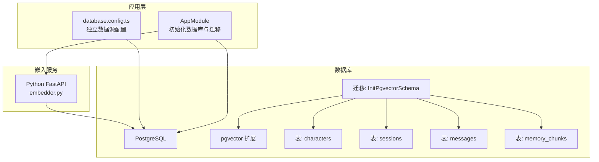
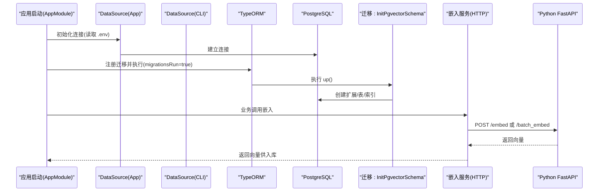
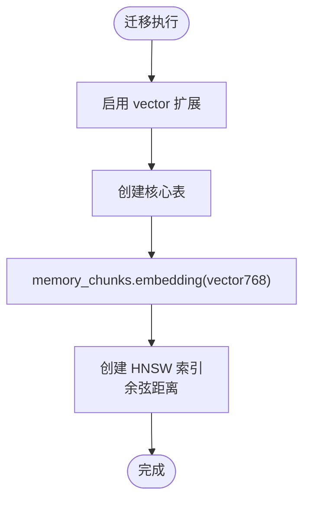
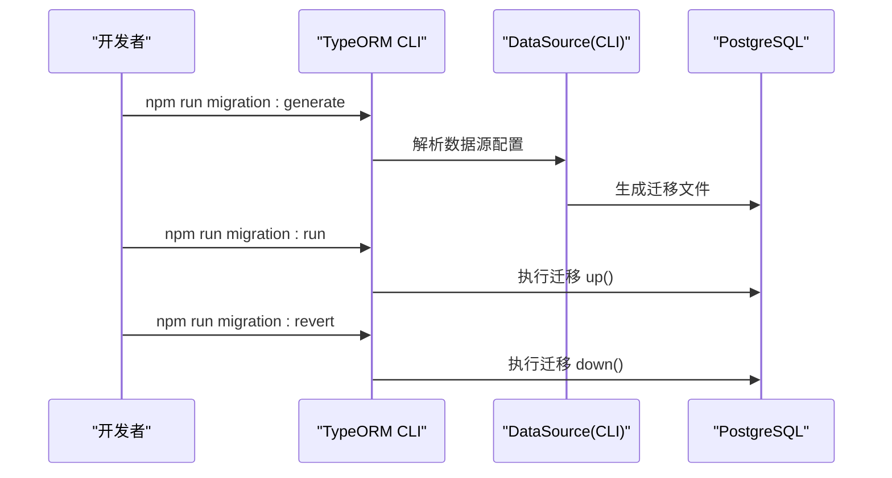
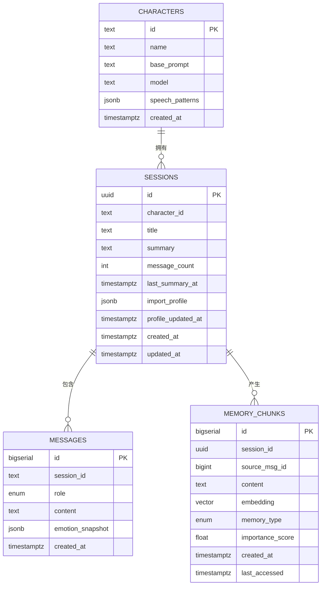
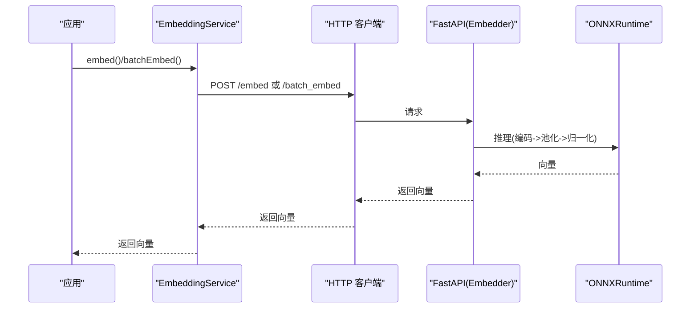
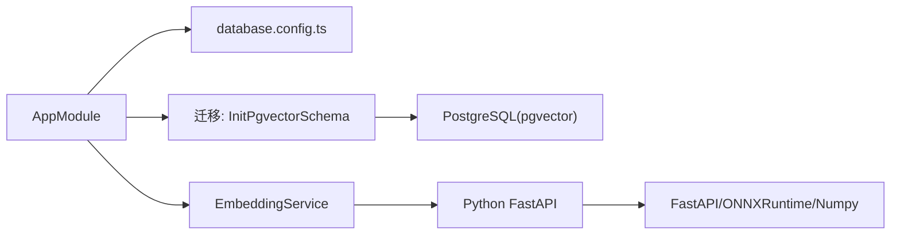

# 数据库架构

<cite>
**本文引用的文件**
- [database.config.ts](file://src/config/database.config.ts)
- [1710000000000-init-pgvector-schema.ts](file://src/migrations/1710000000000-init-pgvector-schema.ts)
- [app.module.ts](file://src/app.module.ts)
- [package.json](file://package.json)
- [character.entity.ts](file://src/characters/entities/character.entity.ts)
- [session.entity.ts](file://src/sessions/entities/session.entity.ts)
- [message.entity.ts](file://src/messages/entities/message.entity.ts)
- [memory.entity.ts](file://src/memories/entities/memory.entity.ts)
- [embedding.service.ts](file://src/embedding/embedding.service.ts)
- [embedder.py](file://python/embedder.py)
- [pyproject.toml](file://python/pyproject.toml)
- [Learning_Notes.md](file://docs/Learning_Notes.md)
</cite>

## 目录
1. [简介](#简介)
2. [项目结构](#项目结构)
3. [核心组件](#核心组件)
4. [架构总览](#架构总览)
5. [详细组件分析](#详细组件分析)
6. [依赖关系分析](#依赖关系分析)
7. [性能考量](#性能考量)
8. [故障排除指南](#故障排除指南)
9. [结论](#结论)
10. [附录](#附录)

## 简介
本文件系统性梳理 AI Companion 的数据库架构与实现，重点覆盖：
- PostgreSQL 连接与配置（数据源、环境变量、日志）
- pgvector 扩展集成（向量类型、HNSW 索引）
- TypeORM 迁移策略（版本管理、同步策略）
- 开发与生产差异（日志、安全、性能）
- 连接最佳实践与故障排除

## 项目结构
数据库相关的关键位置与职责如下：
- 应用层配置：NestJS 根模块集中初始化数据库连接与迁移
- 数据源配置：独立数据源文件用于 CLI 迁移工具
- 实体定义：TypeORM 实体映射关系型表结构
- 迁移文件：初始化 pgvector 扩展与表结构，含 HNSW 索引
- 嵌入服务：通过 HTTP 调用 Python FastAPI 服务生成向量
- 环境变量：统一通过 .env 管理数据库连接参数

图表来源
- [app.module.ts:38-50](file://src/app.module.ts#L38-L50)
- [database.config.ts:8-20](file://src/config/database.config.ts#L8-L20)
- [1710000000000-init-pgvector-schema.ts:6-92](file://src/migrations/1710000000000-init-pgvector-schema.ts#L6-L92)
- [embedder.py:103-115](file://python/embedder.py#L103-L115)

章节来源
- [app.module.ts:18-63](file://src/app.module.ts#L18-L63)
- [database.config.ts:1-22](file://src/config/database.config.ts#L1-L22)
- [package.json:24-27](file://package.json#L24-L27)

## 核心组件
- 数据源配置与连接
  - 通过 TypeORM DataSource 初始化 PostgreSQL 连接，读取环境变量进行配置
  - CLI 迁移使用独立数据源文件，确保迁移工具链可用
- 迁移与模式管理
  - 使用 TypeORM 迁移管理数据库版本，禁止自动同步以保护向量列
  - 迁移中启用 pgvector 扩展并创建核心表与索引
- 实体与表结构
  - TypeORM 实体映射关系型字段；向量字段不映射，采用原生 SQL 操作
- 嵌入服务与向量存储
  - 嵌入服务通过 HTTP 调用 Python FastAPI 服务生成 768 维向量
  - 向量存入 memory_chunks.embedding（vector(768)），并建立 HNSW 索引

章节来源
- [database.config.ts:8-20](file://src/config/database.config.ts#L8-L20)
- [1710000000000-init-pgvector-schema.ts:6-92](file://src/migrations/1710000000000-init-pgvector-schema.ts#L6-L92)
- [memory.entity.ts:8-15](file://src/memories/entities/memory.entity.ts#L8-L15)
- [embedding.service.ts:14-21](file://src/embedding/embedding.service.ts#L14-L21)

## 架构总览
下图展示数据库层与应用层的交互，以及迁移与嵌入服务的集成。

图表来源
- [app.module.ts:38-50](file://src/app.module.ts#L38-L50)
- [database.config.ts:8-20](file://src/config/database.config.ts#L8-L20)
- [1710000000000-init-pgvector-schema.ts:6-92](file://src/migrations/1710000000000-init-pgvector-schema.ts#L6-L92)
- [embedding.service.ts:33-65](file://src/embedding/embedding.service.ts#L33-L65)
- [embedder.py:103-115](file://python/embedder.py#L103-L115)

## 详细组件分析

### 数据源与连接管理
- 配置来源
  - 应用层：根模块集中初始化数据库连接，读取环境变量并开启迁移执行
  - CLI：独立数据源文件，便于迁移工具链运行
- 环境变量
  - DB_HOST、DB_PORT、DB_USER、DB_PASSWORD、DB_NAME 控制连接参数
  - DB_LOGGING 控制 SQL 日志输出（开发阶段）
- 连接策略
  - synchronize=false，避免 TypeORM 删除或变更向量列
  - migrationsRun=true，启动时自动执行迁移
  - logging 可按需开启，便于调试

章节来源
- [app.module.ts:38-50](file://src/app.module.ts#L38-L50)
- [database.config.ts:8-20](file://src/config/database.config.ts#L8-L20)
- [package.json:24-27](file://package.json#L24-L27)

### pgvector 扩展与向量索引
- 扩展启用
  - 迁移中创建 vector 扩展，确保支持向量类型
- 表结构与索引
  - memory_chunks.embedding 为 vector(768)，用于存储 768 维向量
  - 建立 HNSW 索引，使用向量余弦相似度运算符，提升检索性能
- 设计要点
  - 向量字段不在实体中映射，通过原生 SQL 插入与检索，保证与 pgvector 的兼容性

图表来源
- [1710000000000-init-pgvector-schema.ts:7-92](file://src/migrations/1710000000000-init-pgvector-schema.ts#L7-L92)

章节来源
- [1710000000000-init-pgvector-schema.ts:76-92](file://src/migrations/1710000000000-init-pgvector-schema.ts#L76-L92)
- [memory.entity.ts:30-31](file://src/memories/entities/memory.entity.ts#L30-L31)

### TypeORM 迁移策略与版本管理
- 迁移入口
  - 应用启动时自动执行迁移（migrationsRun=true）
  - CLI 使用独立数据源文件，命令行脚本提供迁移生成、运行、回滚
- 版本管理
  - 迁移文件命名包含时间戳，确保顺序与幂等
  - down() 定义回滚顺序，删除索引、表与枚举类型
- 同步策略
  - synchronize=false，避免对向量列的自动变更
  - 通过迁移精确控制结构演进

图表来源
- [package.json:24-27](file://package.json#L24-L27)
- [database.config.ts:8-20](file://src/config/database.config.ts#L8-L20)
- [1710000000000-init-pgvector-schema.ts:95-105](file://src/migrations/1710000000000-init-pgvector-schema.ts#L95-L105)

章节来源
- [package.json:24-27](file://package.json#L24-L27)
- [1710000000000-init-pgvector-schema.ts:4-5](file://src/migrations/1710000000000-init-pgvector-schema.ts#L4-L5)

### 实体与数据模型
- 角色与会话
  - characters：角色元信息
  - sessions：会话信息，包含导入资料与摘要时间戳
- 消息与记忆
  - messages：对话消息，含角色枚举与情绪快照
  - memory_chunks：记忆碎片，包含向量、类型与重要度评分
- 设计约束
  - 向量字段不映射至实体，避免 TypeORM 对 vector 类型的不兼容处理

图表来源
- [character.entity.ts:3-22](file://src/characters/entities/character.entity.ts#L3-L22)
- [session.entity.ts:32-63](file://src/sessions/entities/session.entity.ts#L32-L63)
- [message.entity.ts:5-24](file://src/messages/entities/message.entity.ts#L5-L24)
- [memory.entity.ts:16-43](file://src/memories/entities/memory.entity.ts#L16-L43)
- [1710000000000-init-pgvector-schema.ts:24-82](file://src/migrations/1710000000000-init-pgvector-schema.ts#L24-L82)

章节来源
- [character.entity.ts:3-22](file://src/characters/entities/character.entity.ts#L3-L22)
- [session.entity.ts:32-63](file://src/sessions/entities/session.entity.ts#L32-L63)
- [message.entity.ts:5-24](file://src/messages/entities/message.entity.ts#L5-L24)
- [memory.entity.ts:16-43](file://src/memories/entities/memory.entity.ts#L16-L43)

### 嵌入服务与向量生成
- 服务职责
  - 将文本发送至 Python FastAPI 服务，获取 768 维向量
  - 支持单条与批量嵌入，批量推理具备更高吞吐
- Python 侧实现
  - 使用 ONNX Runtime 推理，均值池化后归一化得到向量
  - 默认模型路径与最大长度可通过环境变量调整
- 集成方式
  - 嵌入服务通过 HTTP 调用，返回结果供上层业务使用

图表来源
- [embedding.service.ts:33-65](file://src/embedding/embedding.service.ts#L33-L65)
- [embedder.py:103-115](file://python/embedder.py#L103-L115)

章节来源
- [embedding.service.ts:14-21](file://src/embedding/embedding.service.ts#L14-L21)
- [embedder.py:31-70](file://python/embedder.py#L31-L70)
- [pyproject.toml:6-16](file://python/pyproject.toml#L6-L16)

## 依赖关系分析
- 应用层依赖
  - AppModule 依赖 TypeOrmModule.forRoot 初始化连接与迁移
  - database.config.ts 作为 CLI 工具的数据源配置
- 数据库依赖
  - 迁移依赖 pgvector 扩展与枚举类型
  - 表间存在外键关系（会话与消息、会话与记忆）
- 嵌入服务依赖
  - Python 服务依赖 FastAPI、ONNX Runtime、Tokenizers
  - 应用通过 HTTP 与 Python 服务通信

图表来源
- [app.module.ts:38-50](file://src/app.module.ts#L38-L50)
- [database.config.ts:8-20](file://src/config/database.config.ts#L8-L20)
- [1710000000000-init-pgvector-schema.ts:6-92](file://src/migrations/1710000000000-init-pgvector-schema.ts#L6-L92)
- [embedding.service.ts:14-21](file://src/embedding/embedding.service.ts#L14-L21)
- [pyproject.toml:6-16](file://python/pyproject.toml#L6-L16)

章节来源
- [app.module.ts:38-50](file://src/app.module.ts#L38-L50)
- [package.json:29-46](file://package.json#L29-L46)

## 性能考量
- 连接与查询
  - 使用 HNSW 索引与余弦距离运算符，提升向量检索效率
  - 合理使用复合索引（如按会话与时间排序的索引）加速历史消息与记忆查询
- 迁移与同步
  - 禁止自动同步，避免对向量列的破坏性变更
  - 通过迁移精确控制结构演进，减少生产风险
- 嵌入与批处理
  - 批量嵌入可利用模型推理的并行能力，降低延迟
  - 合理设置超时，平衡响应时间与稳定性

[本节为通用性能建议，无需特定文件引用]

## 故障排除指南
- 连接失败
  - 检查 .env 中的 DB_HOST、DB_PORT、DB_USER、DB_PASSWORD、DB_NAME 是否正确
  - 确认 PostgreSQL 服务已启动且允许外部连接
- pgvector 扩展缺失
  - 确保迁移已执行，扩展已创建
  - 检查数据库权限是否允许创建扩展
- 向量字段异常
  - 向量字段不在实体中映射，应通过原生 SQL 操作
  - 确认 embedding 为 vector(768)，并已建立 HNSW 索引
- 嵌入服务不可用
  - 检查 PYTHON_EMBED_URL 是否可达
  - 确认 Python 服务健康状态与模型文件是否存在
- 日志定位
  - 开发阶段可开启 DB_LOGGING=true 查看 SQL 日志
  - 嵌入服务提供日志输出，便于排查推理问题

章节来源
- [Learning_Notes.md:261-270](file://docs/Learning_Notes.md#L261-L270)
- [1710000000000-init-pgvector-schema.ts:7-92](file://src/migrations/1710000000000-init-pgvector-schema.ts#L7-L92)
- [embedding.service.ts:70-82](file://src/embedding/embedding.service.ts#L70-L82)

## 结论
本项目采用 TypeORM 迁移管理数据库结构，结合 pgvector 扩展实现高效的向量检索；通过独立数据源配置与 CLI 工具链保障迁移的可控性；应用层通过 HTTP 调用 Python FastAPI 服务生成向量，形成“关系型数据 + 向量检索”的混合架构。开发与生产环境通过环境变量与日志开关实现差异化配置，兼顾安全性与可观测性。

[本节为总结性内容，无需特定文件引用]

## 附录
- 环境变量清单
  - DB_HOST、DB_PORT、DB_USER、DB_PASSWORD、DB_NAME、DB_LOGGING
  - PYTHON_EMBED_URL
- 迁移命令
  - 生成：npm run migration:generate
  - 运行：npm run migration:run
  - 回滚：npm run migration:revert

章节来源
- [Learning_Notes.md:261-270](file://docs/Learning_Notes.md#L261-L270)
- [package.json:24-27](file://package.json#L24-L27)