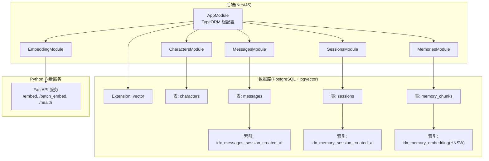
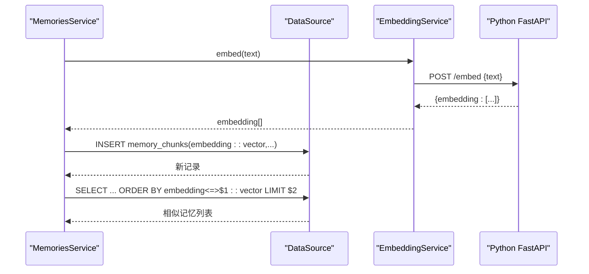
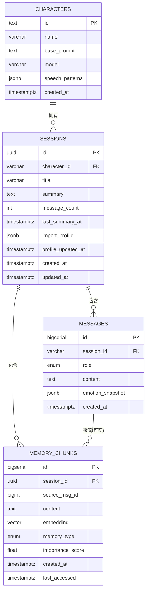
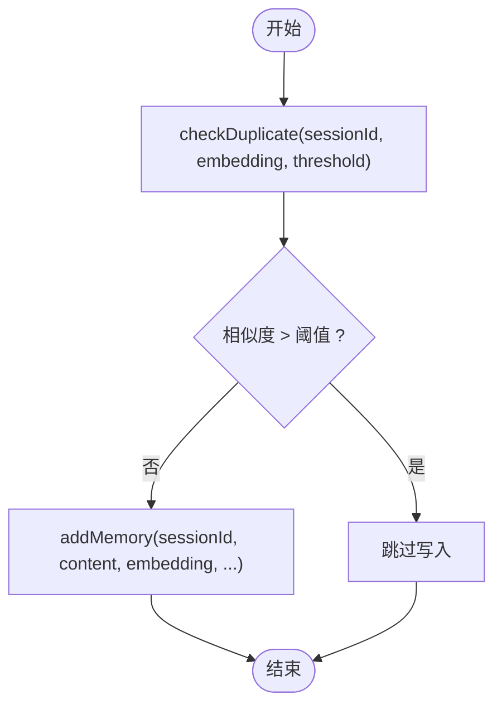
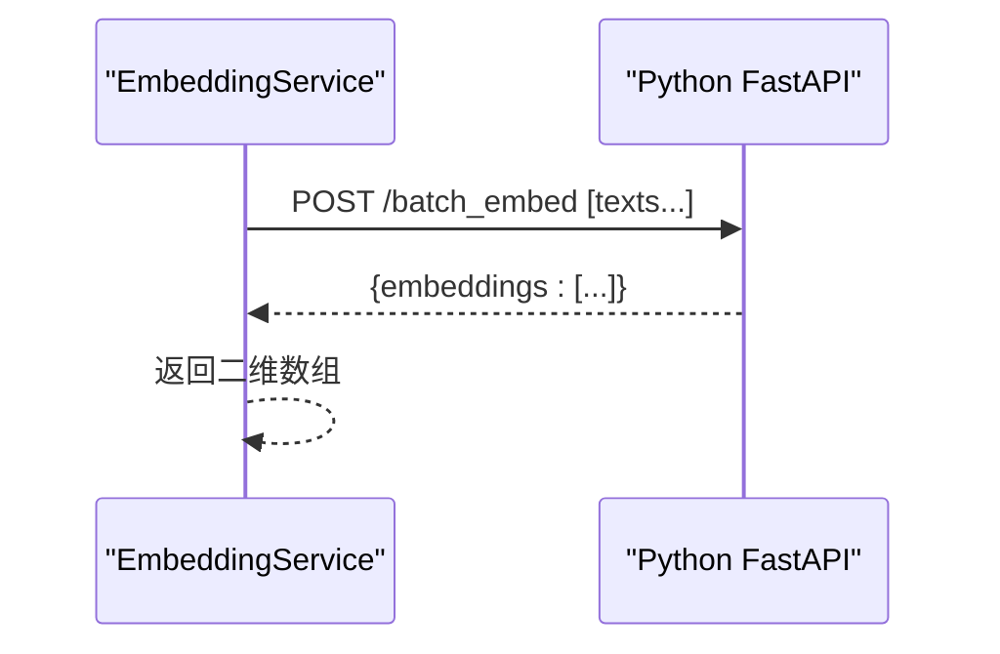
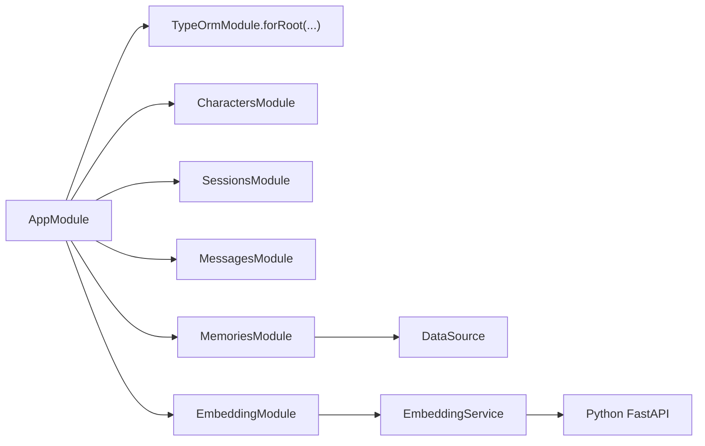

# 数据库设计

<cite>
**本文引用的文件**
- [1710000000000-init-pgvector-schema.ts](file://src/migrations/1710000000000-init-pgvector-schema.ts)
- [database.config.ts](file://src/config/database.config.ts)
- [character.entity.ts](file://src/characters/entities/character.entity.ts)
- [message.entity.ts](file://src/messages/entities/message.entity.ts)
- [session.entity.ts](file://src/sessions/entities/session.entity.ts)
- [memory.entity.ts](file://src/memories/entities/memory.entity.ts)
- [memories.service.ts](file://src/memories/memories.service.ts)
- [embedding.service.ts](file://src/embedding/embedding.service.ts)
- [memories.module.ts](file://src/memories/memories.module.ts)
- [app.module.ts](file://src/app.module.ts)
- [embedder.py](file://python/embedder.py)
- [.env 示例](file://docs/Learning_Notes.md)
</cite>

## 目录
1. [简介](#简介)
2. [项目结构](#项目结构)
3. [核心组件](#核心组件)
4. [架构总览](#架构总览)
5. [详细组件分析](#详细组件分析)
6. [依赖关系分析](#依赖关系分析)
7. [性能考虑](#性能考虑)
8. [故障排查指南](#故障排查指南)
9. [结论](#结论)
10. [附录](#附录)

## 简介
本文件面向“AI Companion”项目的数据库设计，聚焦于 PostgreSQL 与 pgvector 扩展的集成使用，系统性阐述以下主题：
- 数据库配置与迁移策略（初始化模式与版本管理）
- 实体模型设计（Character、Message、Session、MemoryChunk）及其关系与约束
- 向量数据的存储与检索（HNSW 索引、余弦相似度检索）
- 数据访问模式（TypeORM 使用与原生 SQL 边界）
- 数据完整性、索引设计与性能调优
- 数据生命周期管理、备份策略与监控建议
- 数据安全与访问控制实践

## 项目结构
数据库相关的核心位置如下：
- 迁移文件：src/migrations/1710000000000-init-pgvector-schema.ts
- 数据源配置：src/config/database.config.ts 与根模块中的 TypeORM 配置
- 实体定义：characters/entities、messages/entities、sessions/entities、memories/entities
- 记忆服务与嵌入服务：memories.service.ts、embedding.service.ts
- Python 向量服务：python/embedder.py
- 环境变量与部署参考：docs/Learning_Notes.md 中的 .env 示例与 Docker pgvector 搭建说明

图表来源
- [app.module.ts: 38-50:38-50](file://src/app/module.ts#L38-L50)
- [database.config.ts: 8-20:8-20](file://src/config/database.config.ts#L8-L20)
- [1710000000000-init-pgvector-schema.ts: 6-93:6-93](file://src/migrations/1710000000000-init-pgvector-schema.ts#L6-L93)
- [memories.service.ts: 30-34:30-34](file://src/memories/memories.service.ts#L30-L34)
- [embedding.service.ts: 14-21:14-21](file://src/embedding/embedding.service.ts#L14-L21)

章节来源
- [app.module.ts: 18-63:18-63](file://src/app.module.ts#L18-L63)
- [database.config.ts: 8-20:8-20](file://src/config/database.config.ts#L8-L20)
- [1710000000000-init-pgvector-schema.ts: 6-93:6-93](file://src/migrations/1710000000000-init-pgvector-schema.ts#L6-L93)

## 核心组件
- 角色实体（Character）
  - 主键：id（text）
  - 字段：name、basePrompt、model、speechPatterns（jsonb）、createdAt
  - 设计要点：以短标识作为主键，便于业务引用；模型选择与说话模式以 JSONB 存储，利于扩展
- 会话实体（Session）
  - 主键：id（uuid）
  - 字段：characterId、title、summary、messageCount、lastSummaryAt、importProfile（jsonb）、profileUpdatedAt、createdAt、updatedAt
  - 设计要点：与 Character 通过 character_id 关联；导入资料以 JSONB 存储，便于结构化与非结构化信息混合
- 消息实体（Message）
  - 主键：id（bigserial）
  - 字段：sessionId、role（枚举 user/assistant）、content、emotionSnapshot（jsonb）、createdAt
  - 设计要点：按会话分组排序；情绪快照预留后续情感引擎对接
- 记忆实体（MemoryChunk）
  - 主键：id（bigserial）
  - 字段：sessionId、sourceMsgId（可空）、content、memoryType（fact/preference/emotion）、importanceScore、createdAt、lastAccessed
  - 设计要点：embedding 字段不映射至 TypeORM，采用原生 SQL 操作；其余字段通过 TypeORM 管理

章节来源
- [character.entity.ts: 3-22:3-22](file://src/characters/entities/character.entity.ts#L3-L22)
- [session.entity.ts: 32-63:32-63](file://src/sessions/entities/session.entity.ts#L32-L63)
- [message.entity.ts: 5-24:5-24](file://src/messages/entities/message.entity.ts#L5-L24)
- [memory.entity.ts: 16-43:16-43](file://src/memories/entities/memory.entity.ts#L16-L43)

## 架构总览
数据库层采用“TypeORM + pgvector”的混合模式：
- 关系型字段统一由 TypeORM 管理，确保实体关系、约束与迁移可控
- 向量字段（embedding）由于 TypeORM 不支持 vector 类型，采用 DataSource.query 执行原生 SQL
- 嵌入服务通过 HTTP 调用 Python FastAPI，返回 768 维向量，再由后端写入数据库或参与检索

图表来源
- [memories.service.ts: 30-34:30-34](file://src/memories/memories.service.ts#L30-L34)
- [memories.service.ts: 42-59:42-59](file://src/memories/memories.service.ts#L42-L59)
- [memories.service.ts: 64-88:64-88](file://src/memories/memories.service.ts#L64-L88)
- [embedding.service.ts: 33-42:33-42](file://src/embedding/embedding.service.ts#L33-L42)

## 详细组件分析

### 迁移与模式初始化
- 扩展启用：确保安装 vector 扩展
- 枚举类型：messages_role_enum、memory_chunks_memory_type_enum
- 表结构：
  - characters：角色元数据
  - sessions：会话元数据与导入资料
  - messages：对话消息
  - memory_chunks：记忆片段（含向量列）
- 索引：
  - messages(session_id, created_at)
  - memory_chunks(session_id, created_at)
  - memory_chunks(embedding) 使用 HNSW(cosine)

图表来源
- [1710000000000-init-pgvector-schema.ts: 24-82:24-82](file://src/migrations/1710000000000-init-pgvector-schema.ts#L24-L82)
- [character.entity.ts: 4-21:4-21](file://src/characters/entities/character.entity.ts#L4-L21)
- [session.entity.ts: 34-62:34-62](file://src/sessions/entities/session.entity.ts#L34-L62)
- [message.entity.ts: 6-23:6-23](file://src/messages/entities/message.entity.ts#L6-L23)
- [memory.entity.ts: 17-42:17-42](file://src/memories/entities/memory.entity.ts#L17-L42)

章节来源
- [1710000000000-init-pgvector-schema.ts: 6-93:6-93](file://src/migrations/1710000000000-init-pgvector-schema.ts#L6-L93)

### 数据访问模式与约束
- TypeORM 使用
  - characters、sessions、messages 通过实体与仓库管理
  - synchronize=false，迁移驱动表结构演进，避免 vector 列被 TypeORM 删除
- 向量操作边界
  - memory_chunks 的 embedding 字段不映射至实体，所有 CRUD 与检索通过原生 SQL
  - 检索使用 pgvector 的余弦距离运算符，并计算相似度 1 - (embedding <=> query)
- 重复检测
  - 基于阈值的余弦相似度判断，避免重复记忆入库

图表来源
- [memories.service.ts: 93-110:93-110](file://src/memories/memories.service.ts#L93-L110)
- [memories.service.ts: 64-88:64-88](file://src/memories/memories.service.ts#L64-L88)

章节来源
- [memories.service.ts: 30-137:30-137](file://src/memories/memories.service.ts#L30-L137)
- [memories.module.ts: 12-17:12-17](file://src/memories/memories.module.ts#L12-L17)

### 嵌入服务与 Python 集成
- 嵌入服务
  - 单条与批量嵌入接口，超时控制，健康检查
- Python FastAPI
  - 加载 Jina v2 Base Zh 模型，执行 mean pooling 与归一化，输出 768 维向量
  - 提供 /embed、/batch_embed、/health 接口

图表来源
- [embedding.service.ts: 56-65:56-65](file://src/embedding/embedding.service.ts#L56-L65)
- [embedder.py: 107-116:107-116](file://python/embedder.py#L107-L116)

章节来源
- [embedding.service.ts: 14-83:14-83](file://src/embedding/embedding.service.ts#L14-L83)
- [embedder.py: 31-116:31-116](file://python/embedder.py#L31-L116)

## 依赖关系分析
- 数据源配置
  - 通过 DataSource 或 TypeOrmModule.forRoot 提供连接参数、实体扫描、迁移路径与日志开关
- 模块装配
  - AppModule 统一注册 TypeORM、业务模块；MemoriesModule 不注册 MemoryChunk 实体，避免同步冲突
- Python 服务依赖
  - 嵌入服务通过 HTTP 与 Python FastAPI 交互，二者通过环境变量配置地址

图表来源
- [app.module.ts: 38-50:38-50](file://src/app.module.ts#L38-L50)
- [memories.module.ts: 12-17:12-17](file://src/memories/memories.module.ts#L12-L17)
- [database.config.ts: 8-20:8-20](file://src/config/database.config.ts#L8-L20)

章节来源
- [app.module.ts: 18-63:18-63](file://src/app.module.ts#L18-L63)
- [database.config.ts: 8-20:8-20](file://src/config/database.config.ts#L8-L20)
- [memories.module.ts: 12-17:12-17](file://src/memories/memories.module.ts#L12-L17)

## 性能考虑
- 索引设计
  - 会话级时间序列查询索引：messages(session_id, created_at)、memory_chunks(session_id, created_at)
  - 向量检索索引：memory_chunks(embedding) 使用 HNSW，余弦距离
- 查询优化
  - 相似度检索使用余弦距离并排序，限制返回数量
  - 批量嵌入减少网络往返与模型推理开销
- 存储与类型
  - embedding 为固定维度向量，避免动态维度带来的索引退化
- 迁移与同步
  - synchronize=false，确保 vector 列不被 TypeORM 删除，迁移驱动结构变更

章节来源
- [1710000000000-init-pgvector-schema.ts: 84-92:84-92](file://src/migrations/1710000000000-init-pgvector-schema.ts#L84-L92)
- [memories.service.ts: 42-59:42-59](file://src/memories/memories.service.ts#L42-L59)
- [embedding.service.ts: 56-65:56-65](file://src/embedding/embedding.service.ts#L56-L65)

## 故障排查指南
- 连接与迁移
  - 确认 .env 中数据库连接参数正确，迁移已执行且扩展已安装
  - TypeORM 日志开启有助于定位 SQL 问题
- 向量检索异常
  - 检查 embedding 是否正确传入（字符串化向量字面量）
  - 确认 HNSW 索引存在且未损坏
- 嵌入服务不可用
  - 检查 PYTHON_EMBED_URL 是否可达，Python 服务健康接口返回状态
- 重复检测误判
  - 调整相似度阈值，结合 importance_score 与业务规则综合判断

章节来源
- [database.config.ts: 8-20:8-20](file://src/config/database.config.ts#L8-L20)
- [1710000000000-init-pgvector-schema.ts: 6-14:6-14](file://src/migrations/1710000000000-init-pgvector-schema.ts#L6-L14)
- [memories.service.ts: 93-110:93-110](file://src/memories/memories.service.ts#L93-L110)
- [embedding.service.ts: 70-82:70-82](file://src/embedding/embedding.service.ts#L70-L82)

## 结论
本设计以“TypeORM + pgvector”的混合模式实现了关系数据与向量数据的协同：
- 关系字段由 TypeORM 管理，确保实体关系与迁移可控
- 向量字段通过原生 SQL 操作，结合 HNSW 索引实现高效相似度检索
- 嵌入服务与数据库分离，提升可维护性与扩展性
- 通过严格的迁移策略与索引设计，兼顾数据一致性与查询性能

## 附录
- 环境变量与部署
  - 参考 .env 示例与 Docker pgvector 搭建步骤，确保扩展安装与连接参数正确
- Python 模型与推理
  - 使用 ONNX Runtime 加载 Jina v2 Base Zh 模型，提供单条与批量嵌入能力

章节来源
- [.env 示例:261-270](file://docs/Learning_Notes.md#L261-L270)
- [embedder.py: 31-70:31-70](file://python/embedder.py#L31-L70)