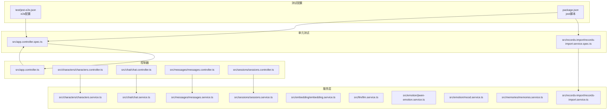
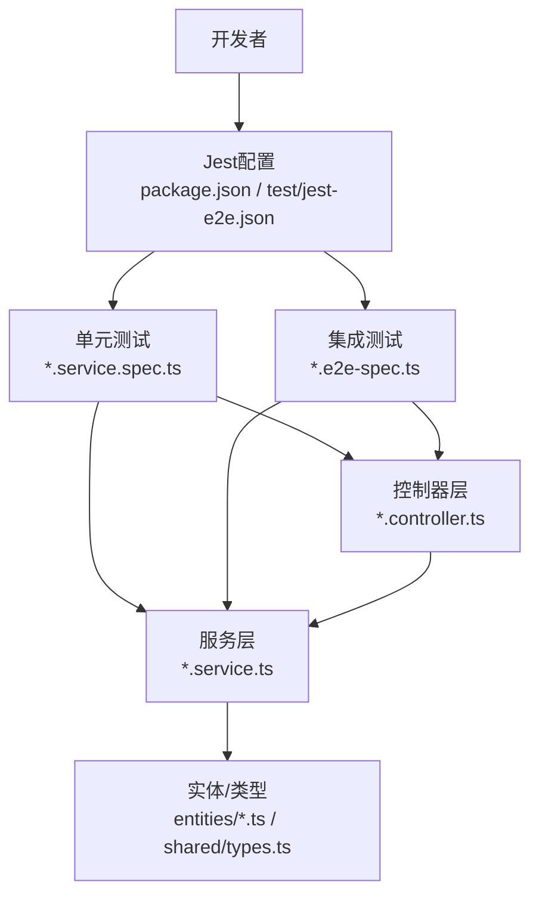
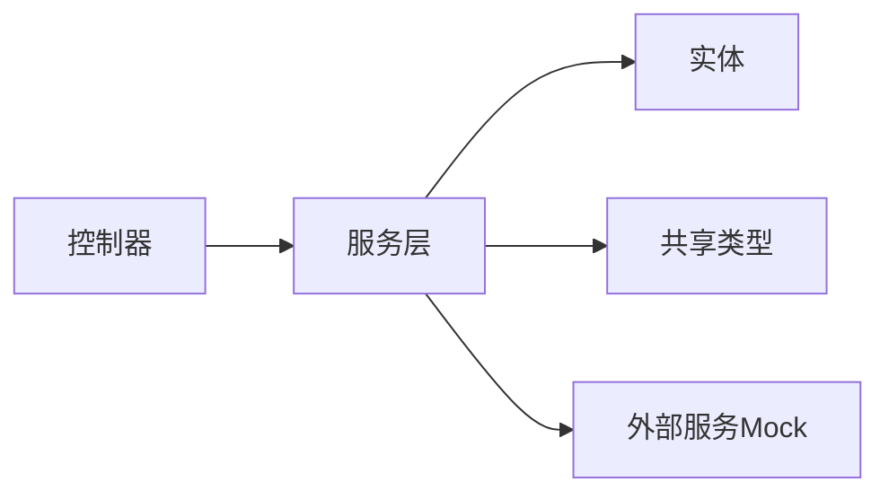

# 单元测试

<cite>
**本文引用的文件**
- [package.json](file://package.json)
- [jest-e2e.json](file://test/jest-e2e.json)
- [app.controller.spec.ts](file://src/app.controller.spec.ts)
- [records-import.service.spec.ts](file://src/records-import/records-import.service.spec.ts)
- [app.controller.ts](file://src/app.controller.ts)
- [characters.controller.ts](file://src/characters/characters.controller.ts)
- [characters.service.ts](file://src/characters/characters.service.ts)
- [chat.controller.ts](file://src/chat/chat.controller.ts)
- [chat.service.ts](file://src/chat/chat.service.ts)
- [messages.controller.ts](file://src/messages/messages.controller.ts)
- [messages.service.ts](file://src/messages/messages.service.ts)
- [sessions.controller.ts](file://src/sessions/sessions.controller.ts)
- [sessions.service.ts](file://src/sessions/sessions.service.ts)
- [embedding.service.ts](file://src/embedding/embedding.service.ts)
- [llm.service.ts](file://src/llm/llm.service.ts)
- [jiwen-emotion.service.ts](file://src/emotion/jiwen-emotion.service.ts)
- [mood.service.ts](file://src/emotion/mood.service.ts)
- [memories.service.ts](file://src/memories/memories.service.ts)
- [records-import.service.ts](file://src/records-import/records-import.service.ts)
- [app.module.ts](file://src/app.module.ts)
- [characters.module.ts](file://src/characters/characters.module.ts)
- [chat.module.ts](file://src/chat/chat.module.ts)
- [messages.module.ts](file://src/messages/messages.module.ts)
- [sessions.module.ts](file://src/sessions/sessions.module.ts)
- [embedding.module.ts](file://src/embedding/embedding.module.ts)
- [emotion.module.ts](file://src/emotion/emotion.module.ts)
- [memories.module.ts](file://src/memories/memories.module.ts)
- [records-import.module.ts](file://src/records-import/records-import.module.ts)
- [character.entity.ts](file://src/characters/entities/character.entity.ts)
- [message.entity.ts](file://src/messages/entities/message.entity.ts)
- [session.entity.ts](file://src/sessions/entities/session.entity.ts)
- [memory.entity.ts](file://src/memories/entities/memory.entity.ts)
- [types.ts](file://shared/types.ts)
</cite>

## 目录
1. [简介](#简介)
2. [项目结构](#项目结构)
3. [核心组件](#核心组件)
4. [架构总览](#架构总览)
5. [详细组件分析](#详细组件分析)
6. [依赖分析](#依赖分析)
7. [性能考虑](#性能考虑)
8. [故障排查指南](#故障排查指南)
9. [结论](#结论)
10. [附录](#附录)

## 简介
本文件面向AI Companion后端（NestJS）的单元测试与集成测试实践，聚焦以下目标：
- Jest测试框架的配置与使用：测试环境设置、测试文件组织、测试运行配置
- 控制器测试：以AppController为例，说明测试用例设计与Mock数据管理
- 服务层单元测试最佳实践：依赖注入测试、异步函数测试、错误处理测试
- 具体服务测试示例：CharactersService、ChatService等核心服务
- 测试覆盖率要求与提升策略
- 测试数据准备、Mock对象使用与断言验证

## 项目结构
后端采用NestJS模块化架构，测试主要分布在：
- 单元测试：位于各模块目录下的“*.service.spec.ts”文件
- 集成测试：位于根目录test下的“*.e2e-spec.ts”文件与“jest-e2e.json”
- 根级测试配置：package.json中的jest脚本与test/jest-e2e.json

**图表来源**
- [package.json](file://package.json)
- [jest-e2e.json](file://test/jest-e2e.json)
- [app.controller.spec.ts](file://src/app.controller.spec.ts)
- [records-import.service.spec.ts](file://src/records-import/records-import.service.spec.ts)
- [app.controller.ts](file://src/app.controller.ts)
- [characters.controller.ts](file://src/characters/characters.controller.ts)
- [characters.service.ts](file://src/characters/characters.service.ts)
- [chat.controller.ts](file://src/chat/chat.controller.ts)
- [chat.service.ts](file://src/chat/chat.service.ts)
- [messages.controller.ts](file://src/messages/messages.controller.ts)
- [messages.service.ts](file://src/messages/messages.service.ts)
- [sessions.controller.ts](file://src/sessions/sessions.controller.ts)
- [sessions.service.ts](file://src/sessions/sessions.service.ts)
- [embedding.service.ts](file://src/embedding/embedding.service.ts)
- [llm.service.ts](file://src/llm/llm.service.ts)
- [jiwen-emotion.service.ts](file://src/emotion/jiwen-emotion.service.ts)
- [mood.service.ts](file://src/emotion/mood.service.ts)
- [memories.service.ts](file://src/memories/memories.service.ts)
- [records-import.service.ts](file://src/records-import/records-import.service.ts)

**章节来源**
- [package.json](file://package.json)
- [jest-e2e.json](file://test/jest-e2e.json)
- [app.controller.spec.ts](file://src/app.controller.spec.ts)
- [records-import.service.spec.ts](file://src/records-import/records-import.service.spec.ts)

## 核心组件
- 测试运行与配置
  - Jest命令与覆盖范围：通过根级package.json中的jest脚本定义测试命令与覆盖率阈值
  - e2e配置：test/jest-e2e.json用于端到端测试的全局配置
- 控制器测试
  - AppController：演示控制器层的典型测试模式，包括构造函数注入、路由处理与响应断言
  - 其他控制器：characters、chat、messages、sessions等均遵循类似模式
- 服务层测试
  - 依赖注入：通过TestBed或Nest的TestingModule模拟模块，替换真实依赖为Mock
  - 异步函数：对Promise/async函数进行await与超时控制
  - 错误处理：断言抛出异常或返回错误响应
- 实体与类型
  - entity.ts与shared/types.ts为测试中常用的模型与类型定义

**章节来源**
- [package.json](file://package.json)
- [jest-e2e.json](file://test/jest-e2e.json)
- [app.controller.spec.ts](file://src/app.controller.spec.ts)
- [characters.controller.ts](file://src/characters/characters.controller.ts)
- [chat.controller.ts](file://src/chat/chat.controller.ts)
- [messages.controller.ts](file://src/messages/messages.controller.ts)
- [sessions.controller.ts](file://src/sessions/sessions.controller.ts)
- [character.entity.ts](file://src/characters/entities/character.entity.ts)
- [message.entity.ts](file://src/messages/entities/message.entity.ts)
- [session.entity.ts](file://src/sessions/entities/session.entity.ts)
- [types.ts](file://shared/types.ts)

## 架构总览
下图展示了测试在系统中的位置与交互关系。

**图表来源**
- [package.json](file://package.json)
- [jest-e2e.json](file://test/jest-e2e.json)
- [app.controller.spec.ts](file://src/app.controller.spec.ts)
- [characters.service.ts](file://src/characters/characters.service.ts)
- [character.entity.ts](file://src/characters/entities/character.entity.ts)
- [types.ts](file://shared/types.ts)

## 详细组件分析

### Jest配置与测试运行
- 命令与覆盖范围
  - 在根级package.json中定义了jest相关脚本，建议包含测试运行、覆盖率统计与报告生成
  - 覆盖率阈值可按功能模块设置，确保关键路径被覆盖
- e2e配置
  - test/jest-e2e.json提供端到端测试的通用设置，如超时、全局初始化等
- 测试文件组织
  - 单元测试与对应服务同目录，命名规范为“*.service.spec.ts”
  - 集成测试位于根目录test，命名规范为“*.e2e-spec.ts”

**章节来源**
- [package.json](file://package.json)
- [jest-e2e.json](file://test/jest-e2e.json)

### 控制器测试：AppController
- 测试目标
  - 验证控制器构造与依赖注入
  - 验证路由处理逻辑与HTTP响应
  - 使用Mock数据管理，避免真实外部依赖
- 关键步骤
  - 创建TestingModule并导入对应Module
  - 替换真实服务为Mock对象（如service.useValue或service.useClass）
  - 使用Test.createTestingModule构建控制器实例
  - 断言响应状态码、响应体结构与内容
- Mock数据管理
  - 使用共享类型定义输入输出结构，保证Mock数据与实体一致
  - 对于复杂场景，可使用工厂函数生成Mock数据

**章节来源**
- [app.controller.spec.ts](file://src/app.controller.spec.ts)
- [app.controller.ts](file://src/app.controller.ts)
- [types.ts](file://shared/types.ts)

### 服务层单元测试最佳实践
- 依赖注入测试
  - 使用Nest的TestingModule加载模块，通过overrideProvider替换真实依赖
  - 验证构造函数注入的服务是否正确注入
- 异步函数测试
  - 对返回Promise的方法进行await，必要时设置超时
  - 对可能失败的异步操作进行try/catch断言
- 错误处理测试
  - 模拟异常场景（如数据库连接失败、外部API不可用）
  - 断言抛出的异常类型或错误响应
- 数据准备与Mock对象
  - 使用实体定义作为Mock数据模板，确保字段完整且类型正确
  - 对外部依赖（如嵌入向量、LLM调用、情绪分析）使用Mock实现

**章节来源**
- [characters.service.ts](file://src/characters/characters.service.ts)
- [chat.service.ts](file://src/chat/chat.service.ts)
- [messages.service.ts](file://src/messages/messages.service.ts)
- [sessions.service.ts](file://src/sessions/sessions.service.ts)
- [embedding.service.ts](file://src/embedding/embedding.service.ts)
- [llm.service.ts](file://src/llm/llm.service.ts)
- [jiwen-emotion.service.ts](file://src/emotion/jiwen-emotion.service.ts)
- [mood.service.ts](file://src/emotion/mood.service.ts)
- [memories.service.ts](file://src/memories/memories.service.ts)
- [records-import.service.ts](file://src/records-import/records-import.service.ts)
- [character.entity.ts](file://src/characters/entities/character.entity.ts)
- [message.entity.ts](file://src/messages/entities/message.entity.ts)
- [session.entity.ts](file://src/sessions/entities/session.entity.ts)
- [memory.entity.ts](file://src/memories/entities/memory.entity.ts)

### 具体服务测试示例

#### CharactersService
- 测试要点
  - 依赖注入：验证数据库连接、嵌入服务、LLM服务等是否正确注入
  - CRUD操作：创建角色、查询角色列表、更新角色、删除角色
  - 异常处理：模拟数据库异常、向量索引失败等
  - Mock数据：基于character.entity.ts定义角色实体的Mock数据
- 断言建议
  - 返回结果结构与字段完整性
  - 错误场景下的异常类型与消息

**章节来源**
- [characters.service.ts](file://src/characters/characters.service.ts)
- [character.entity.ts](file://src/characters/entities/character.entity.ts)

#### ChatService
- 测试要点
  - 会话管理：创建会话、查询历史、结束会话
  - 消息处理：发送消息、接收回复、流式响应（如支持）
  - 外部集成：嵌入向量检索、LLM对话、情绪分析
- Mock策略
  - 将embedding.service、llm.service、emotion服务替换为Mock实现
  - 使用message.entity.ts与session.entity.ts构造Mock数据
- 断言建议
  - 响应时间与吞吐量（可选）
  - 错误回退与重试机制（如外部服务失败）

**章节来源**
- [chat.service.ts](file://src/chat/chat.service.ts)
- [embedding.service.ts](file://src/embedding/embedding.service.ts)
- [llm.service.ts](file://src/llm/llm.service.ts)
- [jiwen-emotion.service.ts](file://src/emotion/jiwen-emotion.service.ts)
- [mood.service.ts](file://src/emotion/mood.service.ts)
- [message.entity.ts](file://src/messages/entities/message.entity.ts)
- [session.entity.ts](file://src/sessions/entities/session.entity.ts)

#### MessagesService
- 测试要点
  - 消息持久化：保存消息、批量导入
  - 查询接口：按会话查询消息列表、分页查询
  - 数据一致性：重复消息去重、时间戳校验
- Mock策略
  - 使用message.entity.ts定义消息实体Mock
  - 对导入流程使用Mock文件与Mock解析器

**章节来源**
- [messages.service.ts](file://src/messages/messages.service.ts)
- [message.entity.ts](file://src/messages/entities/message.entity.ts)

#### SessionsService
- 测试要点
  - 会话生命周期：创建、激活、归档、清理
  - 与ChatService协作：会话上下文传递、历史消息关联
- Mock策略
  - 使用session.entity.ts定义会话实体Mock

**章节来源**
- [sessions.service.ts](file://src/sessions/sessions.service.ts)
- [session.entity.ts](file://src/sessions/entities/session.entity.ts)

#### MemoriesService
- 测试要点
  - 记忆检索：基于语义相似度的检索
  - 记忆更新：新增记忆、更新记忆权重
- Mock策略
  - 使用memory.entity.ts定义记忆实体Mock

**章节来源**
- [memories.service.ts](file://src/memories/memories.service.ts)
- [memory.entity.ts](file://src/memories/entities/memory.entity.ts)

#### RecordsImportService
- 测试要点
  - 导入流程：文件解析、格式校验、批量写入
  - 错误处理：无效文件、格式不匹配、写入失败
- 参考样例
  - 可参考records-import.service.spec.ts的测试结构与断言方式

**章节来源**
- [records-import.service.spec.ts](file://src/records-import/records-import.service.spec.ts)
- [records-import.service.ts](file://src/records-import/records-import.service.ts)

### 控制器测试示例

#### CharactersController
- 测试要点
  - 路由装饰器与参数绑定
  - 业务逻辑委托：调用CharactersService执行具体操作
  - 响应格式：JSON结构与HTTP状态码
- Mock策略
  - 使用CharactersService的Mock实现，避免真实数据库访问

**章节来源**
- [characters.controller.ts](file://src/characters/characters.controller.ts)
- [characters.service.ts](file://src/characters/characters.service.ts)

#### ChatController
- 测试要点
  - 会话与消息的控制器职责分离
  - 输入校验与错误响应
- Mock策略
  - ChatService使用Mock实现

**章节来源**
- [chat.controller.ts](file://src/chat/chat.controller.ts)
- [chat.service.ts](file://src/chat/chat.service.ts)

#### MessagesController
- 测试要点
  - 分页查询与过滤条件
  - 批量导入接口的测试
- Mock策略
  - MessagesService使用Mock实现

**章节来源**
- [messages.controller.ts](file://src/messages/messages.controller.ts)
- [messages.service.ts](file://src/messages/messages.service.ts)

#### SessionsController
- 测试要点
  - 会话状态变更与历史查询
- Mock策略
  - SessionsService使用Mock实现

**章节来源**
- [sessions.controller.ts](file://src/sessions/sessions.controller.ts)
- [sessions.service.ts](file://src/sessions/sessions.service.ts)

### 测试覆盖率要求与提升
- 覆盖率阈值
  - 建议在package.json中为statement、branch、function、line设置合理阈值
  - 对核心服务（CharactersService、ChatService等）设定更高阈值
- 提升策略
  - 补充边界条件与异常分支测试
  - 对高风险路径（外部依赖、并发场景）增加测试
  - 使用Mock隔离外部依赖，确保测试稳定性

**章节来源**
- [package.json](file://package.json)

## 依赖分析
- 模块依赖
  - 各服务依赖于实体与共享类型，确保测试中Mock数据与真实结构一致
  - 控制器依赖服务层，测试时通过Mock服务层验证控制器行为
- 外部依赖
  - 嵌入向量、LLM、情绪分析等外部服务通过Mock实现，便于可控测试

**图表来源**
- [characters.controller.ts](file://src/characters/characters.controller.ts)
- [characters.service.ts](file://src/characters/characters.service.ts)
- [character.entity.ts](file://src/characters/entities/character.entity.ts)
- [types.ts](file://shared/types.ts)
- [embedding.service.ts](file://src/embedding/embedding.service.ts)
- [llm.service.ts](file://src/llm/llm.service.ts)
- [jiwen-emotion.service.ts](file://src/emotion/jiwen-emotion.service.ts)

**章节来源**
- [characters.controller.ts](file://src/characters/characters.controller.ts)
- [characters.service.ts](file://src/characters/characters.service.ts)
- [character.entity.ts](file://src/characters/entities/character.entity.ts)
- [types.ts](file://shared/types.ts)

## 性能考虑
- 测试性能
  - 使用Mock减少I/O与网络请求，提升测试速度
  - 对异步函数设置合理超时，避免长时间阻塞
- 覆盖率与性能平衡
  - 在保证覆盖率的前提下，避免过度Mock导致测试失真
  - 对关键路径进行基准测试，监控回归

## 故障排查指南
- 常见问题
  - 依赖未注入：检查TestingModule中的overrideProvider配置
  - 异步测试失败：确认使用await与超时设置
  - Mock不生效：核对Mock对象的useValue/useClass与实际注入类型一致
- 排查步骤
  - 逐步缩小问题范围：先验证服务层，再验证控制器
  - 输出中间结果：在测试中打印关键变量，定位异常点
  - 使用最小复现：剥离无关逻辑，保留最小可复现用例

**章节来源**
- [records-import.service.spec.ts](file://src/records-import/records-import.service.spec.ts)

## 结论
通过规范的Jest配置、清晰的测试文件组织与严格的Mock策略，可以有效保障AI Companion后端的质量与稳定性。建议优先完善核心服务（CharactersService、ChatService）的测试覆盖，并持续优化测试用例设计与覆盖率阈值，确保代码演进过程中的可靠性与可维护性。

## 附录
- 测试数据准备清单
  - 实体定义：character.entity.ts、message.entity.ts、session.entity.ts、memory.entity.ts
  - 共享类型：shared/types.ts
  - Mock工厂：基于实体定义快速生成测试数据
- 断言验证清单
  - 响应结构与字段完整性
  - HTTP状态码与错误消息
  - 异常类型与堆栈信息
  - 性能指标（可选）