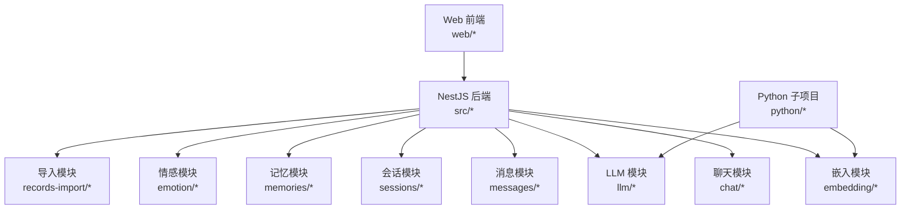
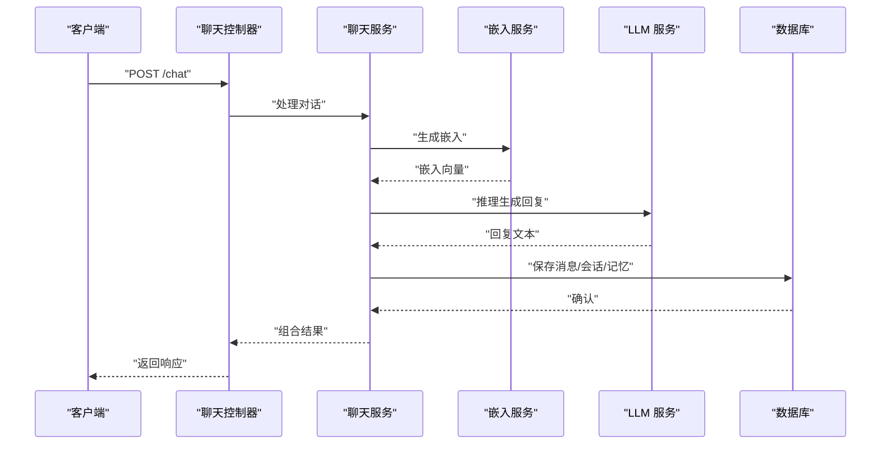
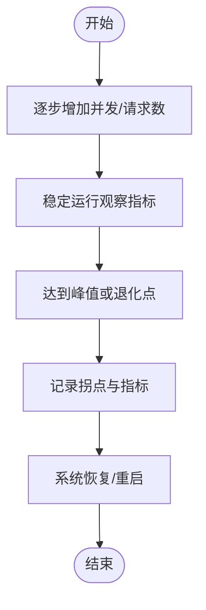
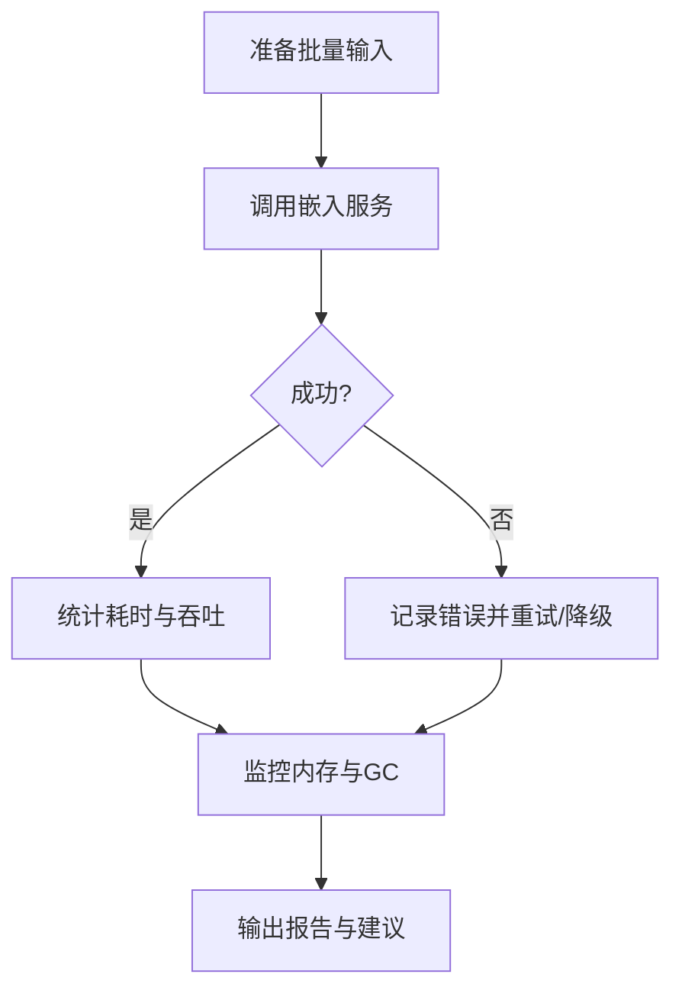
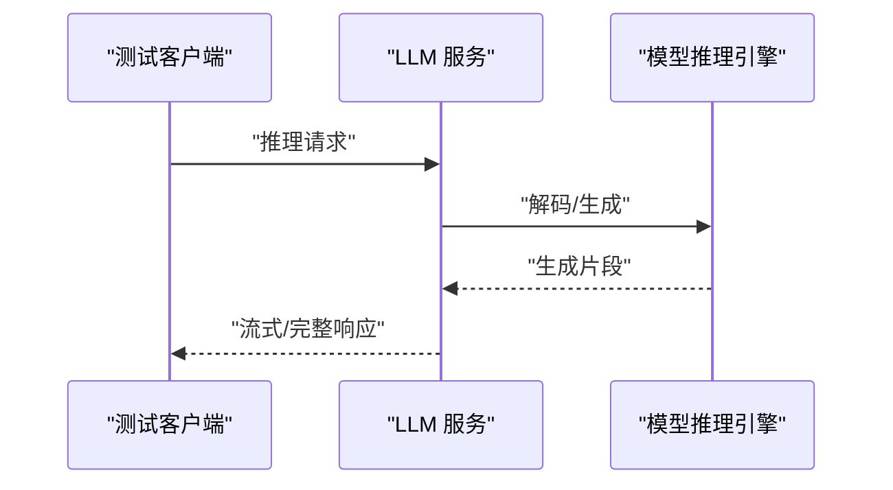
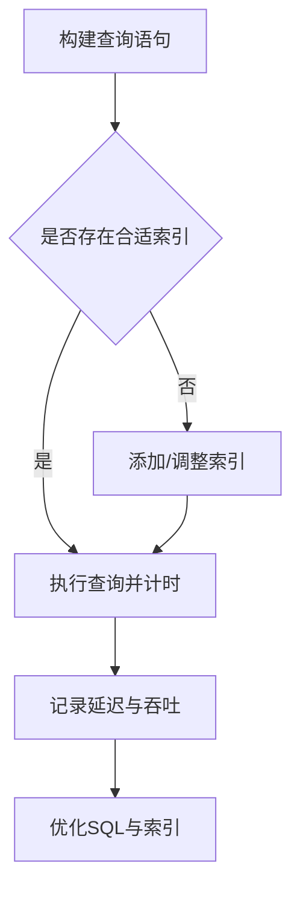
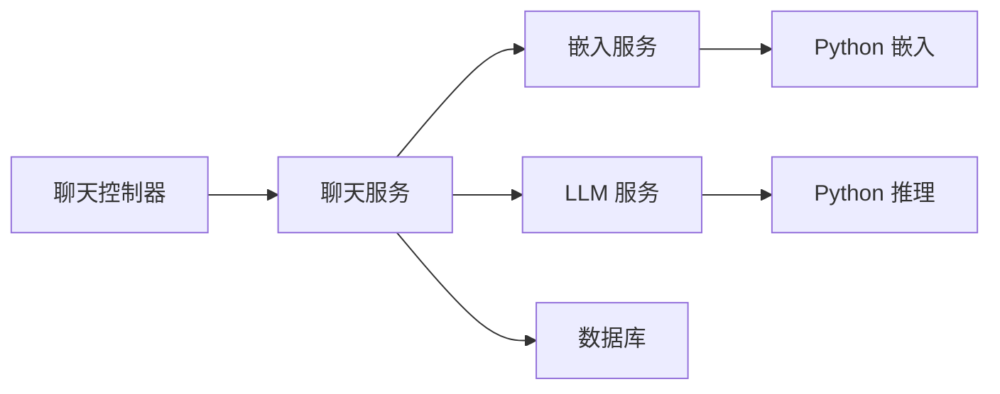

# 性能测试

<cite>
**本文引用的文件**
- [README.md](file://README.md)
- [src/main.ts](file://src/main.ts)
- [src/app.module.ts](file://src/app.module.ts)
- [src/chat/chat.controller.ts](file://src/chat/chat.controller.ts)
- [src/chat/chat.service.ts](file://src/chat/chat.service.ts)
- [src/embedding/embedding.module.ts](file://src/embedding/embedding.module.ts)
- [src/embedding/embedding.service.ts](file://src/embedding/embedding.service.ts)
- [src/llm/llm.module.ts](file://src/llm/llm.module.ts)
- [src/llm/llm.service.ts](file://src/llm/llm.service.ts)
- [python/embedder.py](file://python/embedder.py)
- [python/main.py](file://python/main.py)
- [python/pyproject.toml](file://python/pyproject.toml)
- [test_chat.js](file://test_chat.js)
- [tools/chat_converter.py](file://tools/chat_converter.py)
- [src/migrations/1710000000000-init-pgvector-schema.ts](file://src/migrations/1710000000000-init-pgvector-schema.ts)
- [src/messages/messages.controller.ts](file://src/messages/messages.controller.ts)
- [src/sessions/sessions.controller.ts](file://src/sessions/sessions.controller.ts)
- [src/memories/memories.service.ts](file://src/memories/memories.service.ts)
- [src/emotion/jiwen-emotion.service.ts](file://src/emotion/jiwen-emotion.service.ts)
- [src/records-import/records-import.controller.ts](file://src/records-import/records-import.controller.ts)
</cite>

## 目录
1. [简介](#简介)
2. [项目结构](#项目结构)
3. [核心组件](#核心组件)
4. [架构总览](#架构总览)
5. [详细组件分析](#详细组件分析)
6. [依赖关系分析](#依赖关系分析)
7. [性能考量](#性能考量)
8. [故障排查指南](#故障排查指南)
9. [结论](#结论)
10. [附录](#附录)

## 简介
本文件面向AI Companion项目的性能测试与基准评测，聚焦以下目标：
- 聊天系统：负载测试、压力测试、并发测试的配置与执行；响应时间、吞吐量与资源利用率监控。
- 向量嵌入服务：批量处理性能与内存使用评估。
- AI推理服务：延迟测试与并发请求处理能力。
- 数据库：查询优化测试与索引性能验证。
- 工具与脚本：Artillery、k6或自定义测试脚本的使用指南。
- 优化与回归：性能优化建议与回归测试策略。

## 项目结构
AI Companion采用前后端分离与模块化后端架构。前端位于web目录，后端基于NestJS，核心模块包括聊天、消息、会话、记忆、情感、嵌入与LLM等。Python子项目提供嵌入模型与推理服务入口。

图表来源
- [src/app.module.ts](file://src/app.module.ts)
- [src/chat/chat.controller.ts](file://src/chat/chat.controller.ts)
- [src/embedding/embedding.module.ts](file://src/embedding/embedding.module.ts)
- [src/llm/llm.module.ts](file://src/llm/llm.module.ts)
- [src/messages/messages.controller.ts](file://src/messages/messages.controller.ts)
- [src/sessions/sessions.controller.ts](file://src/sessions/sessions.controller.ts)
- [src/memories/memories.service.ts](file://src/memories/memories.service.ts)
- [src/emotion/jiwen-emotion.service.ts](file://src/emotion/jiwen-emotion.service.ts)
- [src/records-import/records-import.controller.ts](file://src/records-import/records-import.controller.ts)
- [python/embedder.py](file://python/embedder.py)
- [python/main.py](file://python/main.py)

章节来源
- [README.md](file://README.md)
- [src/main.ts](file://src/main.ts)
- [src/app.module.ts](file://src/app.module.ts)

## 核心组件
- 聊天模块：负责对话交互与上下文管理，是性能测试的关键路径。
- 嵌入模块：提供向量嵌入能力，支持批量处理与内存占用评估。
- LLM 模块：提供推理服务，是延迟与并发测试的核心对象。
- 消息/会话/记忆模块：支撑聊天上下文持久化与检索，影响查询与索引性能。
- Python 子项目：作为嵌入与推理服务的外部进程，便于独立压测与资源隔离。

章节来源
- [src/chat/chat.controller.ts](file://src/chat/chat.controller.ts)
- [src/chat/chat.service.ts](file://src/chat/chat.service.ts)
- [src/embedding/embedding.service.ts](file://src/embedding/embedding.service.ts)
- [src/llm/llm.service.ts](file://src/llm/llm.service.ts)
- [src/messages/messages.controller.ts](file://src/messages/messages.controller.ts)
- [src/sessions/sessions.controller.ts](file://src/sessions/sessions.controller.ts)
- [src/memories/memories.service.ts](file://src/memories/memories.service.ts)
- [python/embedder.py](file://python/embedder.py)
- [python/main.py](file://python/main.py)

## 架构总览
下图展示性能测试关注的端到端链路：前端发起请求，经由NestJS控制器进入业务服务，调用嵌入与LLM服务，并访问数据库进行消息与记忆的读写。

图表来源
- [src/chat/chat.controller.ts](file://src/chat/chat.controller.ts)
- [src/chat/chat.service.ts](file://src/chat/chat.service.ts)
- [src/embedding/embedding.service.ts](file://src/embedding/embedding.service.ts)
- [src/llm/llm.service.ts](file://src/llm/llm.service.ts)
- [src/messages/messages.controller.ts](file://src/messages/messages.controller.ts)
- [src/sessions/sessions.controller.ts](file://src/sessions/sessions.controller.ts)
- [src/memories/memories.service.ts](file://src/memories/memories.service.ts)

## 详细组件分析

### 聊天系统性能测试
- 负载测试：以稳定QPS逐步提升并发，观察响应时间、错误率与资源使用。建议从低并发开始，逐步倍增至系统阈值附近。
- 压力测试：持续超过峰值的负载，直至系统出现明显退化或不可用，记录拐点与恢复时间。
- 并发测试：固定时长内模拟多用户同时对话，评估队列与线程池的饱和行为。
- 监控指标：P50/P95/P99延迟、吞吐量（RPS）、CPU/内存/GC、连接数、错误率。
- 关键路径：聊天控制器→聊天服务→嵌入服务→LLM服务→数据库写入。

图表来源
- [src/chat/chat.controller.ts](file://src/chat/chat.controller.ts)
- [src/chat/chat.service.ts](file://src/chat/chat.service.ts)
- [src/embedding/embedding.service.ts](file://src/embedding/embedding.service.ts)
- [src/llm/llm.service.ts](file://src/llm/llm.service.ts)
- [src/messages/messages.controller.ts](file://src/messages/messages.controller.ts)
- [src/sessions/sessions.controller.ts](file://src/sessions/sessions.controller.ts)
- [src/memories/memories.service.ts](file://src/memories/memories.service.ts)

章节来源
- [src/chat/chat.controller.ts](file://src/chat/chat.controller.ts)
- [src/chat/chat.service.ts](file://src/chat/chat.service.ts)

### 向量嵌入服务性能测试
- 批量处理：构造不同批次大小（如16、32、64、128）的文本集合，测量吞吐量与平均/尾延迟，绘制批大小-吞吐量曲线。
- 内存使用：在相同批大小下，监控RSS/堆内存变化，识别内存泄漏或峰值。
- 外部进程：Python嵌入服务作为独立进程，便于单独压测与资源隔离。
- 优化方向：批量化、缓存热点、异步I/O、向量存储索引优化。

图表来源
- [src/embedding/embedding.service.ts](file://src/embedding/embedding.service.ts)
- [python/embedder.py](file://python/embedder.py)

章节来源
- [src/embedding/embedding.service.ts](file://src/embedding/embedding.service.ts)
- [python/embedder.py](file://python/embedder.py)

### AI推理服务性能基准测试
- 延迟测试：单请求延迟（P50/P95/P99），冷启动与热身阶段对比。
- 并发能力：在不同并发级别下，评估RPS、队列长度与拒绝率。
- 资源监控：CPU、GPU（若使用）、内存、网络带宽。
- 优化策略：模型量化/蒸馏、KV缓存、流水线并行、批内合并。

图表来源
- [src/llm/llm.service.ts](file://src/llm/llm.service.ts)
- [python/main.py](file://python/main.py)

章节来源
- [src/llm/llm.service.ts](file://src/llm/llm.service.ts)
- [python/main.py](file://python/main.py)

### 数据库性能测试
- 查询优化测试：对消息/会话/记忆相关查询，比较不同SQL与索引下的延迟与吞吐。
- 索引性能验证：针对高选择性字段建立/删除索引，评估查询计划与执行时间。
- pgvector：迁移脚本初始化向量扩展与表结构，需验证向量相似度搜索的索引与查询性能。
- 并发写入：消息/记忆的高并发插入与更新，评估锁竞争与写放大。

图表来源
- [src/migrations/1710000000000-init-pgvector-schema.ts](file://src/migrations/1710000000000-init-pgvector-schema.ts)
- [src/messages/messages.controller.ts](file://src/messages/messages.controller.ts)
- [src/sessions/sessions.controller.ts](file://src/sessions/sessions.controller.ts)
- [src/memories/memories.service.ts](file://src/memories/memories.service.ts)

章节来源
- [src/migrations/1710000000000-init-pgvector-schema.ts](file://src/migrations/1710000000000-init-pgvector-schema.ts)
- [src/messages/messages.controller.ts](file://src/messages/messages.controller.ts)
- [src/sessions/sessions.controller.ts](file://src/sessions/sessions.controller.ts)
- [src/memories/memories.service.ts](file://src/memories/memories.service.ts)

## 依赖关系分析
- 控制器依赖服务层，服务层依赖嵌入与LLM模块，最终访问数据库。
- Python子项目通过进程方式被调用，便于独立压测与资源隔离。
- 模块间耦合以接口契约为主，便于替换实现与横向扩展。

图表来源
- [src/chat/chat.controller.ts](file://src/chat/chat.controller.ts)
- [src/chat/chat.service.ts](file://src/chat/chat.service.ts)
- [src/embedding/embedding.service.ts](file://src/embedding/embedding.service.ts)
- [src/llm/llm.service.ts](file://src/llm/llm.service.ts)
- [python/embedder.py](file://python/embedder.py)
- [python/main.py](file://python/main.py)

章节来源
- [src/app.module.ts](file://src/app.module.ts)
- [src/chat/chat.controller.ts](file://src/chat/chat.controller.ts)
- [src/chat/chat.service.ts](file://src/chat/chat.service.ts)
- [src/embedding/embedding.service.ts](file://src/embedding/embedding.service.ts)
- [src/llm/llm.service.ts](file://src/llm/llm.service.ts)
- [python/embedder.py](file://python/embedder.py)
- [python/main.py](file://python/main.py)

## 性能考量
- 资源监控：建议使用系统监控工具采集CPU、内存、磁盘I/O与网络；容器环境可结合Prometheus/Grafana。
- 缓存策略：对高频嵌入与推理结果进行缓存，降低重复计算与I/O。
- 异步与并发：将阻塞操作（如I/O、外部进程调用）异步化，合理设置线程池与队列容量。
- 连接池：数据库与外部服务连接池参数需根据峰值并发调优。
- 日志与追踪：在压测中保留关键指标日志，便于事后分析与定位瓶颈。

## 故障排查指南
- 聊天接口异常：检查控制器到服务层的调用链，关注超时与序列化开销。
- 嵌入/推理失败：确认Python服务进程状态、端口可用性与模型加载情况。
- 数据库慢查询：启用慢查询日志，分析执行计划与索引使用。
- 内存泄漏：对比不同批大小下的内存曲线，定位异常增长点。

章节来源
- [src/chat/chat.controller.ts](file://src/chat/chat.controller.ts)
- [src/embedding/embedding.service.ts](file://src/embedding/embedding.service.ts)
- [src/llm/llm.service.ts](file://src/llm/llm.service.ts)
- [python/embedder.py](file://python/embedder.py)
- [python/main.py](file://python/main.py)

## 结论
通过分层压测与端到端链路验证，可全面掌握AI Companion在聊天、嵌入、推理与数据库方面的性能特征。建议以渐进式负载测试发现拐点，结合指标监控与日志追踪定位瓶颈，并以缓存、异步化与索引优化为抓手持续迭代。

## 附录

### 测试工具与脚本使用指南
- Artillery/K6：用于HTTP接口的负载与压力测试，建议针对聊天接口编写场景脚本，覆盖不同并发与思考时间。
- 自定义脚本：参考现有测试脚本路径，扩展批量输入与指标采集逻辑。
- Python服务：确保嵌入与推理服务进程常驻，压测前完成预热与模型加载。

章节来源
- [test_chat.js](file://test_chat.js)
- [python/embedder.py](file://python/embedder.py)
- [python/main.py](file://python/main.py)

### 性能优化建议
- 聊天：引入消息去重、上下文截断与KV缓存；优化数据库写入批大小与事务粒度。
- 嵌入：批量化处理、GPU加速（若可用）、向量索引（如IVF/HNSW）与近似最近邻搜索。
- 推理：模型量化/蒸馏、流水线并行、动态批处理与流式输出。
- 数据库：为高选择性字段建立索引，定期分析统计信息，拆分读写库或引入缓存层。

### 性能回归测试策略
- CI集成：在CI中加入自动化压测任务，设定延迟与错误率阈值。
- 基准集：维护稳定的测试数据集与查询模式，避免随机性导致误判。
- 报告与回滚：生成可视化报告，一旦指标越线自动触发回滚或告警。