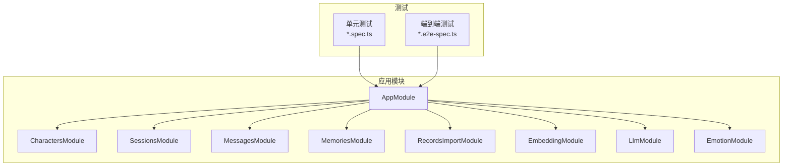
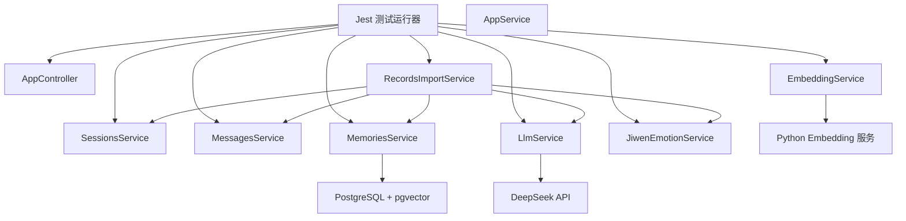
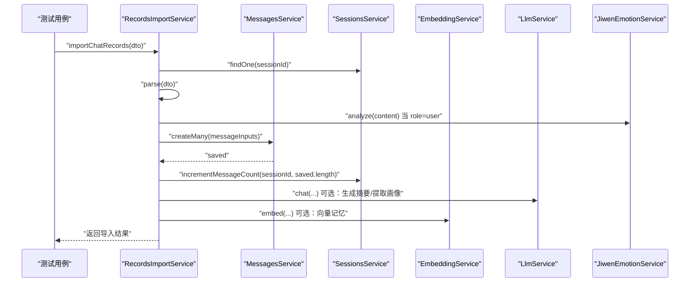
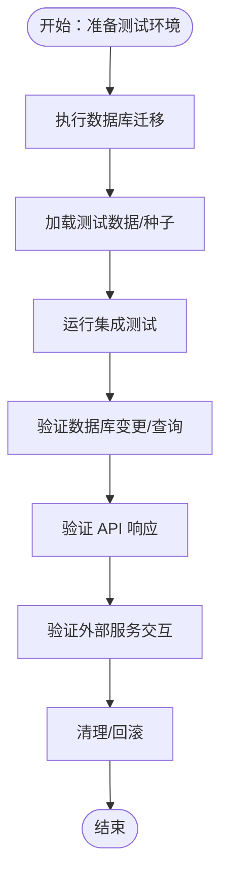
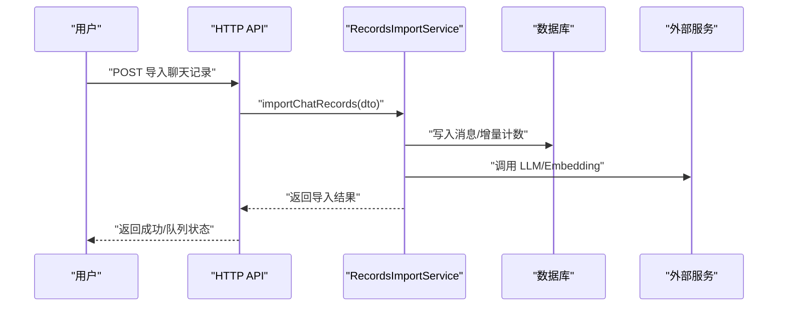
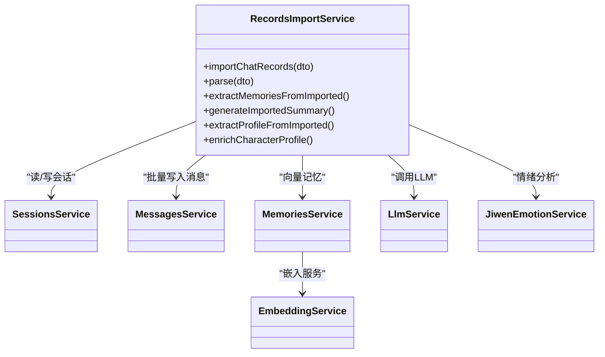

# 测试策略

<cite>
**本文引用的文件**
- [package.json](file://package.json)
- [jest-e2e.json](file://test/jest-e2e.json)
- [app.controller.spec.ts](file://src/app.controller.spec.ts)
- [app.e2e-spec.ts](file://test/app.e2e-spec.ts)
- [records-import.service.spec.ts](file://src/records-import/records-import.service.spec.ts)
- [app.module.ts](file://src/app.module.ts)
- [characters.service.ts](file://src/characters/characters.service.ts)
- [sessions.service.ts](file://src/sessions/sessions.service.ts)
- [messages.service.ts](file://src/messages/messages.service.ts)
- [memories.service.ts](file://src/memories/memories.service.ts)
- [records-import.service.ts](file://src/records-import/records-import.service.ts)
- [llm.service.ts](file://src/llm/llm.service.ts)
- [embedding.service.ts](file://src/embedding/embedding.service.ts)
- [jiwen-emotion.service.ts](file://src/emotion/jiwen-emotion.service.ts)
- [1710000000000-init-pgvector-schema.ts](file://src/migrations/1710000000000-init-pgvector-schema.ts)
- [database.config.ts](file://src/config/database.config.ts)
</cite>

## 目录
1. [简介](#简介)
2. [项目结构](#项目结构)
3. [核心组件](#核心组件)
4. [架构总览](#架构总览)
5. [详细组件分析](#详细组件分析)
6. [依赖分析](#依赖分析)
7. [性能考虑](#性能考虑)
8. [故障排查指南](#故障排查指南)
9. [结论](#结论)
10. [附录](#附录)

## 简介
本测试策略面向 AI Companion 项目，覆盖单元测试、集成测试与端到端测试（E2E），并扩展至性能与压力测试、持续集成中的自动化执行与报告生成。策略重点包括：
- Jest 测试框架配置与运行脚本
- 服务层测试用例设计与 Mock 策略
- API 接口测试与数据库集成测试
- 外部服务（LLM、Embedding、情绪分析）集成测试
- 端到端用户场景与跨平台适配器测试
- 测试覆盖率目标与质量标准
- 测试环境搭建（数据库、模拟服务、测试数据）
- 性能与压力测试实施方案
- 测试最佳实践与常见问题解决

## 项目结构
项目采用 NestJS 架构，核心模块围绕“角色/会话/消息/记忆/导入/嵌入/LLM/情绪”等能力域划分；测试位于 src 下以 .spec.ts 命名的服务层测试与 test 目录下的 E2E 测试。

图表来源
- [app.module.ts:18-62](file://src/app.module.ts#L18-L62)

章节来源
- [package.json:8-27](file://package.json#L8-L27)
- [jest-e2e.json:1-10](file://test/jest-e2e.json#L1-L10)
- [app.module.ts:18-62](file://src/app.module.ts#L18-L62)

## 核心组件
- 单元测试框架与脚本
  - Jest 配置：rootDir、transform、testRegex、collectCoverageFrom、coverageDirectory、testEnvironment
  - 运行脚本：test、test:watch、test:cov、test:debug、test:e2e
- 服务层测试用例
  - AppController 基础用例
  - RecordsImportService 完整业务流程与 Mock
- E2E 测试
  - supertest 发起 HTTP 请求验证根路径响应

章节来源
- [package.json:72-88](file://package.json#L72-L88)
- [package.json:8-27](file://package.json#L8-L27)
- [app.controller.spec.ts:1-23](file://src/app.controller.spec.ts#L1-L23)
- [records-import.service.spec.ts:1-106](file://src/records-import/records-import.service.spec.ts#L1-L106)
- [app.e2e-spec.ts:1-30](file://test/app.e2e-spec.ts#L1-L30)

## 架构总览
测试架构围绕“服务层单元测试 + API 层 E2E + 外部服务 Mock + 数据库迁移与实体”的组合展开。TypeORM 数据源在 AppModule 中集中配置，迁移脚本确保 pgvector 扩展与表结构初始化。

图表来源
- [app.module.ts:38-50](file://src/app.module.ts#L38-L50)
- [records-import.service.ts:48-58](file://src/records-import/records-import.service.ts#L48-L58)
- [memories.service.ts:29-34](file://src/memories/memories.service.ts#L29-L34)
- [embedding.service.ts:14-21](file://src/embedding/embedding.service.ts#L14-L21)
- [llm.service.ts:27-33](file://src/llm/llm.service.ts#L27-L33)
- [jiwen-emotion.service.ts:31-32](file://src/emotion/jiwen-emotion.service.ts#L31-L32)

## 详细组件分析

### 单元测试设计与实现
- 测试框架配置
  - 使用 ts-jest 转换 TypeScript，rootDir 指向 src，匹配 *.spec.ts
  - 收集覆盖率范围覆盖所有 .ts 文件，输出目录为 coverage
  - 测试环境为 node
- 服务层测试策略
  - 通过 Test.createTestingModule 注入控制器/服务，构造最小依赖图
  - 对外部依赖进行 Mock（如 LLM、Embedding、Memories、Sessions、Messages、JiwenEmotion）
  - 针对 RecordsImportService 的复杂流程，使用 Mock 实现异步后台任务（setImmediate）与 JSON 解析安全处理
- Mock 数据管理
  - 为 Sessions/Messages/Memories/Llm/JiwenEmotion 提供函数级 Mock，保证测试隔离与可重复性
  - 使用 jest.fn().mockResolvedValue/mockImplementation 控制返回值与副作用

图表来源
- [records-import.service.ts:60-128](file://src/records-import/records-import.service.ts#L60-L128)
- [records-import.service.spec.ts:4-39](file://src/records-import/records-import.service.spec.ts#L4-L39)

章节来源
- [package.json:72-88](file://package.json#L72-L88)
- [app.controller.spec.ts:1-23](file://src/app.controller.spec.ts#L1-L23)
- [records-import.service.spec.ts:1-106](file://src/records-import/records-import.service.spec.ts#L1-L106)

### 集成测试策略
- 数据库集成测试
  - 使用 TypeORM DataSource（AppModule 中配置）与迁移脚本初始化数据库结构（枚举、表、索引）
  - 在测试前确保迁移执行，测试后清理或使用事务回滚（建议）
  - 验证 Entities 与 Repository 的 CRUD 行为（Characters/Sessions/Messages/Memories）
- 外部服务集成测试
  - LLM 服务：通过 Mock 控制响应，验证 chat 与 chatStream 的调用参数与返回形态
  - Embedding 服务：Mock Python FastAPI，验证 embed/batchEmbed/healthCheck 的调用与错误处理
  - 情绪分析服务：验证 JiwenEmotionService 的情绪打分与摘要生成逻辑
- API 接口测试
  - 使用 supertest 对根路径 / 进行 GET 请求，验证状态码与响应体
  - 可扩展至会话、消息、记忆等路由的接口测试

图表来源
- [app.module.ts:38-50](file://src/app.module.ts#L38-L50)
- [1710000000000-init-pgvector-schema.ts:6-93](file://src/migrations/1710000000000-init-pgvector-schema.ts#L6-L93)
- [embedding.service.ts:33-65](file://src/embedding/embedding.service.ts#L33-L65)
- [llm.service.ts:36-57](file://src/llm/llm.service.ts#L36-L57)
- [jiwen-emotion.service.ts:32-76](file://src/emotion/jiwen-emotion.service.ts#L32-L76)
- [app.e2e-spec.ts:19-24](file://test/app.e2e-spec.ts#L19-L24)

章节来源
- [app.module.ts:38-50](file://src/app.module.ts#L38-L50)
- [1710000000000-init-pgvector-schema.ts:6-93](file://src/migrations/1710000000000-init-pgvector-schema.ts#L6-L93)
- [embedding.service.ts:33-65](file://src/embedding/embedding.service.ts#L33-L65)
- [llm.service.ts:36-57](file://src/llm/llm.service.ts#L36-L57)
- [jiwen-emotion.service.ts:32-76](file://src/emotion/jiwen-emotion.service.ts#L32-L76)
- [app.e2e-spec.ts:1-30](file://test/app.e2e-spec.ts#L1-L30)

### 端到端测试实施方案
- 用户场景测试
  - 场景一：导入微信聊天记录并触发记忆提取、摘要生成、画像提取
  - 场景二：基于会话与消息的历史上下文进行对话，验证情绪快照与回复策略
- 跨平台适配器测试
  - 针对 MiniProgram/Telegram/QQ Bot 等适配器的 API 行为进行契约测试（输入输出、错误码、限流处理）
- 完整业务流程测试
  - 从导入到记忆检索、摘要生成、角色画像更新的完整链路验证
  - 使用 supertest 验证 HTTP API 的端到端行为

图表来源
- [records-import.service.ts:60-128](file://src/records-import/records-import.service.ts#L60-L128)
- [app.e2e-spec.ts:19-24](file://test/app.e2e-spec.ts#L19-L24)

章节来源
- [records-import.service.ts:60-128](file://src/records-import/records-import.service.ts#L60-L128)
- [app.e2e-spec.ts:1-30](file://test/app.e2e-spec.ts#L1-L30)

## 依赖分析
- 组件耦合与内聚
  - RecordsImportService 依赖 Sessions/Messages/Memories/Llm/JiwenEmotion，属于高内聚的业务编排层
  - Services 通过 TypeORM Repository/DataSource 与数据库交互，依赖清晰
- 外部依赖
  - LLM 服务依赖 DeepSeek API，需通过 Mock 保障稳定性
  - Embedding 服务依赖 Python FastAPI，需健康检查与超时控制
- 潜在循环依赖
  - 当前模块间通过服务注入解耦，未发现循环依赖迹象

图表来源
- [records-import.service.ts:48-58](file://src/records-import/records-import.service.ts#L48-L58)
- [memories.service.ts:29-34](file://src/memories/memories.service.ts#L29-L34)
- [embedding.service.ts:14-21](file://src/embedding/embedding.service.ts#L14-L21)
- [llm.service.ts:27-33](file://src/llm/llm.service.ts#L27-L33)
- [jiwen-emotion.service.ts:31-32](file://src/emotion/jiwen-emotion.service.ts#L31-L32)

章节来源
- [records-import.service.ts:48-58](file://src/records-import/records-import.service.ts#L48-L58)
- [memories.service.ts:29-34](file://src/memories/memories.service.ts#L29-L34)
- [embedding.service.ts:14-21](file://src/embedding/embedding.service.ts#L14-L21)
- [llm.service.ts:27-33](file://src/llm/llm.service.ts#L27-L33)
- [jiwen-emotion.service.ts:31-32](file://src/emotion/jiwen-emotion.service.ts#L31-L32)

## 性能考虑
- 单元测试
  - 优先使用 Mock 减少外部依赖，缩短测试时长
  - 对批量操作（如 createMany、batchEmbed）进行边界与超时测试
- 集成测试
  - 使用内存数据库或 Docker Postgres 进行快速回归
  - 对检索与向量计算进行基准测试（QPS、P95 延迟）
- 性能与压力测试
  - 负载测试：JMeter/K6 对 /chat、/import 等关键接口施压
  - 并发测试：模拟多会话并发写入消息与检索记忆
  - 基准测试：对比不同模型/嵌入服务的吞吐与延迟
- 监控指标
  - LLM 调用耗时、错误率、超时比例
  - 嵌入服务健康检查与批量处理耗时
  - 数据库查询延迟与索引命中率

## 故障排查指南
- 常见问题
  - 数据库迁移失败：确认 DB_HOST/PORT/USER/PASSWORD/NAME 与迁移脚本一致
  - LLM/Embedding 超时：检查 API Key、网络连通性与超时阈值
  - 情绪分析异常：确认输入文本编码与关键字匹配规则
- 排查步骤
  - 启用 DB_LOGGING=true 查看 SQL
  - 使用 test:debug 进行单测断点调试
  - 在 E2E 中打印请求/响应体定位问题
- 修复建议
  - 为外部服务增加指数退避与熔断
  - 对批量操作分片处理并记录进度

章节来源
- [app.module.ts:38-50](file://src/app.module.ts#L38-L50)
- [database.config.ts:8-20](file://src/config/database.config.ts#L8-L20)
- [llm.service.ts:36-57](file://src/llm/llm.service.ts#L36-L57)
- [embedding.service.ts:70-82](file://src/embedding/embedding.service.ts#L70-L82)

## 结论
本测试策略以 Jest 为核心，结合服务层 Mock、数据库迁移与外部服务契约，构建了覆盖单元、集成与端到端的完整测试体系。建议在 CI 中强制覆盖率门槛与通过标准，并引入性能与压力测试以保障生产质量。

## 附录

### 测试覆盖率要求与质量标准
- 代码覆盖率目标
  - 语句覆盖率 ≥ 85%
  - 分支覆盖率 ≥ 80%
  - 函数覆盖率 ≥ 90%
  - 行覆盖率 ≥ 85%
- 测试通过标准
  - 所有单元测试与集成测试通过
  - 关键路径（导入/记忆/摘要/画像）E2E 通过
  - 性能基准满足 SLA（如 P95 ≤ 2s）

### 测试环境搭建
- 测试数据库
  - 使用 PostgreSQL + pgvector，迁移脚本初始化表与索引
  - 通过 TypeORM DataSource 或 Docker 快速拉起
- 模拟服务
  - LLM：Mock DeepSeek API，控制响应时间与错误
  - Embedding：Mock Python FastAPI，支持健康检查与批量处理
  - 情绪分析：直接调用 JiwenEmotionService，无需外部依赖
- 测试数据准备
  - 使用迁移脚本与种子数据初始化基础角色/会话/消息
  - 导入测试数据集（微信/QQ 格式）验证解析与导入流程

章节来源
- [1710000000000-init-pgvector-schema.ts:6-93](file://src/migrations/1710000000000-init-pgvector-schema.ts#L6-L93)
- [database.config.ts:8-20](file://src/config/database.config.ts#L8-L20)
- [embedding.service.ts:33-65](file://src/embedding/embedding.service.ts#L33-L65)
- [llm.service.ts:36-57](file://src/llm/llm.service.ts#L36-L57)
- [jiwen-emotion.service.ts:32-76](file://src/emotion/jiwen-emotion.service.ts#L32-L76)

### 持续集成中的测试流程
- 自动化测试执行
  - 安装依赖后执行 npm run test 与 npm run test:e2e
  - 生成覆盖率报告并上传至 CI 报告系统
- 测试报告生成
  - 使用 Jest 内置报告与覆盖率 HTML 输出
  - 可选：集成 SonarQube/Codecov 进行趋势分析

章节来源
- [package.json:8-27](file://package.json#L8-L27)
- [package.json:72-88](file://package.json#L72-L88)