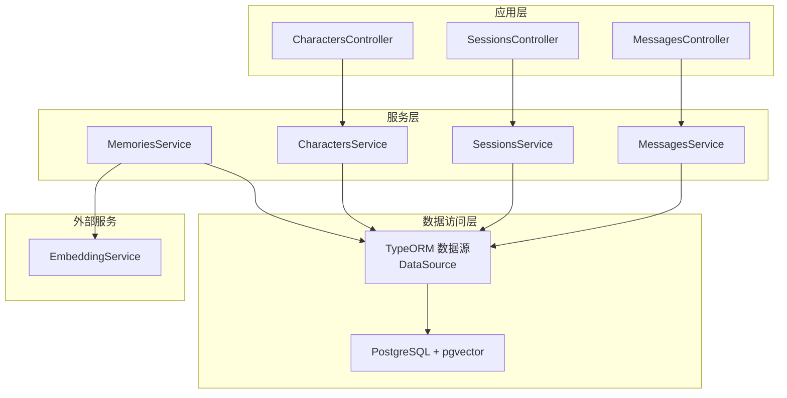
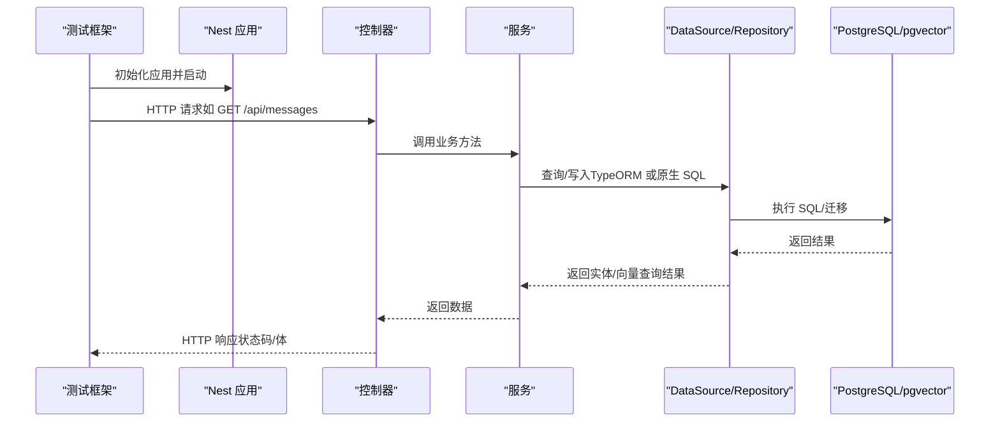
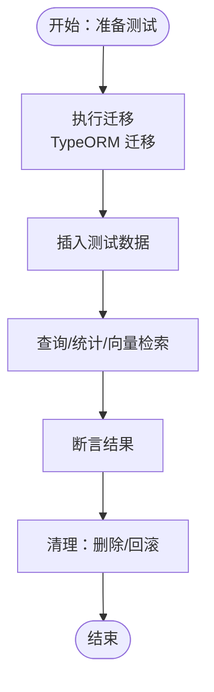
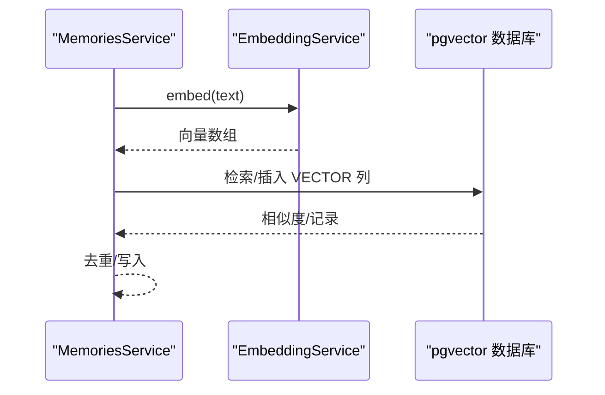
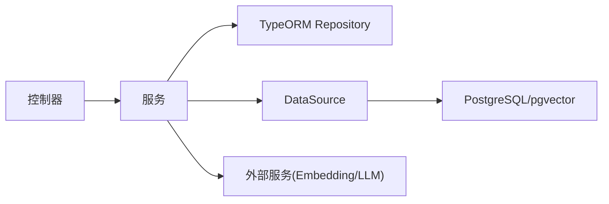

# 集成测试

<cite>
**本文引用的文件**
- [src/main.ts](file://src/main.ts)
- [src/app.module.ts](file://src/app.module.ts)
- [src/config/database.config.ts](file://src/config/database.config.ts)
- [src/characters/characters.controller.ts](file://src/characters/characters.controller.ts)
- [src/characters/characters.service.ts](file://src/characters/characters.service.ts)
- [src/sessions/sessions.controller.ts](file://src/sessions/sessions.controller.ts)
- [src/sessions/sessions.service.ts](file://src/sessions/sessions.service.ts)
- [src/messages/messages.controller.ts](file://src/messages/messages.controller.ts)
- [src/messages/messages.service.ts](file://src/messages/messages.service.ts)
- [src/memories/memories.service.ts](file://src/memories/memories.service.ts)
- [src/records-import/records-import.service.spec.ts](file://src/records-import/records-import.service.spec.ts)
- [test/app.e2e-spec.ts](file://test/app.e2e-spec.ts)
- [test/jest-e2e.json](file://test/jest-e2e.json)
- [package.json](file://package.json)
</cite>

## 目录
1. [简介](#简介)
2. [项目结构](#项目结构)
3. [核心组件](#核心组件)
4. [架构总览](#架构总览)
5. [详细组件分析](#详细组件分析)
6. [依赖关系分析](#依赖关系分析)
7. [性能考量](#性能考量)
8. [故障排查指南](#故障排查指南)
9. [结论](#结论)
10. [附录](#附录)

## 简介
本文件面向 AI Companion 的集成测试，系统性阐述端到端测试策略与落地方法，覆盖以下方面：
- API 接口测试：基于 supertest 的 HTTP 请求与响应验证、错误场景覆盖
- 数据库集成测试：基于 TypeORM 的实体持久化、迁移与一致性验证
- 外部服务集成测试：嵌入向量化与 pgvector 相关能力的端到端验证
- 测试环境配置：测试数据库与迁移、环境变量隔离与测试清理
- 跨模块交互测试：控制器-服务-数据库-外部服务的协同验证
- 最佳实践：测试数据管理、环境隔离与测试清理

## 项目结构
本项目采用 NestJS 架构，核心模块围绕“角色/会话/消息/记忆”展开，并通过 TypeORM 连接 PostgreSQL，使用 pgvector 扩展支持向量检索。测试采用 Jest + supertest，分为单元测试与端到端测试两类。

图表来源
- [src/app.module.ts:18-63](file://src/app.module.ts#L18-L63)
- [src/characters/characters.controller.ts:17-55](file://src/characters/characters.controller.ts#L17-L55)
- [src/sessions/sessions.controller.ts:4-27](file://src/sessions/sessions.controller.ts#L4-L27)
- [src/messages/messages.controller.ts:10-26](file://src/messages/messages.controller.ts#L10-L26)
- [src/characters/characters.service.ts:6-40](file://src/characters/characters.service.ts#L6-L40)
- [src/sessions/sessions.service.ts:7-61](file://src/sessions/sessions.service.ts#L7-L61)
- [src/messages/messages.service.ts:23-92](file://src/messages/messages.service.ts#L23-L92)
- [src/memories/memories.service.ts:30-137](file://src/memories/memories.service.ts#L30-L137)
- [src/config/database.config.ts:8-20](file://src/config/database.config.ts#L8-L20)

章节来源
- [src/app.module.ts:18-63](file://src/app.module.ts#L18-L63)
- [src/main.ts:1-22](file://src/main.ts#L1-L22)

## 核心组件
- 应用入口与启动：负责初始化 Nest 应用、CORS 配置与监听端口
- 应用模块：装配静态资源、配置加载、数据库连接与业务模块
- 数据库配置：定义 DataSource，启用迁移与日志
- 控制器与服务：提供 REST API 与数据访问逻辑；记忆服务直接使用 DataSource 执行原生 SQL 与向量检索

章节来源
- [src/main.ts:4-21](file://src/main.ts#L4-L21)
- [src/app.module.ts:37-50](file://src/app.module.ts#L37-L50)
- [src/config/database.config.ts:8-20](file://src/config/database.config.ts#L8-L20)
- [src/characters/characters.controller.ts:17-55](file://src/characters/characters.controller.ts#L17-L55)
- [src/sessions/sessions.controller.ts:4-27](file://src/sessions/sessions.controller.ts#L4-L27)
- [src/messages/messages.controller.ts:10-26](file://src/messages/messages.controller.ts#L10-L26)
- [src/characters/characters.service.ts:6-40](file://src/characters/characters.service.ts#L6-L40)
- [src/sessions/sessions.service.ts:7-61](file://src/sessions/sessions.service.ts#L7-L61)
- [src/messages/messages.service.ts:23-92](file://src/messages/messages.service.ts#L23-L92)
- [src/memories/memories.service.ts:30-137](file://src/memories/memories.service.ts#L30-L137)

## 架构总览
下图展示端到端测试的关键交互路径：测试框架启动应用 -> 发送 HTTP 请求 -> 控制器调用服务 -> 服务访问数据库或外部服务 -> 返回响应。

图表来源
- [test/app.e2e-spec.ts:10-24](file://test/app.e2e-spec.ts#L10-L24)
- [src/messages/messages.controller.ts:14-25](file://src/messages/messages.controller.ts#L14-L25)
- [src/messages/messages.service.ts:67-82](file://src/messages/messages.service.ts#L67-L82)
- [src/config/database.config.ts:8-20](file://src/config/database.config.ts#L8-L20)

## 详细组件分析

### API 接口测试
- 测试框架与运行方式：Jest + supertest，端到端测试配置在 jest-e2e.json 中，测试脚本通过 package.json 的 test:e2e 调用
- 典型测试流程：创建测试模块 -> 初始化应用 -> 使用 supertest 发送请求 -> 断言状态码与响应体
- 关键控制器与端点：
  - 角色：POST/GET/GET:/:id/DELETE: /api/characters
  - 会话：POST/GET/GET:/:id/DELETE: /api/sessions
  - 消息：GET: /api/messages?sessionId=&limit=
- 错误场景建议：
  - 未找到资源：控制器抛出异常，服务层返回 NotFound 异常
  - 参数缺失/非法：控制器参数校验失败，返回 400/422
  - 数据库约束冲突：唯一性/外键约束导致 409/422
- 建议断言内容：
  - 状态码：200/201/404/400/422/500
  - 响应体字段：必填字段存在、类型正确、长度限制
  - 分页/排序：limit、order、分页边界

章节来源
- [test/app.e2e-spec.ts:10-24](file://test/app.e2e-spec.ts#L10-L24)
- [test/jest-e2e.json:1-9](file://test/jest-e2e.json#L1-L9)
- [package.json:23-27](file://package.json#L23-L27)
- [src/characters/characters.controller.ts:17-55](file://src/characters/characters.controller.ts#L17-L55)
- [src/sessions/sessions.controller.ts:4-27](file://src/sessions/sessions.controller.ts#L4-L27)
- [src/messages/messages.controller.ts:14-25](file://src/messages/messages.controller.ts#L14-L25)
- [src/characters/characters.service.ts:22-28](file://src/characters/characters.service.ts#L22-L28)
- [src/sessions/sessions.service.ts:22-28](file://src/sessions/sessions.service.ts#L22-L28)

### 数据库集成测试
- 数据库连接与迁移：
  - 应用模块通过 TypeOrmModule.forRoot 配置连接参数、实体自动加载、禁用同步、启用迁移
  - CLI 使用单独的 DataSource 配置，便于迁移命令执行
- 实体与服务：
  - 角色/会话/消息实体通过 Repository 访问，提供 CRUD 与统计查询
  - 记忆服务绕过 Entity，直接使用 DataSource 执行原生 SQL，以兼容 pgvector 的 VECTOR 列
- 测试要点：
  - 初始化：在测试前执行迁移，确保表结构与扩展就绪
  - 清理：测试后回滚或重建测试数据库，避免状态污染
  - 一致性：插入后查询，断言字段与索引行为（如向量检索相似度）

图表来源
- [src/app.module.ts:37-50](file://src/app.module.ts#L37-L50)
- [src/config/database.config.ts:8-20](file://src/config/database.config.ts#L8-L20)
- [src/characters/characters.service.ts:13-16](file://src/characters/characters.service.ts#L13-L16)
- [src/sessions/sessions.service.ts:13-16](file://src/sessions/sessions.service.ts#L13-L16)
- [src/messages/messages.service.ts:36-49](file://src/messages/messages.service.ts#L36-L49)
- [src/memories/memories.service.ts:42-59](file://src/memories/memories.service.ts#L42-L59)

章节来源
- [src/app.module.ts:37-50](file://src/app.module.ts#L37-L50)
- [src/config/database.config.ts:8-20](file://src/config/database.config.ts#L8-L20)
- [src/characters/characters.service.ts:13-16](file://src/characters/characters.service.ts#L13-L16)
- [src/sessions/sessions.service.ts:13-16](file://src/sessions/sessions.service.ts#L13-L16)
- [src/messages/messages.service.ts:36-49](file://src/messages/messages.service.ts#L36-L49)
- [src/memories/memories.service.ts:42-59](file://src/memories/memories.service.ts#L42-L59)

### 外部服务集成测试
- 向量嵌入与检索：
  - 记忆服务依赖 EmbeddingService 生成向量，再通过原生 SQL 执行 pgvector 的向量运算与相似度检索
  - 测试建议：构造不同语义的文本，验证相似度排序与阈值去重
- LLM 与情绪分析：
  - 记录导入服务在导入完成后触发摘要队列，可能调用 LLM 与 jiwen 情绪分析服务
  - 测试建议：模拟外部服务返回，验证业务流程与错误降级

图表来源
- [src/memories/memories.service.ts:115-136](file://src/memories/memories.service.ts#L115-L136)
- [src/records-import/records-import.service.spec.ts:30-36](file://src/records-import/records-import.service.spec.ts#L30-L36)

章节来源
- [src/memories/memories.service.ts:30-137](file://src/memories/memories.service.ts#L30-L137)
- [src/records-import/records-import.service.spec.ts:30-36](file://src/records-import/records-import.service.spec.ts#L30-L36)

### 跨模块交互测试
- 控制器-服务-数据库链路：
  - 控制器接收请求参数，调用服务；服务通过 Repository 或 DataSource 访问数据库
  - 建议对关键业务流程进行端到端验证，如创建角色-新建会话-新增消息-记忆检索
- 服务间依赖：
  - 记录导入服务依赖多个子服务，可通过依赖注入替换为 Mock，验证调度逻辑与错误处理

章节来源
- [src/characters/characters.controller.ts:17-55](file://src/characters/characters.controller.ts#L17-L55)
- [src/sessions/sessions.controller.ts:4-27](file://src/sessions/sessions.controller.ts#L4-L27)
- [src/messages/messages.controller.ts:14-25](file://src/messages/messages.controller.ts#L14-L25)
- [src/characters/characters.service.ts:6-40](file://src/characters/characters.service.ts#L6-L40)
- [src/sessions/sessions.service.ts:7-61](file://src/sessions/sessions.service.ts#L7-L61)
- [src/messages/messages.service.ts:23-92](file://src/messages/messages.service.ts#L23-L92)
- [src/records-import/records-import.service.spec.ts:30-36](file://src/records-import/records-import.service.spec.ts#L30-L36)

## 依赖关系分析
- 模块耦合：
  - 控制器仅依赖对应服务，服务依赖 Repository 或 DataSource，降低耦合
  - 记忆服务与 EmbeddingService 解耦，便于替换外部服务
- 外部依赖：
  - PostgreSQL + pgvector：向量检索与存储
  - 外部 LLM/情绪分析服务：通过服务接口抽象，便于 Mock

图表来源
- [src/characters/characters.controller.ts:17-55](file://src/characters/characters.controller.ts#L17-L55)
- [src/sessions/sessions.controller.ts:4-27](file://src/sessions/sessions.controller.ts#L4-L27)
- [src/messages/messages.controller.ts:10-26](file://src/messages/messages.controller.ts#L10-L26)
- [src/characters/characters.service.ts:6-40](file://src/characters/characters.service.ts#L6-L40)
- [src/sessions/sessions.service.ts:7-61](file://src/sessions/sessions.service.ts#L7-L61)
- [src/messages/messages.service.ts:23-92](file://src/messages/messages.service.ts#L23-L92)
- [src/memories/memories.service.ts:30-137](file://src/memories/memories.service.ts#L30-L137)
- [src/config/database.config.ts:8-20](file://src/config/database.config.ts#L8-L20)

## 性能考量
- 数据库性能：
  - 向量检索使用 HNSW 索引与余弦距离，建议在测试中构造大规模向量集进行吞吐与延迟评估
  - 事务批量写入（如 createMany）优于逐条插入
- API 性能：
  - 合理设置 limit 与分页，避免一次性返回过多历史消息
  - 对高频查询建立缓存（如最近消息列表）以减轻数据库压力
- 外部服务：
  - 嵌入服务与 LLM 调用建议限流与超时控制，测试中使用 Mock 降低不确定性

## 故障排查指南
- 端到端测试失败：
  - 检查应用启动日志与 CORS 配置，确认端口占用与跨域问题
  - 使用更详细的响应体断言定位具体字段
- 数据库相关错误：
  - 确认迁移已执行且 pgvector 扩展可用
  - 检查唯一性/外键约束，必要时在测试前清理相关数据
- 向量检索异常：
  - 核对向量维度与类型转换，确保 embeddingService 输出格式正确
- 外部服务不可用：
  - 使用 Mock 替换外部服务，验证业务流程与错误分支

章节来源
- [src/main.ts:9-13](file://src/main.ts#L9-L13)
- [src/app.module.ts:37-50](file://src/app.module.ts#L37-L50)
- [src/config/database.config.ts:8-20](file://src/config/database.config.ts#L8-L20)
- [src/memories/memories.service.ts:42-59](file://src/memories/memories.service.ts#L42-L59)

## 结论
通过统一的测试策略与工具链，本项目可实现对 API、数据库与外部服务的全面集成测试。建议在 CI 中固定测试数据库实例，结合迁移与 Mock，确保测试环境的独立性与可重复性；同时以端到端测试覆盖关键业务流程，以单元测试保障模块内聚与解耦。

## 附录

### 测试环境配置与最佳实践
- 环境变量隔离：
  - 为测试设置独立的数据库名与端口，避免与开发/生产冲突
  - 在测试中显式加载 .env，确保 DataSource 与迁移配置一致
- 测试数据库与迁移：
  - 使用迁移补齐表结构与扩展，避免 TypeORM 同步导致的向量列丢失
  - 在测试前后执行迁移与回滚，保证状态一致
- 测试数据管理：
  - 使用工厂模式或脚本生成最小化测试数据，减少依赖
  - 对易变数据（如向量）使用稳定输入，便于断言
- 测试清理：
  - 在 afterEach/afterAll 中关闭应用与清理数据库
  - 对外部服务使用 Mock，避免真实调用产生副作用

章节来源
- [src/app.module.ts:37-50](file://src/app.module.ts#L37-L50)
- [src/config/database.config.ts:8-20](file://src/config/database.config.ts#L8-L20)
- [test/app.e2e-spec.ts:10-28](file://test/app.e2e-spec.ts#L10-L28)
- [package.json:23-27](file://package.json#L23-L27)