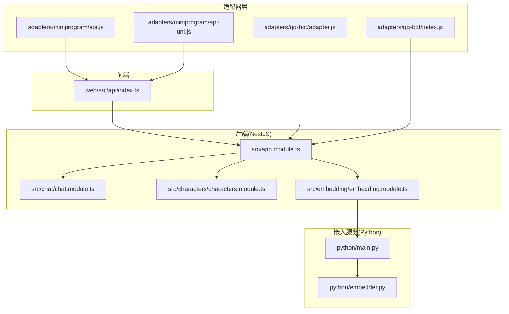
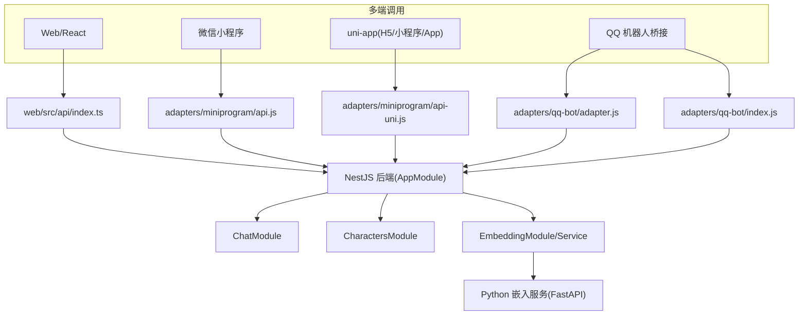
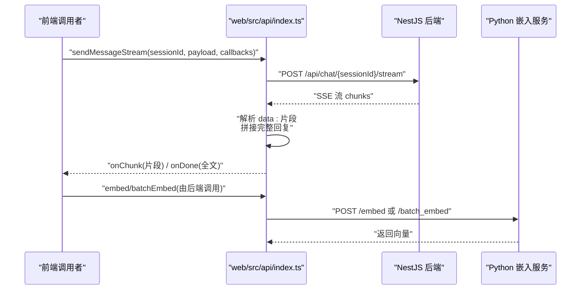
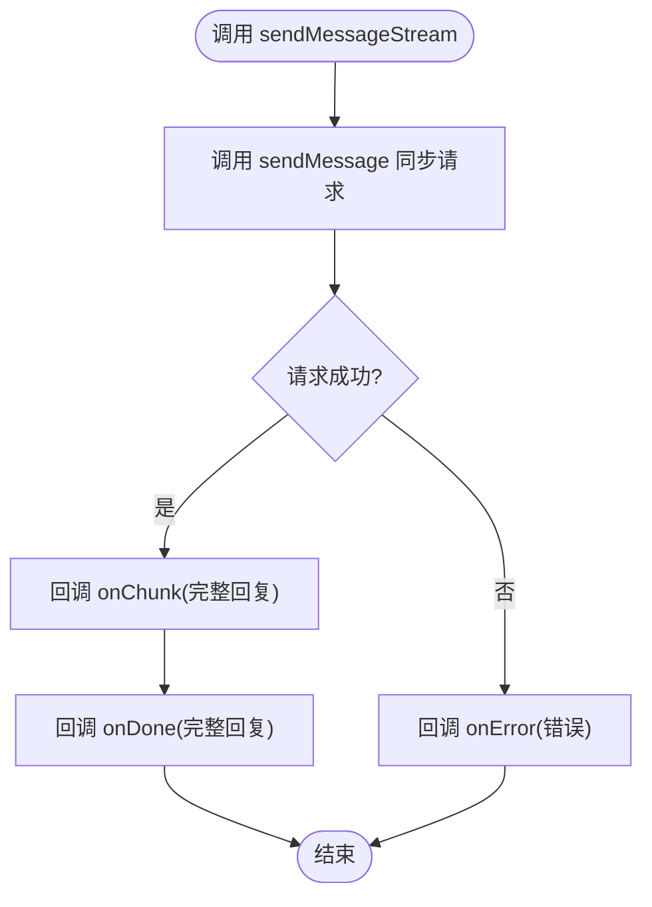
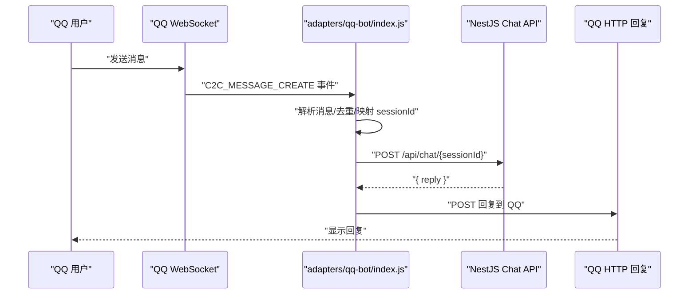
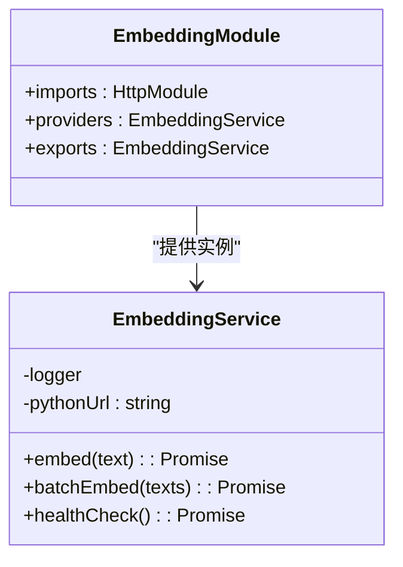
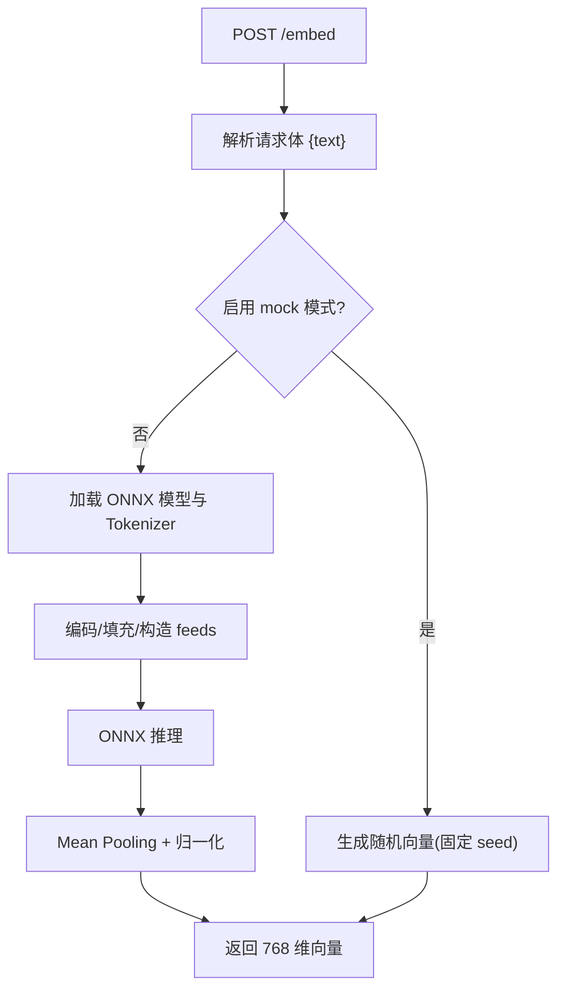
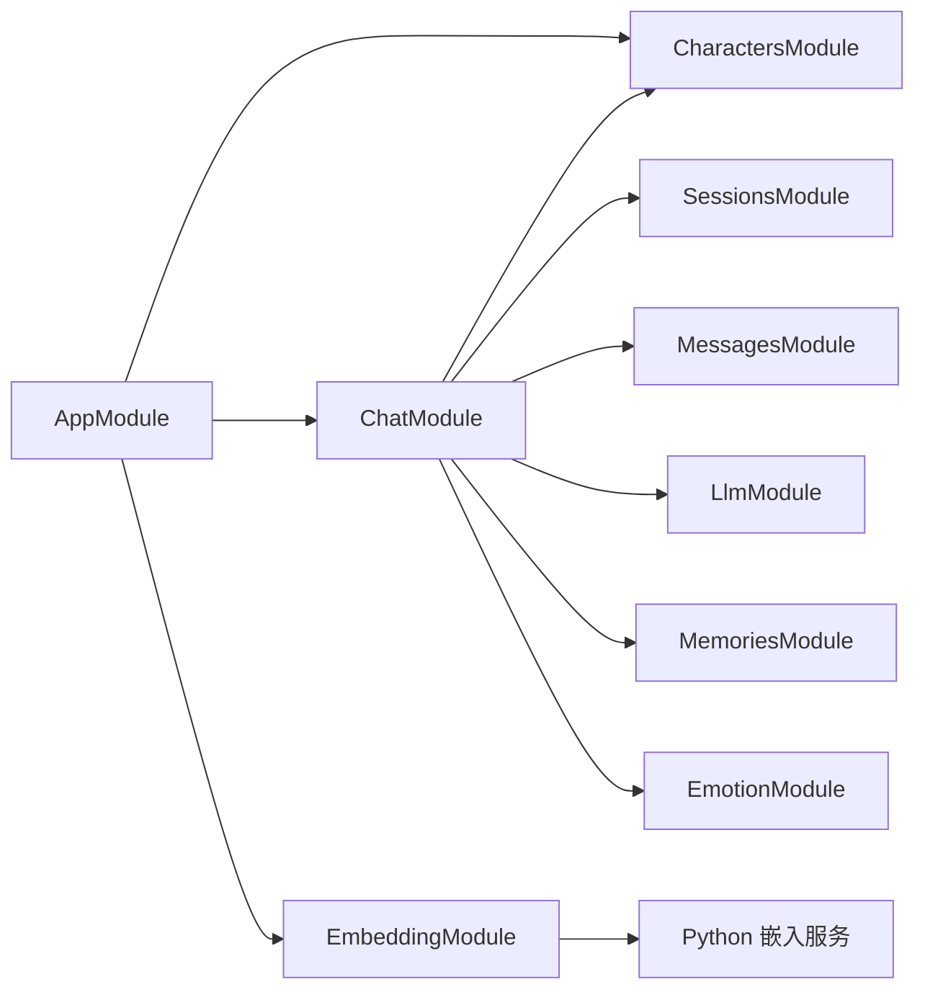

# 扩展模式设计

<cite>
**本文引用的文件**
- [adapters/README.md](file://adapters/README.md)
- [adapters/miniprogram/api.js](file://adapters/miniprogram/api.js)
- [adapters/miniprogram/api-uni.js](file://adapters/miniprogram/api-uni.js)
- [adapters/qq-bot/adapter.js](file://adapters/qq-bot/adapter.js)
- [adapters/qq-bot/index.js](file://adapters/qq-bot/index.js)
- [web/src/api/index.ts](file://web/src/api/index.ts)
- [shared/types.ts](file://shared/types.ts)
- [src/app.module.ts](file://src/app.module.ts)
- [src/characters/characters.module.ts](file://src/characters/characters.module.ts)
- [src/chat/chat.module.ts](file://src/chat/chat.module.ts)
- [src/embedding/embedding.module.ts](file://src/embedding/embedding.module.ts)
- [src/embedding/embedding.service.ts](file://src/embedding/embedding.service.ts)
- [python/embedder.py](file://python/embedder.py)
- [python/main.py](file://python/main.py)
</cite>

## 目录
1. [引言](#引言)
2. [项目结构](#项目结构)
3. [核心组件](#核心组件)
4. [架构总览](#架构总览)
5. [详细组件分析](#详细组件分析)
6. [依赖分析](#依赖分析)
7. [性能考量](#性能考量)
8. [故障排查指南](#故障排查指南)
9. [结论](#结论)
10. [附录](#附录)

## 引言
本文件面向“AI Companion”的扩展模式与适配器设计，系统阐述如何通过标准化接口与模块化架构，实现对多平台（Web、微信小程序、uni-app、QQ 机器人等）的快速适配与扩展；同时覆盖向量嵌入服务的独立部署与扩展策略，并总结扩展点设计原则、最佳实践与兼容性考虑。

## 项目结构
项目采用前后端分离与模块化组织：
- 前端调用层位于 web/src/api/index.ts，提供统一的 API 函数签名，屏蔽底层网络差异。
- 适配器层位于 adapters/，针对不同平台替换网络请求实现，保持函数签名一致。
- 后端基于 NestJS，按功能拆分为多个模块（如 Characters、Sessions、Chat、Embedding 等），通过依赖注入与模块化组合。
- 向量嵌入服务独立为 Python FastAPI 应用，通过 HTTP 提供 embed/batch_embed/health 等接口。

图表来源
- [web/src/api/index.ts:1-212](file://web/src/api/index.ts#L1-L212)
- [adapters/miniprogram/api.js:1-83](file://adapters/miniprogram/api.js#L1-L83)
- [adapters/miniprogram/api-uni.js:1-85](file://adapters/miniprogram/api-uni.js#L1-L85)
- [adapters/qq-bot/adapter.js:1-35](file://adapters/qq-bot/adapter.js#L1-L35)
- [adapters/qq-bot/index.js:1-303](file://adapters/qq-bot/index.js#L1-L303)
- [src/app.module.ts:1-64](file://src/app.module.ts#L1-L64)
- [src/chat/chat.module.ts:1-35](file://src/chat/chat.module.ts#L1-L35)
- [src/characters/characters.module.ts:1-14](file://src/characters/characters.module.ts#L1-L14)
- [src/embedding/embedding.module.ts:1-16](file://src/embedding/embedding.module.ts#L1-L16)
- [python/main.py:1-123](file://python/main.py#L1-L123)
- [python/embedder.py:1-116](file://python/embedder.py#L1-L116)

章节来源
- [adapters/README.md:1-62](file://adapters/README.md#L1-L62)
- [web/src/api/index.ts:1-212](file://web/src/api/index.ts#L1-L212)
- [src/app.module.ts:1-64](file://src/app.module.ts#L1-L64)

## 核心组件
- 统一 API 层（web/src/api/index.ts）
  - 提供角色、会话、消息、聊天（同步/SSE）、聊天记录导入等标准函数签名，屏蔽平台差异。
  - 类型定义来自 shared/types.ts，确保跨平台一致性。
- 适配器层
  - 微信小程序适配器（adapters/miniprogram/api.js）：将 fetch 替换为 wx.request，SSE 降级为同步。
  - uni-app 适配器（adapters/miniprogram/api-uni.js）：在 H5 环境支持 SSE，在小程序环境降级为同步。
  - QQ 机器人适配器（adapters/qq-bot/adapter.js）：提供协议说明与使用示例（需引入官方 SDK）。
  - QQ 机器人桥接（adapters/qq-bot/index.js）：WebSocket 接入 QQ Bot，HTTP 调用后端 API。
- 后端模块
  - AppModule：装配静态资源、配置、数据库迁移与业务模块。
  - ChatModule：编排角色、会话、消息、LLM、记忆与情感模块。
  - EmbeddingModule/EmbeddingService：通过 HTTP 调用 Python 嵌入服务，提供单条与批量向量化能力。
- 向量嵌入服务（Python）
  - FastAPI 提供 /embed、/batch_embed、/health 接口；可启用 mock 模式验证流程。

章节来源
- [web/src/api/index.ts:1-212](file://web/src/api/index.ts#L1-L212)
- [adapters/miniprogram/api.js:1-83](file://adapters/miniprogram/api.js#L1-L83)
- [adapters/miniprogram/api-uni.js:1-85](file://adapters/miniprogram/api-uni.js#L1-L85)
- [adapters/qq-bot/adapter.js:1-35](file://adapters/qq-bot/adapter.js#L1-L35)
- [adapters/qq-bot/index.js:1-303](file://adapters/qq-bot/index.js#L1-L303)
- [src/app.module.ts:1-64](file://src/app.module.ts#L1-L64)
- [src/chat/chat.module.ts:1-35](file://src/chat/chat.module.ts#L1-L35)
- [src/embedding/embedding.module.ts:1-16](file://src/embedding/embedding.module.ts#L1-L16)
- [src/embedding/embedding.service.ts:1-84](file://src/embedding/embedding.service.ts#L1-L84)
- [python/main.py:1-123](file://python/main.py#L1-L123)
- [python/embedder.py:1-116](file://python/embedder.py#L1-L116)

## 架构总览
该系统采用“统一 API 层 + 适配器层 + 后端模块化 + 独立嵌入服务”的分层扩展架构：
- 统一 API 层：提供一致的函数签名与类型约束，便于在多端复用。
- 适配器层：仅替换网络请求实现，保持业务调用不变，实现“零耦合切换”。
- 后端模块：以模块为边界，通过依赖注入与 exports 导出能力，支持横向扩展。
- 嵌入服务：独立进程/容器，通过 HTTP 接口与后端解耦，便于弹性伸缩与灰度发布。

图表来源
- [web/src/api/index.ts:1-212](file://web/src/api/index.ts#L1-L212)
- [adapters/miniprogram/api.js:1-83](file://adapters/miniprogram/api.js#L1-L83)
- [adapters/miniprogram/api-uni.js:1-85](file://adapters/miniprogram/api-uni.js#L1-L85)
- [adapters/qq-bot/adapter.js:1-35](file://adapters/qq-bot/adapter.js#L1-L35)
- [adapters/qq-bot/index.js:1-303](file://adapters/qq-bot/index.js#L1-L303)
- [src/app.module.ts:1-64](file://src/app.module.ts#L1-L64)
- [src/chat/chat.module.ts:1-35](file://src/chat/chat.module.ts#L1-L35)
- [src/characters/characters.module.ts:1-14](file://src/characters/characters.module.ts#L1-L14)
- [src/embedding/embedding.module.ts:1-16](file://src/embedding/embedding.module.ts#L1-L16)
- [src/embedding/embedding.service.ts:1-84](file://src/embedding/embedding.service.ts#L1-L84)
- [python/main.py:1-123](file://python/main.py#L1-L123)

## 详细组件分析

### 组件A：统一 API 层（web/src/api/index.ts）
- 设计要点
  - 以纯 TS 模块形式存在，不依赖 DOM/React/框架，可在任意 JS 环境复用。
  - 通过函数签名统一角色、会话、消息、聊天（同步/SSE）等操作，便于跨端一致调用。
  - 类型定义来自 shared/types.ts，确保前后端/多端类型一致。
- 关键流程（SSE 流式）
  - 建立 SSE 连接，解析 data: 片段，拼接完整回复，回调 onChunk/onDone。
  - 支持 AbortController 取消请求，处理非 2xx 错误并抛出 ApiError。
- 适配器替换
  - 将 fetch 替换为平台特定网络客户端（如 wx.request/uni.request），保持函数名与参数不变。

图表来源
- [web/src/api/index.ts:129-201](file://web/src/api/index.ts#L129-L201)
- [src/embedding/embedding.service.ts:33-65](file://src/embedding/embedding.service.ts#L33-L65)
- [python/main.py:91-112](file://python/main.py#L91-L112)

章节来源
- [web/src/api/index.ts:1-212](file://web/src/api/index.ts#L1-L212)
- [shared/types.ts:1-166](file://shared/types.ts#L1-L166)

### 组件B：微信小程序适配器（adapters/miniprogram/api.js）
- 设计要点
  - 将 fetch 替换为 wx.request，保持函数签名一致。
  - 微信小程序不支持 SSE，sendMessageStream 降级为同步请求，回调 onChunk/onDone。
  - 需在小程序后台配置服务器域名白名单。
- 适用场景
  - 快速接入现有 web/src/api/index.ts，仅替换网络层即可。

图表来源
- [adapters/miniprogram/api.js:75-82](file://adapters/miniprogram/api.js#L75-L82)

章节来源
- [adapters/miniprogram/api.js:1-83](file://adapters/miniprogram/api.js#L1-L83)

### 组件C：uni-app 适配器（adapters/miniprogram/api-uni.js）
- 设计要点
  - uni.request 同时兼容 H5/小程序/App；H5 环境下支持 SSE；小程序环境降级为同步。
  - 适合需要一套代码多端发布的场景。
- 与微信小程序适配器对比
  - uni-app 在 H5 下具备 SSE 能力，体验更接近 Web；小程序端同样降级为同步。

章节来源
- [adapters/miniprogram/api-uni.js:1-85](file://adapters/miniprogram/api-uni.js#L1-L85)

### 组件D：QQ 机器人适配器与桥接（adapters/qq-bot）
- 适配器说明（adapters/qq-bot/adapter.js）
  - 提供架构说明与使用示例，强调需要引入官方 SDK。
- 桥接实现（adapters/qq-bot/index.js）
  - 通过 WebSocket 接入 QQ Bot 网关，鉴权后监听消息事件。
  - 维护 qqUserId → sessionId 映射，必要时创建会话。
  - 将用户消息转发至 NestJS API，再将回复通过 HTTP 发回 QQ。

图表来源
- [adapters/qq-bot/index.js:141-226](file://adapters/qq-bot/index.js#L141-L226)

章节来源
- [adapters/qq-bot/adapter.js:1-35](file://adapters/qq-bot/adapter.js#L1-L35)
- [adapters/qq-bot/index.js:1-303](file://adapters/qq-bot/index.js#L1-L303)

### 组件E：嵌入服务模块（EmbeddingModule/EmbeddingService）
- 设计要点
  - 通过 HttpModule 注册 HTTP 客户端，超时与重定向可控。
  - EmbeddingService 负责调用 Python FastAPI 的 /embed 与 /batch_embed，返回 768 维向量。
  - healthCheck 用于探测嵌入服务状态。
- 与后端模块的关系
  - EmbeddingModule 导出 EmbeddingService，供 ChatService/MemoriesService 等模块使用。

图表来源
- [src/embedding/embedding.module.ts:1-16](file://src/embedding/embedding.module.ts#L1-L16)
- [src/embedding/embedding.service.ts:1-84](file://src/embedding/embedding.service.ts#L1-L84)

章节来源
- [src/embedding/embedding.module.ts:1-16](file://src/embedding/embedding.module.ts#L1-L16)
- [src/embedding/embedding.service.ts:1-84](file://src/embedding/embedding.service.ts#L1-L84)

### 组件F：向量嵌入服务（Python FastAPI）
- 设计要点
  - 提供 /embed、/batch_embed、/health 三个端点。
  - 支持 mock 模式，便于在未准备模型时验证流程。
  - 通过 ONNX Runtime 加载 Jina v2 base zh 模型，进行 mean pooling 与归一化得到 768 维向量。
- 部署建议
  - 与后端隔离部署，通过 PYTHON_EMBED_URL 配置指向实际地址。
  - 可横向扩展，结合负载均衡与容器编排。

图表来源
- [python/main.py:33-71](file://python/main.py#L33-L71)
- [python/embedder.py:71-115](file://python/embedder.py#L71-L115)

章节来源
- [python/main.py:1-123](file://python/main.py#L1-L123)
- [python/embedder.py:1-116](file://python/embedder.py#L1-L116)

## 依赖分析
- 模块耦合与内聚
  - AppModule 聚合静态资源、配置、数据库与业务模块，形成高层聚合。
  - ChatModule 依赖 Characters/Sessions/Messages/Llm/Memories/Emotion，体现强内聚的对话编排。
  - EmbeddingModule 低耦合地依赖外部 Python 服务，便于替换与扩展。
- 外部依赖与集成点
  - 微信/uni-app 适配器依赖各自平台的网络 API（wx.request/uni.request）。
  - QQ 机器人桥接依赖 WebSocket 与 HTTP 回调，需公网可达与域名白名单。
  - 嵌入服务通过 HTTP 与后端解耦，便于灰度与弹性扩容。

图表来源
- [src/app.module.ts:18-59](file://src/app.module.ts#L18-L59)
- [src/chat/chat.module.ts:22-30](file://src/chat/chat.module.ts#L22-L30)

章节来源
- [src/app.module.ts:1-64](file://src/app.module.ts#L1-L64)
- [src/chat/chat.module.ts:1-35](file://src/chat/chat.module.ts#L1-L35)

## 性能考量
- SSE 流式传输
  - Web/H5 环境建议使用 SSE，降低延迟与带宽占用；小程序/uni-app 在小程序端降级为同步请求。
- 批量向量化
  - 嵌入服务提供 /batch_embed，后端应尽量合并请求以提升吞吐；EmbeddingService 的 batchEmbed 为批量入口。
- 超时与重试
  - 嵌入服务 HTTP 调用设置合理超时（单条 10s，批量 30s），避免阻塞主流程。
- 缓存与预热
  - 嵌入服务可按需缓存热点向量；模型加载与 Tokenizer 初始化应在启动时完成，减少首次延迟。
- 网络与域名
  - 小程序需提前配置服务器域名白名单；QQ 机器人需公网可达 WebSocket 地址。

## 故障排查指南
- 嵌入服务不可达
  - 检查 PYTHON_EMBED_URL 是否正确；使用 healthCheck 探测服务状态。
  - 若未准备模型，可启用 mock 模式验证流程。
- 小程序/uni-app 无法流式
  - 微信小程序/部分小程序环境不支持 SSE，sendMessageStream 会降级为同步请求；确认回调 onChunk/onDone 是否触发。
- QQ 机器人无法接收消息
  - 确认 appId/token/appSecret 配置正确；检查 WebSocket 网关与公网可达性；核对会话映射是否建立。
- 类型不一致导致的调用异常
  - 统一使用 shared/types.ts 的类型定义，避免跨端类型差异引发的序列化/反序列化问题。

章节来源
- [src/embedding/embedding.service.ts:70-82](file://src/embedding/embedding.service.ts#L70-L82)
- [adapters/miniprogram/api.js:7-10](file://adapters/miniprogram/api.js#L7-L10)
- [adapters/qq-bot/index.js:268-291](file://adapters/qq-bot/index.js#L268-L291)
- [shared/types.ts:1-166](file://shared/types.ts#L1-L166)

## 结论
本项目通过“统一 API 层 + 适配器层 + 模块化后端 + 独立嵌入服务”的设计，实现了对多平台的高可扩展性与低耦合接入。标准化接口与类型约束确保了跨端一致性；模块化与依赖注入使新增平台与能力变得简单；嵌入服务的独立部署提供了弹性与灰度能力。遵循扩展点设计原则与最佳实践，可快速集成新平台与新能力。

## 附录
- 扩展点设计原则
  - 接口稳定：保持函数签名与类型不变，便于多端复用。
  - 仅替换网络层：适配器仅替换网络请求实现，不改动业务调用。
  - 低耦合：嵌入服务通过 HTTP 解耦，便于独立演进。
  - 可观测：提供 healthCheck 与日志，便于定位问题。
- 兼容性考虑
  - 小程序/跨端平台的 SSE 限制，需在适配器中明确降级策略。
  - 平台域名白名单与公网可达性要求，需在部署前完成配置。
- 开发指南（新平台接入步骤）
  - 复制 web/src/api/index.ts 到适配器目录，替换网络请求为平台专用客户端。
  - 保持函数签名与类型一致，参考 shared/types.ts。
  - 在 AppModule 或目标模块中按需注册与注入，确保类型与路由一致。
  - 如涉及嵌入服务，确保 PYTHON_EMBED_URL 指向可用地址，或启用 mock 模式验证流程。

章节来源
- [adapters/README.md:53-62](file://adapters/README.md#L53-L62)
- [web/src/api/index.ts:1-212](file://web/src/api/index.ts#L1-L212)
- [shared/types.ts:1-166](file://shared/types.ts#L1-L166)
- [src/app.module.ts:1-64](file://src/app.module.ts#L1-L64)
- [src/embedding/embedding.service.ts:1-84](file://src/embedding/embedding.service.ts#L1-L84)
- [python/main.py:1-123](file://python/main.py#L1-L123)