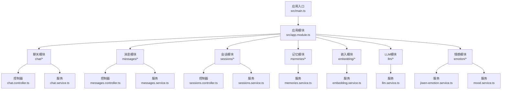
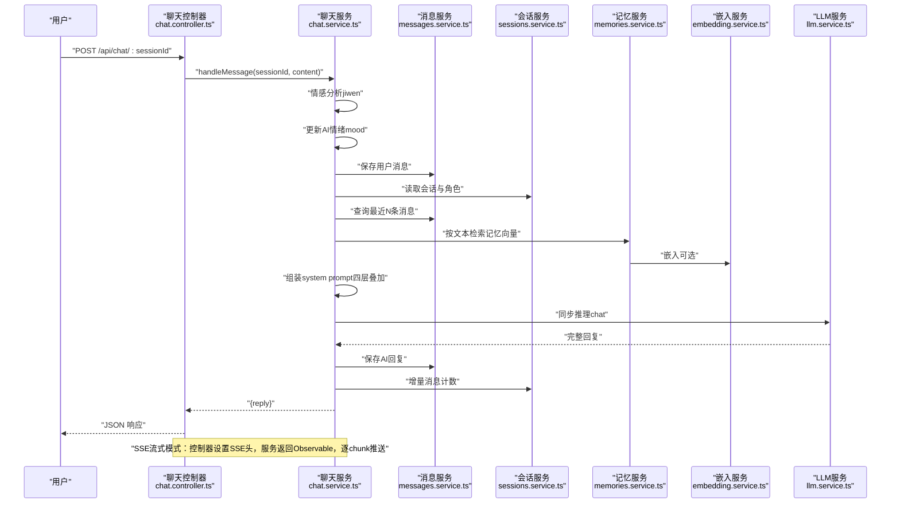
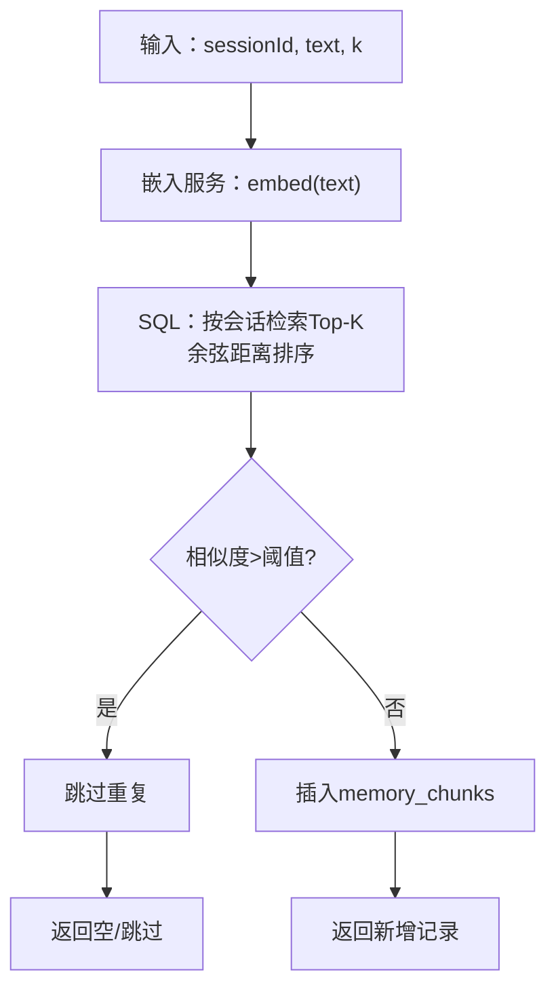
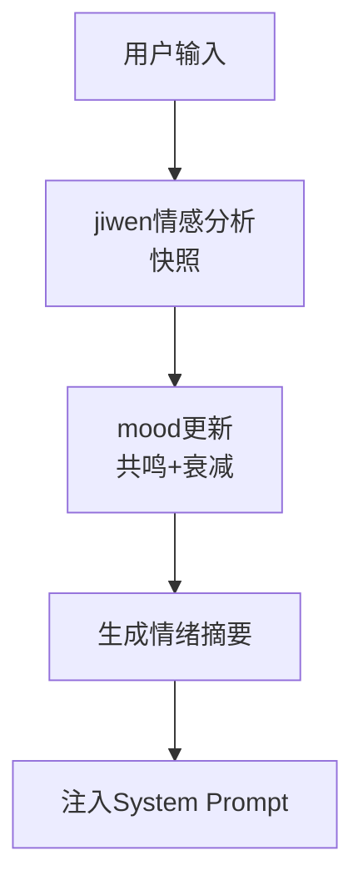
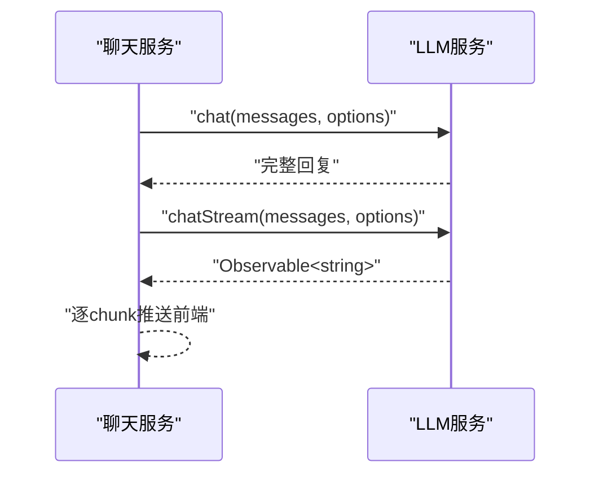
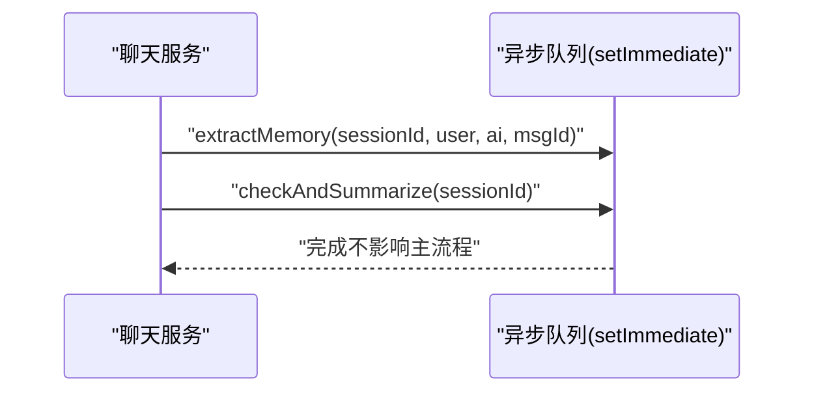
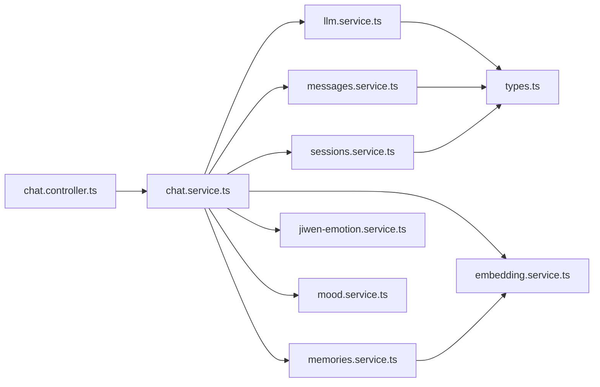

# 数据流设计

<cite>
**本文档引用的文件**
- [src/main.ts](file://src/main.ts)
- [src/app.module.ts](file://src/app.module.ts)
- [src/chat/chat.controller.ts](file://src/chat/chat.controller.ts)
- [src/chat/chat.service.ts](file://src/chat/chat.service.ts)
- [src/messages/messages.controller.ts](file://src/messages/messages.controller.ts)
- [src/messages/messages.service.ts](file://src/messages/messages.service.ts)
- [src/sessions/sessions.controller.ts](file://src/sessions/sessions.controller.ts)
- [src/sessions/sessions.service.ts](file://src/sessions/sessions.service.ts)
- [src/memories/memories.service.ts](file://src/memories/memories.service.ts)
- [src/embedding/embedding.service.ts](file://src/embedding/embedding.service.ts)
- [src/llm/llm.service.ts](file://src/llm/llm.service.ts)
- [src/emotion/jiwen-emotion.service.ts](file://src/emotion/jiwen-emotion.service.ts)
- [src/emotion/mood.service.ts](file://src/emotion/mood.service.ts)
- [shared/types.ts](file://shared/types.ts)
</cite>

## 目录
1. [简介](#简介)
2. [项目结构](#项目结构)
3. [核心组件](#核心组件)
4. [架构总览](#架构总览)
5. [详细组件分析](#详细组件分析)
6. [依赖分析](#依赖分析)
7. [性能考虑](#性能考虑)
8. [故障排查指南](#故障排查指南)
9. [结论](#结论)
10. [附录](#附录)

## 简介
本文件面向“AI Companion”的数据流设计，系统性阐述从用户输入到AI响应的完整处理链路：用户消息接收、角色匹配、上下文构建、记忆检索、情感分析、LLM推理、响应生成与清理。文档还覆盖异步处理模式与流式响应的设计思路、数据缓存策略、性能优化措施以及错误处理机制，并提供数据流图与关键处理节点的详细说明，帮助开发者与产品人员快速理解与落地。

## 项目结构
后端采用 NestJS 架构，模块化组织业务域：聊天、消息、会话、记忆、嵌入、LLM、情感分析等。应用入口负责启动HTTP服务与CORS配置，AppModule集中装配数据库、静态资源与业务模块。前端通过SPA方式由后端提供静态资源。

图表来源
- [src/main.ts:1-22](file://src/main.ts#L1-L22)
- [src/app.module.ts:18-62](file://src/app.module.ts#L18-L62)

章节来源
- [src/main.ts:1-22](file://src/main.ts#L1-L22)
- [src/app.module.ts:18-62](file://src/app.module.ts#L18-L62)

## 核心组件
- 控制器：负责HTTP端点与SSE响应头设置，将请求转发至服务层。
- 服务层：编排业务流程，协调消息、会话、记忆、情感、嵌入与LLM服务。
- 数据访问：基于TypeORM与原生SQL，分别处理消息/会话与记忆向量表。
- 外部集成：DeepSeek API与Python嵌入服务，分别负责推理与向量化。

章节来源
- [src/chat/chat.controller.ts:16-77](file://src/chat/chat.controller.ts#L16-L77)
- [src/chat/chat.service.ts:30-113](file://src/chat/chat.service.ts#L30-L113)
- [src/messages/messages.service.ts:23-92](file://src/messages/messages.service.ts#L23-L92)
- [src/sessions/sessions.service.ts:7-61](file://src/sessions/sessions.service.ts#L7-L61)
- [src/memories/memories.service.ts:30-137](file://src/memories/memories.service.ts#L30-L137)
- [src/embedding/embedding.service.ts:14-83](file://src/embedding/embedding.service.ts#L14-L83)
- [src/llm/llm.service.ts:27-146](file://src/llm/llm.service.ts#L27-L146)
- [src/emotion/jiwen-emotion.service.ts:31-133](file://src/emotion/jiwen-emotion.service.ts#L31-L133)
- [src/emotion/mood.service.ts:18-110](file://src/emotion/mood.service.ts#L18-L110)

## 架构总览
下图展示从用户输入到AI响应的端到端数据流，涵盖同步与异步阶段、流式传输与内存检索路径。

图表来源
- [src/chat/chat.controller.ts:21-77](file://src/chat/chat.controller.ts#L21-L77)
- [src/chat/chat.service.ts:42-113](file://src/chat/chat.service.ts#L42-L113)
- [src/messages/messages.service.ts:36-74](file://src/messages/messages.service.ts#L36-L74)
- [src/sessions/sessions.service.ts:22-54](file://src/sessions/sessions.service.ts#L22-L54)
- [src/memories/memories.service.ts:115-118](file://src/memories/memories.service.ts#L115-L118)
- [src/embedding/embedding.service.ts:33-42](file://src/embedding/embedding.service.ts#L33-L42)
- [src/llm/llm.service.ts:36-57](file://src/llm/llm.service.ts#L36-L57)

## 详细组件分析

### 用户消息接收与路由
- 控制器端点：
  - 同步：POST /api/chat/:sessionId
  - 流式：POST /api/chat/:sessionId/stream
- 流式模式设置SSE响应头，逐字节推送数据块，前端以SSE消费。
- 控制器将请求参数与负载转发至聊天服务。

章节来源
- [src/chat/chat.controller.ts:16-77](file://src/chat/chat.controller.ts#L16-L77)

### 角色匹配与会话状态维护
- 会话读取：根据sessionId获取角色ID与摘要、导入画像、消息计数等。
- 角色读取：根据角色ID获取基础prompt与说话风格。
- 会话状态：
  - 消息计数：每次保存用户/AI消息后递增，用于滚动摘要触发。
  - 滚动摘要：达到阈值且距上次摘要超过1小时时触发。

章节来源
- [src/chat/chat.service.ts:55-61](file://src/chat/chat.service.ts#L55-L61)
- [src/sessions/sessions.service.ts:22-54](file://src/sessions/sessions.service.ts#L22-L54)

### 上下文构建与System Prompt组装
- 上下文来源：
  - 最近N条消息（正序拼接，供LLM消息数组使用）
  - 滚动摘要（session.summary）
  - 导入画像（importProfile，经格式化后注入）
  - 动态记忆（检索得到的记忆列表）
  - 用户情绪与AI情绪摘要
- Prompt层级（四层叠加）：
  - 固定人格（basePrompt）
  - 说话风格（speechPatterns）
  - 滚动摘要
  - 导入画像
  - 动态记忆
  - 情绪状态
  - 核心规则与表情约束

章节来源
- [src/chat/chat.service.ts:63-93](file://src/chat/chat.service.ts#L63-L93)
- [src/chat/chat.service.ts:424-497](file://src/chat/chat.service.ts#L424-L497)
- [src/messages/messages.service.ts:67-74](file://src/messages/messages.service.ts#L67-L74)
- [src/sessions/sessions.service.ts:30-41](file://src/sessions/sessions.service.ts#L30-L41)

### 记忆检索与向量相似度
- 文本检索：对用户输入进行向量化，按会话维度检索Top-K相似记忆。
- 存储结构：memory_chunks表含VECTOR(768)，使用pgvector的余弦距离。
- 查重：相似度阈值过滤重复记忆，避免冗余。
- 写入：向量化→查重→插入，返回写入记录。

图表来源
- [src/memories/memories.service.ts:115-118](file://src/memories/memories.service.ts#L115-L118)
- [src/memories/memories.service.ts:42-59](file://src/memories/memories.service.ts#L42-L59)
- [src/memories/memories.service.ts:93-110](file://src/memories/memories.service.ts#L93-L110)
- [src/memories/memories.service.ts:64-88](file://src/memories/memories.service.ts#L64-L88)
- [src/embedding/embedding.service.ts:33-42](file://src/embedding/embedding.service.ts#L33-L42)

### 情感分析与AI情绪共鸣
- 用户情感：基于词典加权计算，输出主导情绪、愉悦度、唤醒度等快照。
- AI情绪：根据用户情感进行共鸣式更新，同时衰减回归基线，形成自然波动。
- 摘要：将用户情绪与AI情绪摘要注入System Prompt，指导回复风格。

图表来源
- [src/emotion/jiwen-emotion.service.ts:32-76](file://src/emotion/jiwen-emotion.service.ts#L32-L76)
- [src/emotion/mood.service.ts:33-57](file://src/emotion/mood.service.ts#L33-L57)
- [src/chat/chat.service.ts:45-47](file://src/chat/chat.service.ts#L45-L47)
- [src/chat/chat.service.ts:173-180](file://src/chat/chat.service.ts#L173-L180)

### LLM推理与响应生成
- 同步模式：等待完整回复后返回。
- 流式模式：返回Observable，逐chunk推送，前端实时渲染。
- DeepSeek API封装：统一请求参数、鉴权头、超时控制与SSE解析。

图表来源
- [src/llm/llm.service.ts:36-57](file://src/llm/llm.service.ts#L36-L57)
- [src/llm/llm.service.ts:70-145](file://src/llm/llm.service.ts#L70-L145)
- [src/chat/chat.service.ts:95-97](file://src/chat/chat.service.ts#L95-L97)
- [src/chat/chat.service.ts:192-225](file://src/chat/chat.service.ts#L192-L225)

### 响应清理与规范化
- 清理规则：将括号动作描述替换为emoji/颜文字，提升微信式自然度。
- 输出约束：严格禁止使用括号动作描述，强制表情与语气词自然融入。

章节来源
- [src/chat/chat.service.ts:507-544](file://src/chat/chat.service.ts#L507-L544)

### 异步处理与流式响应
- 异步记忆提取：setImmediate调度，从对话中抽取事实/偏好/情绪碎片，向量化→查重→写入。
- 异步滚动摘要：setImmediate调度，定期生成摘要并重置消息计数。
- 流式响应：控制器设置SSE头，服务端逐chunk推送，前端持续渲染，完成后保存AI回复并触发异步任务。

图表来源
- [src/chat/chat.service.ts:103-110](file://src/chat/chat.service.ts#L103-L110)
- [src/chat/chat.service.ts:213-221](file://src/chat/chat.service.ts#L213-L221)
- [src/chat/chat.service.ts:249-315](file://src/chat/chat.service.ts#L249-L315)
- [src/chat/chat.service.ts:334-374](file://src/chat/chat.service.ts#L334-L374)

### 数据缓存策略与性能优化
- 嵌入服务健康检查：提供Python嵌入服务可用性检测，便于降级或告警。
- 批量嵌入：批量接口可利用模型推理并行，降低延迟。
- 消息读取缓存：最近N条消息按时间倒序读取并反转，减少上下文拼接成本。
- 滚动摘要：定期压缩上下文，避免LLM输入过长导致性能下降与成本上升。
- SSE直连：控制器直接写入响应体，避免中间层缓冲与额外序列化开销。

章节来源
- [src/embedding/embedding.service.ts:70-82](file://src/embedding/embedding.service.ts#L70-L82)
- [src/embedding/embedding.service.ts:56-65](file://src/embedding/embedding.service.ts#L56-L65)
- [src/messages/messages.service.ts:67-74](file://src/messages/messages.service.ts#L67-L74)
- [src/chat/chat.service.ts:334-374](file://src/chat/chat.service.ts#L334-L374)
- [src/chat/chat.controller.ts:52-74](file://src/chat/chat.controller.ts#L52-L74)

### 错误处理机制
- 控制器：捕获服务层异常，向SSE客户端发送错误消息并结束流。
- 服务层：记忆检索与滚动摘要异常仅记录日志，不影响主流程。
- LLM服务：超时控制与请求销毁，防止资源泄漏。

章节来源
- [src/chat/chat.controller.ts:66-74](file://src/chat/chat.controller.ts#L66-L74)
- [src/chat/chat.service.ts:73-75](file://src/chat/chat.service.ts#L73-L75)
- [src/chat/chat.service.ts:371-373](file://src/chat/chat.service.ts#L371-L373)
- [src/llm/llm.service.ts:133-144](file://src/llm/llm.service.ts#L133-L144)

## 依赖分析
- 控制器依赖服务层；服务层依赖消息、会话、记忆、情感、嵌入与LLM服务。
- 记忆服务通过DataSource直接执行原生SQL，避免TypeORM对VECTOR列的管理限制。
- LLM服务封装外部API调用，提供同步与流式两种模式。
- 共享类型定义确保前后端一致的数据契约。

图表来源
- [src/chat/chat.controller.ts:18](file://src/chat/chat.controller.ts#L18)
- [src/chat/chat.service.ts:31-40](file://src/chat/chat.service.ts#L31-L40)
- [src/memories/memories.service.ts:32-34](file://src/memories/memories.service.ts#L32-L34)
- [src/llm/llm.service.ts:27-33](file://src/llm/llm.service.ts#L27-L33)
- [shared/types.ts:19-28](file://shared/types.ts#L19-L28)

章节来源
- [src/chat/chat.controller.ts:18](file://src/chat/chat.controller.ts#L18)
- [src/chat/chat.service.ts:31-40](file://src/chat/chat.service.ts#L31-L40)
- [src/memories/memories.service.ts:32-34](file://src/memories/memories.service.ts#L32-L34)
- [src/llm/llm.service.ts:27-33](file://src/llm/llm.service.ts#L27-L33)
- [shared/types.ts:19-28](file://shared/types.ts#L19-L28)

## 性能考虑
- 向量检索：使用pgvector HNSW索引与余弦距离，限制返回数量，降低I/O与网络开销。
- 批量嵌入：在可扩展场景下启用批量接口，提高吞吐。
- 滚动摘要：定期压缩上下文，控制LLM输入长度，平衡成本与效果。
- SSE优化：禁用缓冲，及时flush头部，保证低延迟体验。
- 超时与取消：为外部调用设置合理超时与订阅取消钩子，避免资源泄露。

## 故障排查指南
- SSE无法接收：检查控制器SSE头设置与前端SSE解析逻辑。
- 记忆检索为空：确认Python嵌入服务健康、会话维度正确、阈值设置合理。
- 情绪摘要无效：检查用户输入是否包含足够情绪线索，或调整情感权重。
- LLM超时：检查DEEPSEEK_API_KEY与网络连通性，必要时增加超时或重试。
- 滚动摘要未触发：核对消息计数阈值与last_summary_at时间窗口。

章节来源
- [src/chat/chat.controller.ts:52-74](file://src/chat/chat.controller.ts#L52-L74)
- [src/embedding/embedding.service.ts:70-82](file://src/embedding/embedding.service.ts#L70-L82)
- [src/emotion/jiwen-emotion.service.ts:32-76](file://src/emotion/jiwen-emotion.service.ts#L32-L76)
- [src/llm/llm.service.ts:133-144](file://src/llm/llm.service.ts#L133-L144)
- [src/chat/chat.service.ts:334-374](file://src/chat/chat.service.ts#L334-L374)

## 结论
该数据流设计以“同步主流程 + 异步增强”为核心，结合情感共鸣、记忆检索与滚动摘要，实现高自然度与低延迟的交互体验。通过SSE流式传输与向量检索优化，兼顾用户体验与系统性能。建议在生产环境中完善监控与告警，持续评估摘要策略与检索阈值，以获得最佳效果。

## 附录
- 关键数据类型与契约定义参见共享类型文件，确保前后端一致性。
- 数据库迁移脚本负责初始化pgvector扩展与表结构，确保向量列存在。

章节来源
- [shared/types.ts:19-28](file://shared/types.ts#L19-L28)
- [src/app.module.ts:13](file://src/app.module.ts#L13)