# 整体架构设计

<cite>
**本文引用的文件**
- [README.md](file://README.md)
- [nest-cli.json](file://nest-cli.json)
- [src/main.ts](file://src/main.ts)
- [src/app.module.ts](file://src/app.module.ts)
- [src/config/database.config.ts](file://src/config/database.config.ts)
- [src/characters/characters.module.ts](file://src/characters/characters.module.ts)
- [src/sessions/sessions.module.ts](file://src/sessions/sessions.module.ts)
- [src/chat/chat.module.ts](file://src/chat/chat.module.ts)
- [src/embedding/embedding.module.ts](file://src/embedding/embedding.module.ts)
- [src/memories/memories.module.ts](file://src/memories/memories.module.ts)
- [src/migrations/1710000000000-init-pgvector-schema.ts](file://src/migrations/1710000000000-init-pgvector-schema.ts)
- [web/package.json](file://web/package.json)
- [web/src/api/index.ts](file://web/src/api/index.ts)
- [python/pyproject.toml](file://python/pyproject.toml)
- [python/main.py](file://python/main.py)
- [docs/AI_Companion_最终方案.md](file://docs/AI_Companion_最终方案.md)
</cite>

## 目录
1. [简介](#简介)
2. [项目结构](#项目结构)
3. [核心组件](#核心组件)
4. [架构总览](#架构总览)
5. [详细组件分析](#详细组件分析)
6. [依赖分析](#依赖分析)
7. [性能考量](#性能考量)
8. [故障排查指南](#故障排查指南)
9. [结论](#结论)
10. [附录](#附录)

## 简介
本项目旨在构建一套具备长期记忆、人格模拟与情绪变化能力的 AI 伴侣系统。系统采用三层架构与微服务化部署策略：
- 表示层（Web 前端）：基于 React/Vite 的 SPA，通过统一 API 层与后端交互。
- 业务逻辑层（NestJS 后端）：以模块化设计组织角色、会话、消息、聊天编排、记忆、嵌入、LLM、情绪等子域。
- 数据访问层（PostgreSQL + pgvector）：单库存储关系数据与向量数据，向量检索由数据库完成。

同时，系统引入独立的 Python 向量服务（FastAPI），仅负责文本嵌入，不参与检索，形成清晰的职责边界与可扩展的分布式部署形态。

## 项目结构
项目采用“根目录 + 多子工程”的组织方式：
- backend（NestJS）：src 下按功能域划分子模块，统一入口在 AppModule。
- frontend（Web）：web 目录下为 React 应用，打包后由 NestJS ServeStaticModule 提供。
- python（向量服务）：独立 FastAPI 服务，提供 /embed 与 /batch_embed 接口。
- docs：架构方案与实现说明文档。

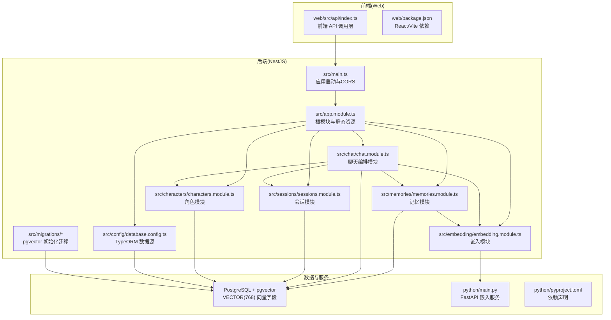

图表来源
- [src/app.module.ts:18-62](file://src/app.module.ts#L18-L62)
- [src/main.ts:4-21](file://src/main.ts#L4-L21)
- [src/config/database.config.ts:8-21](file://src/config/database.config.ts#L8-L21)
- [src/chat/chat.module.ts:12-34](file://src/chat/chat.module.ts#L12-L34)
- [src/characters/characters.module.ts:7-13](file://src/characters/characters.module.ts#L7-L13)
- [src/sessions/sessions.module.ts:7-13](file://src/sessions/sessions.module.ts#L7-L13)
- [src/memories/memories.module.ts:5-17](file://src/memories/memories.module.ts#L5-L17)
- [src/embedding/embedding.module.ts:5-15](file://src/embedding/embedding.module.ts#L5-L15)
- [web/src/api/index.ts:30-212](file://web/src/api/index.ts#L30-L212)
- [python/main.py:26-123](file://python/main.py#L26-L123)

章节来源
- [README.md:24-99](file://README.md#L24-L99)
- [nest-cli.json:1-9](file://nest-cli.json#L1-L9)
- [src/app.module.ts:18-62](file://src/app.module.ts#L18-L62)
- [src/main.ts:4-21](file://src/main.ts#L4-L21)
- [src/config/database.config.ts:8-21](file://src/config/database.config.ts#L8-L21)
- [web/package.json:1-22](file://web/package.json#L1-L22)

## 核心组件
- 根模块与静态资源：AppModule 负责加载 .env、配置 TypeORM 连接 PostgreSQL 并启用 pgvector 初始化迁移；通过 ServeStaticModule 提供 web/dist 静态资源，实现 SPA。
- 业务模块：
  - 角色模块（CharactersModule）：角色的增删改查，导出以供会话模块使用。
  - 会话模块（SessionsModule）：会话 CRUD 与滚动摘要维护。
  - 消息模块（MessagesModule）：消息持久化与读取。
  - 聊天模块（ChatModule）：核心编排模块，串联角色、会话、消息、记忆、嵌入、LLM、情绪。
  - 记忆模块（MemoriesModule）：向量检索与写入，使用原生 SQL 操作 VECTOR 字段。
  - 嵌入模块（EmbeddingModule）：封装 HTTP 客户端，调用 Python 嵌入服务。
  - LLM 模块（LLM 模块文件存在但未在 AppModule 中显式列出，见依赖关系分析）。
- 数据访问层：TypeORM 管理关系字段与实体，向量相关操作通过 DataSource/原生 SQL 执行，确保 pgvector 的 VECTOR(768) 类型不受 ORM 同步影响。
- 前端 API 层：web/src/api/index.ts 统一封装 /api 前缀的 HTTP 请求，支持同步与 SSE 流式响应，并提供错误处理与 AbortController 取消机制。
- Python 嵌入服务：FastAPI 提供 /embed 与 /batch_embed，ONNX Runtime 推理生成 768 维向量；支持 mock 模式以便在模型未下载时快速联调。

章节来源
- [src/app.module.ts:18-62](file://src/app.module.ts#L18-L62)
- [src/characters/characters.module.ts:7-13](file://src/characters/characters.module.ts#L7-L13)
- [src/sessions/sessions.module.ts:7-13](file://src/sessions/sessions.module.ts#L7-L13)
- [src/chat/chat.module.ts:12-34](file://src/chat/chat.module.ts#L12-L34)
- [src/memories/memories.module.ts:5-17](file://src/memories/memories.module.ts#L5-L17)
- [src/embedding/embedding.module.ts:5-15](file://src/embedding/embedding.module.ts#L5-L15)
- [web/src/api/index.ts:30-212](file://web/src/api/index.ts#L30-L212)
- [python/main.py:26-123](file://python/main.py#L26-L123)

## 架构总览
系统采用“后端服务 + 前端应用 + Python 向量服务”的微服务化部署策略：
- 后端服务（NestJS）：监听 3000 端口，提供 /api 接口，内部模块化编排。
- 前端应用（Web）：React SPA，开发时由 Vite 提供热更新，生产打包后由后端 ServeStaticModule 提供。
- Python 向量服务（FastAPI）：监听 8000 端口，提供 /embed 与 /batch_embed，支持健康检查。
- 数据层（PostgreSQL + pgvector）：单库存储角色、会话、消息、记忆碎片（含 VECTOR 字段），迁移脚本初始化扩展与索引。

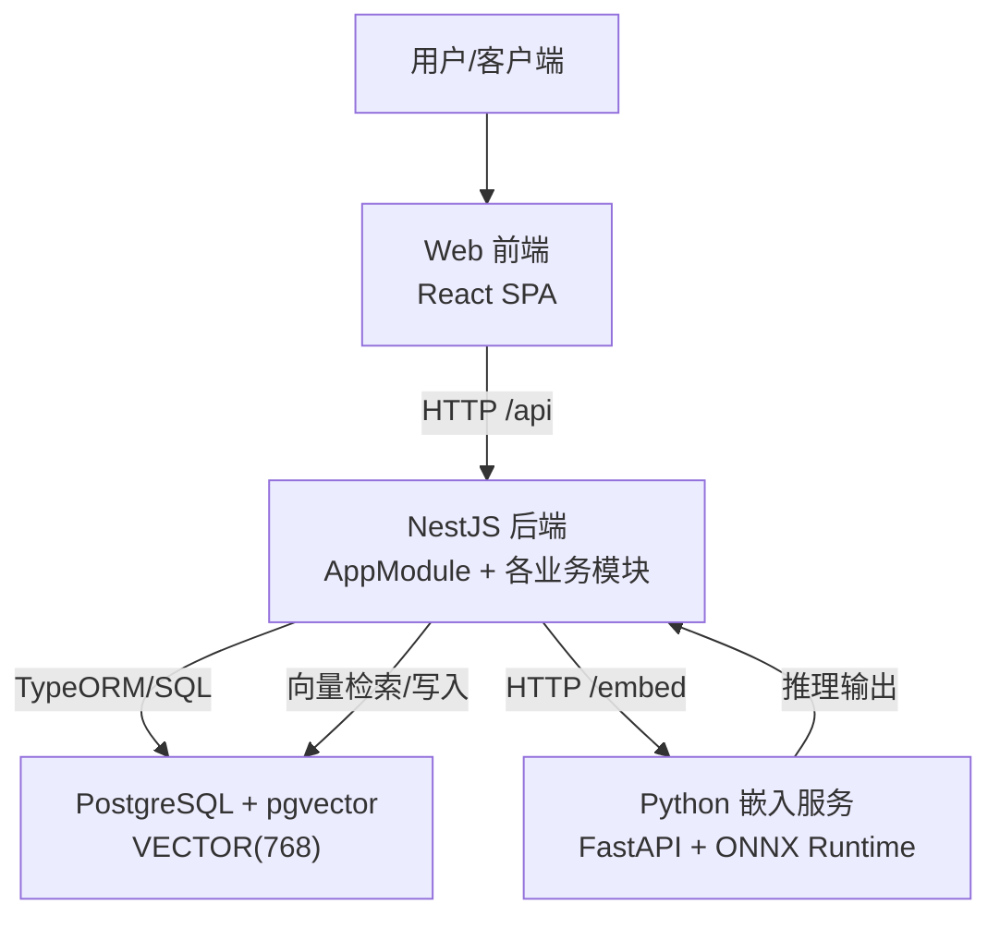

图表来源
- [src/app.module.ts:18-62](file://src/app.module.ts#L18-L62)
- [src/main.ts:9-13](file://src/main.ts#L9-L13)
- [web/src/api/index.ts:30-212](file://web/src/api/index.ts#L30-L212)
- [python/main.py:91-123](file://python/main.py#L91-L123)
- [docs/AI_Companion_最终方案.md:23-50](file://docs/AI_Companion_最终方案.md#L23-L50)

## 详细组件分析

### 后端服务（NestJS）启动与跨域
- 启动入口：main.ts 创建应用实例，启用 CORS（开发阶段允许任意来源），监听端口并打印访问日志。
- 跨域策略：开发阶段允许任意来源，生产环境建议限制为具体域名。

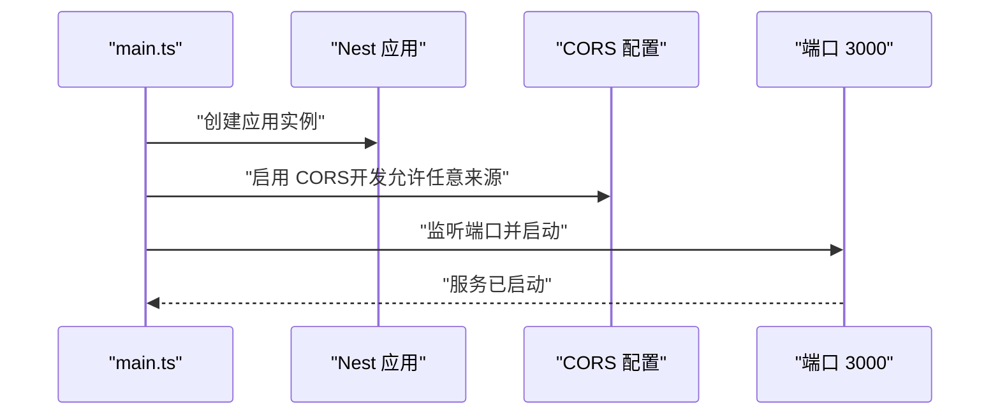

图表来源
- [src/main.ts:4-21](file://src/main.ts#L4-L21)

章节来源
- [src/main.ts:4-21](file://src/main.ts#L4-L21)

### 根模块与静态资源（ServeStaticModule）
- ServeStaticModule：在生产模式下提供 web/dist 静态资源，SPA 回退至 index.html；开发阶段由 Vite 代理 API。
- 配置项：rootPath 指向构建产物目录，serveRoot 为根路径，index 指定 SPA 回退页。

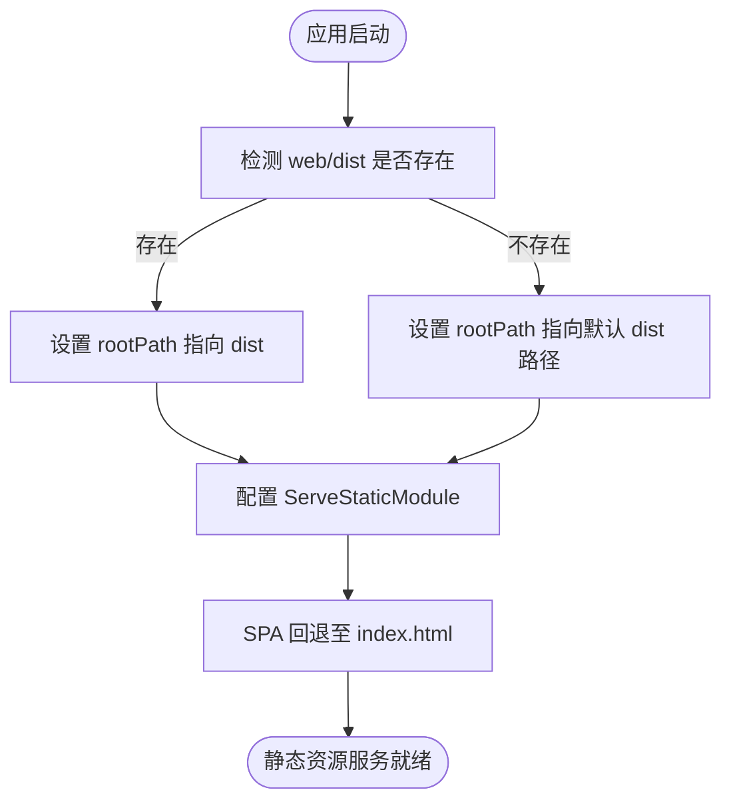

图表来源
- [src/app.module.ts:15-30](file://src/app.module.ts#L15-L30)

章节来源
- [src/app.module.ts:15-30](file://src/app.module.ts#L15-L30)

### 数据库连接与迁移（TypeORM + pgvector）
- TypeORM 配置：PostgreSQL 连接参数来自环境变量，启用迁移并自动运行初始化迁移；synchronize=false，避免删除 VECTOR 列。
- 初始化迁移：创建 pgvector 扩展与表结构（含 VECTOR(768) 字段与 HNSW 索引）。
- 数据源配置：database.config.ts 作为 CLI 运行迁移时的数据源定义。

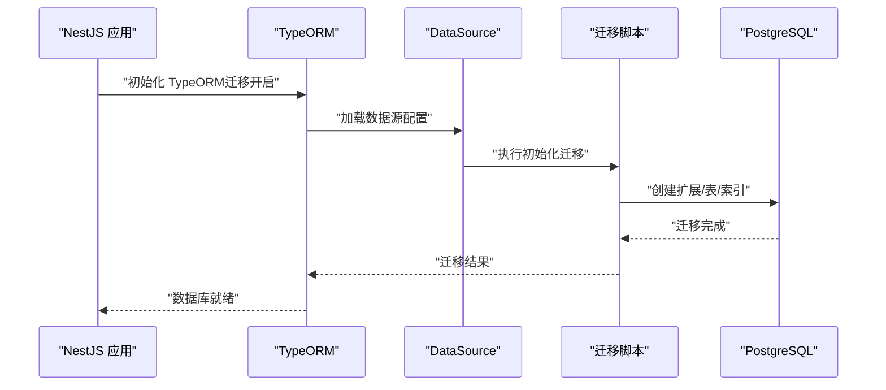

图表来源
- [src/app.module.ts:37-50](file://src/app.module.ts#L37-L50)
- [src/config/database.config.ts:8-21](file://src/config/database.config.ts#L8-L21)
- [src/migrations/1710000000000-init-pgvector-schema.ts](file://src/migrations/1710000000000-init-pgvector-schema.ts)

章节来源
- [src/app.module.ts:37-50](file://src/app.module.ts#L37-L50)
- [src/config/database.config.ts:8-21](file://src/config/database.config.ts#L8-L21)

### 聊天模块（核心编排）
- 职责：串联角色、会话、消息、记忆、嵌入、LLM、情绪模块，组装 Prompt 并调用 LLM，返回结果并触发异步记忆提取与滚动摘要。
- 依赖关系：依赖 CharactersModule、SessionsModule、MessagesModule、LlmModule、MemoriesModule、EmotionModule。

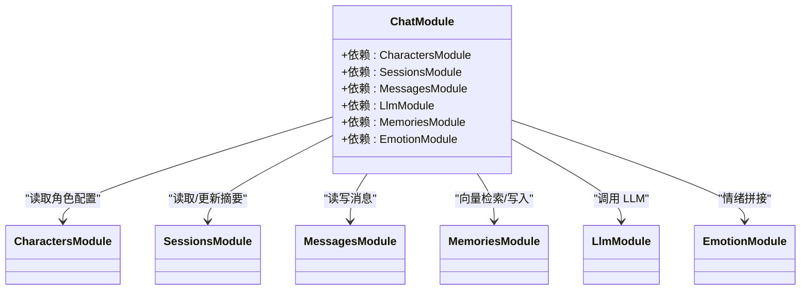

图表来源
- [src/chat/chat.module.ts:12-34](file://src/chat/chat.module.ts#L12-L34)

章节来源
- [src/chat/chat.module.ts:12-34](file://src/chat/chat.module.ts#L12-L34)

### 记忆模块（向量检索与写入）
- 设计要点：不注册包含 VECTOR 字段的实体，避免 TypeORM 同步删除该列；通过注入 DataSource 执行原生 SQL。
- 功能：向量检索、写入、去重（余弦相似度阈值）。

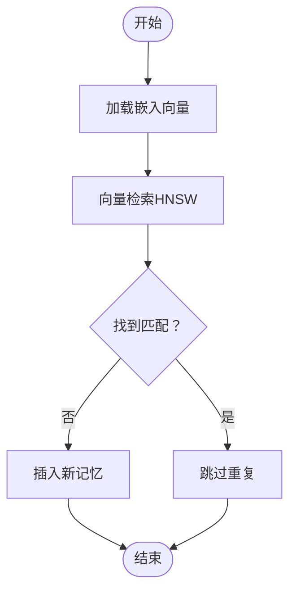

图表来源
- [src/memories/memories.module.ts:5-17](file://src/memories/memories.module.ts#L5-L17)
- [docs/AI_Companion_最终方案.md:252-281](file://docs/AI_Companion_最终方案.md#L252-L281)

章节来源
- [src/memories/memories.module.ts:5-17](file://src/memories/memories.module.ts#L5-L17)

### 嵌入模块（HTTP 调用 Python 嵌入服务）
- 设计要点：通过 HttpModule 注册超时与重定向限制；导出供 ChatService/MemoriesService 使用。
- Python 服务接口：/embed（单条）、/batch_embed（批量）、/health（健康检查）。

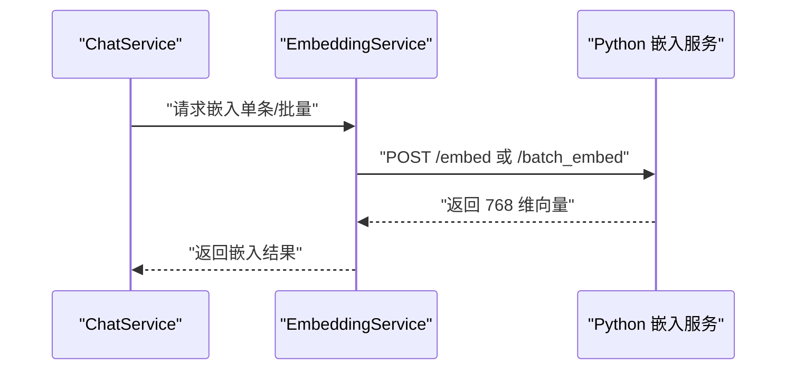

图表来源
- [src/embedding/embedding.module.ts:5-15](file://src/embedding/embedding.module.ts#L5-L15)
- [python/main.py:91-123](file://python/main.py#L91-L123)

章节来源
- [src/embedding/embedding.module.ts:5-15](file://src/embedding/embedding.module.ts#L5-L15)
- [python/main.py:91-123](file://python/main.py#L91-L123)

### 前端 API 层（统一调用与流式响应）
- 统一前缀：BASE_URL 为空（同源），所有请求以 /api 开头。
- 能力：同步消息发送、SSE 流式接收、错误处理、请求取消（AbortController）。
- 适配性：纯 TS 模块，可移植到小程序、RN、Telegram Bot 等环境。

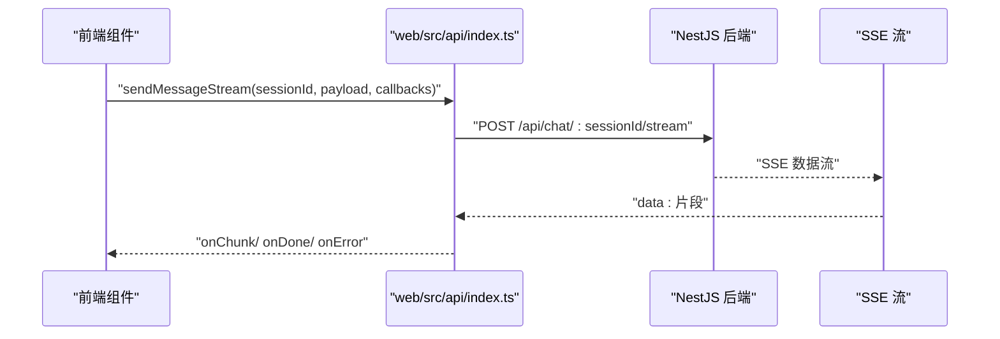

图表来源
- [web/src/api/index.ts:137-201](file://web/src/api/index.ts#L137-L201)

章节来源
- [web/src/api/index.ts:30-212](file://web/src/api/index.ts#L30-L212)

### Python 嵌入服务（FastAPI + ONNX Runtime）
- 职责：将文本转换为 768 维向量，支持单条与批量接口；提供健康检查。
- 模型：Jina v2 base zh（ONNX Runtime 推理）；支持 mock 模式在模型未下载时联调。

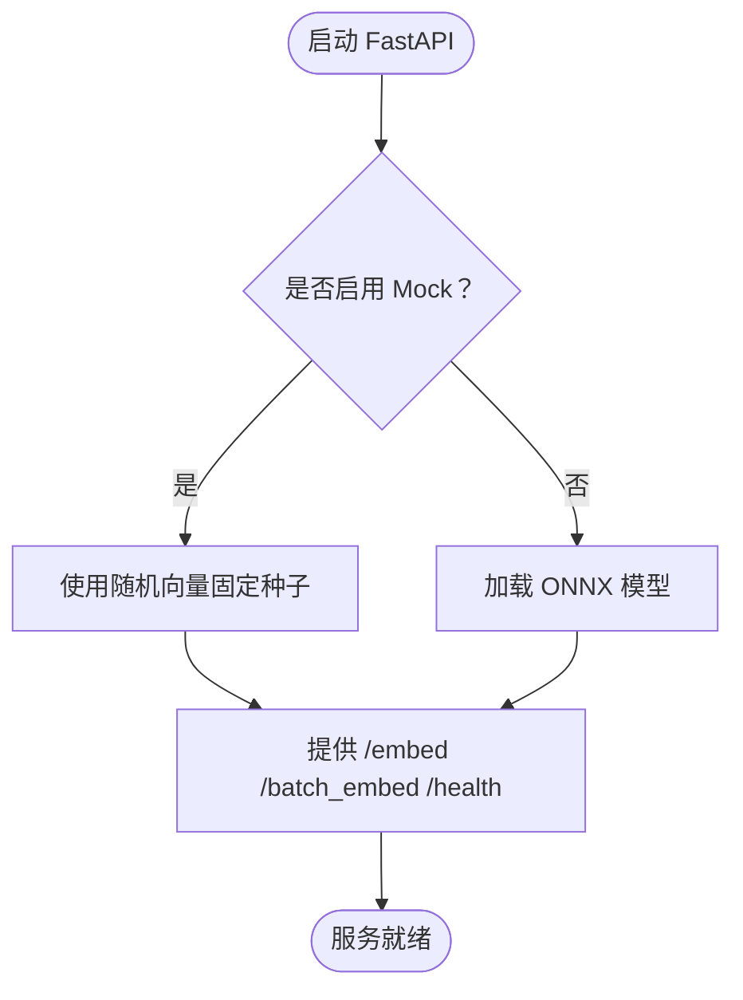

图表来源
- [python/main.py:33-71](file://python/main.py#L33-L71)
- [python/main.py:91-123](file://python/main.py#L91-L123)
- [python/pyproject.toml:1-22](file://python/pyproject.toml#L1-L22)

章节来源
- [python/main.py:33-71](file://python/main.py#L33-L71)
- [python/main.py:91-123](file://python/main.py#L91-L123)
- [python/pyproject.toml:1-22](file://python/pyproject.toml#L1-L22)

## 依赖分析
- 模块耦合与内聚：
  - ChatModule 作为核心编排模块，高内聚地整合角色、会话、消息、记忆、嵌入、LLM、情绪模块，降低外部依赖。
  - MemoriesModule 与 EmbeddingModule 解耦：通过 HTTP 接口通信，避免直接耦合。
  - AppModule 低耦合地聚合各业务模块，集中配置静态资源与数据库。
- 外部依赖：
  - 前端依赖 React/Vite；后端依赖 NestJS + TypeORM；Python 依赖 FastAPI + ONNX Runtime。
- 集成点：
  - 前端通过 /api 与后端交互；后端通过 HTTP 与 Python 嵌入服务交互；数据库通过迁移脚本初始化 pgvector。

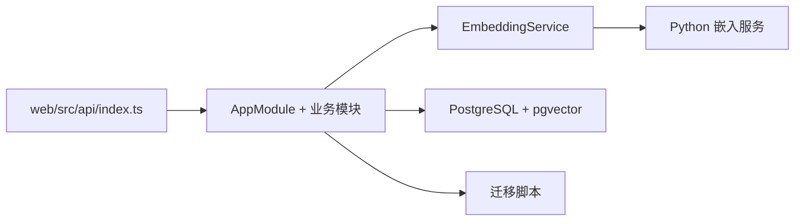

图表来源
- [src/app.module.ts:18-62](file://src/app.module.ts#L18-L62)
- [web/src/api/index.ts:30-212](file://web/src/api/index.ts#L30-L212)
- [python/main.py:91-123](file://python/main.py#L91-L123)

章节来源
- [src/app.module.ts:18-62](file://src/app.module.ts#L18-L62)
- [web/src/api/index.ts:30-212](file://web/src/api/index.ts#L30-L212)
- [python/main.py:91-123](file://python/main.py#L91-L123)

## 性能考量
- 向量检索：使用 HNSW 索引与余弦距离，提升检索效率；检索与写入均通过原生 SQL 控制，避免 ORM 同步带来的额外开销。
- 嵌入推理：Python 服务独立部署，避免与后端业务线争抢资源；支持批量嵌入减少往返次数。
- 前端流式：SSE 流式返回，改善用户体验；合理设置超时与重试策略。
- 数据库：迁移阶段禁用 synchronize，确保 VECTOR 列安全；生产环境严格控制迁移策略。

## 故障排查指南
- CORS 问题（开发阶段）：确认 main.ts 中 CORS 配置允许任意来源；生产环境需限制具体域名。
- 静态资源无法访问：检查 ServeStaticModule 的 rootPath 与 serveRoot；确认 web/dist 已构建。
- 数据库连接失败：核对 .env 中 DB_* 环境变量；确认 PostgreSQL 服务与 pgvector 扩展正常。
- 迁移失败：使用 CLI 指定数据源运行迁移；检查初始化迁移脚本是否成功执行。
- 嵌入服务不可用：确认 Python 服务已启动并监听 8000 端口；检查 /health 健康检查；必要时启用 mock 模式。
- 前端请求异常：检查 web/src/api/index.ts 的 BASE_URL 与 /api 前缀；关注 onChunk/onDone/onError 回调。

章节来源
- [src/main.ts:9-13](file://src/main.ts#L9-L13)
- [src/app.module.ts:15-30](file://src/app.module.ts#L15-L30)
- [src/config/database.config.ts:8-21](file://src/config/database.config.ts#L8-L21)
- [python/main.py:115-123](file://python/main.py#L115-L123)
- [web/src/api/index.ts:37-52](file://web/src/api/index.ts#L37-L52)

## 结论
本架构以模块化为核心，通过清晰的职责边界与微服务化部署，实现了“文本嵌入推理”与“向量检索/写入”的分离，既满足了可扩展性，又保证了性能与稳定性。前端、后端与 Python 向量服务三者协同，形成统一的系统边界与交互模式，为后续扩展（如队列化、WebSocket、多用户系统、分布式向量存储等）奠定了坚实基础。

## 附录
- 技术栈选择理由：
  - NestJS + TypeScript：强类型与模块化便于大型项目演进。
  - PostgreSQL + pgvector：单库存储关系与向量，简化运维与查询。
  - FastAPI + ONNX Runtime：轻量、高性能、易于部署。
  - React/Vite：现代前端开发体验与构建工具链。
- 架构决策权衡：
  - 将检索下沉至数据库，避免 Python 服务承担复杂查询逻辑，降低耦合。
  - 嵌入服务最小化，专注推理，便于替换模型与优化性能。
  - 迁移驱动数据库演进，生产禁用自动同步，保障数据安全。
- 可扩展性设计：
  - 模块化设计支持新增领域（如情绪、多用户、导入工具）。
  - 微服务化部署支持独立扩缩容与灰度发布。
  - 进一步可引入队列、缓存、分布式向量存储等基础设施。