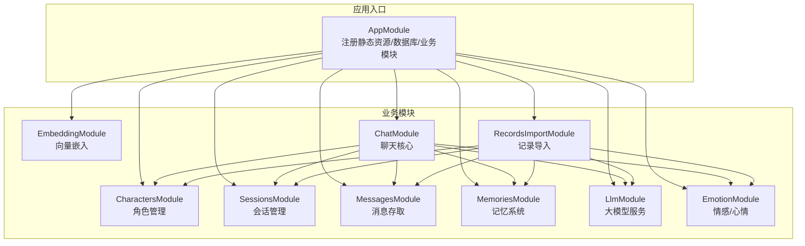
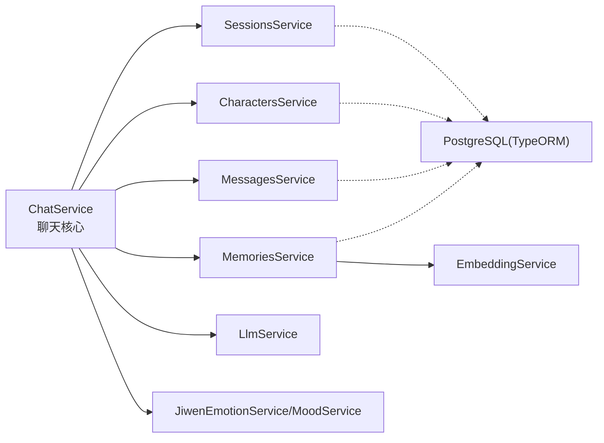
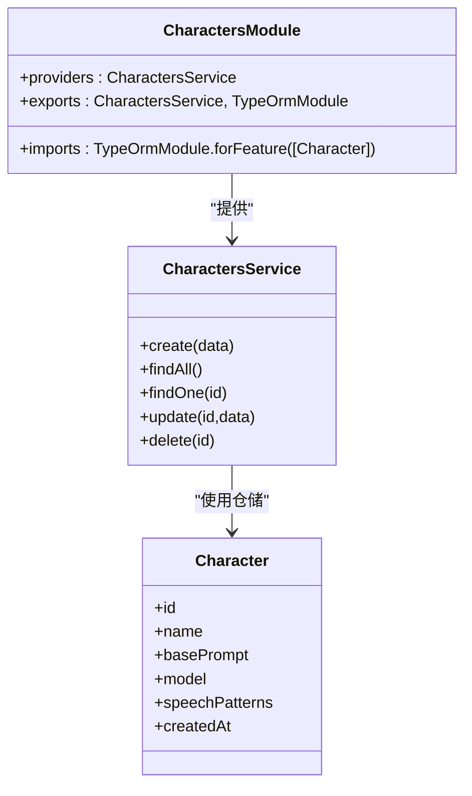
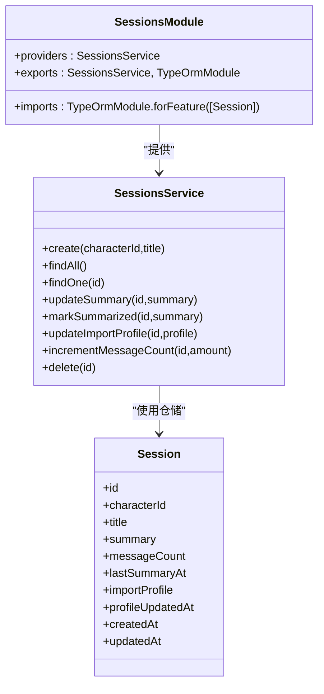
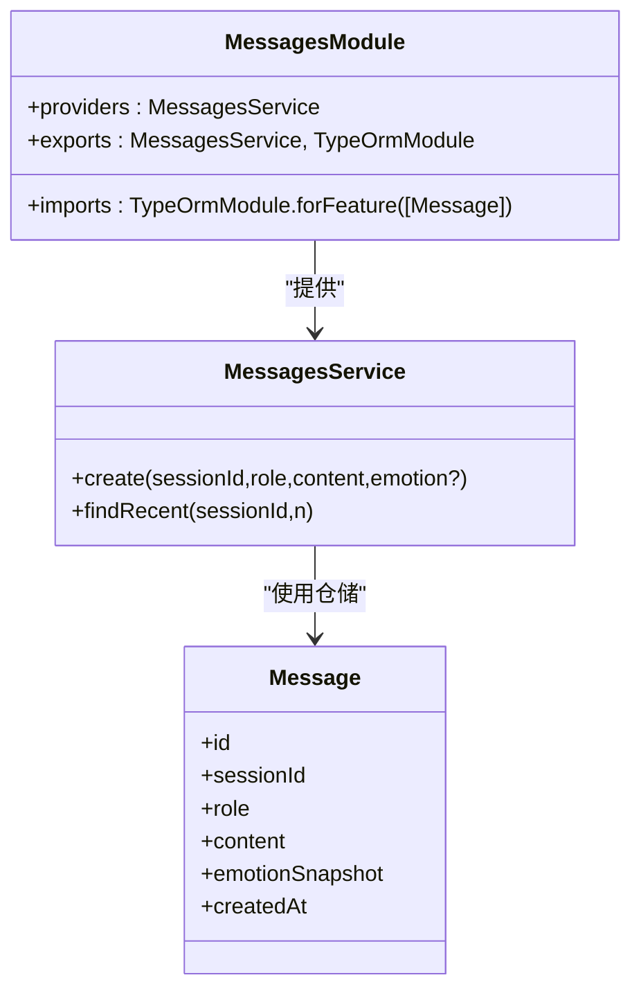
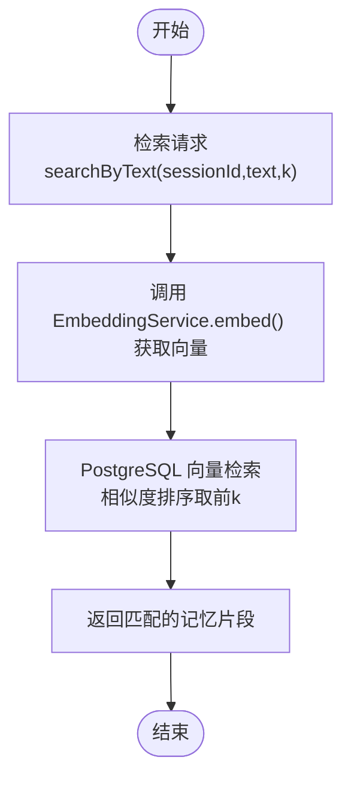
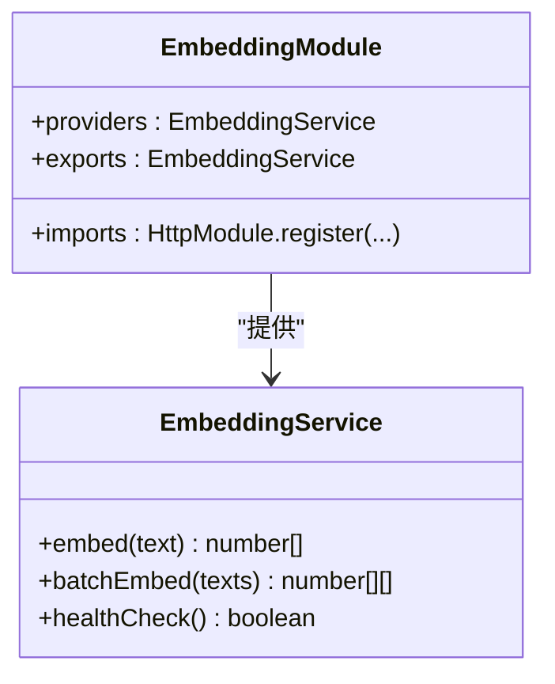
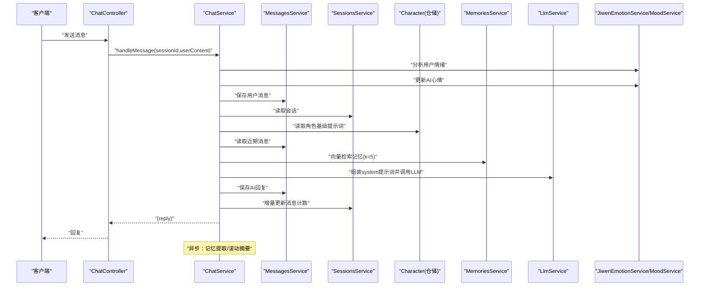
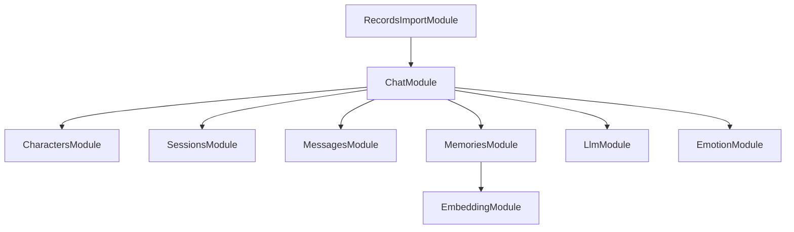

# 模块化设计

<cite>
**本文引用的文件**
- [src/app.module.ts](file://src/app.module.ts)
- [src/characters/characters.module.ts](file://src/characters/characters.module.ts)
- [src/sessions/sessions.module.ts](file://src/sessions/sessions.module.ts)
- [src/chat/chat.module.ts](file://src/chat/chat.module.ts)
- [src/memories/memories.module.ts](file://src/memories/memories.module.ts)
- [src/embedding/embedding.module.ts](file://src/embedding/embedding.module.ts)
- [src/messages/messages.module.ts](file://src/messages/messages.module.ts)
- [src/llm/llm.module.ts](file://src/llm/llm.module.ts)
- [src/emotion/emotion.module.ts](file://src/emotion/emotion.module.ts)
- [src/records-import/records-import.module.ts](file://src/records-import/records-import.module.ts)
- [src/characters/characters.service.ts](file://src/characters/characters.service.ts)
- [src/sessions/sessions.service.ts](file://src/sessions/sessions.service.ts)
- [src/chat/chat.service.ts](file://src/chat/chat.service.ts)
- [src/characters/entities/character.entity.ts](file://src/characters/entities/character.entity.ts)
- [src/sessions/entities/session.entity.ts](file://src/sessions/entities/session.entity.ts)
- [src/messages/entities/message.entity.ts](file://src/messages/entities/message.entity.ts)
- [src/memories/entities/memory.entity.ts](file://src/memories/entities/memory.entity.ts)
- [src/embedding/embedding.service.ts](file://src/embedding/embedding.service.ts)
</cite>

## 目录
1. [引言](#引言)
2. [项目结构](#项目结构)
3. [核心组件](#核心组件)
4. [架构总览](#架构总览)
5. [详细组件分析](#详细组件分析)
6. [依赖分析](#依赖分析)
7. [性能考量](#性能考量)
8. [故障排查指南](#故障排查指南)
9. [结论](#结论)
10. [附录](#附录)

## 引言
本文件面向“AI Companion”的后端模块化设计，系统性阐述基于 NestJS 的模块体系与实现方式，覆盖模块的创建、导入、导出机制；明确各核心模块的职责边界与交互关系；解释依赖注入在模块间的应用；总结模块化带来的代码复用、测试隔离与团队协作优势，并给出最佳实践与扩展建议。

## 项目结构
后端采用标准 NestJS 结构，按功能域拆分模块，顶层入口模块集中注册数据库、静态资源与业务模块。核心模块围绕“角色-会话-消息-记忆-嵌入-LLM-情感”形成清晰的分层与职责划分。

图表来源
- [src/app.module.ts:18-62](file://src/app.module.ts#L18-L62)
- [src/chat/chat.module.ts:12-34](file://src/chat/chat.module.ts#L12-L34)
- [src/records-import/records-import.module.ts:12-24](file://src/records-import/records-import.module.ts#L12-L24)

章节来源
- [src/app.module.ts:18-62](file://src/app.module.ts#L18-L62)

## 核心组件
- 角色管理模块（CharactersModule）：负责角色实体的持久化与查询，提供服务供会话与聊天模块使用。
- 会话管理模块（SessionsModule）：维护会话元数据、滚动摘要、消息计数与导入画像。
- 消息模块（MessagesModule）：负责消息的读写与近期消息查询。
- 记忆模块（MemoriesModule）：封装向量检索与新增记忆的业务逻辑，导出服务供聊天模块使用。
- 嵌入模块（EmbeddingModule）：提供文本向量化能力，供记忆模块与聊天模块异步提取记忆时使用。
- LLM 模块（LlmModule）：封装对外部大模型服务的调用，支持同步与流式响应。
- 情感模块（EmotionModule）：提供用户情绪分析与 AI 心情管理能力。
- 聊天模块（ChatModule）：系统核心，编排一次完整对话流程，协调角色、会话、消息、记忆、LLM、情感模块。
- 记录导入模块（RecordsImportModule）：批量导入场景下的聊天流程编排，复用上述模块。

章节来源
- [src/characters/characters.module.ts:7-13](file://src/characters/characters.module.ts#L7-L13)
- [src/sessions/sessions.module.ts:7-13](file://src/sessions/sessions.module.ts#L7-L13)
- [src/messages/messages.module.ts:7-13](file://src/messages/messages.module.ts#L7-L13)
- [src/memories/memories.module.ts:12-17](file://src/memories/memories.module.ts#L12-L17)
- [src/embedding/embedding.module.ts:5-15](file://src/embedding/embedding.module.ts#L5-L15)
- [src/llm/llm.module.ts:5-15](file://src/llm/llm.module.ts#L5-L15)
- [src/emotion/emotion.module.ts:5-9](file://src/emotion/emotion.module.ts#L5-L9)
- [src/chat/chat.module.ts:12-34](file://src/chat/chat.module.ts#L12-L34)
- [src/records-import/records-import.module.ts:12-24](file://src/records-import/records-import.module.ts#L12-L24)

## 架构总览
下图展示模块间的依赖关系与数据流向，体现“聊天核心”对其他模块的编排作用以及“记忆系统”对嵌入服务的依赖。

图表来源
- [src/chat/chat.service.ts:31-40](file://src/chat/chat.service.ts#L31-L40)
- [src/memories/memories.module.ts:12-17](file://src/memories/memories.module.ts#L12-L17)
- [src/embedding/embedding.module.ts:5-15](file://src/embedding/embedding.module.ts#L5-L15)

## 详细组件分析

### 角色管理模块（CharactersModule）
- 职责：角色实体的注册与持久化，提供角色的增删改查能力。
- 依赖注入：通过 TypeORM 注入角色仓储，提供 CharactersService。
- 导出：向其他模块导出服务与 TypeORM 模块，便于会话模块读取角色基础提示词等。

图表来源
- [src/characters/characters.module.ts:7-13](file://src/characters/characters.module.ts#L7-L13)
- [src/characters/characters.service.ts:6-40](file://src/characters/characters.service.ts#L6-L40)
- [src/characters/entities/character.entity.ts:3-22](file://src/characters/entities/character.entity.ts#L3-L22)

章节来源
- [src/characters/characters.module.ts:7-13](file://src/characters/characters.module.ts#L7-L13)
- [src/characters/characters.service.ts:6-40](file://src/characters/characters.service.ts#L6-L40)
- [src/characters/entities/character.entity.ts:3-22](file://src/characters/entities/character.entity.ts#L3-L22)

### 会话管理模块（SessionsModule）
- 职责：会话生命周期管理，包括滚动摘要、消息计数、导入画像更新。
- 依赖注入：注入会话仓储，提供 SessionsService。
- 导出：向聊天模块导出服务与 TypeORM 模块，用于读取/更新摘要与计数。

图表来源
- [src/sessions/sessions.module.ts:7-13](file://src/sessions/sessions.module.ts#L7-L13)
- [src/sessions/sessions.service.ts:6-61](file://src/sessions/sessions.service.ts#L6-L61)
- [src/sessions/entities/session.entity.ts:32-63](file://src/sessions/entities/session.entity.ts#L32-L63)

章节来源
- [src/sessions/sessions.module.ts:7-13](file://src/sessions/sessions.module.ts#L7-L13)
- [src/sessions/sessions.service.ts:6-61](file://src/sessions/sessions.service.ts#L6-L61)
- [src/sessions/entities/session.entity.ts:32-63](file://src/sessions/entities/session.entity.ts#L32-L63)

### 消息模块（MessagesModule）
- 职责：消息的创建与近期消息查询，支撑上下文拼装与滚动摘要。
- 依赖注入：注入消息仓储，提供 MessagesService。
- 导出：向聊天模块导出服务与 TypeORM 模块。

图表来源
- [src/messages/messages.module.ts:7-13](file://src/messages/messages.module.ts#L7-L13)
- [src/messages/entities/message.entity.ts:5-24](file://src/messages/entities/message.entity.ts#L5-L24)

章节来源
- [src/messages/messages.module.ts:7-13](file://src/messages/messages.module.ts#L7-L13)
- [src/messages/entities/message.entity.ts:5-24](file://src/messages/entities/message.entity.ts#L5-L24)

### 记忆模块（MemoriesModule）
- 职责：封装记忆的向量检索与新增逻辑；由于向量列不映射到实体，直接通过数据源进行原生 SQL 操作。
- 依赖注入：依赖嵌入服务进行文本向量化；不注册 TypeORM 实体，避免迁移过程中向量列被删除。
- 导出：向聊天模块导出服务，供异步记忆提取与检索使用。

图表来源
- [src/memories/memories.module.ts:12-17](file://src/memories/memories.module.ts#L12-L17)
- [src/embedding/embedding.service.ts:33-42](file://src/embedding/embedding.service.ts#L33-L42)

章节来源
- [src/memories/memories.module.ts:12-17](file://src/memories/memories.module.ts#L12-L17)
- [src/embedding/embedding.service.ts:33-42](file://src/embedding/embedding.service.ts#L33-L42)

### 嵌入模块（EmbeddingModule）
- 职责：通过 HTTP 调用 Python 向量化服务，提供单条与批量向量能力；并提供健康检查。
- 依赖注入：注入 HTTP 模块，提供 EmbeddingService。
- 导出：向记忆模块与聊天模块导出服务。

图表来源
- [src/embedding/embedding.module.ts:5-15](file://src/embedding/embedding.module.ts#L5-L15)
- [src/embedding/embedding.service.ts:13-83](file://src/embedding/embedding.service.ts#L13-L83)

章节来源
- [src/embedding/embedding.module.ts:5-15](file://src/embedding/embedding.module.ts#L5-L15)
- [src/embedding/embedding.service.ts:13-83](file://src/embedding/embedding.service.ts#L13-L83)

### LLM 模块（LlmModule）
- 职责：封装外部大模型服务调用，支持同步与流式响应。
- 依赖注入：注入 HTTP 模块，提供 LlmService。
- 导出：向聊天模块导出服务，用于组装系统提示词后的对话生成。

章节来源
- [src/llm/llm.module.ts:5-15](file://src/llm/llm.module.ts#L5-L15)

### 情感模块（EmotionModule）
- 职责：提供用户情绪分析与 AI 心情管理能力，支撑聊天模块的情绪层提示词。
- 依赖注入：提供情绪与心情服务。
- 导出：向聊天模块导出服务。

章节来源
- [src/emotion/emotion.module.ts:5-9](file://src/emotion/emotion.module.ts#L5-L9)

### 聊天模块（ChatModule）
- 职责：系统核心，编排一次完整对话流程，包括保存消息、读取上下文、向量检索记忆、组装系统提示词、调用 LLM、保存回复、更新计数、触发异步记忆提取与滚动摘要。
- 依赖注入：注入角色、会话、消息、记忆、LLM、情感服务。
- 依赖链：依赖角色模块读取基础提示词，依赖会话模块读取/更新摘要与计数，依赖消息模块读写消息，依赖记忆模块进行向量检索与新增，依赖 LLM 模块进行回复生成，依赖情感模块进行情绪与心情管理。

图表来源
- [src/chat/chat.service.ts:42-113](file://src/chat/chat.service.ts#L42-L113)
- [src/chat/chat.module.ts:22-34](file://src/chat/chat.module.ts#L22-L34)

章节来源
- [src/chat/chat.module.ts:12-34](file://src/chat/chat.module.ts#L12-L34)
- [src/chat/chat.service.ts:29-113](file://src/chat/chat.service.ts#L29-L113)

### 记录导入模块（RecordsImportModule）
- 职责：在导入场景下复用聊天流程，编排角色、会话、消息、记忆、LLM、情感模块，完成批量记录的导入与处理。
- 依赖注入：与聊天模块类似，但面向导入控制器与服务。

章节来源
- [src/records-import/records-import.module.ts:12-24](file://src/records-import/records-import.module.ts#L12-L24)

## 依赖分析
- 模块耦合与内聚
  - ChatModule 对多个模块存在强依赖，但通过服务接口解耦，保持高内聚低耦合。
  - MemoriesModule 与 EmbeddingModule 形成清晰的“业务服务-基础设施”边界，避免在业务层直接处理向量细节。
- 直接与间接依赖
  - ChatModule 直接依赖 Characters/Sessions/Messages/Memories/Llm/Emotion。
  - MemoriesModule 间接依赖 EmbeddingModule。
  - RecordsImportModule 与 ChatModule 共享依赖集合。
- 外部依赖与集成点
  - PostgreSQL（TypeORM）承载关系型数据；向量检索通过原生 SQL 与向量扩展配合。
  - Python 向量化服务通过 HTTP 提供嵌入能力。
  - 静态资源由 ServeStaticModule 提供，开发与生产环境路径不同。

图表来源
- [src/chat/chat.module.ts:22-34](file://src/chat/chat.module.ts#L22-L34)
- [src/records-import/records-import.module.ts:12-24](file://src/records-import/records-import.module.ts#L12-L24)

章节来源
- [src/chat/chat.module.ts:22-34](file://src/chat/chat.module.ts#L22-L34)
- [src/records-import/records-import.module.ts:12-24](file://src/records-import/records-import.module.ts#L12-L24)

## 性能考量
- 向量检索与批量嵌入
  - 使用批量嵌入减少推理往返次数，提升吞吐。
  - 向量检索采用 PostgreSQL 的相似度计算，注意索引与查询优化。
- 异步处理
  - 记忆提取与滚动摘要通过异步回调执行，避免阻塞主流程。
- 超时与稳定性
  - HTTP 模块配置了合理的超时与重定向限制，确保外部服务异常时快速失败。
- 数据库迁移
  - 避免 TypeORM 自动同步向量列，统一通过迁移脚本初始化 pgvector 扩展与表结构。

## 故障排查指南
- 常见问题定位
  - 角色不存在：当会话绑定的角色缺失时，会话读取阶段抛出异常，需检查角色数据完整性。
  - 记忆检索异常：捕获并向控制台输出错误，不影响主流程；检查嵌入服务健康状态与 Python 服务可用性。
  - 滚动摘要触发条件：消息计数阈值与时间间隔需满足，否则不会生成摘要。
- 日志与可观测性
  - 记忆提取与滚动摘要过程包含日志输出，便于追踪异步任务执行情况。
- 依赖健康检查
  - 嵌入服务提供健康检查方法，可在启动阶段或监控中使用。

章节来源
- [src/chat/chat.service.ts:59-61](file://src/chat/chat.service.ts#L59-L61)
- [src/chat/chat.service.ts:73-75](file://src/chat/chat.service.ts#L73-L75)
- [src/embedding/embedding.service.ts:70-82](file://src/embedding/embedding.service.ts#L70-L82)

## 结论
该模块化设计以“聊天核心”为中心，围绕角色、会话、消息、记忆、嵌入、LLM、情感等模块形成清晰边界与稳定依赖，借助依赖注入与模块导出机制实现高内聚低耦合。模块化带来代码复用、测试隔离与团队协作效率提升；异步处理与外部服务健康检查保障了系统的稳定性与可扩展性。

## 附录
- 最佳实践
  - 明确模块职责，避免跨模块“横切”逻辑下沉。
  - 通过 exports 暴露最小必要接口，降低耦合。
  - 将外部服务抽象为独立模块（如嵌入模块），便于替换与测试。
  - 对向量等特殊字段采用原生 SQL 或专用模块处理，避免 ORM 限制。
  - 使用迁移脚本管理数据库结构演进，避免自动同步破坏向量列。
- 扩展指南
  - 新增领域模块时，先定义服务接口与实体，再在 AppModule 中注册。
  - 若涉及外部服务，优先封装为独立模块并提供健康检查。
  - 异步任务统一采用非阻塞方式调度，保证用户体验。