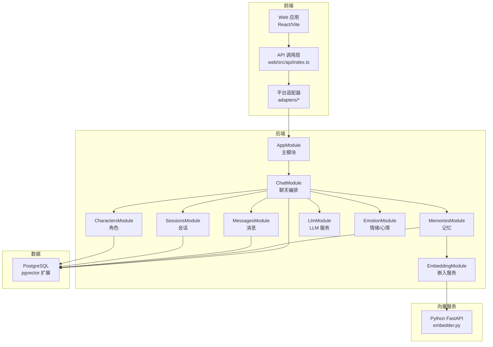
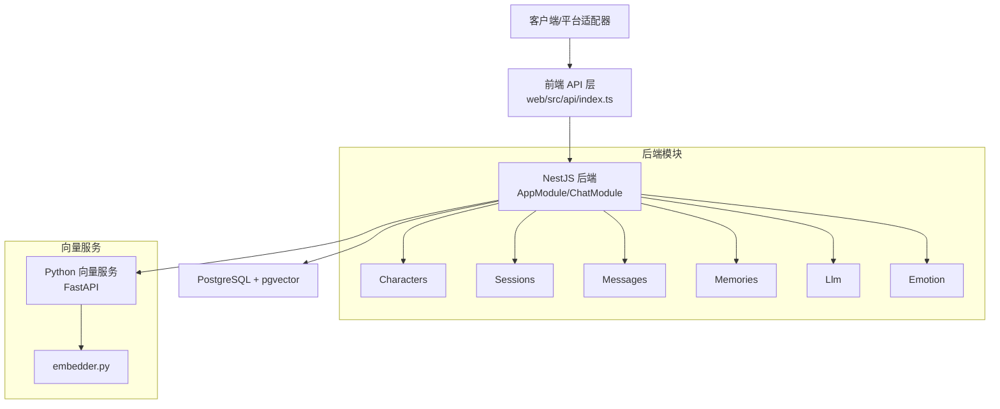
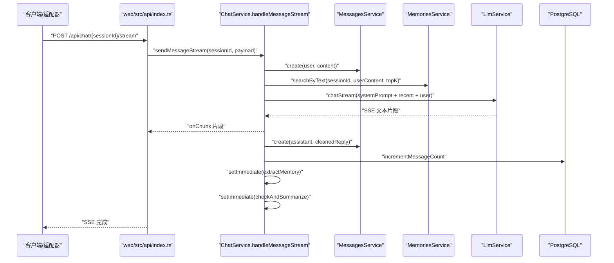
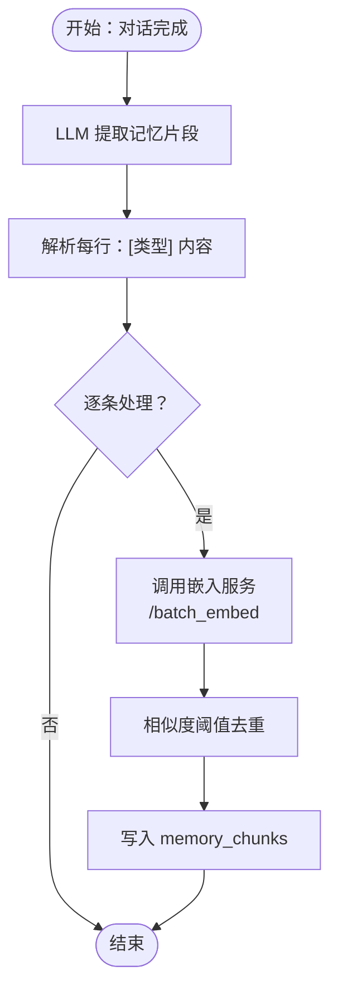
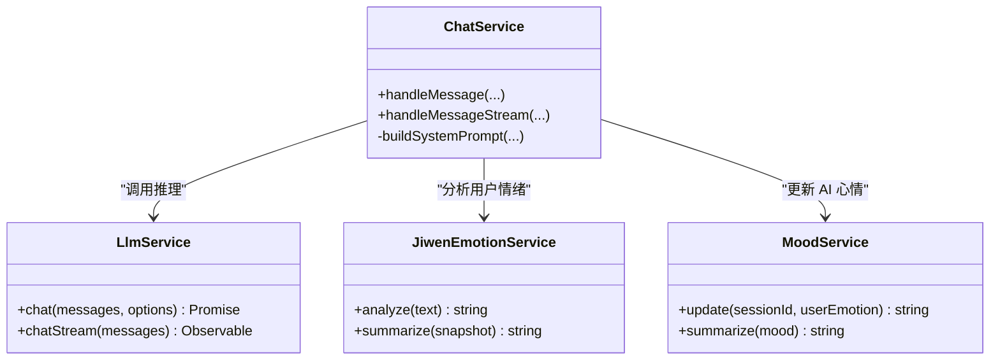
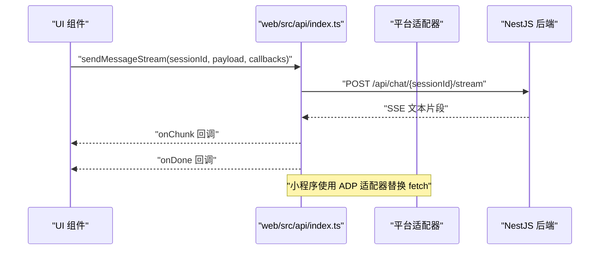
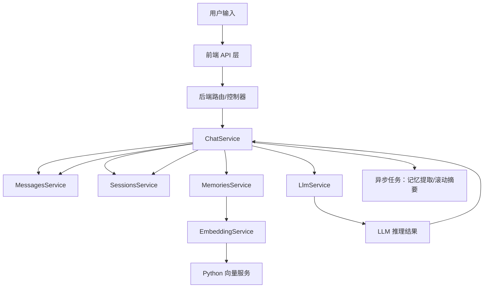
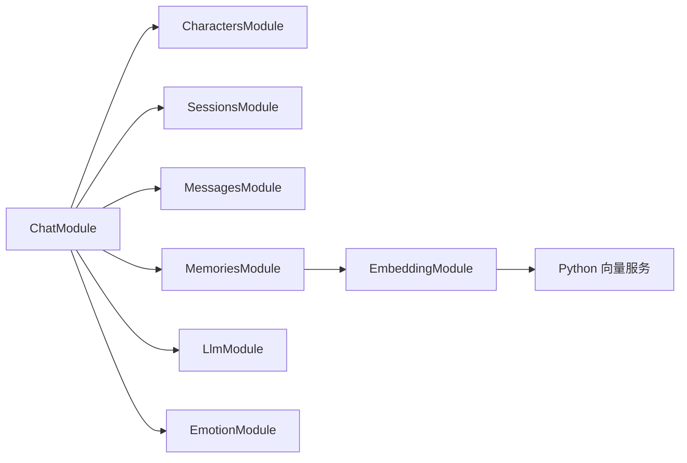

# 系统架构设计

<cite>
**本文引用的文件**
- [src/app.module.ts](file://src/app.module.ts)
- [src/main.ts](file://src/main.ts)
- [src/chat/chat.module.ts](file://src/chat/chat.module.ts)
- [src/chat/chat.service.ts](file://src/chat/chat.service.ts)
- [src/characters/characters.module.ts](file://src/characters/characters.module.ts)
- [src/sessions/sessions.module.ts](file://src/sessions/sessions.module.ts)
- [src/messages/messages.module.ts](file://src/messages/messages.module.ts)
- [src/memories/memories.module.ts](file://src/memories/memories.module.ts)
- [src/embedding/embedding.module.ts](file://src/embedding/embedding.module.ts)
- [src/llm/llm.module.ts](file://src/llm/llm.module.ts)
- [src/emotion/emotion.module.ts](file://src/emotion/emotion.module.ts)
- [src/emotion/jiwen-emotion.service.ts](file://src/emotion/jiwen-emotion.service.ts)
- [src/emotion/mood.service.ts](file://src/emotion/mood.service.ts)
- [src/migrations/1710000000000-init-pgvector-schema.ts](file://src/migrations/1710000000000-init-pgvector-schema.ts)
- [python/main.py](file://python/main.py)
- [python/embedder.py](file://python/embedder.py)
- [web/src/api/index.ts](file://web/src/api/index.ts)
- [adapters/README.md](file://adapters/README.md)
- [adapters/miniprogram/api.js](file://adapters/miniprogram/api.js)
- [shared/types.ts](file://shared/types.ts)
</cite>

## 目录
1. [引言](#引言)
2. [项目结构](#项目结构)
3. [核心组件](#核心组件)
4. [架构总览](#架构总览)
5. [详细组件分析](#详细组件分析)
6. [依赖分析](#依赖分析)
7. [性能考虑](#性能考虑)
8. [故障排查指南](#故障排查指南)
9. [结论](#结论)
10. [附录](#附录)

## 引言
本系统围绕“AI Companion”构建，目标是提供多平台一致的聊天体验，具备角色驱动、记忆检索、情绪建模与流式对话能力。系统采用分层架构与模块化设计，后端基于 NestJS，前端基于 React/Vite，向量服务独立部署为 Python FastAPI 服务，通过明确的 API 边界实现松耦合协作。

## 项目结构
系统采用前后端分离与微服务化思路：
- 后端服务（NestJS）：统一入口、路由编排、业务编排、数据库与迁移管理。
- 前端应用（React/Vite）：Web 界面与 API 调用层，通过共享类型定义与适配器模式支持多平台。
- 向量服务（Python FastAPI）：独立提供文本向量化能力，供记忆检索使用。
- 适配器层：为小程序、uni-app、QQ Bot、Telegram 等平台提供统一 API 的网络层适配。

图表来源
- [src/app.module.ts:18-62](file://src/app.module.ts#L18-L62)
- [src/chat/chat.module.ts:22-33](file://src/chat/chat.module.ts#L22-L33)
- [src/memories/memories.module.ts:12-16](file://src/memories/memories.module.ts#L12-L16)
- [src/embedding/embedding.module.ts:5-14](file://src/embedding/embedding.module.ts#L5-L14)
- [src/llm/llm.module.ts:5-14](file://src/llm/llm.module.ts#L5-L14)
- [python/main.py:26-29](file://python/main.py#L26-L29)

章节来源
- [src/app.module.ts:18-62](file://src/app.module.ts#L18-L62)
- [src/main.ts:4-21](file://src/main.ts#L4-L21)
- [web/src/api/index.ts:30-31](file://web/src/api/index.ts#L30-L31)
- [adapters/README.md:1-62](file://adapters/README.md#L1-L62)

## 核心组件
- 表示层（前端与适配器）
  - Web 应用与 API 调用层：提供统一接口，支持同步与 SSE 流式对话。
  - 平台适配器：替换网络请求实现，保持 API 签名一致。
- 业务逻辑层（NestJS）
  - ChatModule：核心编排，串联角色、会话、消息、记忆、LLM、情绪与心情模块。
  - 各领域模块：Characters/Sessions/Messages/Memories/Llm/Embedding/Emotion。
- 数据访问层（数据库与迁移）
  - TypeORM 管理实体与连接；pgvector 扩展通过迁移初始化。
- 向量服务（Python）
  - FastAPI 提供单条/批量向量化 API，支持 mock 模式与真实模型。

章节来源
- [src/chat/chat.module.ts:12-33](file://src/chat/chat.module.ts#L12-L33)
- [src/characters/characters.module.ts:7-12](file://src/characters/characters.module.ts#L7-L12)
- [src/sessions/sessions.module.ts](file://src/sessions/sessions.module.ts)
- [src/messages/messages.module.ts](file://src/messages/messages.module.ts)
- [src/memories/memories.module.ts:12-16](file://src/memories/memories.module.ts#L12-L16)
- [src/embedding/embedding.module.ts:5-14](file://src/embedding/embedding.module.ts#L5-L14)
- [src/llm/llm.module.ts:5-14](file://src/llm/llm.module.ts#L5-L14)
- [src/emotion/emotion.module.ts](file://src/emotion/emotion.module.ts)
- [src/migrations/1710000000000-init-pgvector-schema.ts](file://src/migrations/1710000000000-init-pgvector-schema.ts)
- [python/main.py:91-112](file://python/main.py#L91-L112)

## 架构总览
系统采用“后端服务 + 前端应用 + 向量服务”的微服务化部署：
- 后端服务：NestJS 主模块装配各业务模块，提供 REST API 与静态资源服务。
- 前端应用：React/Vite 通过 web/src/api/index.ts 发起请求，开发时由 Vite 代理转发，生产时静态托管。
- 向量服务：独立 Python FastAPI 服务，提供 embed/batch_embed 健康检查接口。
- 适配器层：为不同平台提供网络层适配，保持上层 API 签名一致。

图表来源
- [src/app.module.ts:18-62](file://src/app.module.ts#L18-L62)
- [web/src/api/index.ts:30-31](file://web/src/api/index.ts#L30-L31)
- [python/main.py:26-29](file://python/main.py#L26-L29)

## 详细组件分析

### 聊天模块（ChatModule）与服务（ChatService）
- 职责：编排一次完整对话，包括保存用户消息、读取上下文、向量检索记忆、组装 system prompt、调用 LLM、保存回复、更新计数、触发异步记忆提取与滚动摘要。
- 关键流程：
  - 同步路径：保存消息 → 读取上下文 → 检索记忆 → 组装 prompt → LLM 推理 → 保存回复 → 更新计数 → 返回结果。
  - 异步路径：记忆提取（setImmediate）→ 滚动摘要检查（setImmediate）。
- 流式对话：通过 Observable 实现 SSE 分片推送，完成后统一保存回复并触发异步任务。

图表来源
- [src/chat/chat.service.ts:130-231](file://src/chat/chat.service.ts#L130-L231)
- [web/src/api/index.ts:137-201](file://web/src/api/index.ts#L137-L201)

章节来源
- [src/chat/chat.module.ts:12-33](file://src/chat/chat.module.ts#L12-L33)
- [src/chat/chat.service.ts:42-113](file://src/chat/chat.service.ts#L42-L113)
- [src/chat/chat.service.ts:130-231](file://src/chat/chat.service.ts#L130-L231)
- [src/chat/chat.service.ts:249-315](file://src/chat/chat.service.ts#L249-L315)
- [src/chat/chat.service.ts:334-374](file://src/chat/chat.service.ts#L334-L374)

### 记忆模块（MemoriesModule）与嵌入模块（EmbeddingModule）
- 记忆模块：不使用 TypeORM 管理 memory_chunks 实体，因为其包含 VECTOR(768) 列，需通过迁移初始化 pgvector 扩展与表结构，避免 TypeORM 同步删除该列。
- 嵌入模块：通过 HttpModule 调用 Python 向量服务的 embed/batch_embed 接口，支持超时与重定向控制。
- 交互：ChatService 在异步记忆提取阶段调用 MemoriesService.addMemoryByText，后者将候选记忆文本向量化后进行去重与入库。

图表来源
- [src/chat/chat.service.ts:249-315](file://src/chat/chat.service.ts#L249-L315)
- [src/memories/memories.module.ts:8-11](file://src/memories/memories.module.ts#L8-L11)
- [src/embedding/embedding.module.ts:7-10](file://src/embedding/embedding.module.ts#L7-L10)
- [python/main.py:103-112](file://python/main.py#L103-L112)

章节来源
- [src/memories/memories.module.ts:8-11](file://src/memories/memories.module.ts#L8-L11)
- [src/embedding/embedding.module.ts:7-10](file://src/embedding/embedding.module.ts#L7-L10)
- [python/main.py:91-112](file://python/main.py#L91-L112)

### LLM 模块与情绪/心情模块
- LLM 模块：通过 HttpModule 调用外部 LLM 服务，支持较长超时与重定向。
- 情绪/心情模块：JiwenEmotionService 分析用户情绪，MoodService 基于用户情绪更新 AI 心情，二者共同参与 system prompt 组装。

图表来源
- [src/llm/llm.module.ts:5-14](file://src/llm/llm.module.ts#L5-L14)
- [src/emotion/jiwen-emotion.service.ts](file://src/emotion/jiwen-emotion.service.ts)
- [src/emotion/mood.service.ts](file://src/emotion/mood.service.ts)
- [src/chat/chat.service.ts:424-497](file://src/chat/chat.service.ts#L424-L497)

章节来源
- [src/llm/llm.module.ts:5-14](file://src/llm/llm.module.ts#L5-L14)
- [src/emotion/jiwen-emotion.service.ts](file://src/emotion/jiwen-emotion.service.ts)
- [src/emotion/mood.service.ts](file://src/emotion/mood.service.ts)
- [src/chat/chat.service.ts:424-497](file://src/chat/chat.service.ts#L424-L497)

### 前端 API 与平台适配器
- 前端 API 层：统一的请求封装与 SSE 流式解析，支持同步与流式两种调用方式。
- 平台适配器：将 fetch 替换为平台专用网络请求（如 wx.request），保持函数签名一致；小程序不支持 SSE，采用同步降级。

图表来源
- [web/src/api/index.ts:137-201](file://web/src/api/index.ts#L137-L201)
- [adapters/miniprogram/api.js:14-33](file://adapters/miniprogram/api.js#L14-L33)

章节来源
- [web/src/api/index.ts:37-52](file://web/src/api/index.ts#L37-L52)
- [web/src/api/index.ts:137-201](file://web/src/api/index.ts#L137-L201)
- [adapters/README.md:53-61](file://adapters/README.md#L53-L61)
- [adapters/miniprogram/api.js:74-82](file://adapters/miniprogram/api.js#L74-L82)

### 数据流设计（从用户输入到 AI 响应）
- 用户输入经前端 API 层进入后端，ChatService 保存消息、读取上下文、检索记忆、组装 system prompt，调用 LLM 生成回复，保存 AI 回复并更新计数。
- 流式场景下，LLM 以 SSE 推送文本片段，前端实时渲染；流结束后统一清理与持久化。
- 异步任务在主线程外执行，不阻塞用户交互。

图表来源
- [src/chat/chat.service.ts:42-113](file://src/chat/chat.service.ts#L42-L113)
- [src/chat/chat.service.ts:130-231](file://src/chat/chat.service.ts#L130-L231)
- [src/embedding/embedding.module.ts:7-10](file://src/embedding/embedding.module.ts#L7-L10)
- [python/main.py:91-112](file://python/main.py#L91-L112)

## 依赖分析
- 模块耦合与内聚
  - ChatModule 高内聚地编排多个子模块，形成清晰的业务边界；各领域模块通过服务接口解耦。
  - EmbeddingModule 仅暴露服务，避免对上游模块引入 HTTP 客户端细节。
- 外部依赖
  - PostgreSQL + pgvector：存储角色、会话、消息与记忆向量。
  - Python FastAPI：提供稳定的向量化服务，支持 mock 模式便于开发验证。
- 可能的循环依赖
  - 当前模块间通过服务注入与导出避免直接循环引用；注意 Entities 与 Modules 的注册顺序与导出范围。

图表来源
- [src/chat/chat.module.ts:22-33](file://src/chat/chat.module.ts#L22-L33)
- [src/memories/memories.module.ts:12-16](file://src/memories/memories.module.ts#L12-L16)
- [src/embedding/embedding.module.ts:5-14](file://src/embedding/embedding.module.ts#L5-L14)

章节来源
- [src/chat/chat.module.ts:22-33](file://src/chat/chat.module.ts#L22-L33)
- [src/memories/memories.module.ts:12-16](file://src/memories/memories.module.ts#L12-L16)
- [src/embedding/embedding.module.ts:5-14](file://src/embedding/embedding.module.ts#L5-L14)

## 性能考虑
- 向量检索与去重
  - 控制检索 topK 数量与相似度阈值，减少无效写入与查询开销。
  - 批量向量化接口优先使用 /batch_embed，降低网络往返。
- 流式对话
  - SSE 分片推送提升感知延迟；前端按块渲染，避免一次性接收导致卡顿。
- 异步任务
  - 使用 setImmediate 将记忆提取与滚动摘要移出主线程，避免阻塞响应。
- 数据库与迁移
  - pgvector 表结构通过迁移初始化，禁止 TypeORM 同步删除向量列，确保稳定性与一致性。
- CORS 与静态资源
  - 开发阶段允许任意来源，生产环境限制来源，减少跨域风险与不必要的预检开销。

章节来源
- [src/chat/chat.service.ts:65-75](file://src/chat/chat.service.ts#L65-L75)
- [src/chat/chat.service.ts:103-110](file://src/chat/chat.service.ts#L103-L110)
- [src/embedding/embedding.module.ts:7-10](file://src/embedding/embedding.module.ts#L7-L10)
- [python/main.py:103-112](file://python/main.py#L103-L112)
- [src/app.module.ts:38-50](file://src/app.module.ts#L38-L50)
- [src/main.ts:9-13](file://src/main.ts#L9-L13)

## 故障排查指南
- CORS 问题
  - 确认生产环境限制 origin，避免浏览器拦截。
- 数据库连接与迁移
  - 检查 DB_* 环境变量与迁移是否执行；pgvector 初始化失败会导致向量列缺失。
- 向量服务不可用
  - 检查 Python 服务端口与健康检查接口；必要时启用 mock 模式验证流程。
- SSE 流式异常
  - 前端解析 SSE 格式，关注非 JSON 数据与中断情况；小程序不支持 SSE，使用同步降级。
- API 错误处理
  - 统一捕获 HTTP 错误并抛出 ApiError，便于前端展示与恢复。

章节来源
- [src/main.ts:9-13](file://src/main.ts#L9-L13)
- [src/app.module.ts:38-50](file://src/app.module.ts#L38-L50)
- [python/main.py:115-122](file://python/main.py#L115-L122)
- [web/src/api/index.ts:151-198](file://web/src/api/index.ts#L151-L198)
- [adapters/miniprogram/api.js](file://adapters/miniprogram/api.js)
- [shared/types.ts:114-121](file://shared/types.ts#L114-L121)

## 结论
本系统通过清晰的分层与模块化设计，实现了跨平台一致的聊天体验与可扩展的记忆检索能力。后端以 ChatService 为核心编排，前端与适配器层保持 API 签名一致，向量服务独立部署并提供稳定接口。通过迁移与 pgvector 的配合，确保向量数据结构的稳定性；通过流式与异步任务优化用户体验与系统吞吐。建议在生产环境中完善 CORS 策略、监控向量服务健康状态，并持续评估检索与去重策略的性能表现。

## 附录
- 系统边界
  - 后端边界：REST API 与静态资源；内部模块边界通过服务接口与导出控制。
  - 前端边界：UI 组件与 API 调用层；平台适配器边界通过网络请求替换实现。
  - 向量服务边界：embed/batch_embed/health 三个接口；支持 mock 模式。
- 类型定义
  - 共享类型定义位于 shared/types.ts，涵盖消息、角色、会话、导入记录与错误类型，确保前后端与适配器的一致性。

章节来源
- [shared/types.ts:1-166](file://shared/types.ts#L1-L166)
- [python/main.py:91-122](file://python/main.py#L91-L122)
- [adapters/README.md:1-62](file://adapters/README.md#L1-L62)