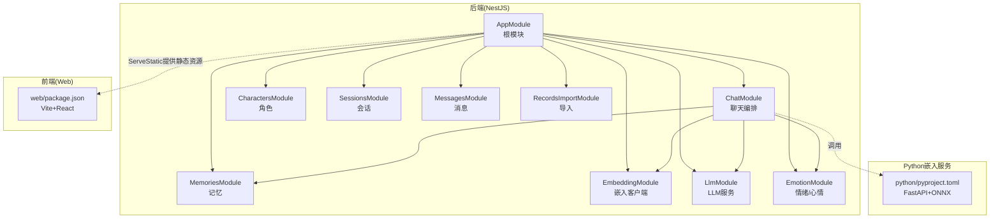
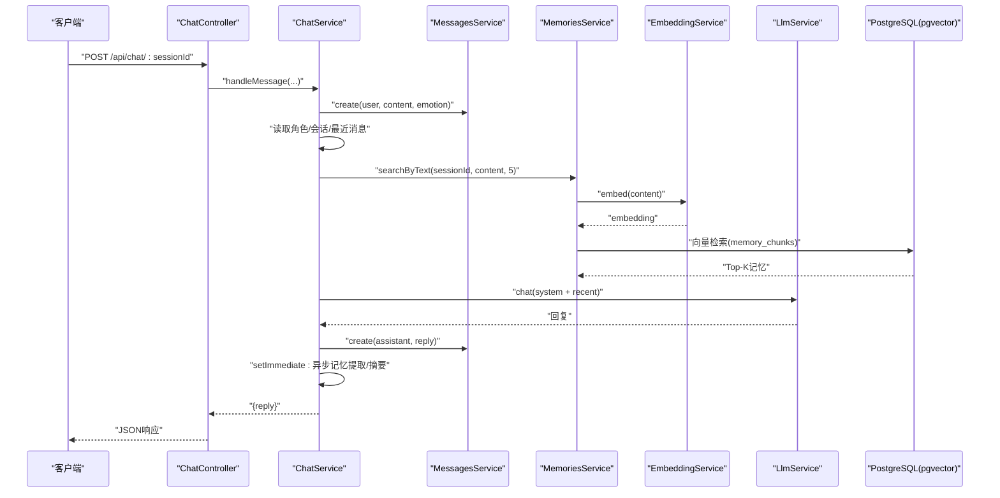
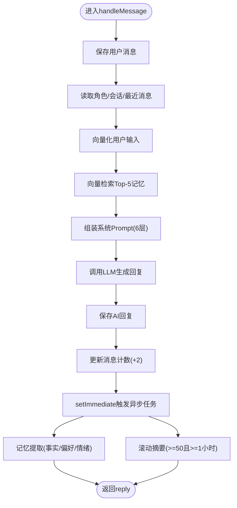
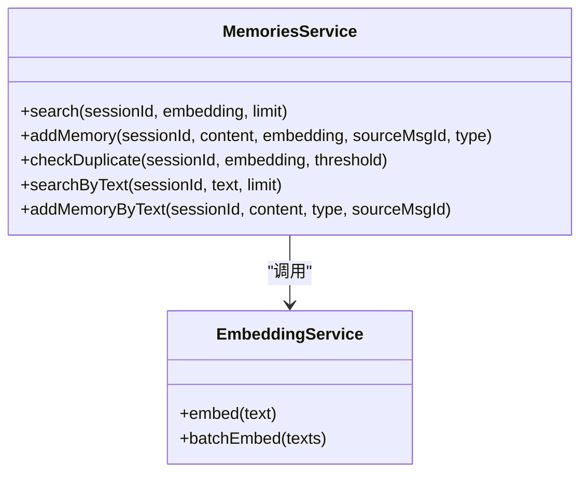
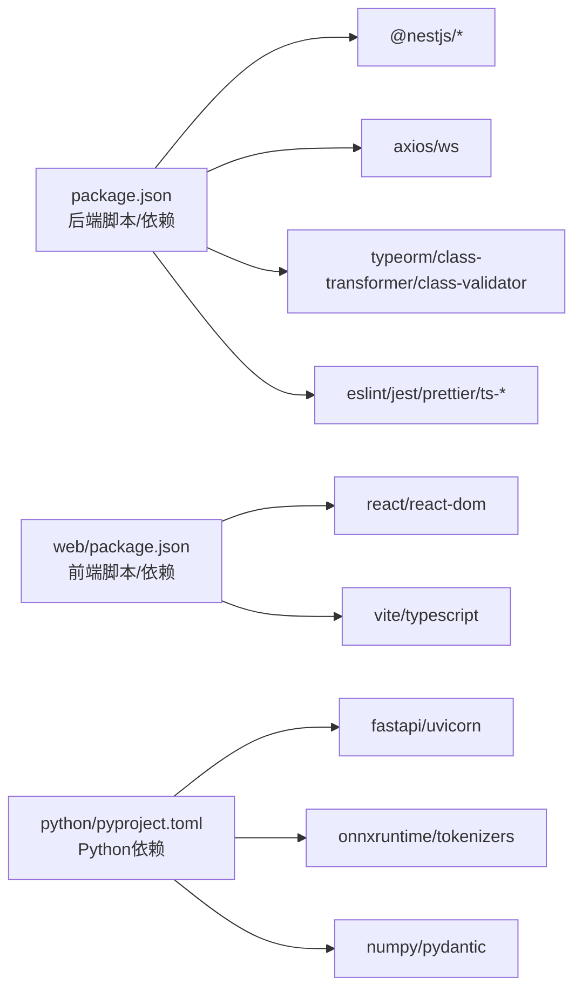

# 贡献指南

<cite>
**本文引用的文件**
- [README.md](file://README.md)
- [package.json](file://package.json)
- [eslint.config.mjs](file://eslint.config.mjs)
- [.prettierrc](file://.prettierrc)
- [python/pyproject.toml](file://python/pyproject.toml)
- [docs/AI_Companion_最终方案.md](file://docs/AI_Companion_最终方案.md)
- [docs/Implementation_Plan.md](file://docs/Implementation_Plan.md)
- [src/app.module.ts](file://src/app.module.ts)
- [src/main.ts](file://src/main.ts)
- [src/chat/chat.service.ts](file://src/chat/chat.service.ts)
- [src/memories/memories.service.ts](file://src/memories/memories.service.ts)
- [src/characters/characters.service.ts](file://src/characters/characters.service.ts)
- [test/app.e2e-spec.ts](file://test/app.e2e-spec.ts)
- [web/package.json](file://web/package.json)
</cite>

## 目录
1. [简介](#简介)
2. [项目结构](#项目结构)
3. [核心组件](#核心组件)
4. [架构总览](#架构总览)
5. [详细组件分析](#详细组件分析)
6. [依赖分析](#依赖分析)
7. [性能考量](#性能考量)
8. [故障排查指南](#故障排查指南)
9. [结论](#结论)
10. [附录](#附录)

## 简介
本指南面向AI Companion项目的贡献者，覆盖开发规范、Git工作流、代码审查标准、新功能开发流程、文档贡献方式、测试要求、开发环境搭建、发布流程以及社区行为准则与沟通渠道使用规范。目标是帮助新老贡献者高效协作，确保代码质量与一致性。

## 项目结构
项目采用多模块分层组织：
- 后端（NestJS）：src/ 下按领域模块划分（chat、characters、sessions、messages、memories、embedding、llm、emotion、records-import 等），统一在根模块装配。
- 前端（React/Vite）：web/ 目录，生产构建产物由后端 ServeStaticModule 提供。
- Python嵌入服务：python/ 目录，提供FastAPI的/embed与/batch_embed接口。
- 文档：docs/ 目录，包含总体方案、实施计划与学习笔记。
- 测试：test/ 目录，包含e2e测试样例。

图表来源
- [src/app.module.ts:18-63](file://src/app.module.ts#L18-L63)
- [docs/Implementation_Plan.md:40-80](file://docs/Implementation_Plan.md#L40-L80)
- [web/package.json:1-22](file://web/package.json#L1-L22)
- [python/pyproject.toml:1-22](file://python/pyproject.toml#L1-L22)

章节来源
- [docs/Implementation_Plan.md:38-80](file://docs/Implementation_Plan.md#L38-L80)
- [src/app.module.ts:18-63](file://src/app.module.ts#L18-L63)

## 核心组件
- 应用入口与CORS：应用启动时启用CORS，开发环境允许任意来源，生产需限制来源。
- 根模块装配：加载ConfigModule、TypeORM（PostgreSQL+pgvector）、ServeStaticModule（提供web/dist），并注册业务模块。
- 聊天服务：核心编排（保存消息、读取上下文、向量检索记忆、组装prompt、调LLM、保存回复、异步记忆提取与滚动摘要）。
- 记忆服务：直接使用DataSource.query执行原生SQL，完成向量检索、写入与查重。
- 角色服务：基于TypeORM Repository进行CRUD。

章节来源
- [src/main.ts:4-21](file://src/main.ts#L4-L21)
- [src/app.module.ts:18-63](file://src/app.module.ts#L18-L63)
- [src/chat/chat.service.ts:13-113](file://src/chat/chat.service.ts#L13-L113)
- [src/memories/memories.service.ts:7-28](file://src/memories/memories.service.ts#L7-L28)
- [src/characters/characters.service.ts:6-40](file://src/characters/characters.service.ts#L6-L40)

## 架构总览
后端通过NestJS提供REST API，前端通过Vite+React提供SPA界面；Python服务提供文本向量化能力；PostgreSQL+pgvector存储结构化数据与向量数据。聊天主流程同步返回完整回复，同时异步执行记忆提取与滚动摘要。

图表来源
- [src/chat/chat.service.ts:42-113](file://src/chat/chat.service.ts#L42-L113)
- [src/memories/memories.service.ts:112-136](file://src/memories/memories.service.ts#L112-L136)
- [docs/Implementation_Plan.md:127-143](file://docs/Implementation_Plan.md#L127-L143)

## 详细组件分析

### 聊天服务（ChatService）
职责与流程
- 同步流程：保存用户消息、读取上下文、向量检索记忆、组装系统prompt、调用LLM、保存AI回复、更新消息计数、返回结果。
- 异步流程：触发记忆提取（从对话中抽取事实/偏好/情绪碎片并入库）、触发滚动摘要（满足阈值后生成摘要并重置计数）。
- Prompt层级：固定人格、滚动摘要、长期画像、动态记忆、情绪状态、严格规则。

图表来源
- [src/chat/chat.service.ts:42-113](file://src/chat/chat.service.ts#L42-L113)
- [src/chat/chat.service.ts:237-374](file://src/chat/chat.service.ts#L237-L374)

章节来源
- [src/chat/chat.service.ts:13-113](file://src/chat/chat.service.ts#L13-L113)
- [src/chat/chat.service.ts:237-374](file://src/chat/chat.service.ts#L237-L374)
- [docs/Implementation_Plan.md:127-143](file://docs/Implementation_Plan.md#L127-L143)

### 记忆服务（MemoriesService）
要点
- 使用DataSource.query执行原生SQL，避免TypeORM对VECTOR(768)类型的兼容问题。
- 提供检索(search)、写入(addMemory)、查重(checkDuplicate)与便捷方法(searchByText/addMemoryByText)。
- 与EmbeddingService配合完成“文本→向量→查重→入库”的闭环。

图表来源
- [src/memories/memories.service.ts:29-137](file://src/memories/memories.service.ts#L29-L137)

章节来源
- [src/memories/memories.service.ts:7-28](file://src/memories/memories.service.ts#L7-L28)
- [src/memories/memories.service.ts:42-88](file://src/memories/memories.service.ts#L42-L88)

### 角色服务（CharactersService）
要点
- 基于TypeORM Repository进行创建、查询、更新、删除。
- 更新支持部分字段更新（名称、基础prompt、模型、说话风格等）。

章节来源
- [src/characters/characters.service.ts:6-40](file://src/characters/characters.service.ts#L6-L40)

## 依赖分析
- 后端依赖：NestJS核心、TypeORM、PostgreSQL驱动、Axios、WS、Dotenv等。
- 前端依赖：React、ReactDOM、Vite、TypeScript。
- Python嵌入服务：FastAPI、Uvicorn、ONNX Runtime、NumPy、Pydantic、tokenizers等。
- 开发工具：ESLint + Prettier、Jest、Supertest、ts-jest、ts-node等。

图表来源
- [package.json:29-71](file://package.json#L29-L71)
- [web/package.json:10-21](file://web/package.json#L10-L21)
- [python/pyproject.toml:1-22](file://python/pyproject.toml#L1-L22)

章节来源
- [package.json:29-71](file://package.json#L29-L71)
- [web/package.json:10-21](file://web/package.json#L10-L21)
- [python/pyproject.toml:1-22](file://python/pyproject.toml#L1-L22)

## 性能考量
- 向量检索：使用pgvector的HNSW索引与余弦距离，限制检索数量，避免高延迟。
- 异步处理：记忆提取与滚动摘要通过setImmediate异步执行，不阻塞主流程。
- LLM调用：同步与SSE两种模式，SSE适合实时交互；温度与最大token参数用于平衡质量与速度。
- 数据库：关闭TypeORM的synchronize，使用迁移脚本管理schema，避免删除VECTOR列。

章节来源
- [docs/Implementation_Plan.md:112-124](file://docs/Implementation_Plan.md#L112-L124)
- [src/memories/memories.service.ts:42-59](file://src/memories/memories.service.ts#L42-L59)
- [src/chat/chat.service.ts:334-374](file://src/chat/chat.service.ts#L334-L374)
- [src/app.module.ts:46-48](file://src/app.module.ts#L46-L48)

## 故障排查指南
- CORS问题：生产环境需限制origin，避免跨域风险。
- 数据库连接：确认DB_HOST/PORT/USER/PASSWORD/NAME与迁移脚本一致。
- Python嵌入服务：确保端口开放、模型下载完成、/embed与/batch_embed可用。
- LLM调用：确认API密钥有效、网络可达DeepSeek。
- 前端静态资源：生产环境需先构建web，后端ServeStatic指向dist目录。

章节来源
- [src/main.ts:7-13](file://src/main.ts#L7-L13)
- [src/app.module.ts:38-50](file://src/app.module.ts#L38-L50)
- [docs/Implementation_Plan.md:159-177](file://docs/Implementation_Plan.md#L159-L177)

## 结论
本指南提供了从开发规范、Git工作流、代码审查、新功能开发、文档贡献、测试要求到环境搭建与发布的完整实践路径。遵循这些规范有助于提升协作效率与代码质量，保障系统长期可维护性与稳定性。

## 附录

### 开发规范与代码风格
- 代码风格
  - 使用ESLint + Prettier统一风格，规则在配置文件中定义。
  - TypeScript类型检查开启，避免any泛滥。
- 命名约定
  - 类/模块：帕斯卡命名（如ChatService、MemoriesService）。
  - 方法/函数：驼峰命名（如handleMessage、searchByText）。
  - 常量：大写下划线（如MAX_TOKENS）。
  - 文件：小写加连字符（如chat.service.ts）。
- 注释规范
  - 公开API与复杂逻辑需添加清晰注释，说明输入、输出、异常与副作用。
  - TODO/NOTE标注临时性或待完善处，便于后续跟进。

章节来源
- [eslint.config.mjs:14-35](file://eslint.config.mjs#L14-L35)
- [.prettierrc:1-5](file://.prettierrc#L1-L5)

### Git工作流与分支策略
- 分支策略
  - main：稳定发布分支。
  - develop：集成开发分支，合并PR前需通过测试与审查。
  - feature/<name>：功能开发分支，完成后合并至develop。
  - hotfix/<name>：紧急修复分支，直接合并至main并打标签。
- 提交规范
  - 类型：feat/fix/docs/style/refactor/test/chore
  - 格式：type(scope): subject
  - 示例：feat(chat): 增加流式对话支持
- Pull Request流程
  - PR需关联Issue，描述变更动机、改动范围与测试覆盖。
  - 至少一名维护者审查通过后方可合并。

### 代码审查标准
- 审查清单
  - 是否满足需求与设计文档要求。
  - 是否通过单元测试与e2e测试，覆盖率达标。
  - 是否遵循命名与注释规范。
  - 是否存在潜在性能瓶颈或安全风险。
  - 是否引入循环依赖或破坏性变更。
- 反馈处理
  - 修改后重新请求审查，及时回复评论。
  - 对于争议性改动，建议在会议中讨论并达成共识。
- 合并要求
  - 通过自动化检查（lint、test、cov）。
  - 获得至少一位维护者批准。
  - Squash或Rebase后合并，保持提交历史整洁。

### 新功能开发指南
- 需求分析
  - 明确用户故事、验收标准与非功能性需求（性能、安全、可维护性）。
- 设计文档
  - 参考现有模块结构与职责划分，必要时补充设计说明。
- 实现规范
  - 在对应模块下新增Service/Controller/Entity/Module。
  - 保持与现有API风格一致，错误处理与日志记录规范。
  - 编写单元测试与必要时的e2e测试。

章节来源
- [docs/Implementation_Plan.md:38-80](file://docs/Implementation_Plan.md#L38-L80)
- [docs/Implementation_Plan.md:181-192](file://docs/Implementation_Plan.md#L181-L192)

### 文档贡献方式
- 文档编写标准
  - 使用Markdown，标题层级清晰，术语前后一致。
  - 代码示例通过文件路径引用，避免粘贴具体代码。
- 更新流程
  - 在docs/目录下新增或修改文档，提交PR并说明变更背景。
- 审核机制
  - 维护者负责审核文档的准确性与完整性，必要时要求修订。

章节来源
- [docs/Implementation_Plan.md:1-30](file://docs/Implementation_Plan.md#L1-L30)
- [docs/Implementation_Plan.md:314-343](file://docs/Implementation_Plan.md#L314-L343)

### 测试要求
- 测试覆盖率目标
  - 单元测试覆盖率不低于80%，关键模块不低于90%。
- 测试用例编写
  - 覆盖正常路径、边界条件与异常场景。
  - 使用Jest与ts-jest，e2e测试使用Supertest。
- 质量保证
  - CI中强制执行测试与覆盖率检查，失败则阻止合并。

章节来源
- [package.json:72-88](file://package.json#L72-L88)
- [test/app.e2e-spec.ts:7-29](file://test/app.e2e-spec.ts#L7-L29)

### 开发环境搭建
- 后端
  - 安装Node.js与npm，执行npm install，运行npm run start:dev。
  - 配置TypeORM连接PostgreSQL，执行迁移脚本。
- 前端
  - 在web/目录执行npm install与npm run dev。
- Python嵌入服务
  - 在python/目录安装依赖，运行uvicorn启动FastAPI服务。
- IDE与调试
  - VS Code推荐插件：ESLint、Prettier、TypeScript Importer、Jest Runner。
  - 后端支持调试模式（npm run start:debug），前端使用Vite Dev Server。

章节来源
- [README.md:28-58](file://README.md#L28-L58)
- [docs/Implementation_Plan.md:159-177](file://docs/Implementation_Plan.md#L159-L177)
- [src/main.ts:15-16](file://src/main.ts#L15-L16)

### 发布流程
- 版本管理
  - 使用语义化版本（MAJOR.MINOR.PATCH），变更记录在变更日志中维护。
- 变更日志
  - 记录重大功能、修复与破坏性变更，便于升级参考。
- 发布检查清单
  - 通过所有测试与覆盖率检查。
  - 更新版本号与依赖锁文件。
  - 生成生产构建（web与后端），验证静态资源与API可用性。
  - 推送tag并发布到目标环境。

### 社区行为准则与沟通渠道
- 行为准则
  - 尊重与包容，禁止骚扰与歧视，维护友好协作氛围。
- 沟通渠道
  - 使用GitHub Issues与PR进行需求与问题跟踪。
  - Discord频道用于即时讨论与技术支持。

章节来源
- [README.md:73-84](file://README.md#L73-L84)