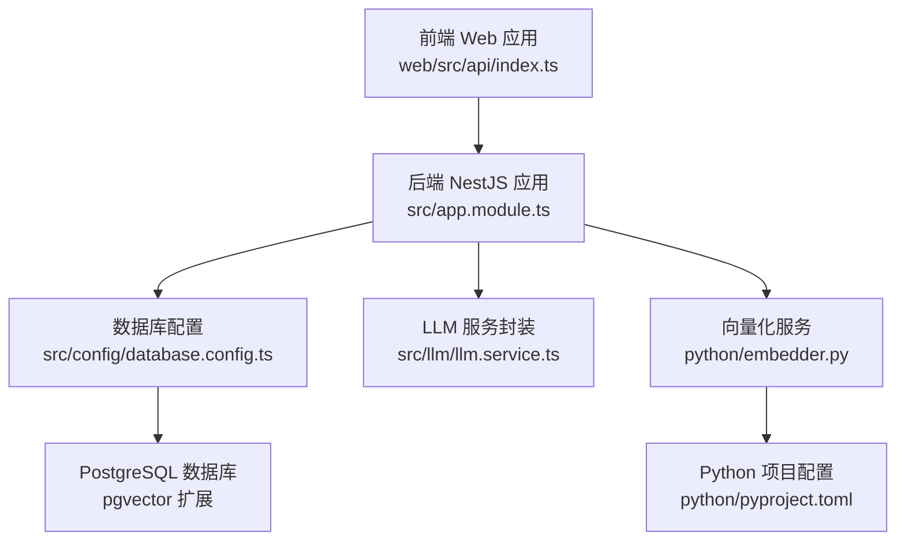
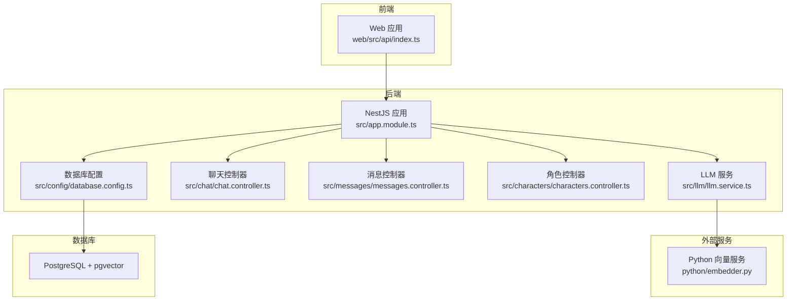
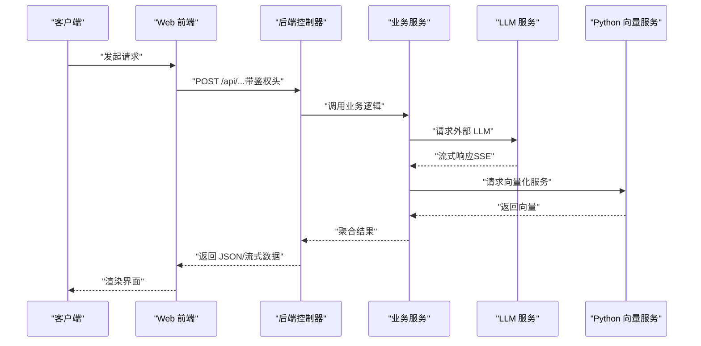
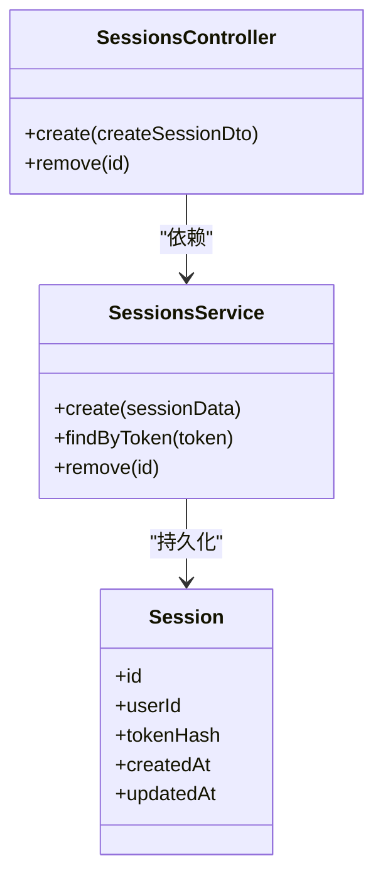
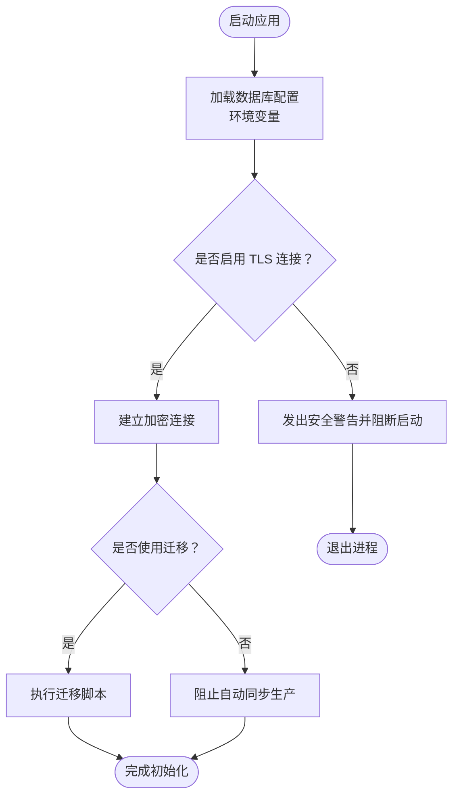
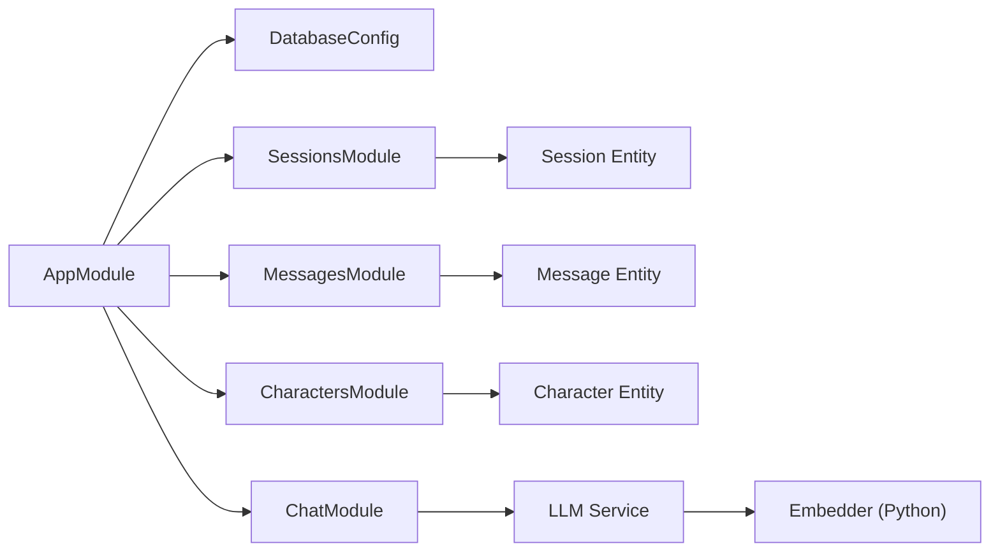

# 安全配置

<cite>
**本文引用的文件**
- [src/app.module.ts](file://src/app.module.ts)
- [src/config/database.config.ts](file://src/config/database.config.ts)
- [docs/Learning_Notes.md](file://docs/Learning_Notes.md)
- [src/sessions/sessions.module.ts](file://src/sessions/sessions.module.ts)
- [src/sessions/entities/session.entity.ts](file://src/sessions/entities/session.entity.ts)
- [src/messages/messages.controller.ts](file://src/messages/messages.controller.ts)
- [src/messages/entities/message.entity.ts](file://src/messages/entities/message.entity.ts)
- [src/characters/characters.controller.ts](file://src/characters/characters.controller.ts)
- [src/characters/entities/character.entity.ts](file://src/characters/entities/character.entity.ts)
- [src/chat/chat.controller.ts](file://src/chat/chat.controller.ts)
- [src/llm/llm.service.ts](file://src/llm/llm.service.ts)
- [web/src/api/index.ts](file://web/src/api/index.ts)
- [test/app.e2e-spec.ts](file://test/app.e2e-spec.ts)
- [package.json](file://package.json)
- [python/pyproject.toml](file://python/pyproject.toml)
- [python/embedder.py](file://python/embedder.py)
</cite>

## 目录
1. [引言](#引言)
2. [项目结构](#项目结构)
3. [核心组件](#核心组件)
4. [架构总览](#架构总览)
5. [详细组件分析](#详细组件分析)
6. [依赖关系分析](#依赖关系分析)
7. [性能与安全注意事项](#性能与安全注意事项)
8. [故障排查指南](#故障排查指南)
9. [结论](#结论)
10. [附录](#附录)

## 引言
本文件面向“AI Companion”项目，提供一套系统化的安全配置文档，覆盖API安全、数据库安全、网络安全、敏感信息保护、身份认证与授权、安全审计与合规、以及安全扫描与渗透测试建议。文档基于仓库现有实现进行梳理，并结合最佳实践给出可操作的加固建议。

## 项目结构
项目采用前后端分离架构：
- 后端：NestJS 应用，模块化组织业务域（角色、会话、消息、聊天、嵌入等），通过 TypeORM 连接 PostgreSQL（含向量扩展）。
- 前端：React/Vite 应用，通过统一 API 入口调用后端接口。
- 向量化服务：独立 Python 服务，由后端通过 HTTP 调用。

图表来源
- [src/app.module.ts:1-50](file://src/app.module.ts#L1-L50)
- [src/config/database.config.ts:1-60](file://src/config/database.config.ts#L1-L60)
- [web/src/api/index.ts:145-170](file://web/src/api/index.ts#L145-L170)
- [src/llm/llm.service.ts:97-146](file://src/llm/llm.service.ts#L97-L146)
- [python/embedder.py:1-100](file://python/embedder.py#L1-L100)
- [python/pyproject.toml:1-120](file://python/pyproject.toml#L1-L120)

章节来源
- [src/app.module.ts:1-50](file://src/app.module.ts#L1-L50)
- [docs/Learning_Notes.md:278-331](file://docs/Learning_Notes.md#L278-L331)

## 核心组件
- 应用根模块与配置加载：根模块集中导入配置模块与数据库模块，确保全局配置可用。
- 数据库配置：通过环境变量驱动连接参数，支持开发/测试/生产多环境切换。
- 会话与实体：会话模块提供会话实体与服务，支撑后续认证与授权扩展。
- 消息与角色实体：消息与角色实体定义数据模型，便于后续审计与脱敏策略落地。
- LLM 服务：封装外部大模型服务调用，需关注请求头、超时与错误处理。
- 前端 API 封装：统一的请求入口，便于集中处理鉴权与错误。

章节来源
- [src/app.module.ts:1-50](file://src/app.module.ts#L1-L50)
- [src/config/database.config.ts:1-60](file://src/config/database.config.ts#L1-L60)
- [src/sessions/sessions.module.ts:1-13](file://src/sessions/sessions.module.ts#L1-L13)
- [src/sessions/entities/session.entity.ts:1-120](file://src/sessions/entities/session.entity.ts#L1-L120)
- [src/messages/entities/message.entity.ts:1-120](file://src/messages/entities/message.entity.ts#L1-L120)
- [src/characters/entities/character.entity.ts:1-120](file://src/characters/entities/character.entity.ts#L1-L120)
- [src/llm/llm.service.ts:97-146](file://src/llm/llm.service.ts#L97-L146)
- [web/src/api/index.ts:145-170](file://web/src/api/index.ts#L145-L170)

## 架构总览
下图展示后端与数据库、LLM 服务及向量化服务之间的交互关系，以及前端调用路径。

图表来源
- [src/app.module.ts:1-50](file://src/app.module.ts#L1-L50)
- [src/config/database.config.ts:1-60](file://src/config/database.config.ts#L1-L60)
- [src/chat/chat.controller.ts:1-120](file://src/chat/chat.controller.ts#L1-L120)
- [src/messages/messages.controller.ts:1-120](file://src/messages/messages.controller.ts#L1-L120)
- [src/characters/characters.controller.ts:1-120](file://src/characters/characters.controller.ts#L1-L120)
- [src/llm/llm.service.ts:97-146](file://src/llm/llm.service.ts#L97-L146)
- [web/src/api/index.ts:145-170](file://web/src/api/index.ts#L145-L170)
- [python/embedder.py:1-100](file://python/embedder.py#L1-L100)

## 详细组件分析

### API 安全配置
- 统一错误处理与状态码：e2e 测试中对根路径返回值进行断言，建议在控制器层统一包装响应与错误处理，避免泄露内部细节。
- 请求体校验：结合 DTO 与校验装饰器，确保输入合法性；对敏感字段进行长度、格式限制。
- 超时与速率限制：对外部 LLM 与向量化服务调用应设置合理超时与并发限制，防止级联故障。
- CORS 与安全头：在网关或中间件层统一配置跨域、内容安全策略、X-Frame-Options、X-Content-Type-Options 等安全头。

图表来源
- [web/src/api/index.ts:145-170](file://web/src/api/index.ts#L145-L170)
- [src/llm/llm.service.ts:97-146](file://src/llm/llm.service.ts#L97-L146)
- [src/chat/chat.controller.ts:1-120](file://src/chat/chat.controller.ts#L1-L120)

章节来源
- [test/app.e2e-spec.ts:1-29](file://test/app.e2e-spec.ts#L1-L29)
- [web/src/api/index.ts:145-170](file://web/src/api/index.ts#L145-L170)
- [src/llm/llm.service.ts:97-146](file://src/llm/llm.service.ts#L97-L146)

### 认证机制与授权策略
- 当前实现：项目未内置认证/授权模块。建议引入鉴权中间件或守卫，结合会话实体与路由元数据实现细粒度授权。
- 会话与实体：会话模块已提供会话实体与服务，可作为会话态存储的基础，配合 JWT 或会话 Cookie 实现登录态管理。
- 授权维度：按用户、角色、资源（角色/会话/消息）进行最小权限授权，使用装饰器或拦截器统一校验。

图表来源
- [src/sessions/sessions.module.ts:1-13](file://src/sessions/sessions.module.ts#L1-L13)
- [src/sessions/entities/session.entity.ts:1-120](file://src/sessions/entities/session.entity.ts#L1-L120)

章节来源
- [src/sessions/sessions.module.ts:1-13](file://src/sessions/sessions.module.ts#L1-L13)
- [src/sessions/entities/session.entity.ts:1-120](file://src/sessions/entities/session.entity.ts#L1-L120)

### 数据库安全设置
- 连接加密：生产环境必须启用 TLS 连接 PostgreSQL；在数据库配置中设置 SSL 参数。
- 用户权限管理：为不同环境创建最小权限账户（仅允许必要 DDL/DML），禁用高危权限。
- 迁移与同步：开发阶段可使用自动同步，生产阶段必须使用迁移脚本，禁止自动同步。
- 数据脱敏：对日志与审计输出中的敏感字段（如用户 ID、消息内容）进行脱敏或屏蔽。

图表来源
- [src/config/database.config.ts:1-60](file://src/config/database.config.ts#L1-L60)
- [docs/Learning_Notes.md:295-312](file://docs/Learning_Notes.md#L295-L312)

章节来源
- [src/config/database.config.ts:1-60](file://src/config/database.config.ts#L1-L60)
- [docs/Learning_Notes.md:295-312](file://docs/Learning_Notes.md#L295-L312)

### 网络安全配置
- 防火墙：仅开放必需端口（如 3000、8000），内网访问数据库与向量化服务。
- DDoS 防护：在反向代理层启用限速、IP 白名单/黑名单、验证码与速率限制。
- SSL/TLS：为反向代理与后端服务配置强密码套件与证书轮换策略，强制 HTTPS。
- 内外网隔离：数据库与向量化服务置于内网，仅后端服务可访问。

章节来源
- [docs/Learning_Notes.md:261-270](file://docs/Learning_Notes.md#L261-L270)
- [web/src/api/index.ts:145-170](file://web/src/api/index.ts#L145-L170)

### 敏感信息保护
- 环境变量：将数据库凭据、第三方 API Key、密钥等放入环境变量，避免硬编码。
- 密钥管理：使用密钥管理系统（如 KMS、Vault）轮换与存储密钥，最小权限访问。
- 数据传输安全：强制 HTTPS、HSTS、OCSP Stapling；对日志与监控数据进行脱敏。
- 前端安全：避免在前端暴露后端密钥；对 API Key 使用后端代理转发。

章节来源
- [docs/Learning_Notes.md:261-270](file://docs/Learning_Notes.md#L261-L270)
- [docs/Learning_Notes.md:278-331](file://docs/Learning_Notes.md#L278-L331)

### 身份认证与授权机制
- JWT 令牌管理：引入 JWT 中间件，校验签名与过期时间；支持刷新令牌与黑名单。
- OAuth 集成：如需第三方登录，使用标准授权码流程，严格校验回调域名与状态参数。
- 会话安全：使用 HttpOnly、Secure、SameSite Cookie；定期轮换会话 ID；实现会话超时与并发控制。

章节来源
- [src/sessions/entities/session.entity.ts:1-120](file://src/sessions/entities/session.entity.ts#L1-L120)
- [src/sessions/sessions.module.ts:1-13](file://src/sessions/sessions.module.ts#L1-L13)

### 安全审计日志与合规
- 日志策略：记录登录、授权、敏感操作、异常错误；脱敏敏感字段；限制日志级别。
- 合规要求：遵循最小采集原则，明确数据处理目的与期限；提供数据删除与导出能力。
- 审计范围：覆盖 API 调用链路、数据库变更、文件上传下载、第三方服务调用。

章节来源
- [src/messages/entities/message.entity.ts:1-120](file://src/messages/entities/message.entity.ts#L1-L120)
- [src/characters/entities/character.entity.ts:1-120](file://src/characters/entities/character.entity.ts#L1-L120)

### 安全漏洞扫描与渗透测试
- 静态分析：对前端与后端代码进行 SAST 扫描，识别硬编码密钥、弱加密、SQL 注入等风险。
- 依赖审计：定期扫描 npm 与 Python 依赖，修复高危漏洞。
- 渗透测试：模拟常见攻击（XSS、CSRF、注入、暴力破解），验证防护有效性。
- 运行时监控：部署 WAF、IDS/IPS、异常检测与告警。

章节来源
- [package.json:1-200](file://package.json#L1-L200)
- [python/pyproject.toml:1-120](file://python/pyproject.toml#L1-L120)

## 依赖关系分析
后端模块与数据库配置存在直接耦合，控制器依赖服务层，服务层依赖外部 LLM 与向量化服务。

图表来源
- [src/app.module.ts:1-50](file://src/app.module.ts#L1-L50)
- [src/config/database.config.ts:1-60](file://src/config/database.config.ts#L1-L60)
- [src/sessions/sessions.module.ts:1-13](file://src/sessions/sessions.module.ts#L1-L13)
- [src/messages/messages.controller.ts:1-120](file://src/messages/messages.controller.ts#L1-L120)
- [src/characters/characters.controller.ts:1-120](file://src/characters/characters.controller.ts#L1-L120)
- [src/chat/chat.controller.ts:1-120](file://src/chat/chat.controller.ts#L1-L120)
- [src/llm/llm.service.ts:97-146](file://src/llm/llm.service.ts#L97-L146)
- [python/embedder.py:1-100](file://python/embedder.py#L1-L100)

章节来源
- [src/app.module.ts:1-50](file://src/app.module.ts#L1-L50)
- [src/sessions/sessions.module.ts:1-13](file://src/sessions/sessions.module.ts#L1-L13)
- [src/messages/messages.controller.ts:1-120](file://src/messages/messages.controller.ts#L1-L120)
- [src/characters/characters.controller.ts:1-120](file://src/characters/characters.controller.ts#L1-L120)
- [src/chat/chat.controller.ts:1-120](file://src/chat/chat.controller.ts#L1-L120)
- [src/llm/llm.service.ts:97-146](file://src/llm/llm.service.ts#L97-L146)

## 性能与安全注意事项
- 流式响应：LLM 返回为流式数据，需注意背压与取消订阅，避免内存泄漏。
- 超时与重试：对外部服务调用设置合理超时与指数退避重试，防止雪崩。
- 并发控制：限制单用户并发请求数量，避免资源耗尽。
- 日志与监控：开启结构化日志与指标采集，及时发现异常。

章节来源
- [src/llm/llm.service.ts:97-146](file://src/llm/llm.service.ts#L97-L146)

## 故障排查指南
- 启动失败：检查数据库连接参数与 TLS 配置；确认迁移脚本执行成功。
- 认证问题：核对鉴权中间件是否生效；检查会话实体与令牌一致性。
- 外部服务异常：查看 LLM 与向量化服务健康状态；检查网络连通与超时设置。
- 前端无法访问：确认 CORS 配置与反向代理规则；检查证书与端口开放情况。

章节来源
- [docs/Learning_Notes.md:295-312](file://docs/Learning_Notes.md#L295-L312)
- [web/src/api/index.ts:145-170](file://web/src/api/index.ts#L145-L170)
- [test/app.e2e-spec.ts:1-29](file://test/app.e2e-spec.ts#L1-L29)

## 结论
本项目当前处于基础业务阶段，尚未内置完善的认证授权与安全中间件。建议优先完成以下加固：引入鉴权中间件与会话管理、完善数据库 TLS 与权限、统一错误与安全头、实施 SAST/依赖审计与渗透测试，并建立日志与合规体系。上述措施可显著提升系统的整体安全性与可维护性。

## 附录
- 环境变量清单（示例）
  - 数据库：DB_HOST、DB_PORT、DB_USER、DB_PASSWORD、DB_NAME
  - 第三方服务：DEEPSEEK_API_KEY
  - 服务地址：PYTHON_EMBED_URL
  - 端口：PORT
- 建议的配置文件位置
  - 后端：.env（开发）、密钥管理（生产）
  - Python：pyproject.toml 中的服务端口与超时配置
- 审计与合规建议
  - 建立数据生命周期管理策略
  - 对日志与监控数据进行脱敏与分级存储

章节来源
- [docs/Learning_Notes.md:261-270](file://docs/Learning_Notes.md#L261-L270)
- [python/pyproject.toml:1-120](file://python/pyproject.toml#L1-L120)