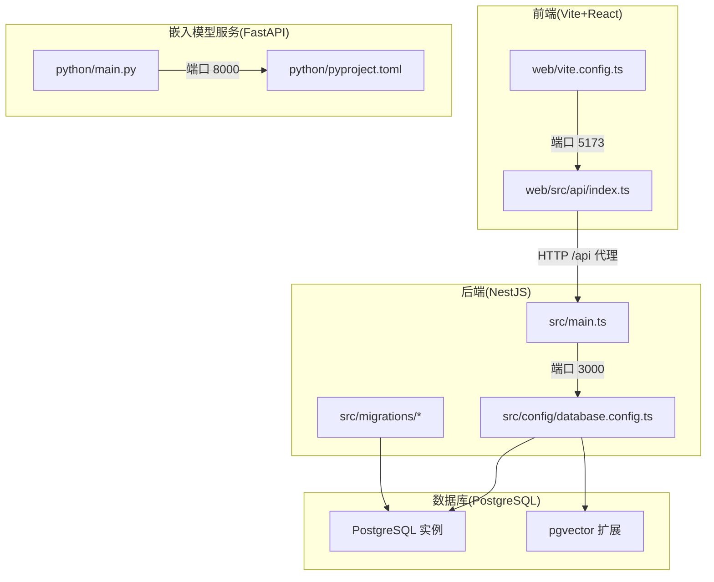
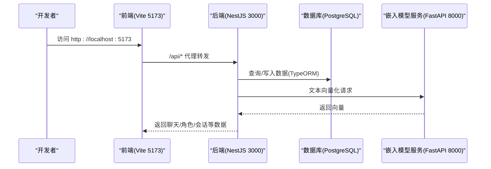
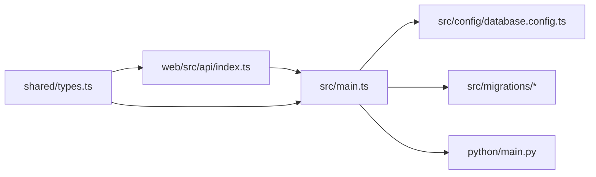

# 开发环境部署

<cite>
**本文引用的文件**
- [package.json](file://package.json)
- [tsconfig.json](file://tsconfig.json)
- [web/package.json](file://web/package.json)
- [web/tsconfig.json](file://web/tsconfig.json)
- [web/vite.config.ts](file://web/vite.config.ts)
- [src/main.ts](file://src/main.ts)
- [src/config/database.config.ts](file://src/config/database.config.ts)
- [src/migrations/1710000000000-init-pgvector-schema.ts](file://src/migrations/1710000000000-init-pgvector-schema.ts)
- [python/pyproject.toml](file://python/pyproject.toml)
- [python/main.py](file://python/main.py)
- [shared/types.ts](file://shared/types.ts)
- [web/src/api/index.ts](file://web/src/api/index.ts)
- [.prettierrc](file://.prettierrc)
- [start.bat](file://start.bat)
- [test_chat.js](file://test_chat.js)
</cite>

## 目录
1. [简介](#简介)
2. [项目结构](#项目结构)
3. [核心组件](#核心组件)
4. [架构总览](#架构总览)
5. [详细组件分析](#详细组件分析)
6. [依赖关系分析](#依赖关系分析)
7. [性能考虑](#性能考虑)
8. [故障排查指南](#故障排查指南)
9. [结论](#结论)
10. [附录](#附录)

## 简介
本文件面向首次参与 AI Companion 项目的开发者，提供从零开始的本地开发环境搭建与运行指南。内容覆盖 Node.js 与 TypeScript 版本要求、依赖安装、环境变量配置、开发服务器启动流程（含热重载、端口与代理）、IDE 推荐配置、数据库本地化部署（含 pgvector 扩展）、以及常见问题与调试技巧。目标是帮助你在最短时间内完成环境准备并成功运行后端、Web 前端、嵌入模型服务与数据库。

## 项目结构
该项目采用多模块组织方式：
- 后端（NestJS）：位于根目录，负责 API、业务逻辑与数据库交互。
- Web 前端（Vite + React）：位于 web/ 目录，通过代理访问后端 API。
- 嵌入模型服务（FastAPI + ONNX Runtime）：位于 python/ 目录，提供文本向量化能力。
- 共享类型定义：位于 shared/ 目录，前后端共享。
- 迁移脚本：位于 src/migrations/，管理数据库结构变更。

图表来源
- [src/main.ts:1-22](file://src/main.ts#L1-L22)
- [src/config/database.config.ts:1-22](file://src/config/database.config.ts#L1-L22)
- [web/vite.config.ts:1-44](file://web/vite.config.ts#L1-L44)
- [web/src/api/index.ts:1-212](file://web/src/api/index.ts#L1-L212)
- [python/main.py:1-123](file://python/main.py#L1-L123)
- [python/pyproject.toml:1-22](file://python/pyproject.toml#L1-L22)

章节来源
- [package.json:1-90](file://package.json#L1-L90)
- [tsconfig.json:1-30](file://tsconfig.json#L1-L30)
- [web/package.json:1-22](file://web/package.json#L1-L22)
- [web/tsconfig.json:1-21](file://web/tsconfig.json#L1-L21)

## 核心组件
- 后端应用入口与启动：负责监听端口、启用 CORS、输出服务地址。
- 数据库配置与迁移：基于 TypeORM 的 PostgreSQL 连接，自动执行迁移。
- 前端开发服务器：Vite 提供热重载与代理，转发 /api 到后端。
- 嵌入模型服务：FastAPI 提供单条与批量向量化接口，支持 mock 模式。
- 共享类型：统一前后端数据结构与错误类型定义。

章节来源
- [src/main.ts:1-22](file://src/main.ts#L1-L22)
- [src/config/database.config.ts:1-22](file://src/config/database.config.ts#L1-L22)
- [web/vite.config.ts:1-44](file://web/vite.config.ts#L1-L44)
- [python/main.py:1-123](file://python/main.py#L1-L123)
- [shared/types.ts:1-166](file://shared/types.ts#L1-L166)

## 架构总览
下图展示本地开发时各组件之间的交互关系与默认端口映射：

图表来源
- [web/vite.config.ts:12-20](file://web/vite.config.ts#L12-L20)
- [src/main.ts:15-16](file://src/main.ts#L15-L16)
- [src/config/database.config.ts:8-20](file://src/config/database.config.ts#L8-L20)
- [python/main.py:91-112](file://python/main.py#L91-L112)

## 详细组件分析

### 后端（NestJS）开发环境
- 启动命令与脚本
  - 开发模式：监听文件变化并重启。
  - 调试模式：启用断点调试。
  - 生产构建与运行：编译后运行 dist/main。
- 端口与 CORS
  - 默认监听端口来自环境变量，未设置则使用 3000。
  - 开发阶段启用 CORS，允许任意来源。
- 数据库连接
  - 通过环境变量配置主机、端口、用户名、密码、数据库名。
  - 自动加载 .env 并执行迁移。
- TypeScript 编译
  - 目标 ES2023，CommonJS 模块，开启装饰器与元数据发射。
  - 严格空值检查、禁止隐式 any 等严格选项。

章节来源
- [package.json:8-27](file://package.json#L8-L27)
- [src/main.ts:15-16](file://src/main.ts#L15-L16)
- [src/main.ts:9-13](file://src/main.ts#L9-L13)
- [src/config/database.config.ts:8-20](file://src/config/database.config.ts#L8-L20)
- [tsconfig.json:4-26](file://tsconfig.json#L4-L26)

### 前端（Vite + React）开发环境
- 启动与热重载
  - 开发服务器默认端口 5173，支持热更新。
- 代理配置
  - 将 /api 前缀转发至后端 3000 端口，便于本地联调。
- 构建优化
  - 使用 Terser 压缩、Rollup 分包策略、去除 console 与 debugger。
- TypeScript 配置
  - 目标 ES2023，严格模式，路径别名 @shared 指向 shared/。
- API 层
  - 通过 fetch 调用 /api/*，在开发模式下由 Vite 代理转发。

章节来源
- [web/vite.config.ts:6-20](file://web/vite.config.ts#L6-L20)
- [web/vite.config.ts:21-42](file://web/vite.config.ts#L21-L42)
- [web/tsconfig.json:4-18](file://web/tsconfig.json#L4-L18)
- [web/src/api/index.ts:30-52](file://web/src/api/index.ts#L30-L52)
- [web/src/api/index.ts:145-201](file://web/src/api/index.ts#L145-L201)

### 嵌入模型服务（FastAPI + ONNX Runtime）
- 启动方式
  - 使用 uvicorn 在 8000 端口启动。
  - 支持 --mock 参数或环境变量 MOCK_EMBEDDING=1，使用随机向量进行测试。
- API
  - POST /embed：单条文本向量化。
  - POST /batch_embed：批量向量化。
  - GET /health：健康检查。
- Python 依赖
  - Python 版本要求 >= 3.10。
  - 关键依赖：FastAPI、Uvicorn、ONNX Runtime、NumPy、Pydantic、tokenizers 等。

章节来源
- [python/main.py:7-18](file://python/main.py#L7-L18)
- [python/main.py:33-71](file://python/main.py#L33-L71)
- [python/main.py:91-123](file://python/main.py#L91-L123)
- [python/pyproject.toml:5-16](file://python/pyproject.toml#L5-L16)

### 数据库本地化部署（PostgreSQL + pgvector）
- 安装与启动
  - 使用 Docker 启动 PostgreSQL 容器，并确保端口映射与持久化卷配置正确。
- 扩展与迁移
  - 初始化时创建 vector 扩展与枚举类型。
  - 创建角色、会话、消息、记忆块等表，并建立索引。
  - 运行迁移以确保数据库结构与代码一致。
- 连接配置
  - 通过环境变量配置主机、端口、用户名、密码、数据库名。
  - 开发阶段可开启 SQL 日志以便调试。

章节来源
- [src/migrations/1710000000000-init-pgvector-schema.ts:6-93](file://src/migrations/1710000000000-init-pgvector-schema.ts#L6-L93)
- [src/config/database.config.ts:8-20](file://src/config/database.config.ts#L8-L20)

### 环境变量配置清单
- 数据库连接
  - DB_HOST、DB_PORT、DB_USER、DB_PASSWORD、DB_NAME
  - DB_LOGGING：是否输出 SQL 日志（true/false）
- 嵌入模型服务
  - MOCK_EMBEDDING：1 表示使用 mock 模式
- 后端端口
  - PORT：后端监听端口，默认 3000
- 前端代理
  - Vite 默认代理目标为 http://localhost:3000（无需手动设置）

章节来源
- [src/config/database.config.ts:10-19](file://src/config/database.config.ts#L10-L19)
- [src/main.ts:15-16](file://src/main.ts#L15-L16)
- [python/main.py:35-35](file://python/main.py#L35-L35)
- [web/vite.config.ts:14-19](file://web/vite.config.ts#L14-L19)

### 开发服务器启动流程
- 启动顺序建议
  - 终端1：启动数据库容器（如 Docker）。
  - 终端2：进入 python 目录，启动嵌入模型服务（默认 8000）。
  - 终端3：回到项目根目录，运行后端开发模式。
  - 终端4：进入 web 目录，启动前端开发服务器（默认 5173）。
- 端口映射
  - 后端：3000
  - 嵌入模型服务：8000
  - 前端：5173
- 代理设置
  - 前端代理将 /api 转发至后端 3000 端口，避免跨域问题。

章节来源
- [start.bat:6-18](file://start.bat#L6-L18)
- [web/vite.config.ts:12-20](file://web/vite.config.ts#L12-L20)
- [src/main.ts:15-16](file://src/main.ts#L15-L16)
- [python/main.py:8-13](file://python/main.py#L8-L13)

### IDE 配置指南（VS Code）
- 推荐插件
  - ESLint、Prettier、TypeScript Importer、DotENV、REST Client
- 调试配置
  - 后端：使用 VS Code 调试配置启动 NestJS 开发模式，支持断点与热重载。
  - 嵌入模型服务：使用 Python 调试配置启动 uvicorn。
  - 前端：使用浏览器调试器或 VS Code Live Server 预览。
- 代码格式化
  - 使用 Prettier 规则：单引号、尾逗号。
  - ESLint 与 TypeScript 配合，保持代码风格一致。

章节来源
- [.prettierrc:1-5](file://.prettierrc#L1-L5)
- [package.json:47-71](file://package.json#L47-L71)
- [web/package.json:14-21](file://web/package.json#L14-L21)

### 依赖安装与编译配置
- Node.js 与 TypeScript
  - 后端：TypeScript 5.7.x，目标 ES2023，CommonJS。
  - 前端：TypeScript ~5.7.0，目标 ES2023，ESNext 模块解析。
- 依赖安装
  - 根目录：安装 NestJS、TypeORM、PostgreSQL 驱动、WS 等。
  - web 目录：安装 Vite、React、React-DOM、React 插件。
  - python 目录：使用 uv/pip 安装 FastAPI、Uvicorn、ONNX Runtime 等。
- 编译与构建
  - 后端：nest build 生成 dist。
  - 前端：tsc -b 与 vite build。
  - 嵌入模型服务：uv run uvicorn 启动。

章节来源
- [package.json:29-46](file://package.json#L29-L46)
- [package.json:47-71](file://package.json#L47-L71)
- [web/package.json:10-21](file://web/package.json#L10-L21)
- [web/tsconfig.json:4-18](file://web/tsconfig.json#L4-L18)
- [tsconfig.json:4-26](file://tsconfig.json#L4-L26)
- [python/pyproject.toml:5-16](file://python/pyproject.toml#L5-L16)

## 依赖关系分析
- 后端对数据库的依赖：TypeORM 连接 PostgreSQL，迁移脚本确保结构一致。
- 前端对后端的依赖：通过 /api 代理访问后端接口。
- 嵌入模型服务独立于后端，但后端在需要时调用其接口。
- 共享类型：前后端共享类型定义，减少耦合与重复。

图表来源
- [web/src/api/index.ts:30-52](file://web/src/api/index.ts#L30-L52)
- [src/main.ts:1-22](file://src/main.ts#L1-L22)
- [src/config/database.config.ts:1-22](file://src/config/database.config.ts#L1-L22)
- [src/migrations/1710000000000-init-pgvector-schema.ts:1-107](file://src/migrations/1710000000000-init-pgvector-schema.ts#L1-L107)
- [python/main.py:91-112](file://python/main.py#L91-L112)
- [shared/types.ts:1-166](file://shared/types.ts#L1-L166)

## 性能考虑
- 前端构建优化：Terser 压缩、Rollup 分包、移除调试语句，提升生产性能。
- 数据库索引：迁移脚本已创建 HNSW 向量索引，提升相似度检索效率。
- 严格编译选项：TypeScript 严格模式有助于早期发现潜在性能与安全问题。
- 嵌入模型 mock：开发阶段使用 mock 可快速验证流程，避免等待模型下载。

章节来源
- [web/vite.config.ts:27-42](file://web/vite.config.ts#L27-L42)
- [src/migrations/1710000000000-init-pgvector-schema.ts:90-92](file://src/migrations/1710000000000-init-pgvector-schema.ts#L90-L92)
- [tsconfig.json:21-25](file://tsconfig.json#L21-L25)
- [python/main.py:35-51](file://python/main.py#L35-L51)

## 故障排查指南
- 启动顺序错误
  - 症状：前端无法访问 /api。
  - 处理：确认后端已在 3000 端口运行，且 Vite 代理指向该端口。
- 数据库连接失败
  - 症状：TypeORM 报连接错误。
  - 处理：检查 DB_HOST/DB_PORT/DB_USER/DB_PASSWORD/DB_NAME 是否正确，确认数据库已启动并接受连接。
- pgvector 扩展缺失
  - 症状：迁移时报错找不到 vector 扩展。
  - 处理：在数据库中手动创建扩展或确保迁移脚本已执行。
- 嵌入模型服务未启动
  - 症状：后端调用 /embed 失败。
  - 处理：确认嵌入模型服务在 8000 端口运行；若模型未下载，使用 MOCK_EMBEDDING=1 启动。
- 端口冲突
  - 症状：端口占用导致启动失败。
  - 处理：修改 PORT、DB_PORT 或停止占用进程。
- 跨域问题
  - 症状：浏览器控制台报跨域错误。
  - 处理：确认后端已启用 CORS，前端代理已正确转发 /api。
- 代码格式化与 Lint
  - 症状：编辑器提示格式或规则问题。
  - 处理：执行 npm run format 与 npm run lint，确保 Prettier 与 ESLint 配置生效。

章节来源
- [web/vite.config.ts:12-20](file://web/vite.config.ts#L12-L20)
- [src/config/database.config.ts:10-19](file://src/config/database.config.ts#L10-L19)
- [src/migrations/1710000000000-init-pgvector-schema.ts:7-7](file://src/migrations/1710000000000-init-pgvector-schema.ts#L7-L7)
- [python/main.py:64-70](file://python/main.py#L64-L70)
- [package.json:12-18](file://package.json#L12-L18)

## 结论
通过以上步骤，你可以在本地成功搭建并运行 AI Companion 的完整开发环境：后端、前端、嵌入模型服务与数据库协同工作。建议在开发初期使用 mock 模式验证流程，随后再接入真实模型与数据库。遇到问题时，优先检查启动顺序、端口占用与代理配置，再逐步定位到数据库与模型服务的具体问题。

## 附录

### 快速启动脚本参考
- Windows 用户可参考提供的批处理脚本，按顺序启动数据库、嵌入模型服务、后端与前端。

章节来源
- [start.bat:1-21](file://start.bat#L1-L21)

### 测试脚本参考
- 提供了简单的聊天测试脚本，可用于验证后端 API 与前端交互是否正常。

章节来源
- [test_chat.js](file://test_chat.js)