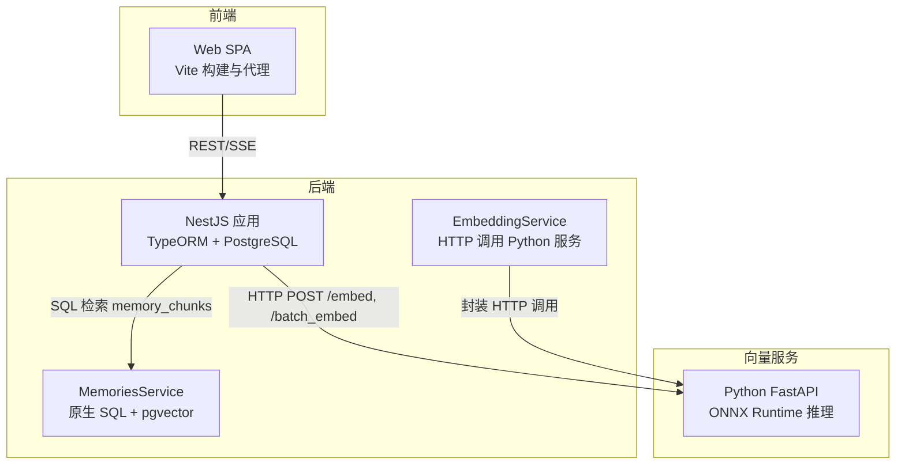
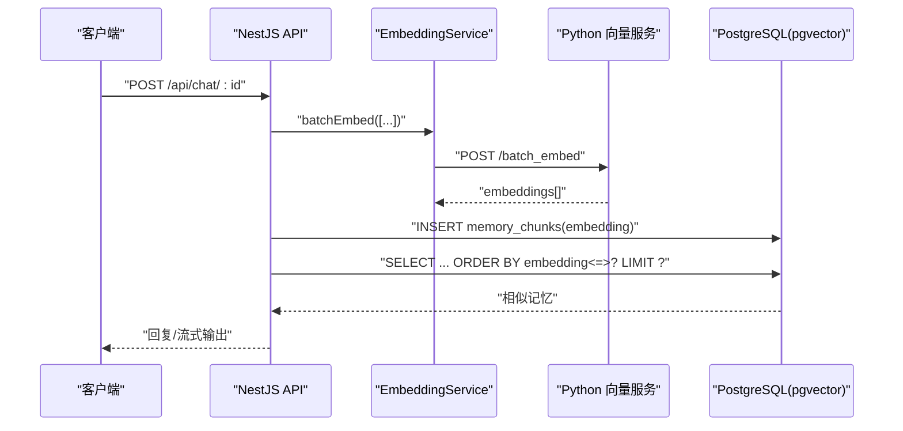
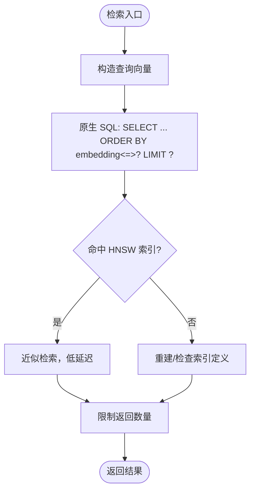
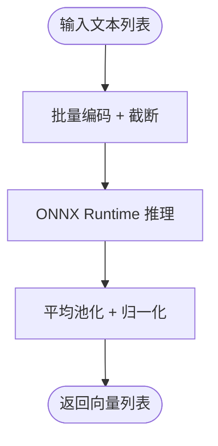
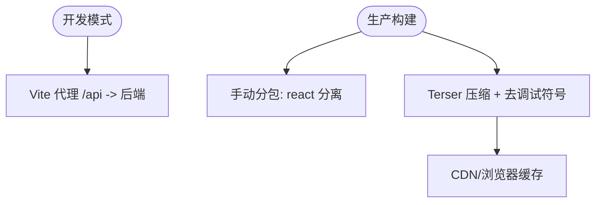
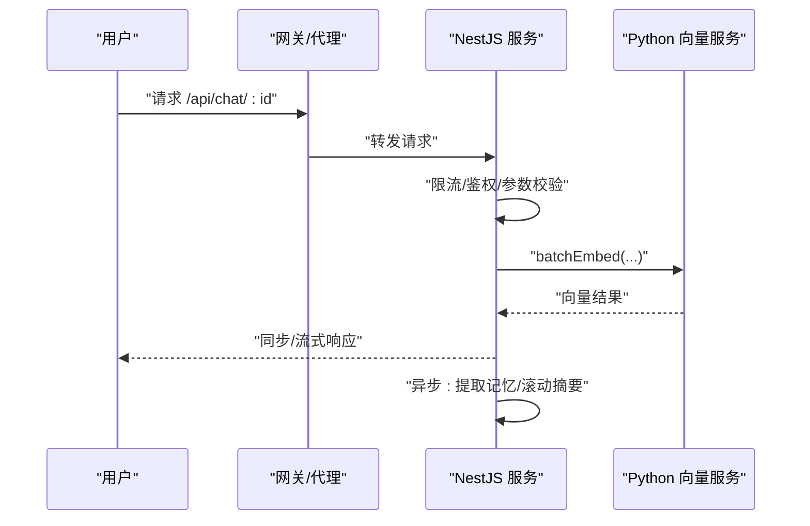
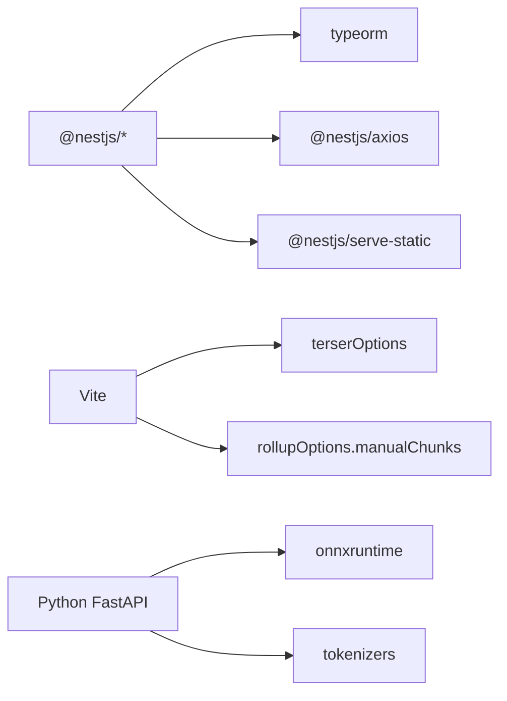

# 性能优化

<cite>
**本文引用的文件**
- [src/app.module.ts](file://src/app.module.ts)
- [src/config/database.config.ts](file://src/config/database.config.ts)
- [src/migrations/1710000000000-init-pgvector-schema.ts](file://src/migrations/1710000000000-init-pgvector-schema.ts)
- [src/embedding/embedding.service.ts](file://src/embedding/embedding.service.ts)
- [src/memories/memories.service.ts](file://src/memories/memories.service.ts)
- [python/embedder.py](file://python/embedder.py)
- [python/pyproject.toml](file://python/pyproject.toml)
- [web/vite.config.ts](file://web/vite.config.ts)
- [web/src/api/index.ts](file://web/src/api/index.ts)
- [package.json](file://package.json)
- [docs/Learning_Notes.md](file://docs/Learning_Notes.md)
- [docs/AI_Companion_最终方案.md](file://docs/AI_Companion_最终方案.md)
</cite>

## 目录
1. [简介](#简介)
2. [项目结构](#项目结构)
3. [核心组件](#核心组件)
4. [架构总览](#架构总览)
5. [详细组件分析](#详细组件分析)
6. [依赖分析](#依赖分析)
7. [性能考虑](#性能考虑)
8. [故障排查指南](#故障排查指南)
9. [结论](#结论)
10. [附录](#附录)

## 简介
本文件面向“AI Companion”项目的性能优化，覆盖数据库、Python 向量嵌入服务、前端、API、系统资源与监控等方面。目标是在保证功能正确性的前提下，最大化吞吐、降低延迟、减少资源占用，并提供可落地的优化建议与基准测试方法。

## 项目结构
项目采用前后端分离与微服务化的思路：
- 后端（NestJS）：TypeORM 连接 PostgreSQL，提供 REST API；向量检索由 pgvector 索引完成。
- 向量服务（Python FastAPI + ONNX Runtime）：独立进程，负责文本向量化。
- 前端（React/Vite）：SPA，构建时进行代码分割与压缩，开发时通过代理联调。

图表来源
- [src/app.module.ts:18-62](file://src/app.module.ts#L18-L62)
- [src/embedding/embedding.service.ts:13-83](file://src/embedding/embedding.service.ts#L13-L83)
- [src/memories/memories.service.ts:42-88](file://src/memories/memories.service.ts#L42-L88)
- [python/embedder.py:31-116](file://python/embedder.py#L31-L116)

章节来源
- [src/app.module.ts:18-62](file://src/app.module.ts#L18-L62)
- [web/vite.config.ts:1-44](file://web/vite.config.ts#L1-44)

## 核心组件
- 数据库与迁移：PostgreSQL + pgvector 扩展，迁移脚本初始化向量索引。
- 向量服务：Python FastAPI + ONNX Runtime，提供单条/批量向量接口。
- 嵌入服务封装：NestJS 通过 HTTP 调用 Python 服务，统一超时与健康检查。
- 记忆检索：原生 SQL 使用向量运算符与 HNSW 索引进行相似度检索。
- 前端：Vite 构建配置开启压缩、去调试符号与手动分包。

章节来源
- [src/config/database.config.ts:8-20](file://src/config/database.config.ts#L8-L20)
- [src/migrations/1710000000000-init-pgvector-schema.ts:6-106](file://src/migrations/1710000000000-init-pgvector-schema.ts#L6-L106)
- [src/embedding/embedding.service.ts:13-83](file://src/embedding/embedding.service.ts#L13-L83)
- [src/memories/memories.service.ts:42-88](file://src/memories/memories.service.ts#L42-L88)
- [web/vite.config.ts:21-42](file://web/vite.config.ts#L21-L42)

## 架构总览
整体数据流：前端发起请求 → 后端处理 → 调用 Python 向量服务 → 写入/检索 pgvector → 返回结果。

图表来源
- [src/embedding/embedding.service.ts:56-65](file://src/embedding/embedding.service.ts#L56-L65)
- [src/memories/memories.service.ts:42-59](file://src/memories/memories.service.ts#L42-L59)
- [python/embedder.py:107-116](file://python/embedder.py#L107-L116)

## 详细组件分析

### 数据库性能优化
- 索引策略
  - 会话级时间索引：messages 与 memory_chunks 均按 session_id + created_at 建立复合索引，便于按会话快速扫描。
  - 向量索引：memory_chunks.embedding 使用 HNSW（cosine 距离），支持近似最近邻检索。
- 查询优化
  - 相似度检索使用向量运算符与 ORDER BY 排序，限制 LIMIT，避免全表扫描。
  - 写入时将向量序列化为字符串传参，避免 ORM 类型映射问题。
- 连接池与配置
  - TypeORM 默认未显式配置连接池参数；生产环境建议结合数据库驱动与连接数评估，设置合适的连接上限与空闲回收策略。
- 迁移与扩展
  - 迁移脚本统一创建扩展与表结构，确保向量列与索引一致性。

图表来源
- [src/memories/memories.service.ts:42-59](file://src/memories/memories.service.ts#L42-L59)
- [src/migrations/1710000000000-init-pgvector-schema.ts:84-92](file://src/migrations/1710000000000-init-pgvector-schema.ts#L84-L92)

章节来源
- [src/migrations/1710000000000-init-pgvector-schema.ts:84-92](file://src/migrations/1710000000000-init-pgvector-schema.ts#L84-L92)
- [src/memories/memories.service.ts:42-59](file://src/memories/memories.service.ts#L42-L59)
- [src/config/database.config.ts:8-20](file://src/config/database.config.ts#L8-L20)

### Python 向量嵌入服务性能调优
- 批处理优化
  - 提供 batch_embed 接口，将多条文本一次性送入 ONNX Runtime，利用模型内部并行与批处理能力，显著降低单次调用开销。
- 内存管理
  - 使用 Tokenizer 批量编码，动态截断至最大长度，避免过长输入导致内存峰值过高。
  - ONNX Runtime 会话仅初始化一次，复用计算图与内存。
- 并发处理
  - 建议在 Python 侧引入进程池或线程池，对不同批次进行并发调度；同时在上游（NestJS）控制并发请求数，避免阻塞。
- 超时与健壮性
  - 嵌入服务封装设置了单条 10 秒、批量 30 秒超时，避免下游卡顿影响主链路。

图表来源
- [python/embedder.py:71-116](file://python/embedder.py#L71-L116)
- [src/embedding/embedding.service.ts:56-65](file://src/embedding/embedding.service.ts#L56-L65)

章节来源
- [python/embedder.py:31-116](file://python/embedder.py#L31-L116)
- [src/embedding/embedding.service.ts:13-83](file://src/embedding/embedding.service.ts#L13-L83)

### 前端性能优化
- 代码分割
  - Vite 配置将 react/react-dom 打包为独立 chunk，减少首屏依赖体积。
- 资源压缩
  - 启用 Terser 压缩、去除 console 与 debugger、启用 CSS 压缩与混淆。
- 缓存策略
  - 生产部署建议开启浏览器缓存与 CDN 缓存；静态资源带长效期标签。
- 代理与联调
  - 开发阶段通过 Vite 代理转发 /api 到后端，避免跨域与 CORS 复杂配置。

图表来源
- [web/vite.config.ts:12-42](file://web/vite.config.ts#L12-L42)
- [web/src/api/index.ts:30-32](file://web/src/api/index.ts#L30-L32)

章节来源
- [web/vite.config.ts:1-44](file://web/vite.config.ts#L1-L44)
- [web/src/api/index.ts:1-212](file://web/src/api/index.ts#L1-L212)

### API 性能优化
- 请求限流
  - 在网关或反向代理层实施基于 IP/Key 的限流；后端可结合速率限制中间件。
- 缓存策略
  - 对热点检索结果与嵌入结果进行短期缓存（如 Redis），降低重复计算与数据库压力。
- 异步处理
  - 记忆提取与滚动摘要采用异步延后执行，避免阻塞主响应链路。
- 健康检查
  - 嵌入服务提供健康检查接口，便于自动摘除不健康实例。

图表来源
- [src/embedding/embedding.service.ts:70-82](file://src/embedding/embedding.service.ts#L70-L82)
- [docs/Learning_Notes.md:1157-1183](file://docs/Learning_Notes.md#L1157-L1183)

章节来源
- [src/embedding/embedding.service.ts:13-83](file://src/embedding/embedding.service.ts#L13-L83)
- [docs/Learning_Notes.md:1157-1183](file://docs/Learning_Notes.md#L1157-L1183)

### 系统资源优化
- CPU 利用率
  - Python 侧可启用多进程/多线程批处理；NestJS 侧合理设置并发阈值，避免过多并发导致上下文切换开销。
- 内存使用
  - 控制单次批大小与最大长度，避免一次性加载大量文本；及时释放临时数组与张量。
- 磁盘 I/O
  - 减少不必要的日志与调试输出；对模型文件与日志目录进行容量规划与清理策略。

章节来源
- [python/embedder.py:28](file://python/embedder.py#L28)
- [python/embedder.py:54-70](file://python/embedder.py#L54-L70)
- [src/config/database.config.ts:19](file://src/config/database.config.ts#L19)

## 依赖分析
- 后端依赖
  - TypeORM + PostgreSQL 驱动；Axios 作为 HTTP 客户端；ServeStatic 提供静态资源。
- 前端依赖
  - React + Vite；打包工具链包含 Terser、Rollup 插件等。
- 向量服务依赖
  - FastAPI + ONNX Runtime + tokenizers；模型与分词器文件需预下载。

图表来源
- [package.json:29-46](file://package.json#L29-L46)
- [web/vite.config.ts:27-41](file://web/vite.config.ts#L27-L41)
- [python/pyproject.toml:6-16](file://python/pyproject.toml#L6-L16)

章节来源
- [package.json:1-90](file://package.json#L1-L90)
- [web/vite.config.ts:1-44](file://web/vite.config.ts#L1-L44)
- [python/pyproject.toml:1-22](file://python/pyproject.toml#L1-L22)

## 性能考虑
- 数据库
  - HNSW 参数（如 m、ef_construction）需结合数据规模与精度需求调优；定期统计与分析慢查询。
  - 事务批量写入，减少往返次数；必要时使用 COPY/批量插入。
- 向量服务
  - 批大小自适应：根据 GPU/CPU 资源与延迟目标动态调整；对长文本进行分段嵌入。
  - 模型优化：使用更小的模型或量化版本；在 Python 侧启用多进程池。
- 前端
  - 预加载关键资源；对非关键路由进行懒加载；启用 Gzip/Brotli 压缩。
- API
  - 对高频接口增加缓存层；对流式响应进行背压控制；对异常请求快速失败。
- 系统
  - 监控 CPU/内存/磁盘/网络；设置告警阈值；对热点接口进行限流与熔断。

## 故障排查指南
- 嵌入服务不可用
  - 检查 PYTHON_EMBED_URL 是否正确；确认健康检查接口返回状态；查看嵌入服务日志。
- 检索缓慢
  - 确认 HNSW 索引是否存在且未损坏；检查 LIMIT 与排序是否命中索引；分析慢查询日志。
- 前端白屏或加载慢
  - 检查构建产物与缓存；确认代理配置；排查网络与 CDN。
- 数据库连接问题
  - 检查 TypeORM 配置与 .env；确认数据库可达与凭据正确。

章节来源
- [src/embedding/embedding.service.ts:70-82](file://src/embedding/embedding.service.ts#L70-L82)
- [src/migrations/1710000000000-init-pgvector-schema.ts:84-92](file://src/migrations/1710000000000-init-pgvector-schema.ts#L84-L92)
- [web/vite.config.ts:12-20](file://web/vite.config.ts#L12-L20)
- [src/config/database.config.ts:8-20](file://src/config/database.config.ts#L8-L20)

## 结论
通过合理的数据库索引设计、向量服务批处理与并发控制、前端构建优化以及 API 缓存与异步处理策略，可在保证用户体验的同时显著提升系统整体性能。建议在生产环境中持续监控关键指标并迭代优化参数。

## 附录

### 性能监控指标
- 后端
  - QPS、P95/P99 延迟、错误率、并发连接数、GC 次数与暂停时间。
- 数据库
  - 活跃连接数、索引扫描比例、慢查询数量、缓冲区命中率。
- 向量服务
  - 推理耗时分布、批大小、GPU/CPU 利用率、内存峰值。
- 前端
  - 首屏时间、交互时间、缓存命中率、传输体积。

### 基准测试方法
- 数据库
  - 使用 pgbench 或自定义脚本模拟高并发检索与写入，逐步提高负载，观察延迟与错误率拐点。
- 向量服务
  - 固定批大小与输入长度，测量吞吐与延迟；对比不同模型/硬件配置。
- API
  - 使用 wrk/JMeter 等工具对关键接口施压，关注响应时间与错误率。
- 前端
  - 使用 Lighthouse/Chrome DevTools 分析首屏与交互性能；对比不同缓存策略。

章节来源
- [docs/Learning_Notes.md:1116-1129](file://docs/Learning_Notes.md#L1116-L1129)
- [docs/AI_Companion_最终方案.md:284-313](file://docs/AI_Companion_最终方案.md#L284-L313)