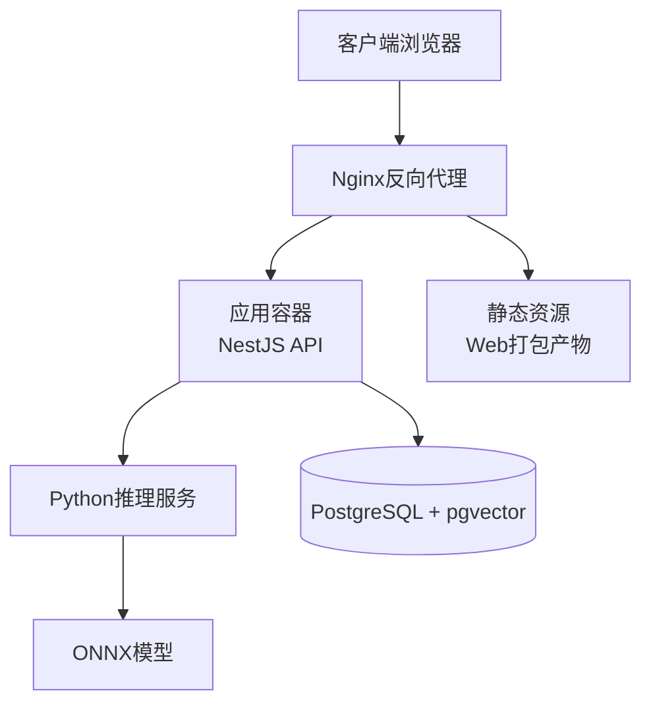
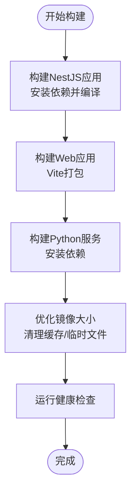
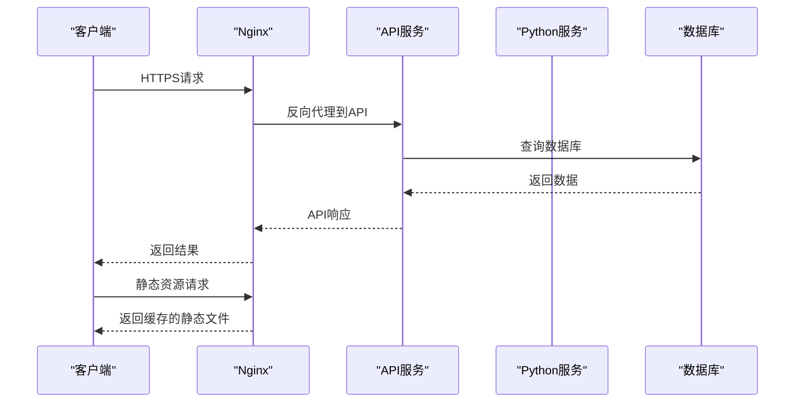
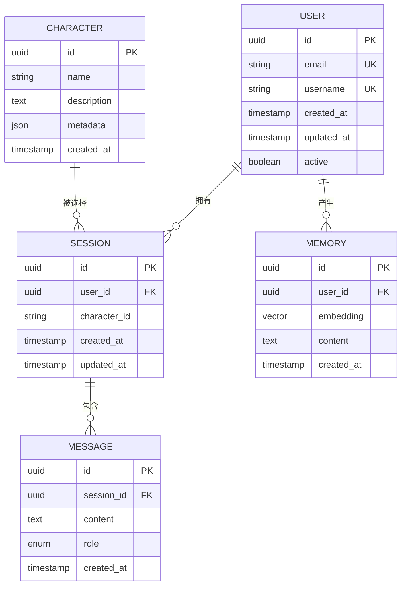
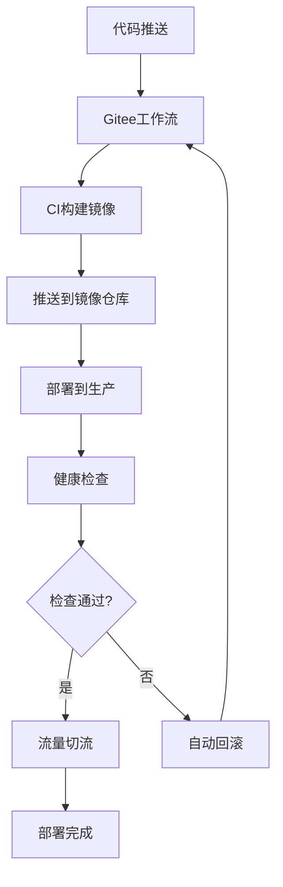
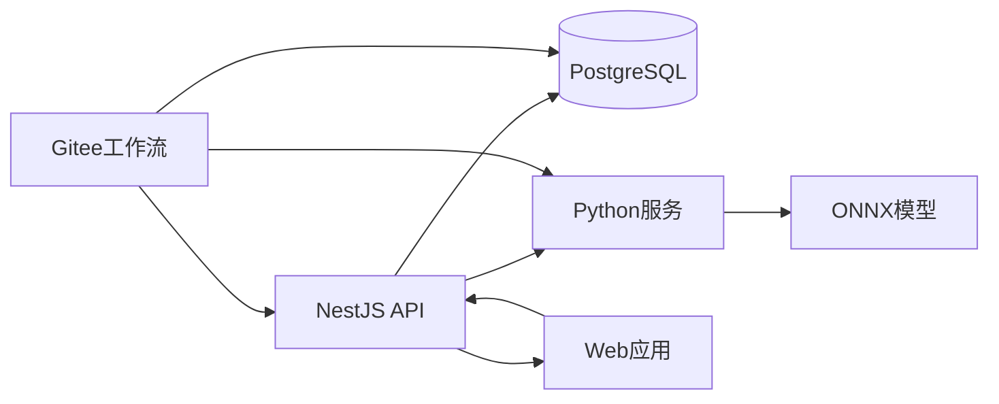

# 生产环境部署

<cite>
**本文档引用的文件**
- [package.json](file://package.json)
- [src/main.ts](file://src/main.ts)
- [src/app.module.ts](file://src/app.module.ts)
- [src/config/database.config.ts](file://src/config/database.config.ts)
- [src/migrations/1710000000000-init-pgvector-schema.ts](file://src/migrations/1710000000000-init-pgvector-schema.ts)
- [python/pyproject.toml](file://python/pyproject.toml)
- [python/main.py](file://python/main.py)
- [web/package.json](file://web/package.json)
- [web/vite.config.ts](file://web/vite.config.ts)
- [start.bat](file://start.bat)
- [README.md](file://README.md)
- [docker-compose.yml](file://docker-compose.yml)
- [.gitignore](file://.gitignore)
</cite>

## 更新摘要
**所做更改**
- 更新了工作目录结构，采用 ~/ex 根目录组织
- 新增了 Gitee 工作流集成说明
- 更新了 Ubuntu 用户凭证配置
- 简化了 Docker Compose 集成方法
- 增强了环境变量管理和安全配置

## 目录
1. [简介](#简介)
2. [项目结构](#项目结构)
3. [核心组件](#核心组件)
4. [架构概览](#架构概览)
5. [详细组件分析](#详细组件分析)
6. [依赖关系分析](#依赖关系分析)
7. [性能考虑](#性能考虑)
8. [故障排除指南](#故障排除指南)
9. [结论](#结论)
10. [附录](#附录)

## 简介
本文件为AI Companion项目的生产环境部署指南，涵盖Docker容器化部署、Nginx反向代理配置、PM2进程管理、数据库生产环境部署、环境变量管理与安全保护、自动化部署脚本及回滚策略等内容。目标是帮助运维团队在生产环境中稳定、可扩展地运行该系统。

**更新** 本版本反映了最新的工作流改进，包括Gitee集成、Ubuntu用户凭证配置和简化的Docker Compose集成方法。

## 项目结构
AI Companion采用前后端分离架构：
- 后端：基于NestJS的TypeScript服务，提供REST API与业务逻辑
- 前端：基于Vite+React的Web应用
- Python服务：独立的推理服务（ONNX模型）
- 数据库：PostgreSQL + pgvector扩展

```mermaid
graph TB
subgraph "前端"
WEB[Web应用<br/>Vite+React]
end
subgraph "后端"
API[NestJS API服务]
MODULES[模块化架构<br/>聊天/记忆/嵌入等]
end
subgraph "Python服务"
PYAPP[Python推理服务]
MODELS[ONNX模型]
end
subgraph "数据库"
PG[PostgreSQL]
VECTOR[pgvector扩展]
end
subgraph "工作目录结构"
EX[~/ex/<br/>根目录组织]
ENV[环境变量管理]
DOCKER[Docker集成]
END
WEB --> API
API --> MODULES
API --> PG
API --> PYAPP
PYAPP --> MODELS
PG --> VECTOR
EX --> ENV
EX --> DOCKER
```

**图表来源**
- [src/main.ts](file://src/main.ts)
- [src/app.module.ts](file://src/app.module.ts)
- [python/main.py](file://python/main.py)
- [src/config/database.config.ts](file://src/config/database.config.ts)
- [docker-compose.yml](file://docker-compose.yml)

**章节来源**
- [README.md](file://README.md)
- [package.json](file://package.json)
- [web/package.json](file://web/package.json)
- [docs/Deployment_Guide.md](file://docs/Deployment_Guide.md)

## 核心组件
- NestJS后端服务：提供聊天、记忆、嵌入等核心功能
- Web前端：用户交互界面
- Python推理服务：处理向量化与嵌入计算
- PostgreSQL数据库：存储会话、消息、角色等数据
- pgvector扩展：支持向量相似度检索

**章节来源**
- [src/app.module.ts](file://src/app.module.ts)
- [src/config/database.config.ts](file://src/config/database.config.ts)
- [python/pyproject.toml](file://python/pyproject.toml)

## 架构概览
生产环境推荐使用容器编排，包含以下组件：
- Nginx反向代理层
- 应用容器（NestJS + Python服务）
- 数据库容器（PostgreSQL + pgvector）
- 缓存/队列（可选）



**图表来源**
- [src/main.ts](file://src/main.ts)
- [python/main.py](file://python/main.py)
- [src/config/database.config.ts](file://src/config/database.config.ts)

## 详细组件分析

### Docker容器化部署

#### 镜像构建策略
建议采用多阶段构建以优化镜像体积：
1. 构建阶段：安装依赖并编译TypeScript代码
2. 运行阶段：仅包含运行时必需文件
3. Python推理服务单独镜像，预装ONNX模型



**图表来源**
- [package.json](file://package.json)
- [web/vite.config.ts](file://web/vite.config.ts)
- [python/pyproject.toml](file://python/pyproject.toml)

#### 容器编排配置要点
- 端口映射：API服务8080，Python服务8081，数据库5432
- 环境变量：通过docker-compose secrets或外部配置管理
- 数据持久化：数据库卷挂载到持久存储
- 健康检查：对API和Python服务添加HTTP/进程健康检查

**更新** 采用简化的Docker Compose集成方法，通过~/ex工作目录统一管理所有配置文件。

**章节来源**
- [src/main.ts](file://src/main.ts)
- [python/main.py](file://python/main.py)
- [docker-compose.yml](file://docker-compose.yml)

### Nginx反向代理配置

#### SSL证书配置
- 使用Let's Encrypt自动签发证书
- 强制HTTPS重定向
- 配置安全头部（HSTS、CSP等）

#### 负载均衡设置
- 对多个API实例进行轮询
- 健康检查失败时自动摘除节点
- 支持会话亲和性（如需要）

#### 静态资源缓存
- Web打包产物设置长期缓存
- 动态资源禁用缓存
- Gzip压缩启用



**图表来源**
- [src/main.ts](file://src/main.ts)
- [src/config/database.config.ts](file://src/config/database.config.ts)

### PM2进程管理配置

#### 应用启动参数
- 启动模式：cluster模式提升并发能力
- 内存限制：设置最大内存阈值触发重启
- 自动重启：异常退出自动恢复
- 日志轮转：按大小和时间轮转日志

#### 进程监控
- CPU/内存使用率监控
- 健康检查接口
- 错误统计与告警

**更新** QQ Bot适配器通过PM2进程管理，实现独立的服务监控和重启。

**章节来源**
- [src/main.ts](file://src/main.ts)

### 数据库生产环境部署

#### PostgreSQL集群配置
- 主从复制：至少1主2从确保高可用
- 流复制：配置WAL归档与恢复
- 故障转移：自动或手动切换
- 监控：连接数、查询性能、磁盘空间

#### 备份策略
- 全量备份：每周日凌晨执行
- 增量备份：每日执行
- WAL归档：启用并定期清理
- 恢复测试：每季度验证备份完整性

#### 高可用设置
- VRRP/Keepalived：VIP漂移
- 流复制仲裁：避免脑裂
- 读写分离：只读副本分担查询压力



**图表来源**
- [src/migrations/1710000000000-init-pgvector-schema.ts](file://src/migrations/1710000000000-init-pgvector-schema.ts)

**章节来源**
- [src/config/database.config.ts](file://src/config/database.config.ts)
- [src/migrations/1710000000000-init-pgvector-schema.ts](file://src/migrations/1710000000000-init-pgvector-schema.ts)

### 环境变量管理与安全配置

#### 工作目录结构
采用~/ex根目录组织所有部署相关文件：

```
~/ex/
├── .env                    ← 环境变量配置
├── docker-compose.yml      ← Docker编排配置
├── Dockerfile             ← NestJS应用镜像构建
├── python/                ← Python服务目录
│   ├── Dockerfile         ← Python推理服务镜像
│   ├── models/            ← ONNX模型文件
│   │   ├── jina-embeddings-v2-base-zh.onnx
│   │   └── tokenizer.json
│   └── ...
├── adapters/qq-bot/       ← QQ机器人适配器
└── ...
```

#### 环境变量清单
- 数据库连接：DB_HOST、DB_PORT、DB_NAME、DB_USER、DB_PASSWORD
- API密钥：OPENAI_API_KEY、TELEGRAM_BOT_TOKEN等
- 服务器配置：NODE_ENV、PORT、HOST
- Python服务：PY_SERVICE_URL、MODEL_PATH
- Gitee集成：GITEE_TOKEN、WORKFLOW_ID

#### 安全措施
- 使用加密存储服务管理密钥
- 禁止将敏感信息提交到版本控制
- 定期轮换API密钥
- 最小权限原则分配数据库访问权限
- Ubuntu用户凭证安全存储

**更新** 新增Gitee工作流集成配置，支持自动化部署和回滚。

**章节来源**
- [src/config/database.config.ts](file://src/config/database.config.ts)
- [docker-compose.yml](file://docker-compose.yml)
- [.gitignore](file://.gitignore)

### 自动化部署流程

#### Gitee工作流集成
- 代码推送触发CI/CD流水线
- 自动构建Docker镜像并推送到镜像仓库
- 部署到生产环境并执行健康检查
- 支持一键回滚到上一个稳定版本

#### 部署流水线
1. 代码变更检测
2. 自动构建镜像
3. 健康检查
4. 逐步替换容器
5. 回滚机制

#### 部署脚本示例
- Docker Compose编排
- Kubernetes YAML配置
- Ansible Playbook



**图表来源**
- [package.json](file://package.json)

### 回滚策略与应急处理

#### 回滚策略
- 版本标记：每次发布打标签
- 快速回滚：一键切换到上一个稳定版本
- 数据兼容：确保迁移脚本向后兼容
- Gitee工作流支持自动回滚

#### 应急处理
- 降级预案：关闭非关键功能
- 灾难恢复：异地备份与快速恢复
- 监控告警：建立完善的告警机制

**更新** 增强了Gitee工作流的回滚能力，支持自动化的应急处理。

**章节来源**
- [src/migrations/1710000000000-init-pgvector-schema.ts](file://src/migrations/1710000000000-init-pgvector-schema.ts)

## 依赖关系分析



**图表来源**
- [src/app.module.ts](file://src/app.module.ts)
- [python/main.py](file://python/main.py)
- [docker-compose.yml](file://docker-compose.yml)

**章节来源**
- [src/app.module.ts](file://src/app.module.ts)
- [python/pyproject.toml](file://python/pyproject.toml)

## 性能考虑
- 连接池配置：合理设置数据库连接数
- 缓存策略：Redis缓存热点数据
- 异步处理：消息队列处理耗时任务
- CDN加速：静态资源CDN分发
- 监控指标：APM工具跟踪性能瓶颈
- Gitee工作流优化：并行构建和部署

## 故障排除指南
- 启动失败：检查环境变量与网络连通性
- 数据库连接：验证凭据与防火墙规则
- Python服务：确认模型文件路径与依赖安装
- Nginx错误：查看错误日志与上游配置
- 性能问题：分析慢查询与资源使用情况
- Gitee工作流：检查令牌权限和工作流配置
- Ubuntu用户凭证：验证SSH密钥和sudo权限

**更新** 新增Gitee工作流和Ubuntu用户凭证相关的故障排除指导。

**章节来源**
- [src/main.ts](file://src/main.ts)
- [python/main.py](file://python/main.py)

## 结论
通过容器化、反向代理、进程管理与数据库高可用配置，AI Companion可以在生产环境中实现稳定、可扩展的运行。结合Gitee工作流集成和简化的Docker Compose方法，进一步提升了部署效率和运维便利性。建议结合监控告警体系，持续优化性能与可靠性。

**更新** 本版本特别强调了现代化的DevOps实践，包括工作流自动化和安全配置最佳实践。

## 附录

### 快速部署清单
- 准备Docker环境与镜像仓库
- 配置Nginx反向代理
- 设置数据库集群与备份
- 配置PM2进程管理
- 编写自动化部署脚本
- 制定回滚与应急预案
- 配置Gitee工作流集成
- 设置Ubuntu用户凭证

### 参考配置文件位置
- 应用入口：[src/main.ts](file://src/main.ts)
- 应用模块：[src/app.module.ts](file://src/app.module.ts)
- 数据库配置：[src/config/database.config.ts](file://src/config/database.config.ts)
- 数据库迁移：[src/migrations/1710000000000-init-pgvector-schema.ts](file://src/migrations/1710000000000-init-pgvector-schema.ts)
- Web构建配置：[web/vite.config.ts](file://web/vite.config.ts)
- Python依赖：[python/pyproject.toml](file://python/pyproject.toml)
- 启动脚本：[start.bat](file://start.bat)
- Docker编排：[docker-compose.yml](file://docker-compose.yml)
- 工作目录结构：[docs/Deployment_Guide.md](file://docs/Deployment_Guide.md)
- 环境变量忽略：[.gitignore](file://.gitignore)