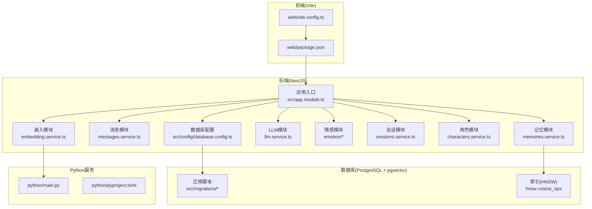
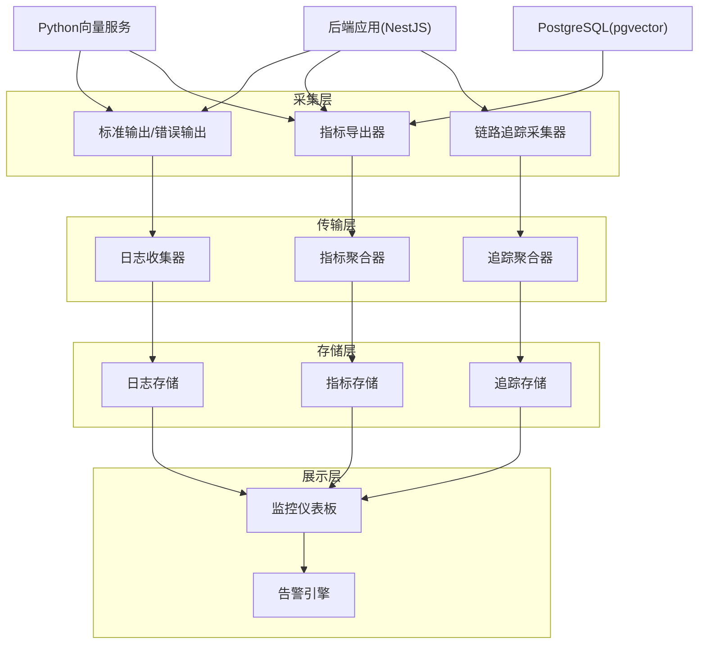
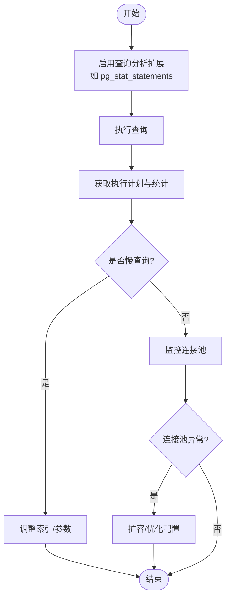
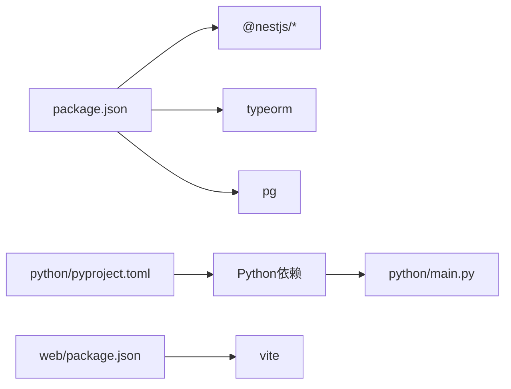

# 监控与日志管理

<cite>
**本文引用的文件**
- [package.json](file://package.json)
- [src/app.module.ts](file://src/app.module.ts)
- [src/config/database.config.ts](file://src/config/database.config.ts)
- [docs/学习笔记.md](file://docs/学习笔记.md)
- [src/migrations/1710000000000-init-pgvector-schema.ts](file://src/migrations/1710000000000-init-pgvector-schema.ts)
- [src/messages/messages.service.ts](file://src/messages/messages.service.ts)
- [src/memories/memories.service.ts](file://src/memories/memories.service.ts)
- [src/llm/llm.service.ts](file://src/llm/llm.service.ts)
- [src/emotion/jiwen-emotion.service.ts](file://src/emotion/jiwen-emotion.service.ts)
- [src/emotion/mood.service.ts](file://src/emotion/mood.service.ts)
- [src/sessions/sessions.service.ts](file://src/sessions/sessions.service.ts)
- [src/characters/characters.service.ts](file://src/characters/characters.service.ts)
- [src/embedding/embedding.service.ts](file://src/embedding/embedding.service.ts)
- [python/main.py](file://python/main.py)
- [python/pyproject.toml](file://python/pyproject.toml)
- [web/package.json](file://web/package.json)
- [web/vite.config.ts](file://web/vite.config.ts)
</cite>

## 目录
1. [简介](#简介)
2. [项目结构](#项目结构)
3. [核心组件](#核心组件)
4. [架构总览](#架构总览)
5. [详细组件分析](#详细组件分析)
6. [依赖分析](#依赖分析)
7. [性能考虑](#性能考虑)
8. [故障排查指南](#故障排查指南)
9. [结论](#结论)
10. [附录](#附录)

## 简介
本文件面向“AI Companion”项目的监控与日志管理，目标是帮助运维与开发团队建立完善的可观测性体系，覆盖应用性能监控（APM）、日志管理、数据库监控、系统资源监控、告警配置以及监控仪表板的关键指标分析方法。当前仓库未内置现成的监控与日志组件，因此本文件提供基于现有代码与技术栈的落地建议与最佳实践。

## 项目结构
- 后端采用 NestJS + TypeScript，数据库为 PostgreSQL（通过 TypeORM 连接），并使用 pgvector 扩展进行向量检索。
- 前端为 React/Vite 构建产物，通过静态文件服务对外提供界面。
- Python 子项目提供嵌入模型服务，供向量检索使用。
- 文档中记录了数据库连接、SQL 日志开关、迁移脚本等与监控密切相关的配置点。

图表来源
- [src/app.module.ts:18-30](file://src/app.module.ts#L18-L30)
- [src/config/database.config.ts:8-20](file://src/config/database.config.ts#L8-L20)
- [src/migrations/1710000000000-init-pgvector-schema.ts](file://src/migrations/1710000000000-init-pgvector-schema.ts)
- [src/memories/memories.service.ts:1094-1114](file://src/memories/memories.service.ts#L1094-L1114)
- [python/main.py](file://python/main.py)
- [web/package.json](file://web/package.json)
- [web/vite.config.ts](file://web/vite.config.ts)

章节来源
- [src/app.module.ts:18-30](file://src/app.module.ts#L18-L30)
- [src/config/database.config.ts:8-20](file://src/config/database.config.ts#L8-L20)
- [docs/学习笔记.md:242-331](file://docs/学习笔记.md#L242-L331)

## 核心组件
- 应用入口与静态资源：后端通过静态文件模块提供前端构建产物，便于统一部署与访问。
- 数据库连接与迁移：通过独立的数据源配置文件集中管理连接参数，并启用迁移以保证生产一致性。
- 模块化服务：消息、记忆、会话、角色、LLM、情感、嵌入等模块各自封装业务逻辑，便于分别观测与优化。
- Python 向量服务：作为外部依赖，需纳入监控范围，确保检索链路稳定。

章节来源
- [src/app.module.ts:18-30](file://src/app.module.ts#L18-L30)
- [src/config/database.config.ts:8-20](file://src/config/database.config.ts#L8-L20)
- [src/messages/messages.service.ts](file://src/messages/messages.service.ts)
- [src/memories/memories.service.ts](file://src/memories/memories.service.ts)
- [src/llm/llm.service.ts](file://src/llm/llm.service.ts)
- [src/emotion/jiwen-emotion.service.ts](file://src/emotion/jiwen-emotion.service.ts)
- [src/emotion/mood.service.ts](file://src/emotion/mood.service.ts)
- [src/sessions/sessions.service.ts](file://src/sessions/sessions.service.ts)
- [src/characters/characters.service.ts](file://src/characters/characters.service.ts)
- [src/embedding/embedding.service.ts](file://src/embedding/embedding.service.ts)
- [python/main.py](file://python/main.py)

## 架构总览
下图展示监控与日志在整体系统中的位置与交互关系。建议在生产环境引入独立的监控与日志组件，实现对后端、数据库、Python 服务与前端的全链路观测。

## 详细组件分析

### 应用性能监控（APM）
- 监控维度
  - CPU 使用率与负载：通过系统级指标采集器或容器运行时暴露的指标进行采集。
  - 内存使用：关注堆内存与常驻集大小，识别泄漏与碎片化风险。
  - QPS/响应时间：按模块统计请求量与 P95/P99 延迟，定位慢接口。
  - 错误率与异常：结合日志与追踪，识别失败模式。
- 建议实现
  - 在后端引入指标导出器（如 Prometheus Exporter），暴露模块级指标（如处理耗时、队列长度、缓存命中率）。
  - 在 Python 服务侧同样暴露指标，便于跨语言链路观测。
  - 结合链路追踪（Trace）采集关键调用链，定位瓶颈。

章节来源
- [src/app.module.ts:18-30](file://src/app.module.ts#L18-L30)
- [src/llm/llm.service.ts](file://src/llm/llm.service.ts)
- [src/embedding/embedding.service.ts](file://src/embedding/embedding.service.ts)
- [python/main.py](file://python/main.py)

### 日志管理系统
- 日志级别配置
  - 建议采用多级别：DEBUG（开发调试）、INFO（常规运行信息）、WARN（潜在问题）、ERROR（错误事件）。
  - 对数据库 SQL 日志，开发阶段可开启，生产阶段建议关闭或降级为 INFO。
- 日志轮转与集中化
  - 使用日志收集器（如 Fluent Bit/Filebeat）将 stdout/stderr 聚合至集中式存储（如 ELK/EFK 或云日志服务）。
  - 针对 Python 服务，同样通过 stdout 输出并统一收集。
- 关键字段
  - 时间戳、服务名、模块名、请求 ID、用户 ID、状态码、耗时、错误堆栈等。

章节来源
- [src/config/database.config.ts:19](file://src/config/database.config.ts#L19)
- [docs/学习笔记.md:882-884](file://docs/学习笔记.md#L882-L884)

### 数据库监控策略
- 查询性能监控
  - 使用数据库内置分析视图（如 EXPLAIN/ANALYZE、pg_stat_statements）观察慢查询与高成本计划。
  - 对向量检索（hnsw）建立基线，持续跟踪相似度查询的延迟分布。
- 连接池使用情况
  - 监控活跃连接数、等待时间、超时次数，避免连接池耗尽导致排队。
- 索引使用率
  - 统计索引扫描次数与回表比例，评估索引有效性；对 hnsw 索引关注构建参数（如 m、ef_construction）对查询性能的影响。
- 迁移与结构变更
  - 通过迁移脚本管理结构变更，避免生产临时锁表操作。

图表来源
- [src/migrations/1710000000000-init-pgvector-schema.ts](file://src/migrations/1710000000000-init-pgvector-schema.ts)
- [src/memories/memories.service.ts:1102-1112](file://src/memories/memories.service.ts#L1102-L1112)

章节来源
- [src/migrations/1710000000000-init-pgvector-schema.ts](file://src/migrations/1710000000000-init-pgvector-schema.ts)
- [src/memories/memories.service.ts:1094-1114](file://src/memories/memories.service.ts#L1094-L1114)
- [docs/学习笔记.md:1116-1129](file://docs/学习笔记.md#L1116-L1129)

### 告警配置指南
- 阈值设置
  - CPU 使用率：短期峰值超过阈值触发预警，长期平均超过阈值触发升级告警。
  - 内存：常驻集增长速率异常、GC 压力过大。
  - QPS：突发下降或异常升高。
  - 错误率：模块级错误率超过阈值。
  - 数据库：慢查询占比、连接池等待时间、索引失效。
- 通知渠道
  - 邮件、即时通讯群组、电话（升级通道）。
- 故障自动处理
  - 健康检查失败自动重启容器或实例。
  - 连接池异常触发扩缩容或切换备用实例。

章节来源
- [src/config/database.config.ts:19](file://src/config/database.config.ts#L19)
- [docs/学习笔记.md:882-884](file://docs/学习笔记.md#L882-L884)

### 系统资源监控
- 磁盘空间：监控根分区与日志目录使用率，设置阈值并预留缓冲。
- 网络带宽：观察请求/响应吞吐与延迟，识别网络瓶颈。
- 系统负载：CPU 平均负载、上下文切换、中断频率等。

章节来源
- [src/app.module.ts:18-30](file://src/app.module.ts#L18-L30)
- [web/vite.config.ts](file://web/vite.config.ts)

### 监控仪表板配置与关键指标分析
- 仪表板建议
  - 后端：请求量、错误率、P95/P99 延迟、并发连接、GC 指标。
  - 数据库：慢查询、索引使用率、连接池、表大小与增长趋势。
  - Python 服务：请求量、错误率、处理耗时、模型推理耗时。
  - 前端：页面加载时间、首次内容绘制、错误上报。
- 关键指标
  - L1：可用性（SLO）、MTTR/MTBF。
  - L2：容量规划（CPU/内存/IO 饱和度）。
  - L3：性能（延迟分布、吞吐、错误率）。
  - L4：业务指标（会话数、消息数、检索命中率）。

章节来源
- [src/messages/messages.service.ts](file://src/messages/messages.service.ts)
- [src/sessions/sessions.service.ts](file://src/sessions/sessions.service.ts)
- [src/characters/characters.service.ts](file://src/characters/characters.service.ts)
- [src/embedding/embedding.service.ts](file://src/embedding/embedding.service.ts)
- [python/main.py](file://python/main.py)

## 依赖分析
- 外部依赖与监控相关的关键点
  - TypeORM/PostgreSQL：通过数据源配置集中管理连接参数，生产环境建议关闭 SQL 日志，降低 I/O 压力。
  - Python 服务：作为外部依赖，需纳入统一监控与告警。
  - 前端构建：静态资源由后端提供，部署时需关注缓存与回源策略对性能的影响。

图表来源
- [package.json](file://package.json)
- [python/pyproject.toml](file://python/pyproject.toml)
- [web/package.json](file://web/package.json)

章节来源
- [package.json](file://package.json)
- [python/pyproject.toml](file://python/pyproject.toml)
- [web/package.json](file://web/package.json)

## 性能考虑
- SQL 日志与 I/O：生产环境应关闭或限制 SQL 日志输出，避免对磁盘与网络造成额外压力。
- 连接池与并发：合理设置连接池上限与超时，避免阻塞与抖动。
- 向量检索：hnsw 索引参数需结合数据规模与查询特征进行调优，定期评估相似度查询的延迟分布。
- 前端静态资源：通过缓存与 CDN 优化加载速度，减少后端压力。

章节来源
- [src/config/database.config.ts:19](file://src/config/database.config.ts#L19)
- [docs/学习笔记.md:882-884](file://docs/学习笔记.md#L882-L884)
- [docs/学习笔记.md:1116-1129](file://docs/学习笔记.md#L1116-L1129)

## 故障排查指南
- 端口占用
  - 若端口被占用，可通过系统工具查找占用进程并终止，再重新启动服务。
- SQL 日志定位
  - 开发阶段可利用 SQL 日志快速定位问题，生产阶段建议改为集中化日志与告警。
- Python 服务连通性
  - 确认嵌入服务地址与端口正确，检查网络连通与健康状态。

章节来源
- [docs/学习笔记.md:886-895](file://docs/学习笔记.md#L886-L895)
- [docs/学习笔记.md:261-270](file://docs/学习笔记.md#L261-L270)

## 结论
本文件基于现有代码与技术栈，提出了面向“AI Companion”的监控与日志管理实施建议。建议尽快引入独立的监控与日志组件，完善指标采集、日志轮转与集中化、数据库性能与连接池监控、系统资源监控及告警机制，并通过仪表板持续跟踪关键指标，形成闭环的可观测性体系。

## 附录
- 配置参考
  - 数据库连接参数与迁移脚本：见数据源配置与迁移文件。
  - 环境变量与端口：见文档中的环境变量示例与端口说明。
- 前端与构建
  - 前端包与构建配置：见 web 目录下的相关文件。

章节来源
- [src/config/database.config.ts:8-20](file://src/config/database.config.ts#L8-L20)
- [src/migrations/1710000000000-init-pgvector-schema.ts](file://src/migrations/1710000000000-init-pgvector-schema.ts)
- [docs/学习笔记.md:261-270](file://docs/学习笔记.md#L261-L270)
- [web/package.json](file://web/package.json)
- [web/vite.config.ts](file://web/vite.config.ts)