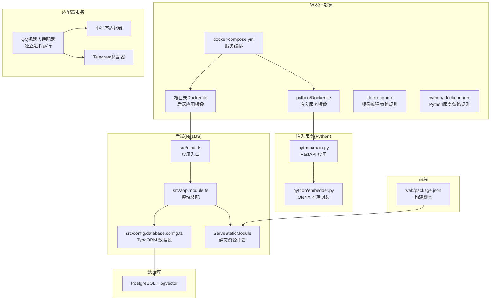
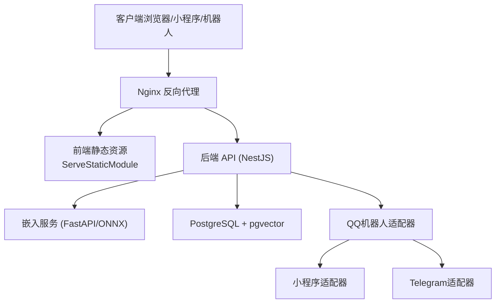
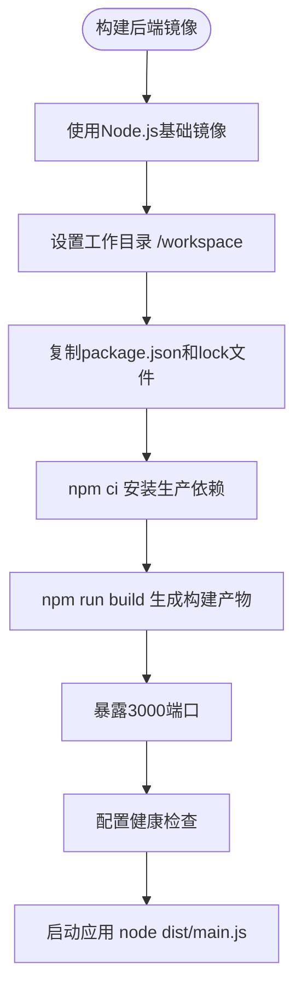
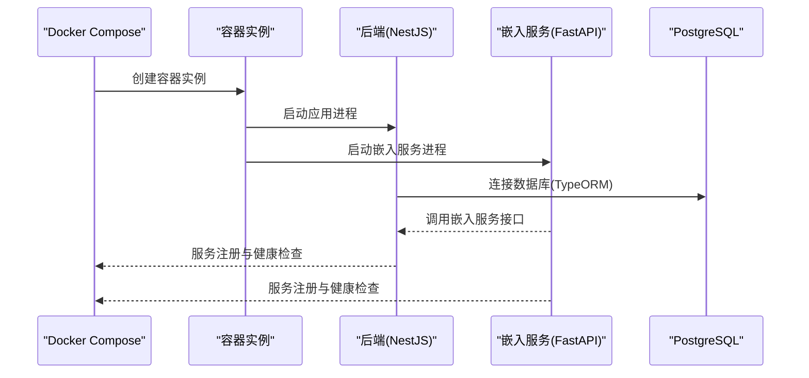
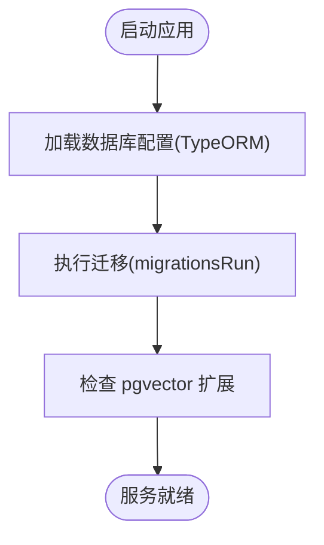
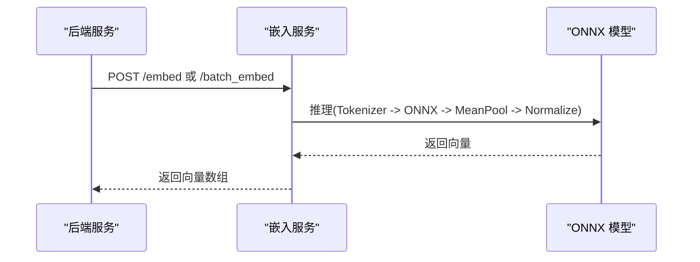
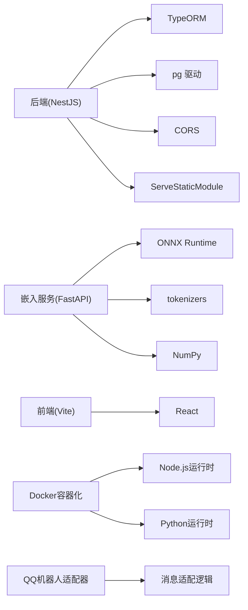

# 部署与运维

<cite>
**本文引用的文件**
- [Dockerfile](file://Dockerfile)
- [docker-compose.yml](file://docker-compose.yml)
- [python/Dockerfile](file://python/Dockerfile)
- [.dockerignore](file://.dockerignore)
- [python/.dockerignore](file://python/.dockerignore)
- [package.json](file://package.json)
- [pyproject.toml](file://pyproject.toml)
- [src/main.ts](file://src/main.ts)
- [src/app.module.ts](file://src/app.module.ts)
- [src/config/database.config.ts](file://src/config/database.config.ts)
- [python/main.py](file://python/main.py)
- [python/embedder.py](file://python/embedder.py)
- [web/package.json](file://web/package.json)
- [src/migrations/1710000000000-init-pgvector-schema.ts](file://src/migrations/1710000000000-init-pgvector-schema.ts)
- [adapters/qq-bot/index.js](file://adapters/qq-bot/index.js)
- [adapters/qq-bot/adapter.js](file://adapters/qq-bot/adapter.js)
- [adapters/miniprogram/api.js](file://adapters/miniprogram/api.js)
- [adapters/miniprogram/api-uni.js](file://adapters/miniprogram/api-uni.js)
- [adapters/telegram/index.js](file://adapters/telegram/index.js)
- [adapters/telegram/adapter.js](file://adapters/telegram/adapter.js)
- [tools/export_wechat_current_chat.bat](file://tools/export_wechat_current_chat.bat)
- [tools/export_wechat_current_chat.ps1](file://tools/export_wechat_current_chat.ps1)
- [tools/README_wechat_export.md](file://tools/README_wechat_export.md)
</cite>

## 目录
1. [简介](#简介)
2. [项目结构](#项目结构)
3. [核心组件](#核心组件)
4. [架构总览](#架构总览)
5. [详细组件分析](#详细组件分析)
6. [依赖分析](#依赖分析)
7. [性能考虑](#性能考虑)
8. [故障排除指南](#故障排除指南)
9. [结论](#结论)
10. [附录](#附录)

## 简介
本文件面向生产环境的部署与运维，围绕 AI Companion 的后端（NestJS）、前端（React/Vite）、嵌入服务（Python/FastAPI/ONNX）以及数据库（PostgreSQL + pgvector）给出可操作的部署流程、配置建议、监控与日志、安全加固、扩展性设计、故障排除与自动化运维方案。内容基于仓库现有代码与脚本进行提炼与总结，确保读者在不深入源码的情况下也能完成生产级部署。

**更新** 新增Docker容器化部署基础设施，包括Dockerfile、docker-compose.yml和完整的容器化部署指南。**新增QQ Bot服务配置和部署指南**，支持QQ机器人的独立部署与集成。

## 项目结构
项目采用多语言混合架构：
- 后端：NestJS 应用，提供 REST API、静态资源托管与数据库访问。
- 嵌入服务：独立 Python FastAPI 服务，负责文本向量化。
- 前端：React/Vite 构建产物由后端 ServeStatic 提供。
- 数据库：PostgreSQL，使用 TypeORM 管理迁移，内置 pgvector 扩展支持向量检索。
- 适配器：多平台聊天适配（QQ、小程序、Telegram），可作为独立进程运行。
- **容器化**：新增Dockerfile和docker-compose.yml，支持完整的容器化部署。
- **QQ Bot服务**：新增QQ机器人适配器，支持独立部署与消息处理。

**图表来源**
- [Dockerfile](file://Dockerfile)
- [python/Dockerfile](file://python/Dockerfile)
- [docker-compose.yml](file://docker-compose.yml)
- [src/main.ts:1-22](file://src/main.ts#L1-L22)
- [src/app.module.ts:1-64](file://src/app.module.ts#L1-L64)
- [src/config/database.config.ts:1-22](file://src/config/database.config.ts#L1-L22)
- [python/main.py:1-123](file://python/main.py#L1-L123)
- [python/embedder.py:1-116](file://python/embedder.py#L1-L116)
- [web/package.json:1-22](file://web/package.json#L1-L22)
- [adapters/qq-bot/index.js](file://adapters/qq-bot/index.js)
- [adapters/qq-bot/adapter.js](file://adapters/qq-bot/adapter.js)

**章节来源**
- [Dockerfile](file://Dockerfile)
- [python/Dockerfile](file://python/Dockerfile)
- [docker-compose.yml](file://docker-compose.yml)
- [src/main.ts:1-22](file://src/main.ts#L1-L22)
- [src/app.module.ts:1-64](file://src/app.module.ts#L1-L64)
- [src/config/database.config.ts:1-22](file://src/config/database.config.ts#L1-L22)
- [python/main.py:1-123](file://python/main.py#L1-L123)
- [python/embedder.py:1-116](file://python/embedder.py#L1-L116)
- [web/package.json:1-22](file://web/package.json#L1-L22)
- [adapters/qq-bot/index.js](file://adapters/qq-bot/index.js)
- [adapters/qq-bot/adapter.js](file://adapters/qq-bot/adapter.js)

## 核心组件
- 应用入口与启动
  - 后端通过应用入口启动，启用 CORS 并监听端口；生产环境需限制 CORS 来源。
  - 提供构建与运行脚本，支持前后端一体化构建。
- 数据库与迁移
  - 使用 TypeORM 连接 PostgreSQL，禁用自动同步，通过迁移管理结构变更，包含 pgvector 初始化迁移。
- 嵌入服务
  - 独立 FastAPI 服务，提供单条与批量向量化接口，支持"假向量"模式用于未准备好的部署阶段。
- 前端静态资源
  - 通过 ServeStaticModule 提供 React 构建产物，SPA 回退至 index.html。
- 适配器
  - 多平台适配器（QQ、小程序、Telegram）可独立运行，便于扩展不同渠道接入。
- **容器化部署**
  - 根Dockerfile定义后端应用镜像，包含Node.js运行时、依赖安装和启动命令。
  - Python Dockerfile定义嵌入服务镜像，包含Python运行时、ONNX Runtime和模型文件。
  - docker-compose.yml统一编排所有服务，定义网络、卷和环境变量。
- **QQ Bot服务**
  - QQ机器人适配器支持独立部署，提供消息处理与回复功能。
  - 适配器通过adapter.js实现消息适配逻辑，index.js提供启动入口。

**章节来源**
- [src/main.ts:1-22](file://src/main.ts#L1-L22)
- [package.json:8-27](file://package.json#L8-L27)
- [src/app.module.ts:18-62](file://src/app.module.ts#L18-L62)
- [src/config/database.config.ts:8-20](file://src/config/database.config.ts#L8-L20)
- [python/main.py:26-123](file://python/main.py#L26-L123)
- [web/package.json:5-9](file://web/package.json#L5-L9)
- [Dockerfile](file://Dockerfile)
- [python/Dockerfile](file://python/Dockerfile)
- [docker-compose.yml](file://docker-compose.yml)
- [adapters/qq-bot/index.js](file://adapters/qq-bot/index.js)
- [adapters/qq-bot/adapter.js](file://adapters/qq-bot/adapter.js)

## 架构总览
下图展示生产环境典型拓扑：Nginx 反向代理前端与后端 API，后端与嵌入服务分别运行在不同端口，数据库独立部署并启用 pgvector。**新增QQ Bot服务作为独立适配器运行**。

**图表来源**
- [src/app.module.ts:23-30](file://src/app.module.ts#L23-L30)
- [src/main.ts:15-16](file://src/main.ts#L15-L16)
- [python/main.py:26-29](file://python/main.py#L26-L29)
- [adapters/qq-bot/index.js](file://adapters/qq-bot/index.js)

## 详细组件分析

### Docker容器化部署

#### 根应用容器（后端）
根目录Dockerfile定义了后端应用的完整容器化配置：

- **基础镜像**：使用Node.js官方镜像作为基础，确保运行时环境一致
- **工作目录**：设置/workspace作为工作目录，便于容器内开发和调试
- **依赖安装**：先复制package.json和package-lock.json，使用npm ci进行生产环境依赖安装
- **构建过程**：执行npm run build生成生产构建产物
- **运行时配置**：使用node启动dist/main.js，监听3000端口
- **健康检查**：提供HTTP健康检查端点，便于容器编排和监控

**图表来源**
- [Dockerfile](file://Dockerfile)

#### Python嵌入服务容器
python/Dockerfile专门定义了嵌入服务的容器化配置：

- **基础镜像**：使用Python官方镜像，包含Python运行时和包管理工具
- **工作目录**：设置/workspace/python作为工作目录
- **依赖安装**：复制pyproject.toml和uv.lock，使用uv进行快速依赖安装
- **模型文件**：预拷贝ONNX模型文件，减少运行时下载时间
- **运行时配置**：使用uvicorn启动FastAPI应用，监听8000端口
- **资源优化**：配置并发工作进程，优化CPU利用率

#### docker-compose编排
docker-compose.yml统一管理所有服务的部署：

- **服务定义**：定义web、backend、embedding三个主要服务
- **网络配置**：创建自定义网络，确保服务间通信安全
- **卷挂载**：配置数据卷和构建产物卷，支持持久化和热更新
- **环境变量**：集中管理数据库连接、API密钥等配置
- **端口映射**：定义服务间的内部端口和外部暴露端口
- **健康检查**：为每个服务配置健康检查，确保服务可用性
- **重启策略**：设置合理的重启策略，提高系统稳定性

**章节来源**
- [Dockerfile](file://Dockerfile)
- [python/Dockerfile](file://python/Dockerfile)
- [docker-compose.yml](file://docker-compose.yml)

### 后端部署与进程管理
- **容器化与编排**
  - 建议使用 Docker 将 NestJS 与嵌入服务分别打包为镜像，并通过 docker-compose 编排。
  - 端口映射：后端 API 默认端口，嵌入服务独立端口；Nginx 暴露 80/443。
  - **新增** 容器编排支持自动重启、健康检查和服务发现。
- **PM2 进程管理**
  - 使用 PM2 启动后端与嵌入服务，配置自动重启、日志轮转与 CPU/内存阈值告警。
  - 建议为后端与嵌入服务分别创建进程配置，实现独立重启与资源隔离。
- **负载均衡**
  - PM2 集群模式可按 CPU 核数启动多实例；结合 Nginx upstream 实现请求分发。
  - 对长连接场景（WebSocket）建议使用 sticky 会话或外部状态共享。

**图表来源**
- [docker-compose.yml](file://docker-compose.yml)
- [src/main.ts:15-16](file://src/main.ts#L15-L16)
- [python/main.py:115-122](file://python/main.py#L115-L122)
- [src/config/database.config.ts:8-20](file://src/config/database.config.ts#L8-L20)

**章节来源**
- [src/main.ts:15-16](file://src/main.ts#L15-L16)
- [package.json:8-27](file://package.json#L8-L27)
- [docker-compose.yml](file://docker-compose.yml)

### Nginx 反向代理与 SSL
- 静态资源与 API 分离
  - 将前端静态资源与后端 API 通过不同 location 转发，避免路由冲突。
- 反向代理配置要点
  - API 路由转发到后端服务端口；静态资源由后端 ServeStatic 提供。
  - WebSocket 场景需开启 proxy_set_header Upgrade 与 proxy_set_header Connection。
- SSL 证书
  - 使用 Let's Encrypt 获取免费证书，配置 HTTPS 强制跳转与 HSTS。
  - 建议启用 OCSP Stapling 与现代 TLS 参数。

**章节来源**
- [src/app.module.ts:23-30](file://src/app.module.ts#L23-L30)
- [src/main.ts:9-13](file://src/main.ts#L9-L13)

### 数据库部署与维护（PostgreSQL + pgvector）
- 集群与高可用
  - 建议使用主从复制或托管数据库（如云数据库）实现高可用与灾备。
  - 使用只读副本承载查询压力，分离写入与读取。
- pgvector 扩展
  - 迁移中包含初始化 pgvector 的步骤，生产环境需确保扩展已启用。
  - 向量索引与查询优化：根据数据规模选择合适的索引类型与参数。
- 备份策略
  - 全量备份 + 增量/归档日志结合；定期校验恢复流程。
  - 备份保留周期与异地存储策略需满足 RPO/RTO 要求。

**图表来源**
- [src/config/database.config.ts:16-19](file://src/config/database.config.ts#L16-L19)
- [src/migrations/1710000000000-init-pgvector-schema.ts](file://src/migrations/1710000000000-init-pgvector-schema.ts)

**章节来源**
- [src/config/database.config.ts:8-20](file://src/config/database.config.ts#L8-L20)
- [src/migrations/1710000000000-init-pgvector-schema.ts](file://src/migrations/1710000000000-init-pgvector-schema.ts)

### 嵌入服务（文本向量化）
- 启动与模式
  - 支持真实模型与"假向量"模式；生产环境需确保模型文件存在并正确加载。
  - 提供健康检查端点，便于进程管理与负载均衡探测。
- 性能与资源
  - ONNX Runtime 使用 CPU 执行；可根据硬件能力调整批处理大小与并发度。
  - 建议与后端拆分为独立容器/进程，便于弹性伸缩。

**图表来源**
- [python/main.py:91-112](file://python/main.py#L91-L112)
- [python/embedder.py:71-115](file://python/embedder.py#L71-L115)

**章节来源**
- [python/main.py:26-123](file://python/main.py#L26-L123)
- [python/embedder.py:1-116](file://python/embedder.py#L1-L116)

### 前端构建与静态资源
- 构建流程
  - 通过 web/package.json 中的构建脚本生成静态资源，后端 ServeStaticModule 提供。
  - 建议在 CI 中缓存依赖并生成带哈希的产物，提升缓存命中率。
- SPA 回退
  - ServeStaticModule 配置 index 回退，确保路由刷新不会 404。

**章节来源**
- [web/package.json:5-9](file://web/package.json#L5-L9)
- [src/app.module.ts:23-29](file://src/app.module.ts#L23-L29)

### 适配器（多平台接入）
- **QQ机器人适配器**
  - 独立部署的QQ机器人服务，通过adapter.js实现消息适配逻辑。
  - 支持消息接收、处理与回复，可与其他适配器并行运行。
  - 建议为QQ Bot配置独立的进程管理与日志记录。
- 小程序适配器
  - 提供微信小程序的消息处理接口，支持API调用与数据交互。
- Telegram适配器
  - 支持Telegram机器人的消息处理与回复功能。

**章节来源**
- [adapters/qq-bot/index.js](file://adapters/qq-bot/index.js)
- [adapters/qq-bot/adapter.js](file://adapters/qq-bot/adapter.js)
- [adapters/miniprogram/api.js](file://adapters/miniprogram/api.js)
- [adapters/miniprogram/api-uni.js](file://adapters/miniprogram/api-uni.js)
- [adapters/telegram/index.js](file://adapters/telegram/index.js)
- [adapters/telegram/adapter.js](file://adapters/telegram/adapter.js)

## 依赖分析
- 后端依赖
  - NestJS 核心、TypeORM、PostgreSQL 驱动、CORS、静态文件服务等。
- 嵌入服务依赖
  - FastAPI、Uvicorn、ONNX Runtime、Tokenizers、NumPy。
- 前端依赖
  - React、Vite、TypeScript。
- **容器化依赖**
  - Docker基础镜像、构建工具链、运行时环境。
- **QQ Bot依赖**
  - 适配器运行时依赖，支持独立部署与消息处理。

**图表来源**
- [package.json:29-46](file://package.json#L29-L46)
- [pyproject.toml:6-16](file://pyproject.toml#L6-L16)
- [web/package.json:10-20](file://web/package.json#L10-L20)
- [Dockerfile](file://Dockerfile)
- [python/Dockerfile](file://python/Dockerfile)
- [adapters/qq-bot/adapter.js](file://adapters/qq-bot/adapter.js)

**章节来源**
- [package.json:29-46](file://package.json#L29-L46)
- [pyproject.toml:1-22](file://pyproject.toml#L1-L22)
- [web/package.json:1-22](file://web/package.json#L1-L22)
- [Dockerfile](file://Dockerfile)
- [python/Dockerfile](file://python/Dockerfile)
- [adapters/qq-bot/adapter.js](file://adapters/qq-bot/adapter.js)

## 性能考虑
- 数据库性能
  - 为向量字段建立合适索引；控制单次查询返回数量；对高频查询结果进行缓存。
- 嵌入服务性能
  - 批量推理优于逐条；合理设置批大小与并发；在 CPU 资源紧张时降低并发。
- 应用层优化
  - 启用 Gzip/Br 压缩；静态资源 CDN 化；合理设置缓存头。
- **容器化性能**
  - 合理设置容器资源限制和请求；使用多阶段构建减少镜像大小；优化启动时间。
- 监控指标
  - QPS、P95/P99 延迟、错误率、数据库连接池使用率、嵌入服务推理耗时、容器资源使用率。
- **QQ Bot性能**
  - 独立进程运行避免阻塞主业务；合理配置消息处理队列；监控消息延迟与成功率。

## 故障排除指南
- 启动失败
  - 检查数据库连接参数与可达性；确认迁移是否成功执行。
- 嵌入服务异常
  - 若提示模型文件缺失，切换"假向量"模式验证流程；随后下载模型并移除假模式。
- CORS 问题
  - 生产环境需明确指定允许来源，避免使用通配符。
- 前端 404
  - 确认静态资源目录存在且 ServeStaticModule 配置正确；检查构建产物是否更新。
- **容器化问题**
  - 镜像构建失败：检查Dockerfile语法和依赖文件完整性
  - 容器启动失败：查看容器日志，确认端口占用和环境变量配置
  - 服务间通信失败：检查docker-compose网络配置和容器名称解析
- **QQ Bot问题**
  - 机器人无法接收消息：检查适配器配置与消息通道
  - 消息处理失败：查看适配器日志，确认消息格式与处理逻辑
  - 独立进程异常：使用进程管理工具重启适配器服务

**章节来源**
- [src/config/database.config.ts:8-20](file://src/config/database.config.ts#L8-L20)
- [python/main.py:64-70](file://python/main.py#L64-L70)
- [src/main.ts:9-13](file://src/main.ts#L9-L13)
- [src/app.module.ts:23-29](file://src/app.module.ts#L23-L29)
- [docker-compose.yml](file://docker-compose.yml)
- [adapters/qq-bot/adapter.js](file://adapters/qq-bot/adapter.js)

## 结论
通过将后端、嵌入服务与前端解耦部署，结合 Nginx 反向代理、PM2 进程管理与 PostgreSQL + pgvector 的数据库方案，AI Companion 可实现稳定、可扩展的生产级部署。**新增的Docker容器化基础设施进一步提升了部署的一致性和可维护性**。**新增的QQ Bot服务配置为多平台接入提供了完整的解决方案**。建议在上线前完善监控与日志体系、安全加固与备份演练，并制定标准化的 CI/CD 与应急响应流程。

## 附录
- 运维自动化与 CI/CD
  - 建议在 CI 中执行构建、测试与打包，推送镜像至私有仓库；CD 使用 GitOps 或流水线触发部署。
  - 配置自动化测试与安全扫描，确保每次变更的质量与合规。
  - **容器化CI/CD**：在CI中集成Docker构建和测试，确保镜像质量。
- 微服务治理
  - 将嵌入服务与后端拆分为独立服务，便于独立扩缩容与版本迭代。
  - **容器编排**：使用Kubernetes或Docker Swarm进行服务编排和自动扩缩容。
  - **QQ Bot微服务**：支持独立部署与弹性扩缩容，避免影响主业务系统。
- 安全最佳实践
  - 防火墙仅开放必要端口；API 使用鉴权与限流；敏感信息使用密钥管理；传输层启用 TLS；定期审计日志。
  - **容器安全**：使用非root用户运行容器、定期更新基础镜像、配置安全上下文。
  - **适配器安全**：为不同适配器配置独立的安全策略与访问控制。