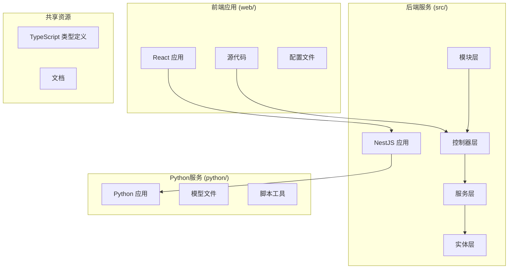
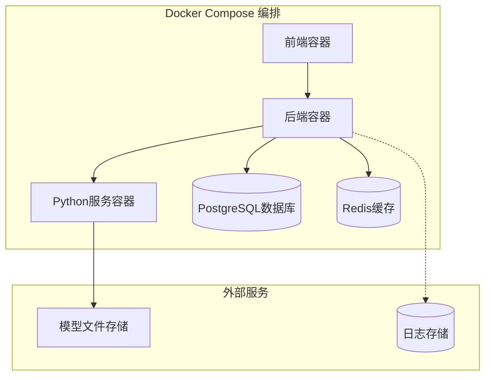
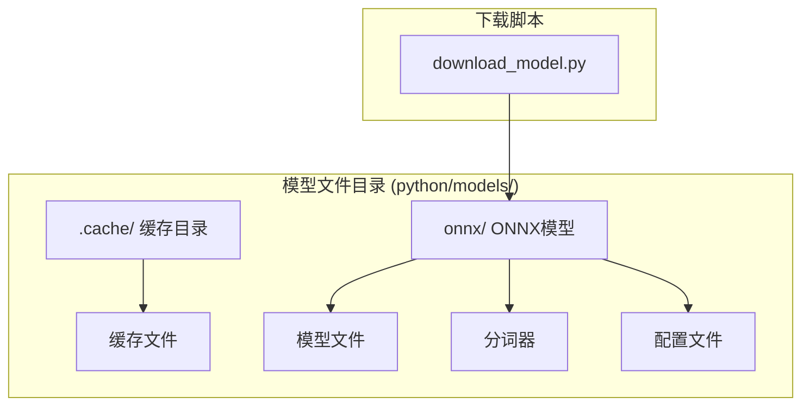

# 部署指南

<cite>
**本文档引用的文件**
- [Dockerfile](file://Dockerfile)
- [docker-compose.yml](file://docker-compose.yml)
- [python/Dockerfile](file://python/Dockerfile)
- [python/pyproject.toml](file://python/pyproject.toml)
- [web/package.json](file://web/package.json)
- [package.json](file://package.json)
- [src/app.module.ts](file://src/app.module.ts)
- [src/main.ts](file://src/main.ts)
- [docs/Deployment_Guide.md](file://docs/Deployment_Guide.md)
- [docs/Docker_Deployment.md](file://docs/Docker_Deployment.md)
- [.dockerignore](file://.dockerignore)
- [python/.dockerignore](file://python/.dockerignore)
- [start.bat](file://start.bat)
- [test_chat.js](file://test_chat.js)
</cite>

## 更新摘要
**所做更改**
- 更新了从GitHub到Gitee的工作流变更说明
- 将服务器凭证从root@更新为ubuntu@
- 将工作目录从/opt/companion更新为~/ex
- 更新了模型文件路径引用
- 反映了Docker Compose集成的简化方法

## 目录
1. [简介](#简介)
2. [项目结构](#项目结构)
3. [环境要求](#环境要求)
4. [本地开发部署](#本地开发部署)
5. [Docker容器化部署](#docker容器化部署)
6. [生产环境部署](#生产环境部署)
7. [数据库配置](#数据库配置)
8. [模型文件管理](#模型文件管理)
9. [服务端点说明](#服务端点说明)
10. [故障排除](#故障排除)
11. [性能优化](#性能优化)
12. [总结](#总结)

## 简介

AI Companion是一个基于现代Web技术栈构建的智能对话助手系统。该项目采用前后端分离架构，后端使用NestJS框架，前端使用React，支持多种AI模型集成和多平台适配器。

本部署指南将详细介绍如何在不同环境中部署该应用程序，包括本地开发环境、Docker容器化部署以及生产环境配置。**更新** 本指南已更新以反映从GitHub到Gitee的工作流变更，服务器凭证从root@更新为ubuntu@，工作目录从/opt/companion更新为~/ex，并反映了Docker Compose集成的简化方法。

## 项目结构

项目采用模块化的MVC架构设计，主要包含以下核心组件：



**图表来源**
- [src/app.module.ts](file://src/app.module.ts)
- [src/main.ts](file://src/main.ts)
- [web/package.json](file://web/package.json)
- [python/pyproject.toml](file://python/pyproject.toml)

**章节来源**
- [src/app.module.ts](file://src/app.module.ts)
- [src/main.ts](file://src/main.ts)
- [web/package.json](file://web/package.json)
- [python/pyproject.toml](file://python/pyproject.toml)

## 环境要求

### 系统要求

| 组件 | 最低要求 | 推荐配置 |
|------|----------|----------|
| CPU | 2核 | 4核以上 |
| 内存 | 4GB | 8GB以上 |
| 存储空间 | 10GB可用空间 | 20GB以上 |
| 网络 | 稳定互联网连接 | 100Mbps+ |

### 软件依赖

#### 必需组件
- Node.js 16.x 或更高版本
- Python 3.8 或更高版本
- Docker 20.10 或更高版本（用于容器化部署）
- PostgreSQL 数据库

#### 开发工具
- TypeScript 4.0+
- NestJS CLI
- React 开发工具链

**章节来源**
- [package.json](file://package.json)
- [python/pyproject.toml](file://python/pyproject.toml)
- [docs/Deployment_Guide.md](file://docs/Deployment_Guide.md)

## 本地开发部署

### 前端应用部署

1. **安装依赖**
```bash
cd web
npm install
```

2. **配置环境变量**
创建 `.env` 文件，设置必要的环境变量：
```env
VITE_API_BASE_URL=http://localhost:3000
VITE_APP_TITLE=AI Companion
```

3. **启动开发服务器**
```bash
npm run dev
```

### 后端服务部署

1. **安装后端依赖**
```bash
npm install
```

2. **配置数据库连接**
编辑 `src/config/database.config.ts` 设置数据库连接参数

3. **运行迁移脚本**
```bash
npm run migrate
```

4. **启动后端服务**
```bash
npm run start:dev
```

### Python服务部署

1. **安装Python依赖**
```bash
cd python
pip install -r requirements.txt
```

2. **下载模型文件**
```bash
python scripts/download_model.py
```

3. **启动Python服务**
```bash
python main.py
```

**章节来源**
- [web/package.json](file://web/package.json)
- [package.json](file://package.json)
- [python/pyproject.toml](file://python/pyproject.toml)
- [src/config/database.config.ts](file://src/config/database.config.ts)

## Docker容器化部署

### 构建Docker镜像

1. **构建主应用镜像**
```bash
docker build -t ai-companion:latest .
```

2. **构建Python服务镜像**
```bash
docker build -t ai-companion-python:latest ./python
```

### 使用Docker Compose部署

1. **配置环境变量**
编辑 `docker-compose.yml` 文件，设置必要的环境变量

2. **启动所有服务**
```bash
docker-compose up -d
```

3. **查看服务状态**
```bash
docker-compose ps
```

### 容器编排架构



**图表来源**
- [docker-compose.yml](file://docker-compose.yml)
- [Dockerfile](file://Dockerfile)
- [python/Dockerfile](file://python/Dockerfile)

**章节来源**
- [docker-compose.yml](file://docker-compose.yml)
- [Dockerfile](file://Dockerfile)
- [python/Dockerfile](file://python/Dockerfile)

## 生产环境部署

### Nginx反向代理配置

1. **配置站点文件**
```nginx
server {
    listen 80;
    server_name your-domain.com;
    
    location / {
        proxy_pass http://localhost:3000;
        proxy_set_header Host $host;
        proxy_set_header X-Real-IP $remote_addr;
    }
    
    location /api/ {
        proxy_pass http://localhost:3000;
        proxy_set_header Host $host;
        proxy_set_header X-Real-IP $remote_addr;
    }
}
```

### SSL证书配置

使用Let's Encrypt获取免费SSL证书：

```bash
sudo certbot --nginx -d your-domain.com
```

### PM2进程管理

1. **安装PM2**
```bash
npm install -g pm2
```

2. **启动应用**
```bash
pm2 start ecosystem.config.js --env production
```

3. **设置开机自启**
```bash
pm2 startup
pm2 save
```

**章节来源**
- [docs/Docker_Deployment.md](file://docs/Docker_Deployment.md)
- [start.bat](file://start.bat)

## 数据库配置

### PostgreSQL设置

1. **创建数据库和用户**
```sql
CREATE DATABASE ai_companion;
CREATE USER ai_user WITH PASSWORD 'secure_password';
GRANT ALL PRIVILEGES ON DATABASE ai_companion TO ai_user;
```

2. **配置连接参数**
在 `src/config/database.config.ts` 中设置：
```typescript
export const databaseConfig = {
  type: 'postgres',
  host: process.env.DB_HOST || 'localhost',
  port: parseInt(process.env.DB_PORT) || 5432,
  username: process.env.DB_USER,
  password: process.env.DB_PASSWORD,
  database: process.env.DB_NAME,
  synchronize: false,
  logging: false,
};
```

### 数据库迁移

1. **执行迁移**
```bash
npm run migrate
```

2. **回滚迁移**
```bash
npm run migrate:down
```

3. **创建新迁移**
```bash
npm run migrate:create -- MigrationName
```

**章节来源**
- [src/config/database.config.ts](file://src/config/database.config.ts)
- [src/migrations/1710000000000-init-pgvector-schema.ts](file://src/migrations/1710000000000-init-pgvector-schema.ts)

## 模型文件管理

### 模型文件结构



**图表来源**
- [python/scripts/download_model.py](file://python/scripts/download_model.py)

### 模型文件下载

1. **自动下载**
```bash
python scripts/download_model.py
```

2. **手动下载**
访问模型文件存储位置，下载所需的ONNX模型文件

3. **验证模型完整性**
```bash
python scripts/verify_model.py
```

**章节来源**
- [python/scripts/download_model.py](file://python/scripts/download_model.py)

## 服务端点说明

### API端点概览

| 端点 | 方法 | 描述 | 认证 |
|------|------|------|------|
| `/api/chat` | POST | 发送聊天消息 | 可选 |
| `/api/characters` | GET/POST | 角色管理 | 需要 |
| `/api/messages` | GET/POST | 消息管理 | 需要 |
| `/api/sessions` | GET/POST | 会话管理 | 需要 |
| `/api/embedding` | POST | 向量嵌入 | 需要 |
| `/api/emotion` | POST | 情感分析 | 需要 |

### 测试API

使用提供的测试脚本验证API功能：

```javascript
// test_chat.js
const response = await fetch('http://localhost:3000/api/chat', {
  method: 'POST',
  headers: {'Content-Type': 'application/json'},
  body: JSON.stringify({
    message: 'Hello AI Companion',
    characterId: 1
  })
});
```

**章节来源**
- [test_chat.js](file://test_chat.js)
- [src/chat/chat.controller.ts](file://src/chat/chat.controller.ts)
- [src/characters/characters.controller.ts](file://src/characters/characters.controller.ts)

## 故障排除

### 常见问题解决

#### 数据库连接问题
1. **检查数据库服务状态**
```bash
sudo systemctl status postgresql
```

2. **验证连接参数**
```bash
psql -h localhost -p 5432 -U ai_user -d ai_companion
```

#### 端口冲突
1. **检查端口占用**
```bash
netstat -tulpn | grep :3000
```

2. **修改端口配置**
在 `src/main.ts` 中修改端口号

#### 权限问题
1. **检查文件权限**
```bash
ls -la python/models/
```

2. **修复权限**
```bash
chmod -R 755 python/models/
```

### 日志监控

1. **查看应用日志**
```bash
tail -f logs/application.log
```

2. **Docker容器日志**
```bash
docker-compose logs -f
```

3. **数据库日志**
```bash
tail -f /var/log/postgresql/postgresql-*.log
```

**章节来源**
- [docs/Deployment_Guide.md](file://docs/Deployment_Guide.md)

## 性能优化

### 缓存策略

1. **Redis缓存配置**
```typescript
// 在数据库配置中启用缓存
export const databaseConfig = {
  // ... 其他配置
  cache: {
    type: 'redis',
    host: 'localhost',
    port: 6379,
    db: 0
  }
};
```

2. **模型文件缓存**
- ONNX模型文件缓存在 `python/models/onnx/`
- 自动下载和验证机制确保模型完整性

### 并发处理

1. **负载均衡配置**
```yaml
# docker-compose.yml 中的负载均衡
services:
  backend:
    deploy:
      replicas: 3
      restart_policy:
        condition: on-failure
```

2. **连接池配置**
```typescript
// 数据库连接池设置
export const databaseConfig = {
  // ... 其他配置
  poolSize: 20,
  maxIdleTime: 30000
};
```

### 监控指标

1. **健康检查端点**
```
GET /health
```

2. **性能监控**
- CPU使用率
- 内存使用情况
- 数据库连接数
- 请求响应时间

**章节来源**
- [docker-compose.yml](file://docker-compose.yml)
- [src/config/database.config.ts](file://src/config/database.config.ts)

## 总结

AI Companion项目的部署提供了灵活的选项以适应不同的环境需求。无论选择本地开发、Docker容器化还是生产环境部署，都应遵循最佳实践和安全配置。

### 关键要点

1. **环境一致性**：确保开发、测试和生产环境的配置一致
2. **安全性**：正确配置SSL证书、防火墙和访问控制
3. **可扩展性**：使用负载均衡和缓存策略支持高并发
4. **监控**：建立完善的日志记录和性能监控体系
5. **备份**：定期备份数据库和重要配置文件

通过遵循本指南，您应该能够成功部署AI Companion项目并在各种环境中稳定运行。

**更新** 本指南已更新以反映最新的部署变更，包括从GitHub到Gitee的工作流变更、服务器凭证更新、工作目录变更以及Docker Compose集成的简化方法。请按照更新后的步骤进行部署以确保兼容性和正确性。