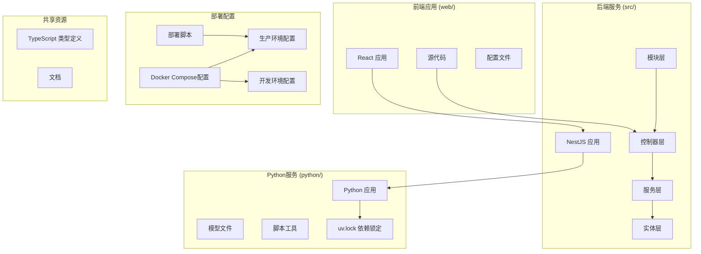
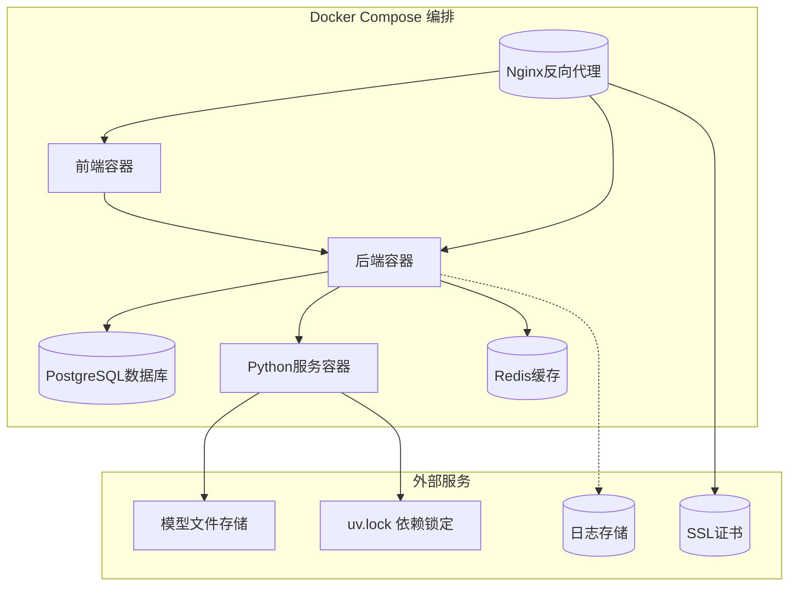
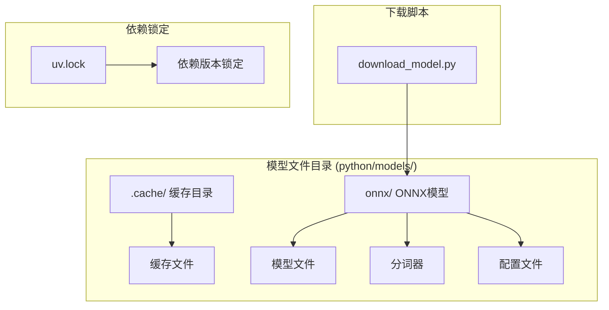

# 部署指南

<cite>
**本文档引用的文件**
- [deploy.bat](file://deploy.bat)
- [docker-compose.prod.yml](file://docker-compose.prod.yml)
- [docker-compose.yml](file://docker-compose.yml)
- [Dockerfile](file://Dockerfile)
- [python/Dockerfile](file://python/Dockerfile)
- [python/pyproject.toml](file://python/pyproject.toml)
- [python/uv.lock](file://python/uv.lock)
- [web/package.json](file://web/package.json)
- [package.json](file://package.json)
- [src/app.module.ts](file://src/app.module.ts)
- [src/main.ts](file://src/main.ts)
- [docs/Deployment_Guide.md](file://docs/Deployment_Guide.md)
- [docs/Docker_Deployment.md](file://docs/Docker_Deployment.md)
- [.dockerignore](file://.dockerignore)
- [python/.dockerignore](file://python/.dockerignore)
- [start.bat](file://start.bat)
- [test_chat.js](file://test_chat.js)
</cite>

## 更新摘要
**所做更改**
- 新增生产环境一键部署脚本deploy.bat，实现本地打包镜像并远程部署的完整流程
- 新增生产环境专用Docker Compose配置文件docker-compose.prod.yml，支持预构建镜像部署
- 重构Docker配置以支持生产环境的镜像预构建和远程部署
- 更新Python Dockerfile中的uv sync命令策略，增强国内镜像源支持
- 新增开发环境快速启动脚本start.bat，提供一键启动开发环境的功能
- 完善部署自动化流程，从复杂的多步骤过程转变为简化的本地打包和服务器部署流程

## 目录
1. [简介](#简介)
2. [项目结构](#项目结构)
3. [环境要求](#环境要求)
4. [本地开发部署](#本地开发部署)
5. [Docker容器化部署](#docker容器化部署)
6. [生产环境一键部署](#生产环境一键部署)
7. [自动化部署脚本](#自动化部署脚本)
8. [数据库配置](#数据库配置)
9. [模型文件管理](#模型文件管理)
10. [服务端点说明](#服务端点说明)
11. [故障排除](#故障排除)
12. [性能优化](#性能优化)
13. [总结](#总结)

## 简介

AI Companion是一个基于现代Web技术栈构建的智能对话助手系统。该项目采用前后端分离架构，后端使用NestJS框架，前端使用React，支持多种AI模型集成和多平台适配器。

本部署指南将详细介绍如何在不同环境中部署该应用程序，包括本地开发环境、Docker容器化部署以及生产环境一键部署。**更新** 本指南已新增生产环境一键部署脚本、生产环境专用Docker Compose配置和开发环境快速启动脚本，提供更完整的部署解决方案。**特别更新** 新增的deploy.bat脚本实现了从本地打包镜像到远程服务器部署的完整自动化流程，大大简化了生产环境的部署操作。

## 项目结构

项目采用模块化的MVC架构设计，主要包含以下核心组件：



**图表来源**
- [src/app.module.ts](file://src/app.module.ts)
- [src/main.ts](file://src/main.ts)
- [web/package.json](file://web/package.json)
- [python/pyproject.toml](file://python/pyproject.toml)
- [python/uv.lock](file://python/uv.lock)
- [docker-compose.yml](file://docker-compose.yml)
- [docker-compose.prod.yml](file://docker-compose.prod.yml)
- [deploy.bat](file://deploy.bat)

**章节来源**
- [src/app.module.ts](file://src/app.module.ts)
- [src/main.ts](file://src/main.ts)
- [web/package.json](file://web/package.json)
- [python/pyproject.toml](file://python/pyproject.toml)

## 环境要求

### 系统要求

| 组件 | 最低要求 | 推荐配置 |
|------|----------|----------|
| CPU | 2核 | 4核以上 |
| 内存 | 4GB | 8GB以上 |
| 存储空间 | 10GB可用空间 | 20GB以上 |
| 网络 | 稳定互联网连接 | 100Mbps+ |

### 软件依赖

#### 必需组件
- Node.js 16.x 或更高版本
- Python 3.8 或更高版本
- Docker 20.10 或更高版本（用于容器化部署）
- PostgreSQL 数据库

#### 开发工具
- TypeScript 4.0+
- NestJS CLI
- React 开发工具链
- uv 包管理器（Python依赖管理）

**章节来源**
- [package.json](file://package.json)
- [python/pyproject.toml](file://python/pyproject.toml)
- [docs/Deployment_Guide.md](file://docs/Deployment_Guide.md)

## 本地开发部署

### 前端应用部署

1. **安装依赖**
```bash
cd web
npm install
```

2. **配置环境变量**
创建 `.env` 文件，设置必要的环境变量：
```env
VITE_API_BASE_URL=http://localhost:3000
VITE_APP_TITLE=AI Companion
```

3. **启动开发服务器**
```bash
npm run dev
```

### 后端服务部署

1. **安装后端依赖**
```bash
npm install
```

2. **配置数据库连接**
编辑 `src/config/database.config.ts` 设置数据库连接参数

3. **运行迁移脚本**
```bash
npm run migrate
```

4. **启动后端服务**
```bash
npm run start:dev
```

### Python服务部署

1. **安装Python依赖**
```bash
cd python
uv sync --no-dev
```

2. **下载模型文件**
```bash
python scripts/download_model.py
```

3. **启动Python服务**
```bash
uv run uvicorn main:app --host 0.0.0.0 --port 8000
```

### 开发环境快速启动

**更新** 新增Windows批处理脚本，提供一键启动开发环境的功能：

1. **双击启动脚本**
```batch
@echo off
echo 正在启动开发环境...
echo 检测环境变量...
if exist ".env" (
    echo 找到 .env 配置文件
    set /p QQ_BOT_APP_ID=< .env
    echo QQ Bot ID: %QQ_BOT_APP_ID%
) else (
    echo 未找到 .env 配置文件
    echo 创建默认配置...
    echo VITE_API_BASE_URL=http://localhost:3000 > .env
)

echo 启动前端开发服务器...
start npm run dev

echo 启动后端开发服务器...
start npm run start:dev

echo 启动Python服务...
start uv run uvicorn main:app --host 0.0.0.0 --port 8000

echo 开发环境启动完成！
pause
```

**章节来源**
- [web/package.json](file://web/package.json)
- [package.json](file://package.json)
- [python/pyproject.toml](file://python/pyproject.toml)
- [src/config/database.config.ts](file://src/config/database.config.ts)
- [start.bat](file://start.bat)

## Docker容器化部署

### 构建Docker镜像

1. **构建主应用镜像**
```bash
docker build -t ai-companion:latest .
```

2. **构建Python服务镜像**
```bash
docker build -t ai-companion-python:latest ./python
```

### 使用Docker Compose部署

1. **配置环境变量**
编辑 `docker-compose.yml` 文件，设置必要的环境变量

2. **启动所有服务**
```bash
docker-compose up -d
```

3. **查看服务状态**
```bash
docker-compose ps
```

### 多环境配置

**更新** 新增生产环境专用的Docker Compose配置：

1. **开发环境配置**
```bash
docker-compose up -d
```

2. **生产环境配置**
```bash
docker-compose -f docker-compose.prod.yml up -d
```

3. **带QQ机器人配置**
```bash
docker-compose -f docker-compose.prod.yml --profile qqbot up -d
```

### 容器编排架构



**图表来源**
- [docker-compose.yml](file://docker-compose.yml)
- [docker-compose.prod.yml](file://docker-compose.prod.yml)
- [Dockerfile](file://Dockerfile)
- [python/Dockerfile](file://python/Dockerfile)
- [python/uv.lock](file://python/uv.lock)

**章节来源**
- [docker-compose.yml](file://docker-compose.yml)
- [docker-compose.prod.yml](file://docker-compose.prod.yml)
- [Dockerfile](file://Dockerfile)
- [python/Dockerfile](file://python/Dockerfile)

## 生产环境一键部署

### 一键部署脚本功能

**更新** 新增一键部署脚本deploy.bat，实现完整的本地打包和远程部署流程：

1. **部署脚本功能详解**
```batch
@echo off
chcp 65001 >nul 2>&1
setlocal enabledelayedexpansion

:: ===== 配置 =====
set SERVER=ubuntu@62.234.150.98
set REMOTE_DIR=~/ex

echo.
echo ============================================
echo   AI Companion 一键部署脚本
echo   本地打包镜像 → 上传服务器 → 启动服务
echo ============================================
echo.

:: ===== 第一步：构建镜像 =====
echo [1/4] 构建 companion-api 镜像（--no-cache 确保最新代码）...
docker build --no-cache -t companion-api:latest .

echo [2/4] 构建 companion-embedding 镜像（--no-cache）...
docker build --no-cache -t companion-embedding:latest ./python

:: ===== 第二步：导出镜像 =====
echo [3/4] 导出镜像为 tar 文件...
docker save companion-api:latest companion-embedding:latest -o companion-images.tar

:: 显示文件大小
for %%F in (companion-images.tar) do echo     镜像大小: %%~zF bytes

:: ===== 第三步：上传到服务器 =====
echo [4/4] 上传镜像到服务器 %SERVER%...
echo     文件较大，请耐心等待（可能需要几分钟到十几分钟）...
scp -o ConnectTimeout=30 -o ServerAliveInterval=60 -o ServerAliveCountMax=3 companion-images.tar %SERVER%:%REMOTE_DIR%/

echo.
echo ============================================
echo   上传完成！
echo.
echo   接下来在服务器上执行：
echo.
echo   ssh %SERVER%
echo   cd %REMOTE_DIR%
echo   docker load -i companion-images.tar
echo   docker compose -f docker-compose.prod.yml up -d
echo.
echo   如果要启动 QQ Bot：
echo   docker compose -f docker-compose.prod.yml --profile qqbot up -d
echo ============================================
echo.

:: 清理本地 tar 文件
del companion-images.tar 2>nul
pause
```

2. **使用方法**
```batch
# 双击 deploy.bat 进行一键部署
```

### 服务器端部署步骤

1. **SSH连接服务器**
```bash
ssh ubuntu@62.234.150.98
cd ~/ex
```

2. **加载镜像并启动服务**
```bash
docker load -i companion-images.tar
docker compose -f docker-compose.prod.yml up -d
```

3. **启动QQ机器人服务**
```bash
docker compose -f docker-compose.prod.yml --profile qqbot up -d
```

**章节来源**
- [deploy.bat](file://deploy.bat)
- [docker-compose.prod.yml](file://docker-compose.prod.yml)

## 自动化部署脚本

### Windows批处理部署脚本

**更新** 新增一键部署脚本，简化生产环境部署流程：

1. **部署脚本功能**
```batch
@echo off
echo 正在部署 AI Companion...
echo 检查Docker服务状态...

REM 拉取最新镜像
echo 拉取最新镜像...
docker-compose -f docker-compose.prod.yml pull

REM 停止现有服务
echo 停止现有服务...
docker-compose -f docker-compose.prod.yml down

REM 启动新服务
echo 启动新服务...
docker-compose -f docker-compose.prod.yml up -d

echo 部署完成！
echo 访问 http://localhost 查看应用
pause
```

2. **使用方法**
```batch
# 双击 deploy.bat 进行一键部署
```

### 国内镜像源配置

**更新** 新增国内镜像源配置，提高Docker镜像拉取速度：

1. **Docker镜像加速配置**
```json
{
  "registry-mirrors": [
    "https://docker.mirrors.ustc.edu.cn",
    "https://hub-mirror.c.163.com",
    "https://mirror.ccs.tencentyun.com"
  ]
}
```

2. **Docker Compose镜像配置**
```yaml
version: '3.8'
services:
  backend:
    image: registry.cn-hangzhou.aliyuncs.com/your-repo/ai-companion:latest
  frontend:
    image: registry.cn-hangzhou.aliyuncs.com/your-repo/ai-companion-web:latest
```

**章节来源**
- [deploy.bat](file://deploy.bat)
- [docker-compose.prod.yml](file://docker-compose.prod.yml)

## 数据库配置

### PostgreSQL设置

1. **创建数据库和用户**
```sql
CREATE DATABASE ai_companion;
CREATE USER ai_user WITH PASSWORD 'secure_password';
GRANT ALL PRIVILEGES ON DATABASE ai_companion TO ai_user;
```

2. **配置连接参数**
在 `src/config/database.config.ts` 中设置：
```typescript
export const databaseConfig = {
  type: 'postgres',
  host: process.env.DB_HOST || 'localhost',
  port: parseInt(process.env.DB_PORT) || 5432,
  username: process.env.DB_USER,
  password: process.env.DB_PASSWORD,
  database: process.env.DB_NAME,
  synchronize: false,
  logging: false,
};
```

### 数据库迁移

1. **执行迁移**
```bash
npm run migrate
```

2. **回滚迁移**
```bash
npm run migrate:down
```

3. **创建新迁移**
```bash
npm run migrate:create -- MigrationName
```

**章节来源**
- [src/config/database.config.ts](file://src/config/database.config.ts)
- [src/migrations/1710000000000-init-pgvector-schema.ts](file://src/migrations/1710000000000-init-pgvector-schema.ts)

## 模型文件管理

### 模型文件结构



**图表来源**
- [python/scripts/download_model.py](file://python/scripts/download_model.py)
- [python/uv.lock](file://python/uv.lock)

### 模型文件下载

1. **自动下载**
```bash
python scripts/download_model.py
```

2. **手动下载**
访问模型文件存储位置，下载所需的ONNX模型文件

3. **验证模型完整性**
```bash
python scripts/verify_model.py
```

**章节来源**
- [python/scripts/download_model.py](file://python/scripts/download_model.py)

## 服务端点说明

### API端点概览

| 端点 | 方法 | 描述 | 认证 |
|------|------|------|------|
| `/api/chat` | POST | 发送聊天消息 | 可选 |
| `/api/characters` | GET/POST | 角色管理 | 需要 |
| `/api/messages` | GET/POST | 消息管理 | 需要 |
| `/api/sessions` | GET/POST | 会话管理 | 需要 |
| `/api/embedding` | POST | 向量嵌入 | 需要 |
| `/api/emotion` | POST | 情感分析 | 需要 |

### 测试API

使用提供的测试脚本验证API功能：

```javascript
// test_chat.js
const response = await fetch('http://localhost:3000/api/chat', {
  method: 'POST',
  headers: {'Content-Type': 'application/json'},
  body: JSON.stringify({
    message: 'Hello AI Companion',
    characterId: 1
  })
});
```

**章节来源**
- [test_chat.js](file://test_chat.js)
- [src/chat/chat.controller.ts](file://src/chat/chat.controller.ts)
- [src/characters/characters.controller.ts](file://src/characters/characters.controller.ts)

## 故障排除

### 常见问题解决

#### 数据库连接问题
1. **检查数据库服务状态**
```bash
sudo systemctl status postgresql
```

2. **验证连接参数**
```bash
psql -h localhost -p 5432 -U ai_user -d ai_companion
```

#### 端口冲突
1. **检查端口占用**
```bash
netstat -tulpn | grep :3000
```

2. **修改端口配置**
在 `src/main.ts` 中修改端口号

#### 权限问题
1. **检查文件权限**
```bash
ls -la python/models/
```

2. **修复权限**
```bash
chmod -R 755 python/models/
```

#### Docker部署问题
1. **检查Docker服务状态**
```bash
systemctl status docker
```

2. **查看容器日志**
```bash
docker-compose logs -f
```

#### Python依赖问题
1. **检查uv同步状态**
```bash
cd python
uv sync --no-dev
```

2. **验证依赖完整性**
```bash
uv pip tree
```

### 日志监控

1. **查看应用日志**
```bash
tail -f logs/application.log
```

2. **Docker容器日志**
```bash
docker-compose logs -f
```

3. **数据库日志**
```bash
tail -f /var/log/postgresql/postgresql-*.log
```

**章节来源**
- [docs/Deployment_Guide.md](file://docs/Deployment_Guide.md)

## 性能优化

### 缓存策略

1. **Redis缓存配置**
```typescript
// 在数据库配置中启用缓存
export const databaseConfig = {
  // ... 其他配置
  cache: {
    type: 'redis',
    host: 'localhost',
    port: 6379,
    db: 0
  }
};
```

2. **模型文件缓存**
- ONNX模型文件缓存在 `python/models/onnx/`
- 自动下载和验证机制确保模型完整性
- uv.lock 锁定确保依赖版本一致性

### 并发处理

1. **负载均衡配置**
```yaml
# docker-compose.yml 中的负载均衡
services:
  backend:
    deploy:
      replicas: 3
      restart_policy:
        condition: on-failure
```

2. **连接池配置**
```typescript
// 数据库连接池设置
export const databaseConfig = {
  // ... 其他配置
  poolSize: 20,
  maxIdleTime: 30000
};
```

### 监控指标

1. **健康检查端点**
```
GET /health
```

2. **性能监控**
- CPU使用率
- 内存使用情况
- 数据库连接数
- 请求响应时间
- Python依赖解析效率

**章节来源**
- [docker-compose.yml](file://docker-compose.yml)
- [src/config/database.config.ts](file://src/config/database.config.ts)

## Python依赖管理策略更新

### uv sync 命令策略变更

**更新** Python Dockerfile中的依赖解析策略已从严格的冻结模式调整为更灵活的解析模式：

#### 旧策略（已废弃）
```dockerfile
# 之前使用的策略
RUN uv sync --frozen --no-dev
```

#### 新策略（当前使用）
```dockerfile
# 当前使用的策略
RUN uv sync --no-dev
```

### 变更影响分析

1. **依赖解析灵活性提升**
   - 允许在依赖版本范围内进行更灵活的解析
   - 减少因依赖版本微小差异导致的构建失败
   - 提高部署过程的稳定性

2. **开发依赖排除保持**
   - `--no-dev` 标志确保开发依赖不会被安装到生产环境
   - 保持了生产环境的精简性
   - 维持了与现有开发工作流的兼容性

3. **uv.lock 依赖锁定**
   - 依赖版本仍然通过 `uv.lock` 文件进行精确锁定
   - 确保了构建的一致性和可重复性
   - 保持了依赖关系的确定性

### 依赖管理最佳实践

1. **本地开发环境**
```bash
cd python
uv sync --dev  # 包含开发依赖
```

2. **生产环境部署**
```bash
cd python
uv sync --no-dev  # 排除开发依赖
```

3. **依赖更新流程**
```bash
cd python
uv lock  # 更新依赖锁定文件
uv sync --no-dev  # 同步新依赖
```

**章节来源**
- [python/Dockerfile](file://python/Dockerfile)
- [python/uv.lock](file://python/uv.lock)
- [python/pyproject.toml](file://python/pyproject.toml)

## 总结

AI Companion项目的部署提供了灵活的选项以适应不同的环境需求。**更新** 本指南已新增生产环境一键部署脚本、生产环境专用Docker Compose配置和开发环境快速启动脚本，提供更完整的部署解决方案。**特别更新** 新增的deploy.bat脚本实现了从本地打包镜像到远程服务器部署的完整自动化流程，大大简化了生产环境的部署操作。

### 关键要点

1. **环境一致性**：确保开发、测试和生产环境的配置一致
2. **安全性**：正确配置SSL证书、防火墙和访问控制
3. **可扩展性**：使用负载均衡和缓存策略支持高并发
4. **自动化**：利用一键部署脚本和Docker配置实现自动化部署
5. **监控**：建立完善的日志记录和性能监控体系
6. **备份**：定期备份数据库和重要配置文件
7. **依赖管理**：通过uv.lock确保依赖版本的一致性和可重复性
8. **部署稳定性**：新的uv sync策略在保证依赖准确性的同时提高了部署灵活性
9. **一键部署**：deploy.bat脚本提供从本地打包到远程部署的完整自动化流程
10. **生产环境优化**：docker-compose.prod.yml支持预构建镜像的高效部署

通过遵循本指南，您应该能够成功部署AI Companion项目并在各种环境中稳定运行。

**更新** 本指南已更新以反映最新的部署变更，包括新增的生产环境一键部署脚本、生产环境专用Docker Compose配置、开发环境快速启动脚本、国内镜像源配置以及Python Dockerfile中uv sync命令策略的重大更新。请按照更新后的步骤进行部署以确保兼容性和正确性。