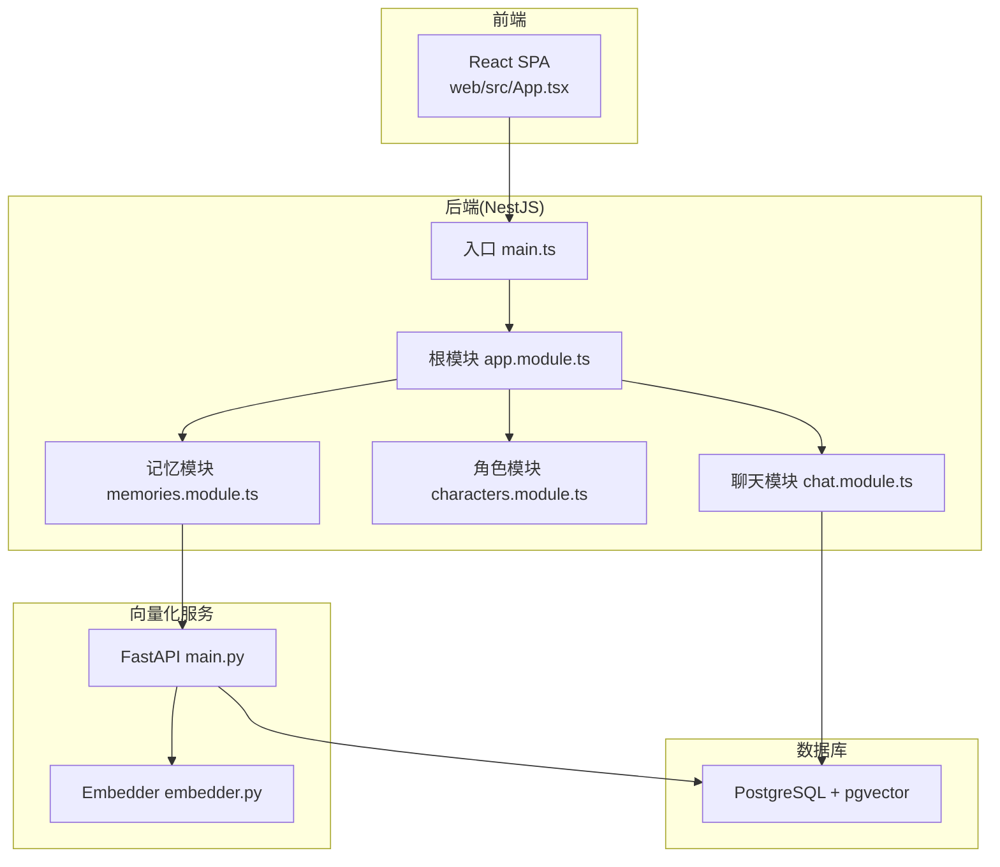
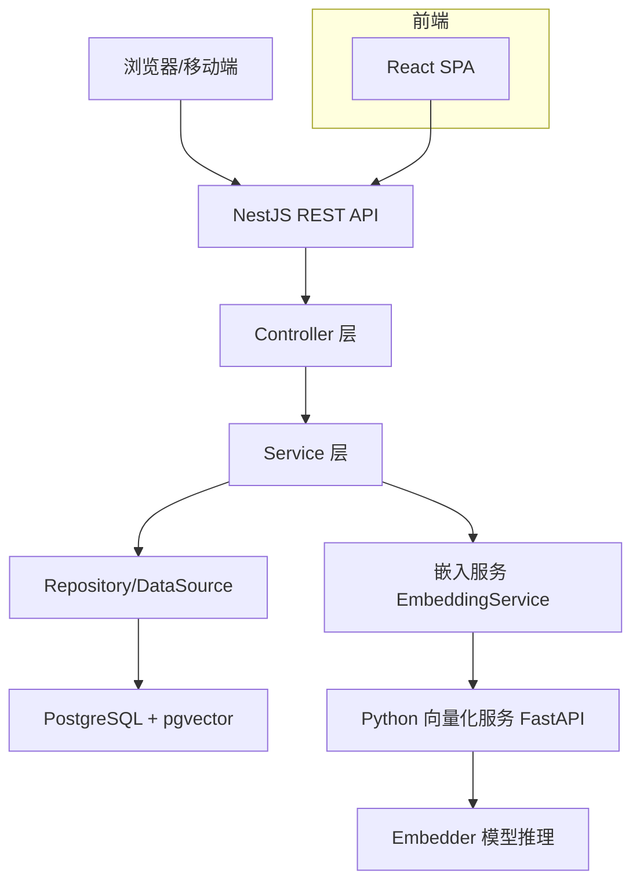
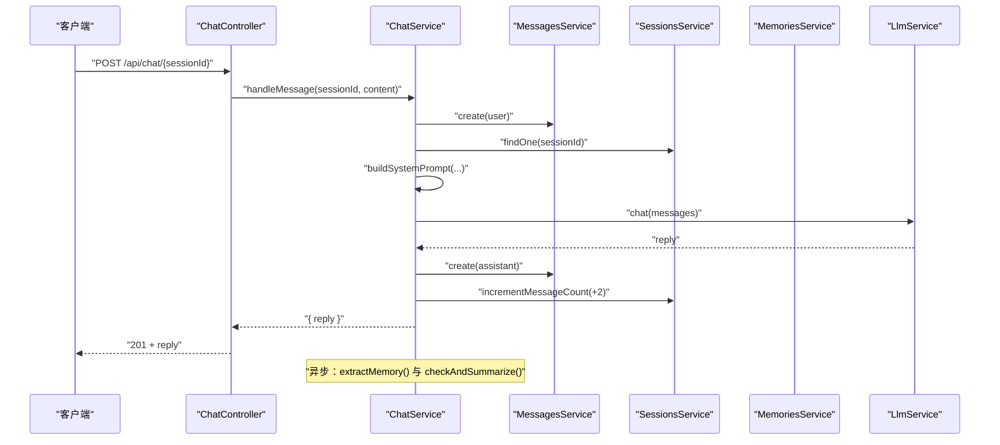
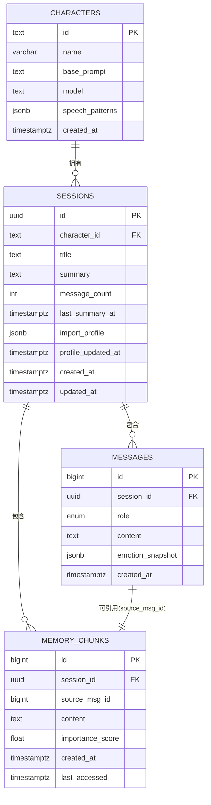
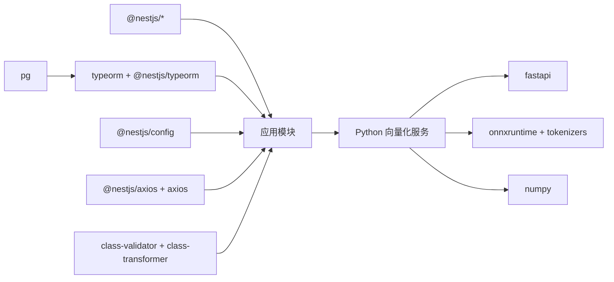

# 学习笔记

<cite>
**本文引用的文件**
- [README.md](file://README.md)
- [Learning_Notes.md](file://docs/Learning_Notes.md)
- [main.ts](file://src/main.ts)
- [package.json](file://package.json)
- [app.module.ts](file://src/app.module.ts)
- [characters.module.ts](file://src/characters/characters.module.ts)
- [chat.module.ts](file://src/chat/chat.module.ts)
- [memories.module.ts](file://src/memories/memories.module.ts)
- [character.entity.ts](file://src/characters/entities/character.entity.ts)
- [session.entity.ts](file://src/sessions/entities/session.entity.ts)
- [message.entity.ts](file://src/messages/entities/message.entity.ts)
- [memory.entity.ts](file://src/memories/entities/memory.entity.ts)
- [chat.service.ts](file://src/chat/chat.service.ts)
- [memories.service.ts](file://src/memories/memories.service.ts)
- [main.py](file://python/main.py)
- [embedder.py](file://python/embedder.py)
- [App.tsx](file://web/src/App.tsx)
</cite>

## 目录
1. [简介](#简介)
2. [项目结构](#项目结构)
3. [核心组件](#核心组件)
4. [架构总览](#架构总览)
5. [详细组件分析](#详细组件分析)
6. [依赖分析](#依赖分析)
7. [性能考虑](#性能考虑)
8. [故障排查指南](#故障排查指南)
9. [结论](#结论)
10. [附录](#附录)

## 简介
本项目是一个基于 NestJS 的 AI 伴侣后端，结合 PostgreSQL + pgvector 实现“向量检索 + 滚动摘要 + 情绪建模”的增强对话系统。前端采用 React + Vite，后端提供 REST API 与流式 SSE，Python 服务负责文本向量化（Embedding）。项目遵循“模块化 + 依赖注入 + ORM + 微服务分离”的架构设计，强调可扩展性与工程化实践。

## 项目结构
- 后端（NestJS）
  - src：核心业务模块与实体
  - web：React 前端（SPA）
  - python：FastAPI 向量化服务
  - docs：学习笔记与实施计划
- 基础设施
  - Docker + pgvector：数据库与向量扩展
  - 环境变量：.env 配置数据库、LLM 密钥、Python Embedding 服务地址

图表来源
- [main.ts:1-22](file://src/main.ts#L1-L22)
- [app.module.ts:18-63](file://src/app.module.ts#L18-L63)
- [chat.module.ts:12-34](file://src/chat/chat.module.ts#L12-L34)
- [characters.module.ts:7-13](file://src/characters/characters.module.ts#L7-L13)
- [memories.module.ts:5-17](file://src/memories/memories.module.ts#L5-L17)
- [main.py:1-123](file://python/main.py#L1-L123)
- [embedder.py:1-116](file://python/embedder.py#L1-L116)

章节来源
- [README.md:24-99](file://README.md#L24-L99)
- [package.json:8-27](file://package.json#L8-L27)
- [app.module.ts:18-63](file://src/app.module.ts#L18-L63)

## 核心组件
- 应用入口与跨域
  - main.ts 设置 CORS（开发阶段允许任意来源），监听端口并输出访问提示。
- 根模块装配
  - app.module.ts 配置静态资源服务（ServeStaticModule）、ConfigModule 全局读取 .env、TypeORM 连接 PostgreSQL 并启用 pgvector 初始化迁移。
- 业务模块
  - characters.module.ts：角色实体与服务，供其他模块依赖。
  - chat.module.ts：聊天核心模块，编排角色、会话、消息、LLM、记忆、情绪模块。
  - memories.module.ts：记忆模块，不注册 TypeORM Entity，直接使用 DataSource 进行原生 SQL 操作，避免 pgvector 的 VECTOR 类型被 TypeORM 删除。
- 数据实体
  - Character：角色表，包含 id、name、basePrompt、model、speechPatterns、createdAt。
  - Session：会话表，包含 characterId、title、summary、messageCount、lastSummaryAt、importProfile、profileUpdatedAt、createdAt、updatedAt。
  - Message：消息表，包含 sessionId、role、content、emotionSnapshot、createdAt。
  - MemoryChunk：记忆碎片表，包含 session_id、source_msg_id、content、memory_type、importance_score、created_at、last_accessed；embedding 字段不映射，走原生 SQL。
- 服务与流程
  - chat.service.ts：核心编排，同步保存用户消息、读取上下文、向量检索记忆、组装 system prompt、调用 LLM、保存 AI 回复、更新计数；异步触发记忆提取与滚动摘要。
  - memories.service.ts：向量检索、写入、查重（余弦相似度阈值），均通过 DataSource.query 执行原生 SQL。

章节来源
- [main.ts:7-19](file://src/main.ts#L7-L19)
- [app.module.ts:23-50](file://src/app.module.ts#L23-L50)
- [characters.module.ts:7-13](file://src/characters/characters.module.ts#L7-L13)
- [chat.module.ts:12-34](file://src/chat/chat.module.ts#L12-L34)
- [memories.module.ts:5-17](file://src/memories/memories.module.ts#L5-L17)
- [character.entity.ts:3-22](file://src/characters/entities/character.entity.ts#L3-L22)
- [session.entity.ts:32-63](file://src/sessions/entities/session.entity.ts#L32-L63)
- [message.entity.ts:5-24](file://src/messages/entities/message.entity.ts#L5-L24)
- [memory.entity.ts:16-43](file://src/memories/entities/memory.entity.ts#L16-L43)
- [chat.service.ts:29-113](file://src/chat/chat.service.ts#L29-L113)
- [memories.service.ts:29-137](file://src/memories/memories.service.ts#L29-L137)

## 架构总览
系统采用“后端 API + 前端 SPA + 向量化微服务”的分层架构。后端负责业务编排与持久化，前端负责交互与状态展示，Python 服务负责文本向量化。数据库使用 PostgreSQL + pgvector，支持向量相似度检索与索引。

图表来源
- [main.ts:1-22](file://src/main.ts#L1-L22)
- [chat.service.ts:29-113](file://src/chat/chat.service.ts#L29-L113)
- [memories.service.ts:29-137](file://src/memories/memories.service.ts#L29-L137)
- [main.py:1-123](file://python/main.py#L1-L123)
- [embedder.py:31-116](file://python/embedder.py#L31-L116)

## 详细组件分析

### 聊天服务（ChatService）编排流程
- 同步阶段（用户等待）
  - 情绪分析与AI情绪建模
  - 保存用户消息
  - 读取会话与角色
  - 读取最近消息
  - 向量检索记忆
  - 组装 system prompt（四层叠加）
  - 调用 LLM 生成回复
  - 保存 AI 回复
  - 更新消息计数
- 异步阶段（不阻塞用户）
  - 记忆提取（事实/偏好/情绪）
  - 滚动摘要检查

图表来源
- [chat.service.ts:42-113](file://src/chat/chat.service.ts#L42-L113)

章节来源
- [chat.service.ts:29-113](file://src/chat/chat.service.ts#L29-L113)

### 记忆服务（MemoriesService）向量检索与写入
- 向量检索：使用 pgvector 的余弦距离运算符，返回相似度排序的记忆片段。
- 写入记忆：将文本向量化后写入 memory_chunks，embedding 为 VECTOR(768)，不映射至 TypeORM。
- 查重：通过余弦相似度阈值判断是否重复，避免冗余存储。

图表来源
- [memories.service.ts:42-137](file://src/memories/memories.service.ts#L42-L137)
- [main.py:91-112](file://python/main.py#L91-L112)
- [embedder.py:103-115](file://python/embedder.py#L103-L115)

章节来源
- [memories.service.ts:29-137](file://src/memories/memories.service.ts#L29-L137)
- [main.py:1-123](file://python/main.py#L1-L123)
- [embedder.py:1-116](file://python/embedder.py#L1-L116)

### 数据模型与关系
- 角色（characters）：固定人格与模型选择。
- 会话（sessions）：关联角色，维护摘要、消息计数与导入画像。
- 消息（messages）：按会话归档，保留完整对话历史。
- 记忆碎片（memory_chunks）：与会话关联，存储向量与类型，支持相似度检索。

图表来源
- [character.entity.ts:3-22](file://src/characters/entities/character.entity.ts#L3-L22)
- [session.entity.ts:32-63](file://src/sessions/entities/session.entity.ts#L32-L63)
- [message.entity.ts:5-24](file://src/messages/entities/message.entity.ts#L5-L24)
- [memory.entity.ts:16-43](file://src/memories/entities/memory.entity.ts#L16-L43)

章节来源
- [character.entity.ts:3-22](file://src/characters/entities/character.entity.ts#L3-L22)
- [session.entity.ts:32-63](file://src/sessions/entities/session.entity.ts#L32-L63)
- [message.entity.ts:5-24](file://src/messages/entities/message.entity.ts#L5-L24)
- [memory.entity.ts:16-43](file://src/memories/entities/memory.entity.ts#L16-L43)

### 前端集成与上下文加载
- App.tsx 通过 AppProvider 初始化上下文，首次渲染时加载角色与会话列表，为聊天界面提供数据基础。

章节来源
- [App.tsx:6-20](file://web/src/App.tsx#L6-L20)

## 依赖分析
- 后端依赖
  - @nestjs/*：框架与平台层
  - typeorm + @nestjs/typeorm + pg：ORM 与 PostgreSQL 驱动
  - @nestjs/config：环境变量管理
  - @nestjs/axios + axios：HTTP 客户端
  - class-validator + class-transformer：请求参数校验与转换
- 前端依赖
  - react + react-dom：UI 框架
  - vite + typescript：构建与类型支持
- Python 向量化服务
  - fastapi：API 框架
  - onnxruntime + tokenizers：模型推理与分词
  - numpy：向量计算

图表来源
- [package.json:29-45](file://package.json#L29-L45)
- [package.json:47-71](file://package.json#L47-L71)
- [main.py:23-29](file://python/main.py#L23-L29)
- [embedder.py:19-21](file://python/embedder.py#L19-L21)

章节来源
- [package.json:29-71](file://package.json#L29-L71)
- [main.py:1-123](file://python/main.py#L1-L123)
- [embedder.py:1-116](file://python/embedder.py#L1-L116)

## 性能考虑
- 数据库层
  - 使用 pgvector 的 HNSW 索引与余弦相似度，提升大规模向量检索效率。
  - 通过 DataSource.query 直接操作 VECTOR 列，避免 TypeORM 同步导致的列丢失风险。
- 服务层
  - 异步记忆提取与滚动摘要，避免阻塞主流程。
  - SSE 流式返回，改善用户体验。
- 前端层
  - SPA 架构减少页面刷新，结合 React 状态管理优化渲染。

## 故障排查指南
- 环境与依赖
  - 确认 Docker Desktop 已启动，pgvector 容器运行并映射端口。
  - 检查 .env 配置（DB_HOST、DB_PORT、DB_USER、DB_PASSWORD、DB_NAME、DEEPSEEK_API_KEY、PYTHON_EMBED_URL、PORT）。
- 数据库连接
  - TypeORM 连接参数与迁移配置需与 pgvector 一致，确保 migrationsRun 生效。
- API 调用
  - 使用 Node.js 脚本或 VS Code REST Client 发送中文请求，避免 Windows bash 编码问题。
- 向量化服务
  - 确保 Python 服务端口与 .env 中 PYTHON_EMBED_URL 一致；模型文件存在或启用 MOCK 模式验证流程。
- 日志与调试
  - 开启 DB_LOGGING=true 查看 SQL；观察 ChatService 中的日志输出（记忆提取、滚动摘要）。

章节来源
- [Learning_Notes.md:646-760](file://docs/Learning_Notes.md#L646-L760)
- [app.module.ts:37-50](file://src/app.module.ts#L37-L50)
- [main.py:33-71](file://python/main.py#L33-L71)

## 结论
本项目通过模块化设计与清晰的职责划分，实现了从角色、会话、消息到记忆与情绪的完整对话闭环。借助 pgvector 的向量检索能力与 Python 向量化服务，系统具备良好的扩展性与工程化实践。建议在生产环境中关闭 TypeORM 的 synchronize，使用迁移管理数据库结构，并完善监控与日志体系。

## 附录
- 快速启动
  - 后端：npm run start:dev
  - 前端：cd web && npm run dev
  - Python 向量化服务：uv run uvicorn python/main:app --port 8000
- 常用脚本
  - 迁移：npm run migration:run / migration:revert
  - 测试：npm run test / test:e2e
- Docker 与 pgvector
  - 参考学习笔记中的环境搭建步骤与参数说明。

章节来源
- [README.md:30-58](file://README.md#L30-L58)
- [package.json:8-27](file://package.json#L8-L27)
- [Learning_Notes.md:75-211](file://docs/Learning_Notes.md#L75-L211)