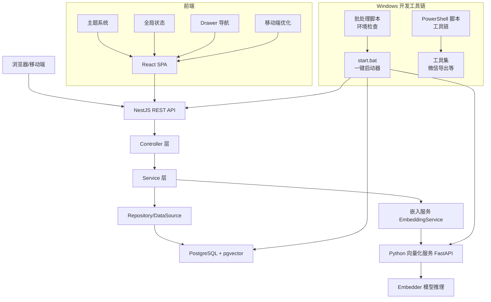
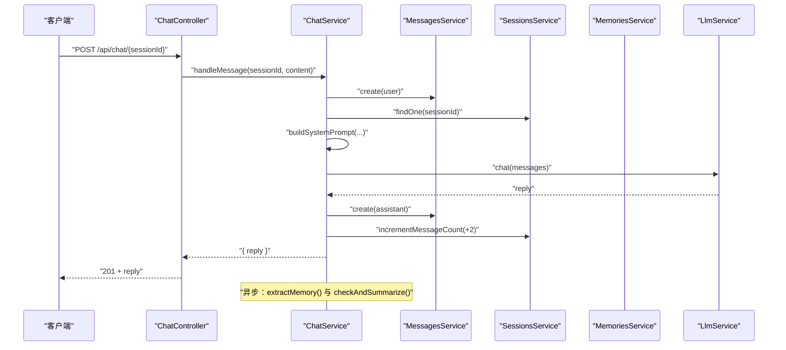
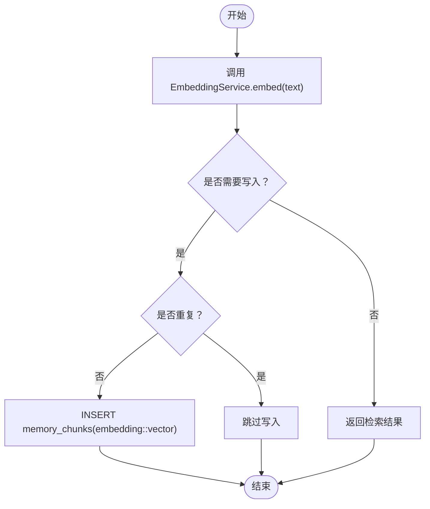
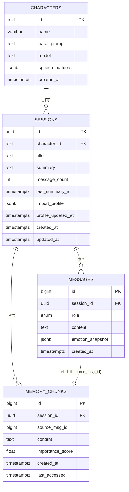
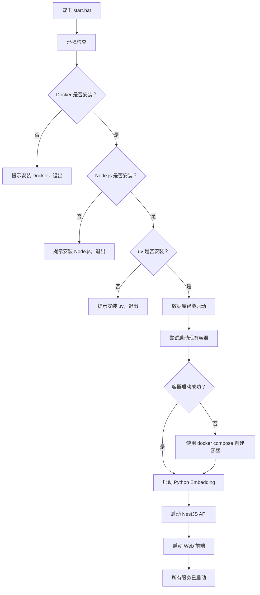
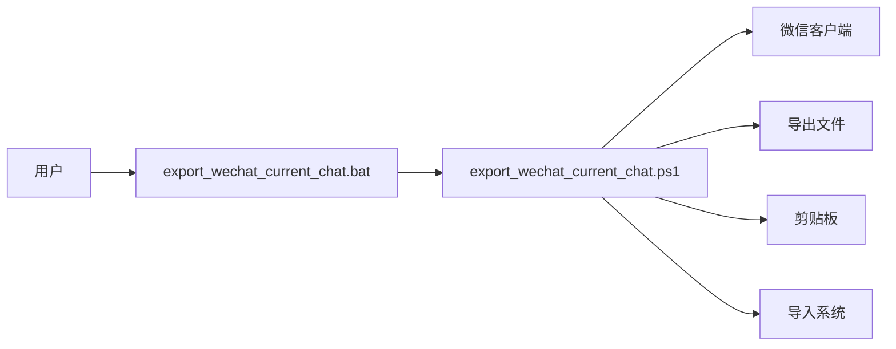
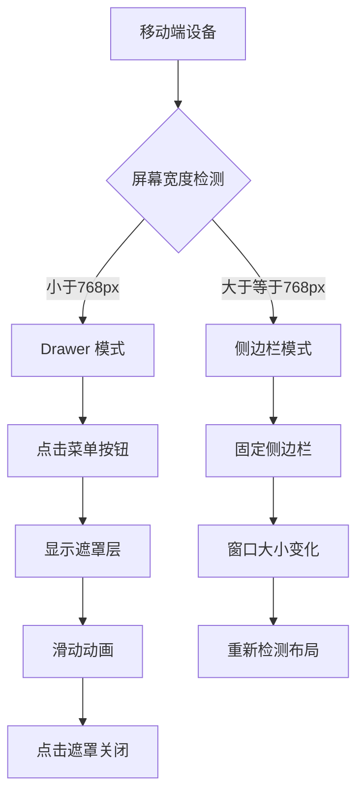
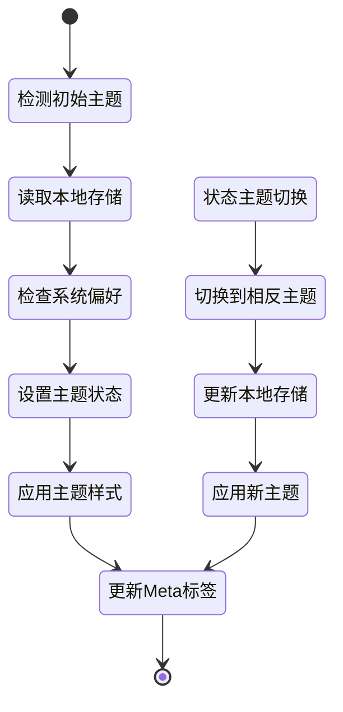
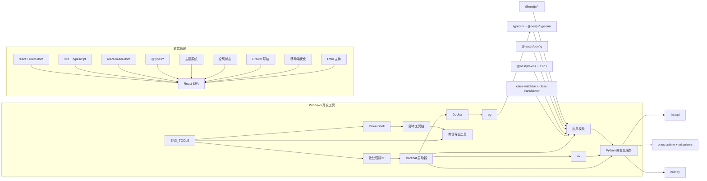

# 学习笔记

<cite>
**本文引用的文件**
- [README.md](file://README.md)
- [Learning_Notes.md](file://docs/Learning_Notes.md)
- [Implementation_Plan.md](file://docs/Implementation_Plan.md)
- [start.bat](file://start.bat)
- [main.ts](file://src/main.ts)
- [package.json](file://package.json)
- [app.module.ts](file://src/app.module.ts)
- [characters.module.ts](file://src/characters/characters.module.ts)
- [chat.module.ts](file://src/chat/chat.module.ts)
- [memories.module.ts](file://src/memories/memories.module.ts)
- [character.entity.ts](file://src/characters/entities/character.entity.ts)
- [session.entity.ts](file://src/sessions/entities/session.entity.ts)
- [message.entity.ts](file://src/messages/entities/message.entity.ts)
- [memory.entity.ts](file://src/memories/entities/memory.entity.ts)
- [chat.service.ts](file://src/chat/chat.service.ts)
- [memories.service.ts](file://src/memories/memories.service.ts)
- [main.py](file://python/main.py)
- [embedder.py](file://python/embedder.py)
- [App.tsx](file://web/src/App.tsx)
- [main.tsx](file://web/src/main.tsx)
- [useTheme.ts](file://web/src/hooks/useTheme.ts)
- [AppContext.tsx](file://web/src/context/AppContext.tsx)
- [export_wechat_current_chat.bat](file://tools/export_wechat_current_chat.bat)
- [export_wechat_current_chat.ps1](file://tools/export_wechat_current_chat.ps1)
- [README_wechat_export.md](file://tools/README_wechat_export.md)
</cite>

## 更新摘要
**所做更改**
- 新增 Windows 批处理脚本学习内容，包括批处理脚本基础语法、常用命令详解
- 新增 start.bat 开发启动器的完整技术说明，涵盖设计逻辑、环境检查、数据库智能启动
- 新增 PowerShell 脚本工具链的使用说明，包括微信聊天导出工具
- 新增开发环境自动化启动的最佳实践和故障排查指南

## 目录
1. [简介](#简介)
2. [项目结构](#项目结构)
3. [核心组件](#核心组件)
4. [架构总览](#架构总览)
5. [详细组件分析](#详细组件分析)
6. [Windows 批处理脚本学习](#windows-批处理脚本学习)
7. [start.bat 开发启动器](#startbat-开发启动器)
8. [PowerShell 脚本工具链](#powershell-脚本工具链)
9. [移动端优化与响应式设计](#移动端优化与响应式设计)
10. [主题切换系统](#主题切换系统)
11. [依赖分析](#依赖分析)
12. [性能考虑](#性能考虑)
13. [故障排查指南](#故障排查指南)
14. [结论](#结论)
15. [附录](#附录)

## 简介
本项目是一个基于 NestJS 的 AI 伴侣后端，结合 PostgreSQL + pgvector 实现"向量检索 + 滚动摘要 + 情绪建模"的增强对话系统。前端采用 React + Vite，后端提供 REST API 与流式 SSE，Python 服务负责文本向量化（Embedding）。项目遵循"模块化 + 依赖注入 + ORM + 微服务分离"的架构设计，强调可扩展性与工程化实践。

**更新** 新增了完整的 Windows 批处理脚本学习内容和 start.bat 开发启动器技术说明，提供了从批处理基础到实际应用的完整学习路径。同时扩展了 PowerShell 脚本工具链，包括微信聊天导出等实用工具。

## 项目结构
- 后端（NestJS）
  - src：核心业务模块与实体
  - web：React 前端（SPA）
  - python：FastAPI 向量化服务
  - docs：学习笔记与实施计划
  - start.bat：Windows 开发环境一键启动器
- 基础设施
  - Docker + pgvector：数据库与向量扩展
  - 环境变量：.env 配置数据库、LLM 密钥、Python Embedding 服务地址
- 工具集
  - tools：PowerShell 脚本工具链，包括微信聊天导出工具

```mermaid
graph TB
subgraph "Windows 开发环境"
START_BAT["start.bat<br/>一键启动器"]
BAT_SCRIPTS["批处理脚本<br/>基础语法学习"]
PS_SCRIPTS["PowerShell 脚本<br/>工具链"]
END_TOOLS["工具集<br/>export_wechat_current_chat.*"]
end
subgraph "前端"
WEB["React SPA<br/>web/src/App.tsx"]
THEME["主题系统<br/>useTheme.ts"]
CONTEXT["全局状态<br/>AppContext.tsx"]
DRAWER["Drawer 导航<br/>Sidebar 组件"]
MOBILE["移动端优化<br/>响应式设计"]
end
subgraph "后端(NestJS)"
MAIN_TS["入口 main.ts"]
APP_MODULE["根模块 app.module.ts"]
CHAT_MOD["聊天模块 chat.module.ts"]
CHAR_MOD["角色模块 characters.module.ts"]
MEM_MOD["记忆模块 memories.module.ts"]
end
subgraph "数据库"
PG["PostgreSQL + pgvector"]
end
subgraph "向量化服务"
PY_MAIN["FastAPI main.py"]
PY_EMB["Embedder embedder.py"]
END_TOOLS --> PS_SCRIPTS
START_BAT --> BAT_SCRIPTS
BAT_SCRIPTS --> START_BAT
PS_SCRIPTS --> END_TOOLS
WEB --> MAIN_TS
MAIN_TS --> APP_MODULE
APP_MODULE --> CHAT_MOD
APP_MODULE --> CHAR_MOD
APP_MODULE --> MEM_MOD
CHAT_MOD --> PG
MEM_MOD --> PY_MAIN
PY_MAIN --> PY_EMB
PY_MAIN --> PG
```

**图表来源**
- [start.bat:1-44](file://start.bat#L1-L44)
- [Learning_Notes.md:3706-3805](file://docs/Learning_Notes.md#L3706-L3805)
- [export_wechat_current_chat.bat:1-4](file://tools/export_wechat_current_chat.bat#L1-L4)
- [export_wechat_current_chat.ps1:1-40](file://tools/export_wechat_current_chat.ps1#L1-L40)
- [main.ts:1-22](file://src/main.ts#L1-L22)
- [app.module.ts:18-63](file://src/app.module.ts#L18-L63)
- [chat.module.ts:12-34](file://src/chat/chat.module.ts#L12-L34)
- [characters.module.ts:7-13](file://src/characters/characters.module.ts#L7-L13)
- [memories.module.ts:5-17](file://src/memories/memories.module.ts#L5-L17)
- [main.py:1-123](file://python/main.py#L1-L123)
- [embedder.py:1-116](file://python/embedder.py#L1-L116)
- [App.tsx:1-44](file://web/src/App.tsx#L1-L44)
- [useTheme.ts:1-44](file://web/src/hooks/useTheme.ts#L1-L44)
- [AppContext.tsx:1-413](file://web/src/context/AppContext.tsx#L1-L413)

**章节来源**
- [README.md:24-99](file://README.md#L24-L99)
- [package.json:8-27](file://package.json#L8-L27)
- [app.module.ts:18-63](file://src/app.module.ts#L18-L63)

## 核心组件
- 应用入口与跨域
  - main.ts 设置 CORS（开发阶段允许任意来源），监听端口并输出访问提示。
- 根模块装配
  - app.module.ts 配置静态资源服务（ServeStaticModule）、ConfigModule 全局读取 .env、TypeORM 连接 PostgreSQL 并启用 pgvector 初始化迁移。
- 业务模块
  - characters.module.ts：角色实体与服务，供其他模块依赖。
  - chat.module.ts：聊天核心模块，编排角色、会话、消息、LLM、记忆、情绪模块。
  - memories.module.ts：记忆模块，不注册 TypeORM Entity，直接使用 DataSource 进行原生 SQL 操作，避免 pgvector 的 VECTOR 类型被 TypeORM 删除。
- 数据实体
  - Character：角色表，包含 id、name、basePrompt、model、speechPatterns、createdAt。
  - Session：会话表，包含 characterId、title、summary、messageCount、lastSummaryAt、importProfile、profileUpdatedAt、createdAt、updatedAt。
  - Message：消息表，包含 sessionId、role、content、emotionSnapshot、createdAt。
  - MemoryChunk：记忆碎片表，包含 session_id、source_msg_id、content、memory_type、importance_score、created_at、last_accessed；embedding 字段不映射，走原生 SQL。
- 服务与流程
  - chat.service.ts：核心编排，同步保存用户消息、读取上下文、向量检索记忆、组装 system prompt、调用 LLM、保存 AI 回复、更新计数；异步触发记忆提取与滚动摘要。
  - memories.service.ts：向量检索、写入、查重（余弦相似度阈值），均通过 DataSource.query 执行原生 SQL。

**章节来源**
- [main.ts:7-19](file://src/main.ts#L7-L19)
- [app.module.ts:23-50](file://src/app.module.ts#L23-L50)
- [characters.module.ts:7-13](file://src/characters/characters.module.ts#L7-L13)
- [chat.module.ts:12-34](file://src/chat/chat.module.ts#L12-L34)
- [memories.module.ts:5-17](file://src/memories/memories.module.ts#L5-L17)
- [character.entity.ts:3-22](file://src/characters/entities/character.entity.ts#L3-L22)
- [session.entity.ts:32-63](file://src/sessions/entities/session.entity.ts#L32-L63)
- [message.entity.ts:5-24](file://src/messages/entities/message.entity.ts#L5-L24)
- [memory.entity.ts:16-43](file://src/memories/entities/memory.entity.ts#L16-L43)
- [chat.service.ts:29-113](file://src/chat/chat.service.ts#L29-L113)
- [memories.service.ts:29-137](file://src/memories/memories.service.ts#L29-L137)

## 架构总览
系统采用"后端 API + 前端 SPA + 向量化微服务 + Windows 开发工具链"的分层架构。后端负责业务编排与持久化，前端负责交互与状态展示，Python 服务负责文本向量化。数据库使用 PostgreSQL + pgvector，支持向量相似度检索与索引。Windows 开发环境通过批处理脚本实现一键启动和环境检查。



**图表来源**
- [start.bat:1-44](file://start.bat#L1-L44)
- [Learning_Notes.md:3745-3791](file://docs/Learning_Notes.md#L3745-L3791)
- [export_wechat_current_chat.ps1:1-40](file://tools/export_wechat_current_chat.ps1#L1-L40)
- [main.ts:1-22](file://src/main.ts#L1-L22)
- [chat.service.ts:29-113](file://src/chat/chat.service.ts#L29-L113)
- [memories.service.ts:29-137](file://src/memories/memories.service.ts#L29-L137)
- [main.py:1-123](file://python/main.py#L1-L123)
- [embedder.py:31-116](file://python/embedder.py#L31-L116)
- [App.tsx:1-44](file://web/src/App.tsx#L1-L44)
- [useTheme.ts:1-44](file://web/src/hooks/useTheme.ts#L1-L44)
- [AppContext.tsx:1-413](file://web/src/context/AppContext.tsx#L1-L413)

## 详细组件分析

### 聊天服务（ChatService）编排流程
- 同步阶段（用户等待）
  - 情绪分析与AI情绪建模
  - 保存用户消息
  - 读取会话与角色
  - 读取最近消息
  - 向量检索记忆
  - 组装 system prompt（四层叠加）
  - 调用 LLM 生成回复
  - 保存 AI 回复
  - 更新消息计数
- 异步阶段（不阻塞用户）
  - 记忆提取（事实/偏好/情绪）
  - 滚动摘要检查



**图表来源**
- [chat.service.ts:42-113](file://src/chat/chat.service.ts#L42-L113)

**章节来源**
- [chat.service.ts:29-113](file://src/chat/chat.service.ts#L29-L113)

### 记忆服务（MemoriesService）向量检索与写入
- 向量检索：使用 pgvector 的余弦距离运算符，返回相似度排序的记忆片段。
- 写入记忆：将文本向量化后写入 memory_chunks，embedding 为 VECTOR(768)，不映射至 TypeORM。
- 查重：通过余弦相似度阈值判断是否重复，避免冗余存储。



**图表来源**
- [memories.service.ts:42-137](file://src/memories/memories.service.ts#L42-L137)
- [main.py:91-112](file://python/main.py#L91-L112)
- [embedder.py:103-115](file://python/embedder.py#L103-L115)

**章节来源**
- [memories.service.ts:29-137](file://src/memories/memories.service.ts#L29-L137)
- [main.py:1-123](file://python/main.py#L1-L123)
- [embedder.py:1-116](file://python/embedder.py#L1-L116)

### 数据模型与关系
- 角色（characters）：固定人格与模型选择。
- 会话（sessions）：关联角色，维护摘要、消息计数与导入画像。
- 消息（messages）：按会话归档，保留完整对话历史。
- 记忆碎片（memory_chunks）：与会话关联，存储向量与类型，支持相似度检索。



**图表来源**
- [character.entity.ts:3-22](file://src/characters/entities/character.entity.ts#L3-L22)
- [session.entity.ts:32-63](file://src/sessions/entities/session.entity.ts#L32-L63)
- [message.entity.ts:5-24](file://src/messages/entities/message.entity.ts#L5-L24)
- [memory.entity.ts:16-43](file://src/memories/entities/memory.entity.ts#L16-L43)

**章节来源**
- [character.entity.ts:3-22](file://src/characters/entities/character.entity.ts#L3-L22)
- [session.entity.ts:32-63](file://src/sessions/entities/session.entity.ts#L32-L63)
- [message.entity.ts:5-24](file://src/messages/entities/message.entity.ts#L5-L24)
- [memory.entity.ts:16-43](file://src/memories/entities/memory.entity.ts#L16-L43)

### 前端集成与上下文加载
- App.tsx 通过 AppProvider 初始化上下文，首次渲染时加载角色与会话列表，为聊天界面提供数据基础。

**章节来源**
- [App.tsx:6-20](file://web/src/App.tsx#L6-L20)

## Windows 批处理脚本学习

### 批处理脚本基础语法

Windows 批处理脚本（.bat）是 Windows 系统的命令行脚本语言，具有以下特点：

#### 常用命令详解

| 命令 | 说明 | 示例 |
|------|------|------|
| `@echo off` | 关闭命令回显，让输出更干净 | 脚本开头必加 |
| `echo` | 输出文字 | `echo Hello World` |
| `start "标题" cmd /k "命令"` | 新窗口执行命令，窗口保持打开 | `start "API" cmd /k "npm run dev"` |
| `cd /d %~dp0` | 切换到 bat 文件所在目录 | `%~dp0` 是 bat 文件所在路径 |
| `if %errorlevel% neq 0` | 判断上一条命令是否失败 | `neq` = not equal |
| `>nul 2>&1` | 静默执行，不输出任何内容 | `docker --version >nul 2>&1` |
| `pause` | 暂停，等用户按键 | 脚本结尾，防止窗口闪退 |
| `chcp 65001` | 切换控制台编码为 UTF-8 | 支持中文显示 |
| `::` 或 `rem` | 注释 | `:: 这是注释` |

#### `start` 命令详解

```bat
start "窗口标题" cmd /k "要执行的命令"
```

- `"窗口标题"`：新窗口的标题栏文字，方便识别
- `cmd /k`：执行命令后**保持窗口打开**（`/c` 是执行后关闭）
- 每个服务一个独立窗口，关闭窗口 = 停止该服务

#### `%~dp0` 路径解析

```
假设 start.bat 在 D:\Code\AI\companion\start.bat

%~dp0 = D:\Code\AI\companion\    （带末尾反斜杠）

cd /d %~dp0python  →  切换到 D:\Code\AI\companion\python
cd /d %~dp0web     →  切换到 D:\Code\AI\companion\web
```

`%0` 是脚本自身路径，`%~d` 提取盘符，`%~p` 提取路径，`%~dp0` 合起来就是脚本所在目录。

**章节来源**
- [Learning_Notes.md:3706-3741](file://docs/Learning_Notes.md#L3706-L3741)

### 批处理脚本最佳实践

#### 环境检查模式
批处理脚本通常采用"环境检查 + 条件启动"的模式：

```bat
docker --version >nul 2>&1 || goto :no_docker
node --version >nul 2>&1 || goto :no_node
uv --version >nul 2>&1 || goto :no_uv
```

- `>nul 2>&1`：静默执行，不输出任何内容
- `||`：如果前一条命令失败（返回非0），则执行后续命令
- `goto :label`：跳转到指定标签处

#### 错误处理机制
```bat
docker start companion-pg >nul 2>&1 && goto :pg_ok
echo       容器不存在，使用 docker compose 启动...
docker compose --env-file .env.docker up postgres -d || goto :pg_fail
```

- `&&`：前一条命令成功才执行后一条
- `||`：前一条命令失败才执行后一条
- `goto :label`：错误时跳转到相应处理标签

**章节来源**
- [Learning_Notes.md:3706-3805](file://docs/Learning_Notes.md#L3706-L3805)

## start.bat 开发启动器

### 设计逻辑与启动流程

start.bat 是一个完整的 Windows 开发环境一键启动器，采用"环境检查 + 智能启动 + 独立窗口"的设计理念。

#### 启动流程图



**图表来源**
- [start.bat:14-28](file://start.bat#L14-L28)
- [Learning_Notes.md:3749-3768](file://docs/Learning_Notes.md#L3749-L3768)

#### 数据库智能启动机制

start.bat 实现了"复用现有容器 + 创建新容器"的智能启动策略：

```bat
docker start companion-pg >nul 2>&1 && goto :pg_ok
echo       容器不存在，使用 docker compose 启动...
docker compose --env-file .env.docker up postgres -d || goto :pg_fail
```

- **第一次运行**：`companion-pg` 容器不存在 → `docker start` 失败 → 回退到 `docker compose up`
- **后续运行**：容器已存在但可能停止 → `docker start` 直接启动，比 `docker compose up` 更快

#### 环境变量设置与服务启动

```bat
start "Embedding Service" cmd /k "cd /d %~dp0python&& set MOCK_EMBEDDING=1&& uv run uvicorn main:app --port 8000 --reload"
```

- `set MOCK_EMBEDDING=1`：设置环境变量，让 Python 使用 Mock 向量
- `&&`：前一条成功才执行后一条
- `--reload`：Python 热更新，修改代码自动重启

### 为什么每个服务用独立窗口？

| 方案 | 优点 | 缺点 |
|------|------|------|
| 所有服务同一窗口 | 节省屏幕空间 | 一个服务崩溃日志被其他服务刷走，难以排查 |
| 每服务独立窗口 | 日志隔离，关闭单个窗口停止单个服务 | 占 4 个窗口 |

独立窗口更实用：开发时通常只关注 API 和前端日志，数据库和 Embedding 的窗口可以最小化。

### 开发环境配置信息

启动完成后，脚本会显示各服务的访问地址：

- **PostgreSQL**：localhost:55432
- **Embedding**：localhost:8000（Mock 模式）
- **API**：localhost:3000
- **Web**：localhost:5173

**章节来源**
- [start.bat:1-44](file://start.bat#L1-L44)
- [Learning_Notes.md:3745-3791](file://docs/Learning_Notes.md#L3745-L3791)

### 踩坑记录与注意事项

#### 常见问题及解决方案

1. **`cd` 不能跨盘符**：`cd D:\other` 在 C 盘下不会切换。必须用 `cd /d D:\other`，`/d` 表示同时切换盘符和目录。

2. **`set` 环境变量作用域**：`set MOCK_EMBEDDING=1` 只在当前 cmd 会话生效。用 `start cmd /k "set VAR=1 && command"` 可以在新窗口中设置。

3. **`chcp 65001` 防止中文乱码**：Windows 默认使用 GBK 编码，`echo` 输出中文会乱码。`chcp 65001` 切换到 UTF-8 编码。

4. **Docker 权限问题**：确保当前用户属于 docker-users 组，否则可能出现权限错误。

5. **端口冲突**：如果 3000、5173、8000、55432 端口被占用，需要手动释放或修改配置。

**章节来源**
- [Learning_Notes.md:3801-3805](file://docs/Learning_Notes.md#L3801-L3805)

## PowerShell 脚本工具链

### export_wechat_current_chat 工具集

项目提供了完整的微信聊天导出工具链，包括批处理脚本和 PowerShell 脚本：

#### 批处理脚本封装

```bat
powershell -NoProfile -ExecutionPolicy Bypass -File "%~dp0export_wechat_current_chat.ps1" -SelectAll %*
```

- `-NoProfile`：不加载 PowerShell 配置文件，启动更快
- `-ExecutionPolicy Bypass`：绕过执行策略限制
- `"%~dp0export_wechat_current_chat.ps1"`：指向 PowerShell 脚本文件
- `-SelectAll`：选择所有聊天记录
- `%*`：传递原始参数给 PowerShell 脚本

#### PowerShell 脚本功能特性

export_wechat_current_chat.ps1 提供了多种使用场景：

| 参数 | 功能 | 说明 |
|------|------|------|
| `-SelectAll` | 选择所有聊天记录 | 默认选项 |
| `-NoAutoCopy` | 不自动复制到剪贴板 | 仅导出到文件 |
| `-Import` | 导入到系统 | 导入到指定会话ID |
| `-SessionId <UUID>` | 指定会话ID | 与 -Import 搭配使用 |

#### 使用示例

```bash
# 导出所有聊天记录到剪贴板
powershell -ExecutionPolicy Bypass -File tools\export_wechat_current_chat.ps1 -SelectAll

# 仅导出到文件，不复制到剪贴板
powershell -ExecutionPolicy Bypass -File tools\export_wechat_current_chat.ps1 -NoAutoCopy

# 导入到指定会话
powershell -ExecutionPolicy Bypass -File tools\export_wechat_current_chat.ps1 -SelectAll -Import -SessionId <UUID>
```

### 工具链架构图



**图表来源**
- [export_wechat_current_chat.bat:1-4](file://tools/export_wechat_current_chat.bat#L1-L4)
- [export_wechat_current_chat.ps1:1-40](file://tools/export_wechat_current_chat.ps1#L1-L40)

**章节来源**
- [export_wechat_current_chat.bat:1-4](file://tools/export_wechat_current_chat.bat#L1-L4)
- [export_wechat_current_chat.ps1:1-40](file://tools/export_wechat_current_chat.ps1#L1-L40)
- [README_wechat_export.md:14-40](file://tools/README_wechat_export.md#L14-L40)

## 移动端优化与响应式设计

### Drawer 导航系统
应用采用了现代化的 Drawer 导航模式，特别针对移动设备进行了优化：

- **响应式布局**：在小屏幕设备上自动切换到 Drawer 模式，在桌面设备上显示侧边栏
- **手势支持**：支持滑动手势打开/关闭侧边栏
- **遮罩层**：点击遮罩层自动关闭 Drawer
- **状态管理**：通过 AppContext 管理 Drawer 的打开/关闭状态



**图表来源**
- [App.tsx:8-33](file://web/src/App.tsx#L8-L33)
- [AppContext.tsx:197-213](file://web/src/context/AppContext.tsx#L197-L213)

### Safe Area 处理机制
为了适配不同设备的安全区域（如 iPhone X 系列的刘海屏、底部安全区域），应用实现了以下处理：

- **CSS 自定义属性**：使用 `env()` 和 `safe-area-inset-*` 函数
- **动态计算**：根据设备类型动态调整内边距
- **全屏适配**：确保内容不会被系统 UI 遮挡

### iOS PWA 支持
应用完全支持 iOS PWA（渐进式 Web 应用）：

- **Web App Manifest**：完整的 PWA 配置文件
- **图标适配**：支持不同分辨率的应用图标
- **启动画面**：自定义启动画面
- **状态栏样式**：支持主题色状态栏
- **离线缓存**：Service Worker 实现离线访问

**章节来源**
- [App.tsx:10-32](file://web/src/App.tsx#L10-L32)
- [AppContext.tsx:217-402](file://web/src/context/AppContext.tsx#L217-L402)

## 主题切换系统

### 主题管理架构
应用实现了完整的主题切换系统，支持深色/浅色主题自动切换：

- **Hook 系统**：useTheme Hook 管理主题状态
- **本地存储**：使用 localStorage 持久化用户偏好
- **系统匹配**：自动检测系统主题设置
- **Meta 标签更新**：动态更新主题色 meta 标签

### 主题切换流程


**图表来源**
- [useTheme.ts:11-43](file://web/src/hooks/useTheme.ts#L11-L43)

### 主题配置
- **主题类型**：`Theme = 'dark' | 'light'`
- **存储键名**：`'companion-theme'`
- **Meta 主题颜色**：
  - 深色主题：`#0d0c0e`
  - 浅色主题：`#f7f3ee`
- **默认主题**：根据系统偏好自动选择

**章节来源**
- [useTheme.ts:1-44](file://web/src/hooks/useTheme.ts#L1-L44)

## 依赖分析
- 后端依赖
  - @nestjs/*：框架与平台层
  - typeorm + @nestjs/typeorm + pg：ORM 与 PostgreSQL 驱动
  - @nestjs/config：环境变量管理
  - @nestjs/axios + axios：HTTP 客户端
  - class-validator + class-transformer：请求参数校验与转换
- 前端依赖
  - react + react-dom：UI 框架
  - vite + typescript：构建与类型支持
  - react-router-dom：路由管理
  - @types/react + @types/react-dom：类型定义
- Python 向量化服务
  - fastapi：API 框架
  - onnxruntime + tokenizers：模型推理与分词
  - numpy：向量计算
- **新增** Windows 开发工具
  - Docker：容器化数据库服务
  - uv：Python 包管理和虚拟环境
  - PowerShell：脚本执行环境



**图表来源**
- [package.json:29-71](file://package.json#L29-L71)
- [main.py:23-29](file://python/main.py#L23-L29)
- [embedder.py:19-21](file://python/embedder.py#L19-L21)
- [useTheme.ts:1-44](file://web/src/hooks/useTheme.ts#L1-L44)
- [AppContext.tsx:1-413](file://web/src/context/AppContext.tsx#L1-L413)
- [start.bat:1-44](file://start.bat#L1-L44)
- [export_wechat_current_chat.bat:1-4](file://tools/export_wechat_current_chat.bat#L1-L4)

**章节来源**
- [package.json:29-71](file://package.json#L29-L71)
- [main.py:1-123](file://python/main.py#L1-L123)
- [embedder.py:1-116](file://python/embedder.py#L1-L116)

## 性能考虑
- 数据库层
  - 使用 pgvector 的 HNSW 索引与余弦相似度，提升大规模向量检索效率。
  - 通过 DataSource.query 直接操作 VECTOR 列，避免 TypeORM 同步导致的列丢失风险。
- 服务层
  - 异步记忆提取与滚动摘要，避免阻塞主流程。
  - SSE 流式返回，改善用户体验。
- 前端层
  - SPA 架构减少页面刷新，结合 React 状态管理优化渲染。
  - **新增** Drawer 导航的懒加载优化，仅在需要时渲染侧边栏内容。
  - **新增** 主题切换的 CSS 变量优化，避免频繁的 DOM 操作。
  - **新增** 响应式布局的媒体查询优化，减少不必要的重排重绘。
- **新增** Windows 开发环境性能优化
  - **数据库智能启动**：复用现有容器比重新创建更快
  - **独立窗口管理**：便于并行开发和调试
  - **Mock 模式**：开发阶段使用 Mock 向量，启动更快、内存占用更少
  - **热更新机制**：Python 和前端都支持热更新，提高开发效率

## 故障排查指南
- 环境与依赖
  - 确认 Docker Desktop 已启动，pgvector 容器运行并映射端口。
  - 检查 .env 配置（DB_HOST、DB_PORT、DB_USER、DB_PASSWORD、DB_NAME、DEEPSEEK_API_KEY、PYTHON_EMBED_URL、PORT）。
  - **新增** 验证 Windows 开发环境：Docker、Node.js、uv 是否正确安装。
- 数据库连接
  - TypeORM 连接参数与迁移配置需与 pgvector 一致，确保 migrationsRun 生效。
- API 调用
  - 使用 Node.js 脚本或 VS Code REST Client 发送中文请求，避免 Windows bash 编码问题。
- 向量化服务
  - 确保 Python 服务端口与 .env 中 PYTHON_EMBED_URL 一致；模型文件存在或启用 MOCK 模式验证流程。
- **新增** Windows 批处理脚本问题
  - **编码问题**：确保使用 `chcp 65001` 设置 UTF-8 编码
  - **路径问题**：使用 `%~dp0` 获取脚本所在目录，避免相对路径错误
  - **权限问题**：PowerShell 脚本需要适当的执行策略设置
  - **端口冲突**：检查 3000、5173、8000、55432 端口是否被占用
- **新增** 移动端兼容性
  - 检查 viewport meta 标签配置
  - 验证 Safe Area CSS 属性是否正确应用
  - 测试 Drawer 导航在不同设备上的表现
- **新增** 主题系统
  - 检查 localStorage 是否正常工作
  - 验证 CSS 变量 `data-theme` 是否正确设置
  - 确认 Meta 主题色标签是否动态更新

**章节来源**
- [Learning_Notes.md:646-760](file://docs/Learning_Notes.md#L646-L760)
- [app.module.ts:37-50](file://src/app.module.ts#L37-L50)
- [main.py:33-71](file://python/main.py#L33-L71)
- [start.bat:10-12](file://start.bat#L10-L12)
- [Learning_Notes.md:3801-3805](file://docs/Learning_Notes.md#L3801-L3805)

## 结论
本项目通过模块化设计与清晰的职责划分，实现了从角色、会话、消息到记忆与情绪的完整对话闭环。借助 pgvector 的向量检索能力与 Python 向量化服务，系统具备良好的扩展性与工程化实践。

**更新** 最新版本显著增强了开发体验，通过完整的 Windows 批处理脚本学习内容、start.bat 开发启动器和 PowerShell 脚本工具链，提供了从基础语法到实际应用的完整学习路径。新增的移动端优化特性进一步提升了跨设备用户体验。建议在生产环境中关闭 TypeORM 的 synchronize，使用迁移管理数据库结构，并完善监控与日志体系。

## 附录
- 快速启动
  - 后端：npm run start:dev
  - 前端：cd web && npm run dev
  - Python 向量化服务：uv run uvicorn python/main:app --port 8000
  - **新增** Windows 开发启动：双击 start.bat
- 常用脚本
  - 迁移：npm run migration:run / migration:revert
  - 测试：npm run test / test:e2e
  - **新增** 批处理脚本：start.bat（一键启动所有服务）
  - **新增** PowerShell 工具：export_wechat_current_chat.ps1（微信导出）
- Docker 与 pgvector
  - 参考学习笔记中的环境搭建步骤与参数说明。
- **新增** Windows 开发环境
  - 批处理脚本学习：从基础语法到实际应用
  - start.bat 启动器：环境检查、智能启动、独立窗口管理
  - PowerShell 工具链：微信聊天导出等实用工具
- **新增** 移动端开发
  - Drawer 导航测试：在移动端设备上验证滑动手势和点击行为
  - 主题切换测试：验证深色/浅色主题在不同设备上的显示效果
  - PWA 功能测试：验证 iOS PWA 安装和离线功能

**章节来源**
- [README.md:30-58](file://README.md#L30-L58)
- [package.json:8-27](file://package.json#L8-L27)
- [Learning_Notes.md:75-211](file://docs/Learning_Notes.md#L75-L211)
- [start.bat:1-44](file://start.bat#L1-L44)
- [export_wechat_current_chat.bat:1-4](file://tools/export_wechat_current_chat.bat#L1-L4)
- [export_wechat_current_chat.ps1:1-40](file://tools/export_wechat_current_chat.ps1#L1-L40)