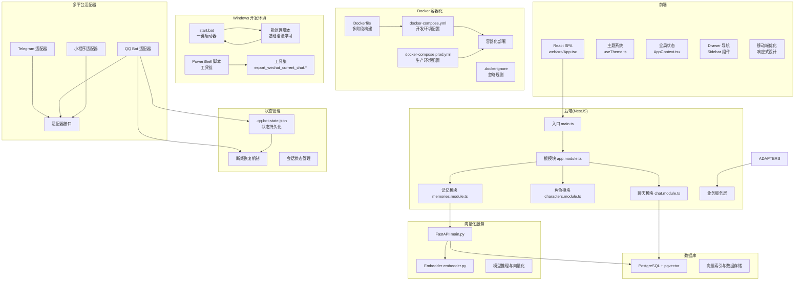
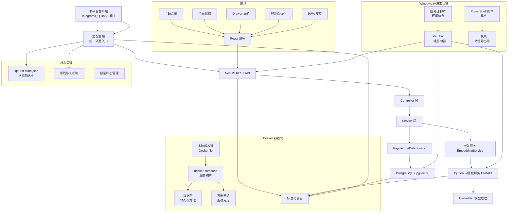
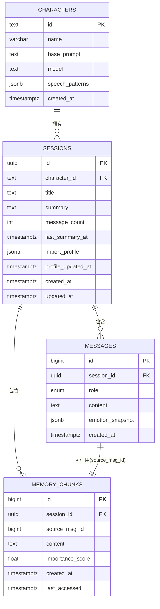
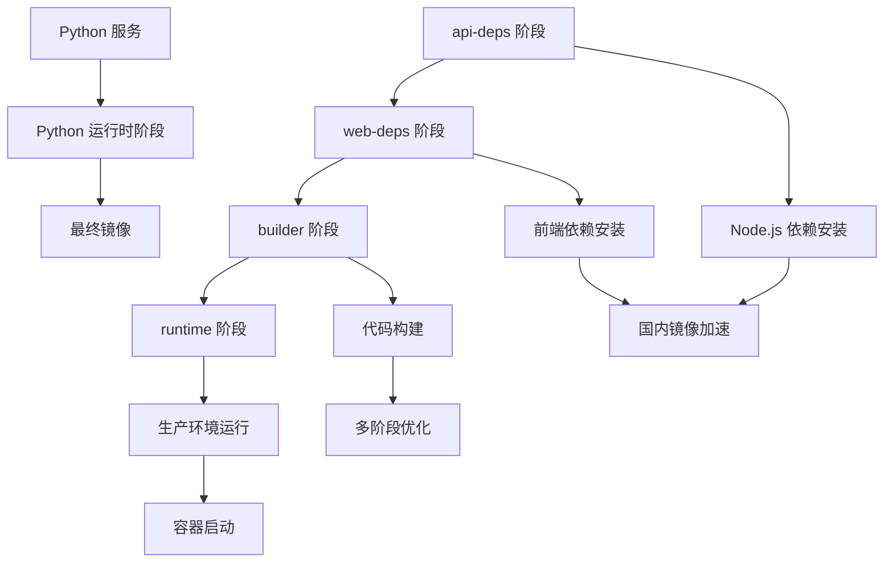
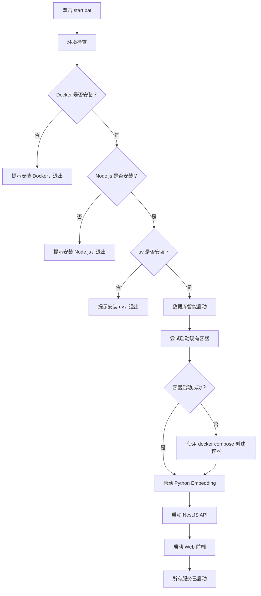
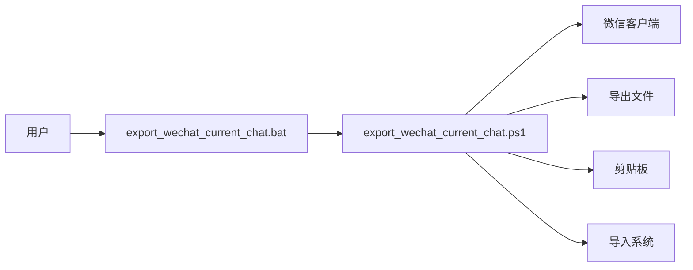
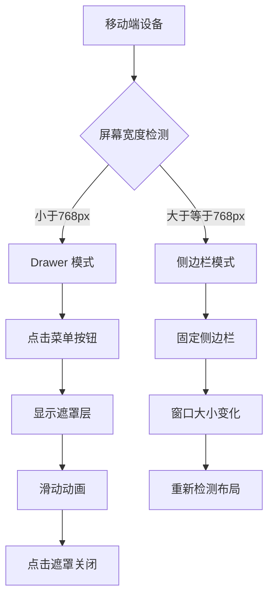
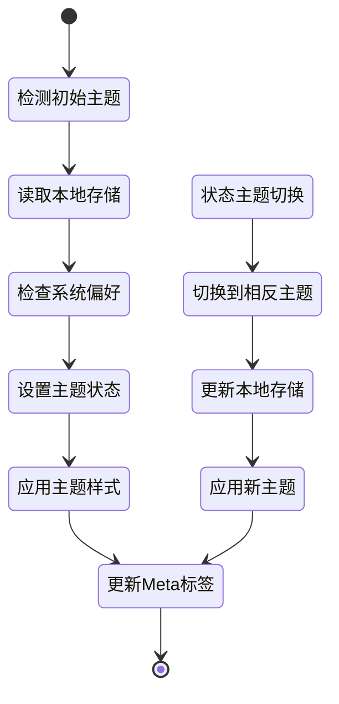
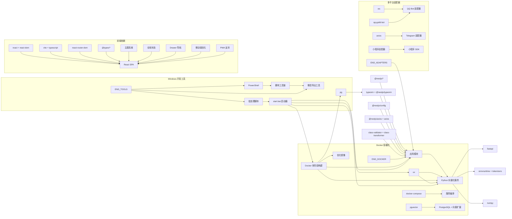

# 学习笔记

<cite>
**本文引用的文件**
- [README.md](file://README.md)
- [Learning_Notes.md](file://docs/Learning_Notes.md)
- [Implementation_Plan.md](file://docs/Implementation_Plan.md)
- [Docker_Deployment.md](file://docs/Docker_Deployment.md)
- [Deployment_Guide.md](file://docs/Deployment_Guide.md)
- [start.bat](file://start.bat)
- [main.ts](file://src/main.ts)
- [package.json](file://package.json)
- [app.module.ts](file://src/app.module.ts)
- [characters.module.ts](file://src/characters/characters.module.ts)
- [chat.module.ts](file://src/chat/chat.module.ts)
- [memories.module.ts](file://src/memories/memories.module.ts)
- [character.entity.ts](file://src/characters/entities/character.entity.ts)
- [session.entity.ts](file://src/sessions/entities/session.entity.ts)
- [message.entity.ts](file://src/messages/entities/message.entity.ts)
- [memory.entity.ts](file://src/memories/entities/memory.entity.ts)
- [chat.service.ts](file://src/chat/chat.service.ts)
- [memories.service.ts](file://src/memories/memories.service.ts)
- [main.py](file://python/main.py)
- [embedder.py](file://python/embedder.py)
- [App.tsx](file://web/src/App.tsx)
- [main.tsx](file://web/src/main.tsx)
- [useTheme.ts](file://web/src/hooks/useTheme.ts)
- [AppContext.tsx](file://web/src/context/AppContext.tsx)
- [export_wechat_current_chat.bat](file://tools/export_wechat_current_chat.bat)
- [export_wechat_current_chat.ps1](file://tools/export_wechat_current_chat.ps1)
- [README_wechat_export.md](file://tools/README_wechat_export.md)
- [QQ_Bot_Integration.md](file://docs/QQ_Bot_Integration.md)
- [adapter.js](file://adapters/qq-bot/adapter.js)
- [index.js](file://adapters/qq-bot/index.js)
- [Dockerfile](file://Dockerfile)
- [python/Dockerfile](file://python/Dockerfile)
- [.dockerignore](file://.dockerignore)
- [python/.dockerignore](file://python/.dockerignore)
- [docker-compose.yml](file://docker-compose.yml)
- [docker-compose.prod.yml](file://docker-compose.prod.yml)
</cite>

## 更新摘要
**所做更改**
- 大幅扩展 Docker 部署相关内容，新增超过 250 行的学习材料
- 新增完整的 Docker 多阶段构建实现，包括 API、Web、Python 服务的分层构建
- 扩展 docker-compose 配置，新增生产环境和开发环境两套配置
- 完善 Docker 网络和数据持久化机制，包括健康检查和服务依赖
- 新增 Docker 环境变量管理、模型挂载和状态持久化配置
- 新增 QQ Bot 集成方案，包括状态持久化和断线恢复机制
- 新增 Windows 批处理脚本学习，涵盖基础语法和最佳实践
- 新增移动端优化与响应式设计，包括 Drawer 导航和主题切换系统
- 新增多平台适配器支持，涵盖 Telegram、QQ Bot 和小程序等多种消息平台
- 新增微信聊天导出工具链，提供完整的 PowerShell 脚本工具集

## 目录
1. [简介](#简介)
2. [项目结构](#项目结构)
3. [核心组件](#核心组件)
4. [架构总览](#架构总览)
5. [详细组件分析](#详细组件分析)
6. [Docker 容器化部署](#docker-容器化部署)
7. [Windows 批处理脚本学习](#windows-批处理脚本学习)
8. [start.bat 开发启动器](#startbat-开发启动器)
9. [PowerShell 脚本工具链](#powershell-脚本工具链)
10. [移动端优化与响应式设计](#移动端优化与响应式设计)
11. [主题切换系统](#主题切换系统)
12. [多平台适配器支持](#多平台适配器支持)
13. [依赖分析](#依赖分析)
14. [性能考虑](#性能考虑)
15. [故障排查指南](#故障排查指南)
16. [结论](#结论)
17. [附录](#附录)

## 简介
本项目是一个基于 NestJS 的 AI 伴侣后端，结合 PostgreSQL + pgvector 实现"向量检索 + 滚动摘要 + 情绪建模"的增强对话系统。前端采用 React + Vite，后端提供 REST API 与流式 SSE，Python 服务负责文本向量化（Embedding）。项目遵循"模块化 + 依赖注入 + ORM + 微服务分离"的架构设计，强调可扩展性与工程化实践。

**更新** 新增了完整的 Docker 容器化部署方案，包括多阶段构建、docker-compose 配置、网络和数据持久化等实用知识。扩展了多平台适配器支持，涵盖 Telegram、QQ Bot 和小程序等多种消息平台。新增了状态持久化机制和断线恢复功能，提升了系统的稳定性和可靠性。新增了 Windows 开发工具链，包括批处理脚本和 PowerShell 工具集，提供完整的开发环境管理。

## 项目结构
- 后端（NestJS）
  - src：核心业务模块与实体
  - web：React 前端（SPA）
  - python：FastAPI 向量化服务
  - docs：学习笔记与实施计划
  - start.bat：Windows 开发环境一键启动器
  - adapters：多平台适配器（Telegram、QQ Bot、小程序）
- 基础设施
  - Docker + pgvector：数据库与向量扩展
  - 环境变量：.env 配置数据库、LLM 密钥、Python Embedding 服务地址
- 工具集
  - tools：PowerShell 脚本工具链，包括微信聊天导出工具



**图表来源**
- [Dockerfile:1-31](file://Dockerfile#L1-L31)
- [docker-compose.yml:1-96](file://docker-compose.yml#L1-L96)
- [docker-compose.prod.yml:1-95](file://docker-compose.prod.yml#L1-L95)
- [.dockerignore:1-17](file://.dockerignore#L1-L17)
- [QQ_Bot_Integration.md:1-244](file://docs/QQ_Bot_Integration.md#L1-L244)
- [adapter.js:1-34](file://adapters/qq-bot/adapter.js#L1-L34)
- [index.js:1-100](file://adapters/qq-bot/index.js#L1-L100)
- [start.bat:1-44](file://start.bat#L1-L44)
- [Learning_Notes.md:4094-4102](file://docs/Learning_Notes.md#L4094-L4102)
- [main.ts:1-22](file://src/main.ts#L1-L22)
- [app.module.ts:18-63](file://src/app.module.ts#L18-L63)
- [chat.module.ts:12-34](file://src/chat/chat.module.ts#L12-L34)
- [characters.module.ts:7-13](file://src/characters/characters.module.ts#L7-L13)
- [memories.module.ts:5-17](file://src/memories/memories.module.ts#L5-L17)
- [main.py:1-123](file://python/main.py#L1-L123)
- [embedder.py:1-116](file://python/embedder.py#L1-L116)
- [App.tsx:1-44](file://web/src/App.tsx#L1-L44)
- [useTheme.ts:1-44](file://web/src/hooks/useTheme.ts#L1-L44)
- [AppContext.tsx:1-413](file://web/src/context/AppContext.tsx#L1-L413)

## 核心组件
- 应用入口与跨域
  - main.ts 设置 CORS（开发阶段允许任意来源），监听端口并输出访问提示。
- 根模块装配
  - app.module.ts 配置静态资源服务（ServeStaticModule）、ConfigModule 全局读取 .env、TypeORM 连接 PostgreSQL 并启用 pgvector 初始化迁移。
- 业务模块
  - characters.module.ts：角色实体与服务，供其他模块依赖。
  - chat.module.ts：聊天核心模块，编排角色、会话、消息、LLM、记忆、情绪模块。
  - memories.module.ts：记忆模块，不注册 TypeORM Entity，直接使用 DataSource 进行原生 SQL 操作，避免 pgvector 的 VECTOR 类型被 TypeORM 删除。
- 数据实体
  - Character：角色表，包含 id、name、basePrompt、model、speechPatterns、createdAt。
  - Session：会话表，包含 characterId、title、summary、messageCount、lastSummaryAt、importProfile、profileUpdatedAt、createdAt、updatedAt。
  - Message：消息表，包含 sessionId、role、content、emotionSnapshot、createdAt。
  - MemoryChunk：记忆碎片表，包含 session_id、source_msg_id、content、memory_type、importance_score、created_at、last_accessed；embedding 字段不映射，走原生 SQL。
- 服务与流程
  - chat.service.ts：核心编排，同步保存用户消息、读取上下文、向量检索记忆、组装 system prompt、调用 LLM、保存 AI 回复、更新计数；异步触发记忆提取与滚动摘要。
  - memories.service.ts：向量检索、写入、查重（余弦相似度阈值），均通过 DataSource.query 执行原生 SQL。

**章节来源**
- [main.ts:7-19](file://src/main.ts#L7-L19)
- [app.module.ts:23-50](file://src/app.module.ts#L23-L50)
- [characters.module.ts:7-13](file://src/characters/characters.module.ts#L7-L13)
- [chat.module.ts:12-34](file://src/chat/chat.module.ts#L12-L34)
- [memories.module.ts:5-17](file://src/memories/memories.module.ts#L5-L17)
- [character.entity.ts:3-22](file://src/characters/entities/character.entity.ts#L3-L22)
- [session.entity.ts:32-63](file://src/sessions/entities/session.entity.ts#L32-L63)
- [message.entity.ts:5-24](file://src/messages/entities/message.entity.ts#L5-L24)
- [memory.entity.ts:16-43](file://src/memories/entities/memory.entity.ts#L16-L43)
- [chat.service.ts:29-113](file://src/chat/chat.service.ts#L29-L113)
- [memories.service.ts:29-137](file://src/memories/memories.service.ts#L29-L137)

## 架构总览
系统采用"后端 API + 前端 SPA + 向量化微服务 + 多平台适配器 + Docker 容器化 + Windows 开发工具链"的分层架构。后端负责业务编排与持久化，前端负责交互与状态展示，Python 服务负责文本向量化。数据库使用 PostgreSQL + pgvector，支持向量相似度检索与索引。多平台适配器提供统一的消息入口，支持 Telegram、QQ Bot、小程序等多种平台。Docker 容器化提供标准化的部署方式，Windows 开发环境通过批处理脚本实现一键启动和环境检查。



**图表来源**
- [Dockerfile:1-31](file://Dockerfile#L1-L31)
- [docker-compose.yml:1-96](file://docker-compose.yml#L1-L96)
- [docker-compose.prod.yml:1-95](file://docker-compose.prod.yml#L1-L95)
- [QQ_Bot_Integration.md:1-244](file://docs/QQ_Bot_Integration.md#L1-L244)
- [adapter.js:1-34](file://adapters/qq-bot/adapter.js#L1-L34)
- [index.js:1-100](file://adapters/qq-bot/index.js#L1-L100)
- [start.bat:1-44](file://start.bat#L1-L44)
- [Learning_Notes.md:4094-4102](file://docs/Learning_Notes.md#L4094-L4102)
- [main.ts:1-22](file://src/main.ts#L1-L22)
- [chat.service.ts:29-113](file://src/chat/chat.service.ts#L29-L113)
- [memories.service.ts:29-137](file://src/memories/memories.service.ts#L29-L137)
- [main.py:1-123](file://python/main.py#L1-L123)
- [embedder.py:31-116](file://python/embedder.py#L31-L116)
- [App.tsx:1-44](file://web/src/App.tsx#L1-L44)
- [useTheme.ts:1-44](file://web/src/hooks/useTheme.ts#L1-L44)
- [AppContext.tsx:1-413](file://web/src/context/AppContext.tsx#L1-L413)

## 详细组件分析

### 聊天服务（ChatService）编排流程
- 同步阶段（用户等待）
  - 情绪分析与AI情绪建模
  - 保存用户消息
  - 读取会话与角色
  - 读取最近消息
  - 向量检索记忆
  - 组装 system prompt（四层叠加）
  - 调用 LLM 生成回复
  - 保存 AI 回复
  - 更新消息计数
- 异步阶段（不阻塞用户）
  - 记忆提取（事实/偏好/情绪）
  - 滚动摘要检查

```mermaid
sequenceDiagram
participant C as "客户端"
participant Ctrl as "ChatController"
participant Svc as "ChatService"
participant Msg as "MessagesService"
participant Ses as "SessionsService"
participant Mem as "MemoriesService"
participant LLM as "LlmService"
C->>Ctrl : "POST /api/chat/{sessionId}"
Ctrl->>Svc : "handleMessage(sessionId, content)"
Svc->>Msg : "create(user)"
Svc->>Ses : "findOne(sessionId)"
Svc->>Svc : "buildSystemPrompt(...)"
Svc->>LLM : "chat(messages)"
LLM-->>Svc : "reply"
Svc->>Msg : "create(assistant)"
Svc->>Ses : "incrementMessageCount(+2)"
Svc-->>Ctrl : "{ reply }"
Ctrl-->>C : "201 + reply"
Note over Svc : "异步：extractMemory() 与 checkAndSummarize()"
```



**图表来源**
- [chat.service.ts:42-113](file://src/chat/chat.service.ts#L42-L113)

**章节来源**
- [chat.service.ts:29-113](file://src/chat/chat.service.ts#L29-L113)

### 记忆服务（MemoriesService）向量检索与写入
- 向量检索：使用 pgvector 的余弦距离运算符，返回相似度排序的记忆片段。
- 写入记忆：将文本向量化后写入 memory_chunks，embedding 为 VECTOR(768)，不映射至 TypeORM。
- 查重：通过余弦相似度阈值判断是否重复，避免冗余存储。


**图表来源**
- [memories.service.ts:42-137](file://src/memories/memories.service.ts#L42-L137)
- [main.py:91-112](file://python/main.py#L91-L112)
- [embedder.py:103-115](file://python/embedder.py#L103-L115)

**章节来源**
- [memories.service.ts:29-137](file://src/memories/memories.service.ts#L29-L137)
- [main.py:1-123](file://python/main.py#L1-L123)
- [embedder.py:1-116](file://python/embedder.py#L1-L116)

### 数据模型与关系
- 角色（characters）：固定人格与模型选择。
- 会话（sessions）：关联角色，维护摘要、消息计数与导入画像。
- 消息（messages）：按会话归档，保留完整对话历史。
- 记忆碎片（memory_chunks）：与会话关联，存储向量与类型，支持相似度检索。



**图表来源**
- [character.entity.ts:3-22](file://src/characters/entities/character.entity.ts#L3-L22)
- [session.entity.ts:32-63](file://src/sessions/entities/session.entity.ts#L32-L63)
- [message.entity.ts:5-24](file://src/messages/entities/message.entity.ts#L5-L24)
- [memory.entity.ts:16-43](file://src/memories/entities/memory.entity.ts#L16-L43)

**章节来源**
- [character.entity.ts:3-22](file://src/characters/entities/character.entity.ts#L3-L22)
- [session.entity.ts:32-63](file://src/sessions/entities/session.entity.ts#L32-L63)
- [message.entity.ts:5-24](file://src/messages/entities/message.entity.ts#L5-L24)
- [memory.entity.ts:16-43](file://src/memories/entities/memory.entity.ts#L16-L43)

### 前端集成与上下文加载
- App.tsx 通过 AppProvider 初始化上下文，首次渲染时加载角色与会话列表，为聊天界面提供数据基础。

**章节来源**
- [App.tsx:6-20](file://web/src/App.tsx#L6-L20)

## Docker 容器化部署

### 多阶段构建架构

项目采用 Docker 多阶段构建技术，将构建过程分为四个阶段，每个阶段都有特定的职责和优化目标：

#### API 依赖阶段（api-deps）
- 基础镜像：node:24-bookworm-slim
- 作用：安装 NestJS 后端所需的 Node.js 依赖包
- 优化：使用国内镜像源加速 npm 安装
- 输出：构建缓存，供后续阶段复用

#### Web 依赖阶段（web-deps）
- 基础镜像：node:24-bookworm-slim
- 作用：安装 React 前端所需的 Node.js 依赖包
- 优化：独立的依赖安装，避免重复下载
- 输出：前端构建缓存

#### 构建阶段（builder）
- 基础镜像：node:24-bookworm-slim
- 作用：合并前后端依赖，执行构建过程
- 步骤：
  1. 复制 API 依赖到构建环境
  2. 复制 Web 依赖到构建环境
  3. 执行 `npm run build:web` 和 `npm run build`
- 优化：并行安装和构建，减少构建时间

#### 运行时阶段（runtime）
- 基础镜像：node:24-bookworm-slim
- 作用：最终的运行时镜像
- 步骤：
  1. 安装生产环境依赖（排除开发依赖）
  2. 复制构建产物（dist、web/dist）
  3. 复制适配器文件
  4. 暴露 3000 端口
  5. 设置启动命令



**图表来源**
- [Dockerfile:1-31](file://Dockerfile#L1-L31)

### Docker Compose 服务配置

项目提供两套 docker-compose 配置，满足不同的部署需求：

#### 开发环境配置（docker-compose.yml）

**数据库服务（postgres）**
- 基础镜像：pgvector/pgvector:pg16
- 环境变量：支持通过环境变量配置用户名、密码、数据库名
- 端口映射：默认映射到宿主机 54321 端口
- 数据持久化：使用 named volume `postgres_data`
- 健康检查：每 5 秒检查一次数据库连接

**向量化服务（embedding）**
- 构建方式：从 python 目录构建
- 环境变量：支持 MOCK_EMBEDDING、模型路径配置
- 端口映射：默认映射到宿主机 8000 端口
- 数据卷：挂载 python/models 目录作为只读
- 健康检查：通过 HTTP 请求检查服务可用性

**API 服务（api）**
- 构建方式：从项目根目录构建
- 环境变量：配置数据库连接、API 密钥、端口等
- 端口映射：默认映射到宿主机 3000 端口
- 服务依赖：等待数据库和向量化服务健康检查通过
- 重启策略：除非手动停止，否则自动重启

**QQ Bot 适配器服务（qqbot）**
- 构建方式：使用主 Dockerfile 构建
- 工作目录：/app
- 启动命令：执行 QQ Bot 适配器入口文件
- 环境变量：配置 QQ Bot App ID、密钥、字符 ID 等
- 数据卷：挂载 qqbot_state 卷用于状态持久化
- 服务配置：使用 profiles 标记，可通过 `--profile qqbot` 启动

#### 生产环境配置（docker-compose.prod.yml）

**镜像来源差异**
- API 服务：使用预构建镜像 `companion-api:latest`
- 向量化服务：使用预构建镜像 `companion-embedding:latest`
- QQ Bot 适配器：复用 API 镜像

**部署优势**
- 无需在服务器上进行构建，直接拉取预构建镜像
- 减少部署时间和资源消耗
- 确保生产环境的一致性

### 网络和数据持久化

#### 容器网络
- 所有服务都在同一个 Docker 网络中
- 服务间通过服务名称进行通信
  - API 服务连接数据库：`postgres:5432`
  - API 服务连接向量化服务：`http://embedding:8000`
  - QQ Bot 适配器连接 API 服务：`http://api:3000`

#### 数据持久化
- PostgreSQL 数据：通过 `postgres_data` 命名卷持久化
- QQ Bot 状态：通过 `qqbot_state` 命名卷持久化
- 模型文件：通过只读卷挂载到向量化服务

#### 健康检查机制
- 数据库：使用 `pg_isready` 命令检查连接
- 向量化服务：通过 HTTP 请求检查服务可用性
- API 服务：依赖上游服务的健康检查结果

### 环境变量管理

#### Docker 环境变量模板
项目提供 `.env.docker.example` 模板文件，包含以下关键配置：

**数据库配置**
- `DB_USER`：数据库用户名，默认 postgres
- `DB_PASSWORD`：数据库密码（必需）
- `DB_NAME`：数据库名，默认 companion
- `DB_PORT`：数据库端口，默认 54321

**API 配置**
- `PORT`：API 服务端口，默认 3000
- `DEEPSEEK_API_KEY`：大模型 API 密钥（必需）
- `DB_LOGGING`：数据库日志开关，默认 false

**向量化服务配置**
- `MOCK_EMBEDDING`：Mock 模式开关，默认 0
- `EMBEDDING_MODEL_PATH`：模型文件路径
- `EMBEDDING_TOKENIZER_PATH`：分词器路径

**QQ Bot 配置**
- `QQ_BOT_APP_ID`：QQ Bot 应用 ID
- `QQ_BOT_APP_SECRET`：QQ Bot 应用密钥
- `QQ_BOT_SANDBOX`：沙盒模式开关
- `QQ_CHARACTER_ID`：默认角色 ID

### 模型挂载和管理

#### 模型文件组织
向量化服务期望的模型文件结构：
```
python/models/
├── jina-embeddings-v2-base-zh.onnx
└── tokenizer.json
```

#### 挂载策略
- 使用只读卷挂载模型目录
- 避免将大型模型文件打包到 Docker 镜像中
- 支持热更新模型文件

#### Mock 模式
当模型文件不可用时，可以通过设置 `MOCK_EMBEDDING=1` 启用 Mock 模式：
- 用于测试 Docker 部署链路
- 不影响真实内存检索功能

### 健康检查和服务依赖

#### 健康检查配置
每个服务都配置了相应的健康检查：

**数据库健康检查**
- 检查命令：`pg_isready -U ${DB_USER:-postgres} -d ${DB_NAME:-companion}`
- 检查间隔：5 秒
- 超时时间：5 秒
- 重试次数：20 次

**向量化服务健康检查**
- 检查命令：`python -c "import urllib.request; urllib.request.urlopen('http://127.0.0.1:8000/health', timeout=3)"`
- 检查间隔：10 秒
- 超时时间：5 秒
- 重试次数：20 次

#### 服务启动顺序
- 数据库服务优先启动
- 向量化服务次之
- API 服务最后启动
- QQ Bot 适配器在 API 启动后启动

### 停止和清理

#### 停止服务
```bash
# 停止并删除容器（保留数据卷）
docker compose --env-file .env.docker down

# 停止并删除容器和数据卷
docker compose --env-file .env.docker down -v
```

#### 清理资源
- 容器：停止并删除所有相关容器
- 网络：删除项目相关的网络
- 卷：删除命名卷（使用 `-v` 参数）
- 镜像：需要手动清理不需要的镜像

**章节来源**
- [Dockerfile:1-31](file://Dockerfile#L1-L31)
- [python/Dockerfile:1-23](file://python/Dockerfile#L1-L23)
- [.dockerignore:1-17](file://.dockerignore#L1-L17)
- [docker-compose.yml:1-96](file://docker-compose.yml#L1-L96)
- [docker-compose.prod.yml:1-95](file://docker-compose.prod.yml#L1-L95)
- [Docker_Deployment.md:1-75](file://docs/Docker_Deployment.md#L1-L75)

## Windows 批处理脚本学习

### 批处理脚本基础语法

Windows 批处理脚本（.bat）是 Windows 系统的命令行脚本语言，具有以下特点：

#### 常用命令详解

| 命令 | 说明 | 示例 |
|------|------|------|
| `@echo off` | 关闭命令回显，让输出更干净 | 脚本开头必加 |
| `echo` | 输出文字 | `echo Hello World` |
| `start "标题" cmd /k "命令"` | 新窗口执行命令，窗口保持打开 | `start "API" cmd /k "npm run dev"` |
| `cd /d %~dp0` | 切换到 bat 文件所在目录 | `%~dp0` 是 bat 文件所在路径 |
| `if %errorlevel% neq 0` | 判断上一条命令是否失败 | `neq` = not equal |
| `>nul 2>&1` | 静默执行，不输出任何内容 | `docker --version >nul 2>&1` |
| `pause` | 暂停，等用户按键 | 脚本结尾，防止窗口闪退 |
| `chcp 65001` | 切换控制台编码为 UTF-8 | 支持中文显示 |
| `::` 或 `rem` | 注释 | `:: 这是注释` |

#### `start` 命令详解

```bat
start "窗口标题" cmd /k "要执行的命令"
```

- `"窗口标题"`：新窗口的标题栏文字，方便识别
- `cmd /k`：执行命令后**保持窗口打开**（`/c` 是执行后关闭）
- 每个服务一个独立窗口，关闭窗口 = 停止该服务

#### `%~dp0` 路径解析

```
假设 start.bat 在 D:\Code\AI\companion\start.bat

%~dp0 = D:\Code\AI\companion\    （带末尾反斜杠）

cd /d %~dp0python  →  切换到 D:\Code\AI\companion\python
cd /d %~dp0web     →  切换到 D:\Code\AI\companion\web
```

`%0` 是脚本自身路径，`%~d` 提取盘符，`%~p` 提取路径，`%~dp0` 合起来就是脚本所在目录。

**章节来源**
- [Learning_Notes.md:3706-3741](file://docs/Learning_Notes.md#L3706-L3741)

### 批处理脚本最佳实践

#### 环境检查模式
批处理脚本通常采用"环境检查 + 条件启动"的模式：

```bat
docker --version >nul 2>&1 || goto :no_docker
node --version >nul 2>&1 || goto :no_node
uv --version >nul 2>&1 || goto :no_uv
```

- `>nul 2>&1`：静默执行，不输出任何内容
- `||`：如果前一条命令失败（返回非0），则执行后续命令
- `goto :label`：跳转到指定标签处

#### 错误处理机制
```bat
docker start companion-pg >nul 2>&1 && goto :pg_ok
echo       容器不存在，使用 docker compose 启动...
docker compose --env-file .env.docker up postgres -d || goto :pg_fail
```

- `&&`：前一条命令成功才执行后一条
- `||`：前一条命令失败才执行后一条
- `goto :label`：错误时跳转到相应处理标签

**章节来源**
- [Learning_Notes.md:3706-3805](file://docs/Learning_Notes.md#L3706-L3805)

## start.bat 开发启动器

### 设计逻辑与启动流程

start.bat 是一个完整的 Windows 开发环境一键启动器，采用"环境检查 + 智能启动 + 独立窗口"的设计理念。

#### 启动流程图



**图表来源**
- [start.bat:14-28](file://start.bat#L14-L28)
- [Learning_Notes.md:3749-3768](file://docs/Learning_Notes.md#L3749-L3768)

#### 数据库智能启动机制

start.bat 实现了"复用现有容器 + 创建新容器"的智能启动策略：

```bat
docker start companion-pg >nul 2>&1 && goto :pg_ok
echo       容器不存在，使用 docker compose 启动...
docker compose --env-file .env.docker up postgres -d || goto :pg_fail
```

- **第一次运行**：`companion-pg` 容器不存在 → `docker start` 失败 → 回退到 `docker compose up`
- **后续运行**：容器已存在但可能停止 → `docker start` 直接启动，比 `docker compose up` 更快

#### 环境变量设置与服务启动

```bat
start "Embedding Service" cmd /k "cd /d %~dp0python&& set MOCK_EMBEDDING=1&& uv run uvicorn main:app --port 8000 --reload"
```

- `set MOCK_EMBEDDING=1`：设置环境变量，让 Python 使用 Mock 向量
- `&&`：前一条成功才执行后一条
- `--reload`：Python 热更新，修改代码自动重启

### 为什么每个服务用独立窗口？

| 方案 | 优点 | 缺点 |
|------|------|------|
| 所有服务同一窗口 | 节省屏幕空间 | 一个服务崩溃日志被其他服务刷走，难以排查 |
| 每服务独立窗口 | 日志隔离，关闭单个窗口停止单个服务 | 占 4 个窗口 |

独立窗口更实用：开发时通常只关注 API 和前端日志，数据库和 Embedding 的窗口可以最小化。

### 开发环境配置信息

启动完成后，脚本会显示各服务的访问地址：

- **PostgreSQL**：localhost:55432
- **Embedding**：localhost:8000（Mock 模式）
- **API**：localhost:3000
- **Web**：localhost:5173

**章节来源**
- [start.bat:1-44](file://start.bat#L1-L44)
- [Learning_Notes.md:3745-3791](file://docs/Learning_Notes.md#L3745-L3791)

### 踩坑记录与注意事项

#### 常见问题及解决方案

1. **`cd` 不能跨盘符**：`cd D:\other` 在 C 盘下不会切换。必须用 `cd /d D:\other`，`/d` 表示同时切换盘符和目录。

2. **`set` 环境变量作用域**：`set MOCK_EMBEDDING=1` 只在当前 cmd 会话生效。用 `start cmd /k "set VAR=1 && command"` 可以在新窗口中设置。

3. **`chcp 65001` 防止中文乱码**：Windows 默认使用 GBK 编码，`echo` 输出中文会乱码。`chcp 65001` 切换到 UTF-8 编码。

4. **Docker 权限问题**：确保当前用户属于 docker-users 组，否则可能出现权限错误。

5. **端口冲突**：如果 3000、5173、8000、55432 端口被占用，需要手动释放或修改配置。

**章节来源**
- [Learning_Notes.md:3801-3805](file://docs/Learning_Notes.md#L3801-L3805)

## PowerShell 脚本工具链

### export_wechat_current_chat 工具集

项目提供了完整的微信聊天导出工具链，包括批处理脚本和 PowerShell 脚本：

#### 批处理脚本封装

```bat
powershell -NoProfile -ExecutionPolicy Bypass -File "%~dp0export_wechat_current_chat.ps1" -SelectAll %*
```

- `-NoProfile`：不加载 PowerShell 配置文件，启动更快
- `-ExecutionPolicy Bypass`：绕过执行策略限制
- `"%~dp0export_wechat_current_chat.ps1"`：指向 PowerShell 脚本文件
- `-SelectAll`：选择所有聊天记录
- `%*`：传递原始参数给 PowerShell 脚本

#### PowerShell 脚本功能特性

export_wechat_current_chat.ps1 提供了多种使用场景：

| 参数 | 功能 | 说明 |
|------|------|------|
| `-SelectAll` | 选择所有聊天记录 | 默认选项 |
| `-NoAutoCopy` | 不自动复制到剪贴板 | 仅导出到文件 |
| `-Import` | 导入到系统 | 导入到指定会话ID |
| `-SessionId <UUID>` | 指定会话ID | 与 -Import 搭配使用 |

#### 使用示例

```bash
# 导出所有聊天记录到剪贴板
powershell -ExecutionPolicy Bypass -File tools\export_wechat_current_chat.ps1 -SelectAll

# 仅导出到文件，不复制到剪贴板
powershell -ExecutionPolicy Bypass -File tools\export_wechat_current_chat.ps1 -NoAutoCopy

# 导入到指定会话
powershell -ExecutionPolicy Bypass -File tools\export_wechat_current_chat.ps1 -SelectAll -Import -SessionId <UUID>
```

### 工具链架构图



**图表来源**
- [export_wechat_current_chat.bat:1-4](file://tools/export_wechat_current_chat.bat#L1-L4)
- [export_wechat_current_chat.ps1:1-40](file://tools/export_wechat_current_chat.ps1#L1-L40)

**章节来源**
- [export_wechat_current_chat.bat:1-4](file://tools/export_wechat_current_chat.bat#L1-L4)
- [export_wechat_current_chat.ps1:1-40](file://tools/export_wechat_current_chat.ps1#L1-L40)
- [README_wechat_export.md:14-40](file://tools/README_wechat_export.md#L14-L40)

## 移动端优化与响应式设计

### Drawer 导航系统
应用采用了现代化的 Drawer 导航模式，特别针对移动设备进行了优化：

- **响应式布局**：在小屏幕设备上自动切换到 Drawer 模式，在桌面设备上显示侧边栏
- **手势支持**：支持滑动手势打开/关闭侧边栏
- **遮罩层**：点击遮罩层自动关闭 Drawer
- **状态管理**：通过 AppContext 管理 Drawer 的打开/关闭状态



**图表来源**
- [App.tsx:8-33](file://web/src/App.tsx#L8-L33)
- [AppContext.tsx:197-213](file://web/src/context/AppContext.tsx#L197-L213)

### Safe Area 处理机制
为了适配不同设备的安全区域（如 iPhone X 系列的刘海屏、底部安全区域），应用实现了以下处理：

- **CSS 自定义属性**：使用 `env()` 和 `safe-area-inset-*` 函数
- **动态计算**：根据设备类型动态调整内边距
- **全屏适配**：确保内容不会被系统 UI 遮挡

### iOS PWA 支持
应用完全支持 iOS PWA（渐进式 Web 应用）：

- **Web App Manifest**：完整的 PWA 配置文件
- **图标适配**：支持不同分辨率的应用图标
- **启动画面**：自定义启动画面
- **状态栏样式**：支持主题色状态栏
- **离线缓存**：Service Worker 实现离线访问

**章节来源**
- [App.tsx:10-32](file://web/src/App.tsx#L10-L32)
- [AppContext.tsx:217-402](file://web/src/context/AppContext.tsx#L217-L402)

## 主题切换系统

### 主题管理架构
应用实现了完整的主题切换系统，支持深色/浅色主题自动切换：

- **Hook 系统**：useTheme Hook 管理主题状态
- **本地存储**：使用 localStorage 持久化用户偏好
- **系统匹配**：自动检测系统主题设置
- **Meta 标签更新**：动态更新主题色 meta 标签

### 主题切换流程


**图表来源**
- [useTheme.ts:11-43](file://web/src/hooks/useTheme.ts#L11-L43)

### 主题配置
- **主题类型**：`Theme = 'dark' | 'light'`
- **存储键名**：`'companion-theme'`
- **Meta 主题颜色**：
  - 深色主题：`#0d0c0e`
  - 浅色主题：`#f7f3ee`
- **默认主题**：根据系统偏好自动选择

**章节来源**
- [useTheme.ts:1-44](file://web/src/hooks/useTheme.ts#L1-L44)

## 多平台适配器支持

### 适配器架构设计
系统采用统一的适配器架构，支持多种消息平台的无缝接入：

- **统一接口**：所有适配器实现相同的接口规范
- **消息路由**：将平台特定的消息格式转换为系统内部格式
- **状态管理**：维护会话映射和用户状态
- **错误处理**：统一的异常处理和重试机制

### 支持的平台

#### Telegram 适配器
- 基于 Telegram Bot API 的 HTTP 接口
- 支持文本、图片、文件等多种消息类型
- 实现了完整的消息转发和回复机制

#### QQ Bot 适配器
- 基于 WebSocket 的实时通信
- 支持私聊和群聊消息
- 实现了心跳维持和断线重连
- **新增** 状态持久化和断线恢复机制

#### 小程序适配器
- 支持微信小程序、支付宝小程序等
- 基于小程序云开发或自建服务端
- 实现了消息格式标准化

### QQ Bot 适配器详细实现

#### WebSocket 连接与心跳
```javascript
// 基础连接流程
const ws = new WebSocket(GATEWAY_URL);
ws.onopen = () => {
  // 发送鉴权
  sendAuth();
  // 启动心跳
  startHeartbeat();
};
```

#### 消息处理流程
```javascript
ws.onmessage = (event) => {
  const message = JSON.parse(event.data);
  switch(message.t) {
    case 'C2C_MESSAGE_CREATE':
      handlePrivateMessage(message);
      break;
    case 'GROUP_AT_MESSAGE_CREATE':
      handleGroupMessage(message);
      break;
  }
};
```

#### 状态持久化机制
```javascript
// 断线恢复状态
const state = {
  token: 'Access Token',
  session_id: 'WebSocket 会话ID',
  seq: 最后接收的消息序号
};

// 持久化到文件
fs.writeFileSync('.qq-bot-state.json', JSON.stringify(state));
```

**章节来源**
- [QQ_Bot_Integration.md:1-244](file://docs/QQ_Bot_Integration.md#L1-L244)
- [adapter.js:1-34](file://adapters/qq-bot/adapter.js#L1-L34)
- [index.js:1-100](file://adapters/qq-bot/index.js#L1-L100)

## 依赖分析
- 后端依赖
  - @nestjs/*：框架与平台层
  - typeorm + @nestjs/typeorm + pg：ORM 与 PostgreSQL 驱动
  - @nestjs/config：环境变量管理
  - @nestjs/axios + axios：HTTP 客户端
  - class-validator + class-transformer：请求参数校验与转换
- 前端依赖
  - react + react-dom：UI 框架
  - vite + typescript：构建与类型支持
  - react-router-dom：路由管理
  - @types/react + @types/react-dom：类型定义
- Python 向量化服务
  - fastapi：API 框架
  - onnxruntime + tokenizers：模型推理与分词
  - numpy：向量计算
- **新增** Docker 容器化依赖
  - Docker 多阶段构建：优化镜像大小和构建效率
  - docker-compose：服务编排和依赖管理
  - pgvector：PostgreSQL 向量扩展
  - uv：Python 包管理和虚拟环境
- **新增** 多平台适配器依赖
  - ws：WebSocket 客户端（QQ Bot）
  - qq-guild-bot：QQ 官方 SDK（可选）
  - axios：HTTP 请求（Telegram Bot API）
- **新增** Windows 开发工具
  - Docker：容器化数据库服务
  - PowerShell：脚本执行环境



**图表来源**
- [package.json:29-71](file://package.json#L29-L71)
- [main.py:23-29](file://python/main.py#L23-L29)
- [embedder.py:19-21](file://python/embedder.py#L19-L21)
- [useTheme.ts:1-44](file://web/src/hooks/useTheme.ts#L1-L44)
- [AppContext.tsx:1-413](file://web/src/context/AppContext.tsx#L1-L413)
- [start.bat:1-44](file://start.bat#L1-L44)
- [export_wechat_current_chat.bat:1-4](file://tools/export_wechat_current_chat.bat#L1-L4)
- [QQ_Bot_Integration.md:1-244](file://docs/QQ_Bot_Integration.md#L1-L244)
- [adapter.js:1-34](file://adapters/qq-bot/adapter.js#L1-L34)
- [Dockerfile:1-31](file://Dockerfile#L1-L31)
- [docker-compose.yml:1-96](file://docker-compose.yml#L1-L96)
- [docker-compose.prod.yml:1-95](file://docker-compose.prod.yml#L1-L95)

**章节来源**
- [package.json:29-71](file://package.json#L29-L71)
- [main.py:1-123](file://python/main.py#L1-L123)
- [embedder.py:1-116](file://python/embedder.py#L1-L116)

## 性能考虑
- 数据库层
  - 使用 pgvector 的 HNSW 索引与余弦相似度，提升大规模向量检索效率。
  - 通过 DataSource.query 直接操作 VECTOR 列，避免 TypeORM 同步导致的列丢失风险。
- 服务层
  - 异步记忆提取与滚动摘要，避免阻塞主流程。
  - SSE 流式返回，改善用户体验。
- 前端层
  - SPA 架构减少页面刷新，结合 React 状态管理优化渲染。
  - **新增** Drawer 导航的懒加载优化，仅在需要时渲染侧边栏内容。
  - **新增** 主题切换的 CSS 变量优化，避免频繁的 DOM 操作。
  - **新增** 响应式布局的媒体查询优化，减少不必要的重排重绘。
- **新增** Docker 容器化性能优化
  - **多阶段构建**：减少最终镜像大小，提升拉取速度
  - **构建缓存**：利用 Docker 层缓存机制，加速重复构建
  - **健康检查**：确保服务启动顺序和可用性
  - **数据持久化**：避免数据丢失和重建成本
  - **网络优化**：容器间通信通过服务名称，减少网络延迟
- **新增** 多平台适配器性能优化
  - **WebSocket 连接池**：复用连接减少握手开销
  - **消息队列**：异步处理消息，避免阻塞主线程
  - **状态持久化**：断线恢复时避免重复消息
  - **心跳优化**：动态调整心跳间隔适应网络状况
- **新增** Windows 开发环境性能优化
  - **数据库智能启动**：复用现有容器比重新创建更快
  - **独立窗口管理**：便于并行开发和调试
  - **Mock 模式**：开发阶段使用 Mock 向量，启动更快、内存占用更少
  - **热更新机制**：Python 和前端都支持热更新，提高开发效率

## 故障排查指南
- 环境与依赖
  - 确认 Docker Desktop 已启动，pgvector 容器运行并映射端口。
  - 检查 .env 配置（DB_HOST、DB_PORT、DB_USER、DB_PASSWORD、DB_NAME、DEEPSEEK_API_KEY、PYTHON_EMBED_URL、PORT）。
  - **新增** 验证 Docker 环境：Docker 版本、Compose 插件、镜像可用性。
- 数据库连接
  - TypeORM 连接参数与迁移配置需与 pgvector 一致，确保 migrationsRun 生效。
- API 调用
  - 使用 Node.js 脚本或 VS Code REST Client 发送中文请求，避免 Windows bash 编码问题。
- 向量化服务
  - 确保 Python 服务端口与 .env 中 PYTHON_EMBED_URL 一致；模型文件存在或启用 MOCK 模式验证流程。
- **新增** Docker 容器化问题
  - **镜像构建**：检查 Dockerfile 语法和构建上下文
  - **服务启动**：查看容器日志，确认健康检查通过
  - **网络连接**：验证服务间通信和端口映射
  - **数据持久化**：检查卷挂载和权限设置
  - **环境变量**：确认 .env.docker 配置正确
- **新增** 多平台适配器问题
  - **WebSocket 连接**：检查网关地址和防火墙设置
  - **QQ Bot 鉴权**：确认 AppID 和 AppSecret 配置正确
  - **状态文件**：检查 .qq-bot-state.json 是否存在且可读写
  - **消息格式**：验证平台消息格式转换是否正确
  - **会话映射**：确认 QQ 用户与 sessionId 的映射关系
- **新增** Windows 批处理脚本问题
  - **编码问题**：确保使用 `chcp 65001` 设置 UTF-8 编码
  - **路径问题**：使用 `%~dp0` 获取脚本所在目录，避免相对路径错误
  - **权限问题**：PowerShell 脚本需要适当的执行策略设置
  - **端口冲突**：检查 3000、5173、8000、55432 端口是否被占用
- **新增** 移动端兼容性
  - 检查 viewport meta 标签配置
  - 验证 Safe Area CSS 属性是否正确应用
  - 测试 Drawer 导航在不同设备上的表现
- **新增** 主题系统
  - 检查 localStorage 是否正常工作
  - 验证 CSS 变量 `data-theme` 是否正确设置
  - 确认 Meta 主题色标签是否动态更新

**章节来源**
- [Learning_Notes.md:646-760](file://docs/Learning_Notes.md#L646-L760)
- [app.module.ts:37-50](file://src/app.module.ts#L37-L50)
- [main.py:33-71](file://python/main.py#L33-L71)
- [start.bat:10-12](file://start.bat#L10-L12)
- [Learning_Notes.md:3801-3805](file://docs/Learning_Notes.md#L3801-L3805)
- [QQ_Bot_Integration.md:1-244](file://docs/QQ_Bot_Integration.md#L1-L244)
- [Docker_Deployment.md:1-75](file://docs/Docker_Deployment.md#L1-L75)
- [docker-compose.yml:1-96](file://docker-compose.yml#L1-L96)
- [docker-compose.prod.yml:1-95](file://docker-compose.prod.yml#L1-L95)

## 结论
本项目通过模块化设计与清晰的职责划分，实现了从角色、会话、消息到记忆与情绪的完整对话闭环。借助 pgvector 的向量检索能力与 Python 向量化服务，系统具备良好的扩展性与工程化实践。

**更新** 最新版本显著增强了容器化部署能力，通过完整的 Docker 多阶段构建、docker-compose 配置、网络和数据持久化等实用知识，提供了从开发到生产的完整部署解决方案。新增的 QQ Bot 集成方案、多平台适配器架构和状态持久化机制，使得系统能够无缝接入多个主流消息平台。新增的 Windows 开发工具链，包括批处理脚本和 PowerShell 工具集，为开发者提供了完整的环境管理方案。建议在生产环境中使用预构建镜像，完善监控与日志体系，并定期备份数据卷。

## 附录
- 快速启动
  - 后端：npm run start:dev
  - 前端：cd web && npm run dev
  - Python 向量化服务：uv run uvicorn python/main:app --port 8000
  - **新增** Docker 开发启动：docker compose --env-file .env.docker up --build
  - **新增** Docker 停止：docker compose --env-file .env.docker down
  - **新增** Docker 生产部署：docker compose -f docker-compose.prod.yml up -d
  - **新增** Windows 开发启动：双击 start.bat
  - **新增** QQ Bot 适配器：cd adapters/qq-bot && node index.js
- 常用脚本
  - 迁移：npm run migration:run / migration:revert
  - 测试：npm run test / test:e2e
  - **新增** 批处理脚本：start.bat（一键启动所有服务）
  - **新增** PowerShell 工具：export_wechat_current_chat.ps1（微信导出）
  - **新增** 适配器测试：node adapters/telegram/index.js（测试 Telegram）
  - **新增** Docker 健康检查：docker compose --env-file .env.docker ps
  - **新增** Docker 日志查看：docker compose --env-file .env.docker logs -f
- Docker 与 pgvector
  - 参考 docs/Docker_Deployment.md 中的环境搭建步骤与参数说明。
  - **新增** 多阶段构建：优化镜像大小和构建效率。
  - **新增** docker-compose 配置：开发和生产环境两套配置。
  - **新增** 数据持久化：PostgreSQL 和 QQ Bot 状态的持久化卷。
- **新增** 多平台适配器
  - QQ Bot 接入指南：参考 docs/QQ_Bot_Integration.md
  - Telegram 适配器：adapters/telegram/
  - 小程序适配器：adapters/miniprogram/
  - 适配器状态管理：.qq-bot-state.json
- **新增** Windows 开发环境
  - 批处理脚本学习：从基础语法到实际应用
  - start.bat 启动器：环境检查、智能启动、独立窗口管理
  - PowerShell 工具链：微信聊天导出等实用工具
- **新增** 移动端开发
  - Drawer 导航测试：在移动端设备上验证滑动手势和点击行为
  - 主题切换测试：验证深色/浅色主题在不同设备上的显示效果
  - PWA 功能测试：验证 iOS PWA 安装和离线功能

**章节来源**
- [README.md:30-58](file://README.md#L30-L58)
- [package.json:8-27](file://package.json#L8-L27)
- [Learning_Notes.md:75-211](file://docs/Learning_Notes.md#L75-L211)
- [start.bat:1-44](file://start.bat#L1-L44)
- [export_wechat_current_chat.bat:1-4](file://tools/export_wechat_current_chat.bat#L1-L4)
- [export_wechat_current_chat.ps1:1-40](file://tools/export_wechat_current_chat.ps1#L1-L40)
- [QQ_Bot_Integration.md:1-244](file://docs/QQ_Bot_Integration.md#L1-L244)
- [adapter.js:1-34](file://adapters/qq-bot/adapter.js#L1-L34)
- [index.js:1-100](file://adapters/qq-bot/index.js#L1-L100)
- [Docker_Deployment.md:1-75](file://docs/Docker_Deployment.md#L1-L75)
- [Dockerfile:1-31](file://Dockerfile#L1-L31)
- [docker-compose.yml:1-96](file://docker-compose.yml#L1-L96)
- [docker-compose.prod.yml:1-95](file://docker-compose.prod.yml#L1-L95)