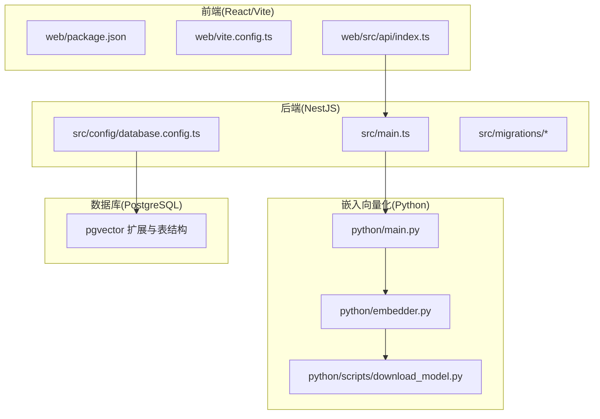
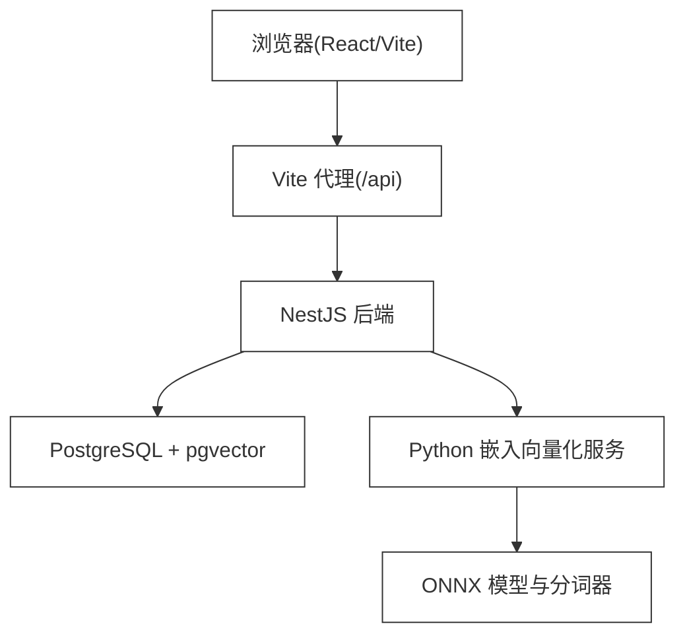
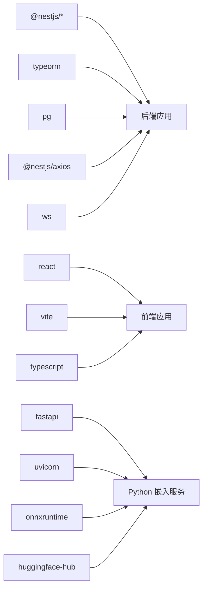

# 开发环境搭建

<cite>
**本文引用的文件**
- [start.bat](file://start.bat)
- [docker-compose.yml](file://docker-compose.yml)
- [package.json](file://package.json)
- [web/package.json](file://web/package.json)
- [python/pyproject.toml](file://python/pyproject.toml)
- [src/config/database.config.ts](file://src/config/database.config.ts)
- [web/vite.config.ts](file://web/vite.config.ts)
- [test_chat.js](file://test_chat.js)
</cite>

## 更新摘要
**所做更改**
- 删除了手动多终端启动各服务的复杂步骤描述
- 新增了start.bat一键启动脚本的完整使用说明
- 更新了环境检查流程，增加了Docker、Node.js、uv的版本检测
- 添加了数据库智能启动逻辑说明（容器存在性检查）
- 更新了服务启动窗口说明，改为一键启动模式
- 简化了开发服务器启动流程，统一使用start.bat

## 目录
1. [简介](#简介)
2. [一键启动脚本](#一键启动脚本)
3. [项目结构](#项目结构)
4. [核心组件](#核心组件)
5. [架构总览](#架构总览)
6. [详细组件分析](#详细组件分析)
7. [依赖关系分析](#依赖关系分析)
8. [性能考虑](#性能考虑)
9. [故障排除指南](#故障排除指南)
10. [结论](#结论)
11. [附录](#附录)

## 简介
本指南面向首次参与 AI Companion 项目的开发者，提供从零搭建可运行开发环境的完整步骤与最佳实践。项目采用前后端分离架构：后端为 NestJS 应用，前端为 React/Vite 应用，嵌入向量化服务由独立的 Python FastAPI 服务提供。数据库使用 PostgreSQL，并通过 pgvector 扩展支持向量相似度检索。

**重要更新**：项目现已提供一键启动脚本start.bat，完全替代原有的手动多终端启动方式，简化了开发环境搭建流程。

## 一键启动脚本
项目提供了强大的一键启动脚本start.bat，可同时启动所有必要的开发服务：

### 启动脚本功能特性
- **环境自动检测**：检查Docker、Node.js、uv的安装状态
- **智能数据库管理**：自动检测并启动PostgreSQL容器
- **多服务并行启动**：同时启动Python嵌入服务、NestJS API、Vite前端
- **Mock模式支持**：Python嵌入服务默认使用Mock模式
- **端口映射**：自动配置各服务的端口映射

### 启动流程详解
```mermaid
graph TB
A[start.bat] --> B[Docker环境检测]
B --> C{容器存在?}
C --> |是| D[启动现有容器]
C --> |否| E[使用docker compose启动]
D --> F[启动Python嵌入服务(Mock)]
F --> G[启动NestJS API]
G --> H[启动Vite前端]
E --> F
```

**图表来源**
- [start.bat:10-28](file://start.bat#L10-L28)

### 启动后服务状态
- **PostgreSQL**: localhost:55432 (Docker容器映射)
- **Python嵌入服务**: localhost:8000 (Mock模式)
- **NestJS API**: localhost:3000 (热重载)
- **Vite前端**: localhost:5173 (热重载)

**章节来源**
- [start.bat:1-68](file://start.bat#L1-L68)

## 项目结构
项目采用多模块组织方式：
- 后端：NestJS 应用，位于根目录，包含 API 控制器、服务、TypeORM 实体与迁移脚本
- 前端：React/Vite 应用，位于 web 子目录，通过代理访问后端 API
- 嵌入向量化：独立 Python FastAPI 服务，位于 python 子目录，提供文本向量化能力
- 工具与文档：tools 与 docs 子目录存放辅助脚本与学习笔记



**章节来源**
- [README.md:28-45](file://README.md#L28-L45)

## 核心组件
- **后端应用入口与跨域配置**：后端通过入口文件启动，启用 CORS 并监听端口，默认端口来自环境变量
- **数据库连接与迁移**：通过 TypeORM DataSource 连接 PostgreSQL，自动执行迁移脚本
- **前端代理与构建**：Vite 提供开发服务器与代理，将 /api 转发至后端
- **嵌入向量化服务**：FastAPI 提供单条与批量向量化接口，支持 Mock 模式与真实模型
- **一键启动脚本**：Windows 批处理脚本提供多服务并行启动，包含环境检测与错误处理

**章节来源**
- [src/config/database.config.ts:1-22](file://src/config/database.config.ts#L1-L22)
- [web/vite.config.ts:1-44](file://web/vite.config.ts#L1-L44)
- [python/pyproject.toml:1-22](file://python/pyproject.toml#L1-L22)
- [start.bat:1-68](file://start.bat#L1-L68)

## 架构总览
下图展示开发环境中的关键交互：前端通过代理访问后端 API，后端在需要时调用 Python 嵌入向量化服务，数据库使用 PostgreSQL 并启用 pgvector 扩展以支持向量检索。



**图表来源**
- [web/vite.config.ts:14-19](file://web/vite.config.ts#L14-L19)
- [src/config/database.config.ts:8-20](file://src/config/database.config.ts#L8-L20)
- [docker-compose.yml:19-35](file://docker-compose.yml#L19-L35)

## 详细组件分析

### 后端(NestJS)开发环境
- **Node.js 与 TypeScript**
  - 使用 Nest CLI 与 TypeScript 编译配置，严格类型检查与装饰器元数据支持
  - 开发模式支持热重载与调试模式
- **数据库与迁移**
  - 通过 TypeORM 连接 PostgreSQL，支持扩展加载与迁移管理
  - 初始化迁移包含枚举类型、表结构与索引，涵盖角色、会话、消息与记忆块
- **启动与脚本**
  - 提供构建、开发、调试、生产运行脚本，以及 TypeORM 迁移命令

**章节来源**
- [package.json:8-27](file://package.json#L8-L27)
- [src/config/database.config.ts:1-22](file://src/config/database.config.ts#L1-L22)
- [src/migrations/1710000000000-init-pgvector-schema.ts:1-107](file://src/migrations/1710000000000-init-pgvector-schema.ts#L1-L107)

### 前端(React/Vite)开发环境
- **Vite 开发服务器与代理**
  - 默认端口 5173，将 /api 代理到后端 3000 端口
  - 构建优化与代码分割策略
- **API 层抽象**
  - 无框架耦合的纯 TypeScript 模块，便于在多平台复用
  - 支持同步与流式(SSE)聊天接口

**章节来源**
- [web/package.json:1-22](file://web/package.json#L1-L22)
- [web/vite.config.ts:1-44](file://web/vite.config.ts#L1-L44)

### 嵌入向量化(Python)服务
- **技术栈与依赖**
  - FastAPI + Uvicorn + ONNX Runtime + Hugging Face Hub
  - 支持 Mock 模式与真实模型两种运行方式
- **模型与分词器**
  - 默认模型与分词器位于 python/models 目录
  - 提供下载脚本，支持通过环境变量指定自定义路径
- **API 接口**
  - 单条与批量向量化接口，健康检查接口

**章节来源**
- [python/pyproject.toml:1-22](file://python/pyproject.toml#L1-L22)
- [python/scripts/download_model.py:1-42](file://python/scripts/download_model.py#L1-L42)

### 数据库初始化与迁移
- **扩展与类型**
  - 初始化迁移创建 vector 扩展与自定义枚举类型
- **表结构**
  - 角色、会话、消息与记忆块表，包含主键、外键与时间戳字段
- **索引**
  - 为消息与记忆块按会话与创建时间建立索引
  - 为向量列建立 HNSW 索引以支持向量相似度检索

**章节来源**
- [src/migrations/1710000000000-init-pgvector-schema.ts:6-93](file://src/migrations/1710000000000-init-pgvector-schema.ts#L6-L93)

## 依赖关系分析
- **后端依赖**
  - NestJS 核心、TypeORM、PostgreSQL 驱动、Axios、WebSocket 等
  - 开发依赖包括 ESLint、Jest、TypeScript 编译器与相关插件
- **前端依赖**
  - React、Vite、TypeScript 与 React 插件
- **Python 依赖**
  - FastAPI、Uvicorn、ONNX Runtime、NumPy、Pydantic、Hugging Face Hub 等



**图表来源**
- [package.json:29-71](file://package.json#L29-L71)
- [web/package.json:10-20](file://web/package.json#L10-L20)
- [python/pyproject.toml:6-16](file://python/pyproject.toml#L6-L16)

**章节来源**
- [package.json:29-71](file://package.json#L29-L71)
- [web/package.json:10-20](file://web/package.json#L10-L20)
- [python/pyproject.toml:1-22](file://python/pyproject.toml#L1-L22)

## 性能考虑
- **向量索引**
  - 使用 HNSW 索引提升向量相似度检索性能，建议根据数据规模调整索引参数
- **数据库连接**
  - 合理配置连接池大小与超时，避免高并发下的连接争用
- **前端构建**
  - 启用代码压缩与手动分包策略，减少首屏加载时间
- **嵌入服务**
  - 在模型未准备就绪时使用 Mock 模式，缩短开发周期；真实模型加载耗时较长，建议预热

## 故障排除指南
- **启动脚本错误**
  - **Docker未安装**：脚本会检测到Docker缺失并提示安装地址
  - **Node.js未安装**：脚本会检测到Node.js缺失并提示安装地址
  - **uv未安装**：脚本会检测到uv缺失并提示安装地址
  - **数据库启动失败**：检查Docker服务是否正常运行
- **端口冲突**
  - 后端默认端口 3000，前端默认端口 5173；如被占用，请修改对应配置
- **CORS 问题**
  - 开发阶段后端已启用 CORS，若仍出现跨域错误，请检查代理配置与浏览器控制台错误
- **数据库连接失败**
  - 检查数据库主机、端口、用户名、密码与数据库名是否正确；确认 PostgreSQL 已启动且允许外部连接
- **迁移未执行**
  - 确认迁移脚本路径与 TypeORM 配置一致；在开发环境可开启 SQL 日志定位问题
- **嵌入模型缺失**
  - 使用下载脚本获取模型与分词器；或设置环境变量指向自定义路径；也可启用 Mock 模式临时绕过
- **端到端测试失败**
  - 使用一键启动脚本启动所有服务后再进行测试

**章节来源**
- [start.bat:46-67](file://start.bat#L46-L67)
- [src/config/database.config.ts:8-20](file://src/config/database.config.ts#L8-L20)
- [web/vite.config.ts:14-19](file://web/vite.config.ts#L14-L19)
- [test_chat.js:124-129](file://test_chat.js#L124-L129)

## 结论
通过本指南，开发者可以快速完成 Node.js、TypeScript、Python、PostgreSQL 与 pgvector 的环境搭建，并掌握项目依赖安装、数据库初始化、环境变量配置、Python 虚拟环境设置、开发服务器启动与热重载配置等关键步骤。**最新的一键启动脚本start.bat大大简化了开发环境搭建流程，开发者只需运行该脚本即可同时启动所有必要服务**。遇到问题时，可依据故障排除指南进行定位与修复，从而高效开展后续开发工作。

## 附录

### 环境要求与安装步骤
- **Node.js 与 npm**
  - 安装 Node.js LTS 版本，确保 npm 可用
  - 在项目根目录执行依赖安装
- **TypeScript**
  - 使用项目内置 TypeScript 配置，遵循严格类型检查
- **Python 与 uv**
  - 安装 Python 3.10+ 与 uv（推荐），用于管理 Python 依赖与运行嵌入服务
- **PostgreSQL 与 pgvector**
  - 安装 PostgreSQL，确保扩展 vector 可用；初始化迁移会自动创建所需表与索引
- **Docker**
  - 安装 Docker Desktop，用于容器化数据库和嵌入服务的管理

### 一键启动流程
1. **运行启动脚本**：双击start.bat文件
2. **等待自动启动**：脚本会自动检测环境并启动所有服务
3. **查看启动结果**：确认四个服务窗口都已成功启动
4. **开始开发**：打开浏览器访问http://localhost:5173

### 传统手动启动方式（已不推荐）
- **后端**：在根目录执行`npm run start:dev`
- **前端**：在web目录执行`npm run dev`
- **嵌入服务**：在python目录执行`uv run uvicorn main:app --port 8000 --reload`
- **数据库**：使用docker compose启动PostgreSQL容器

### 依赖安装与数据库初始化
- **后端**：在根目录执行依赖安装，启动后 TypeORM 自动执行迁移
- **前端**：在 web 目录执行依赖安装
- **嵌入向量化**：在 python 目录执行依赖安装，并使用下载脚本获取模型
- **数据库**：通过Docker容器自动初始化，包含pgvector扩展

### 环境变量配置
- **数据库连接参数**：DB_HOST、DB_PORT、DB_USER、DB_PASSWORD、DB_NAME
- **开发日志**：DB_LOGGING=true 可开启 SQL 日志
- **嵌入服务**：可通过环境变量指定模型与分词器路径，或启用 Mock 模式
- **Docker环境**：.env.docker文件中配置Docker相关环境变量

### Python 虚拟环境
- 推荐使用 uv 的虚拟环境功能隔离依赖；或使用系统自带 venv
- 嵌入服务默认使用Mock模式，无需真实模型即可进行开发

### 热重载与开发工具
- **后端**：开发模式脚本提供热重载与调试模式
- **前端**：Vite 提供快速热更新与构建预览
- **嵌入服务**：Uvicorn 支持自动重启

### 常见问题与调试技巧
- **端口冲突**：修改默认端口
- **CORS**：检查代理与后端 CORS 配置
- **数据库**：确认连接参数与扩展可用
- **迁移**：检查脚本路径与日志
- **模型**：使用下载脚本或启用 Mock 模式
- **测试**：使用提供的端到端测试脚本验证全流程

**章节来源**
- [start.bat:1-68](file://start.bat#L1-L68)
- [docker-compose.yml:1-63](file://docker-compose.yml#L1-L63)
- [package.json:8-27](file://package.json#L8-L27)
- [web/package.json:1-22](file://web/package.json#L1-L22)
- [python/pyproject.toml:1-22](file://python/pyproject.toml#L1-L22)
- [src/config/database.config.ts:8-20](file://src/config/database.config.ts#L8-L20)
- [web/vite.config.ts:12-20](file://web/vite.config.ts#L12-L20)
- [test_chat.js:8-12](file://test_chat.js#L8-L12)