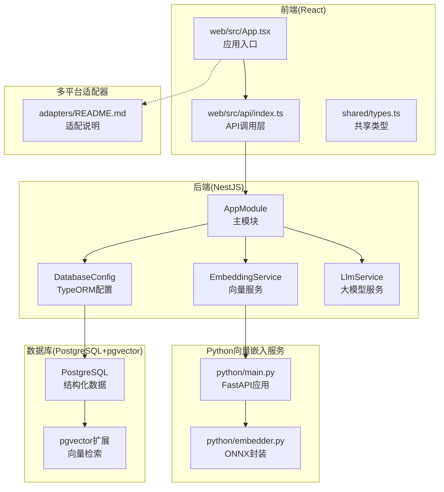
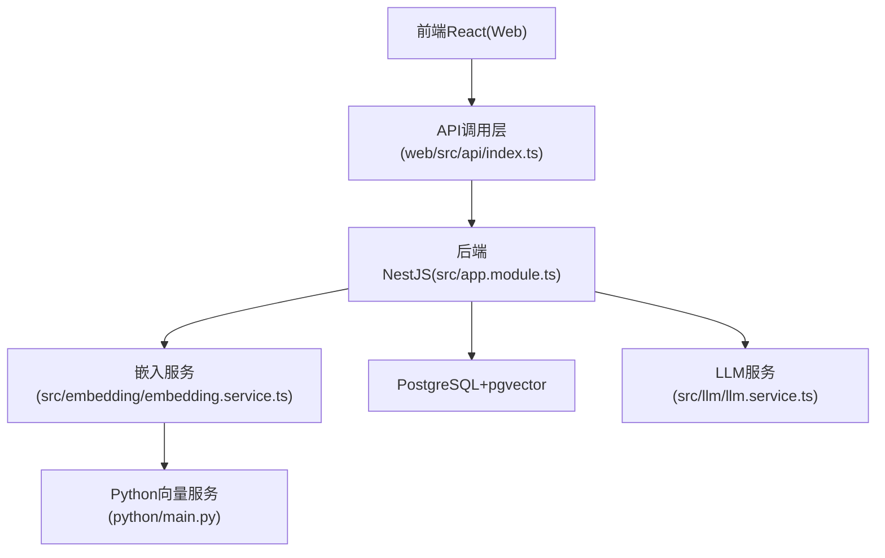
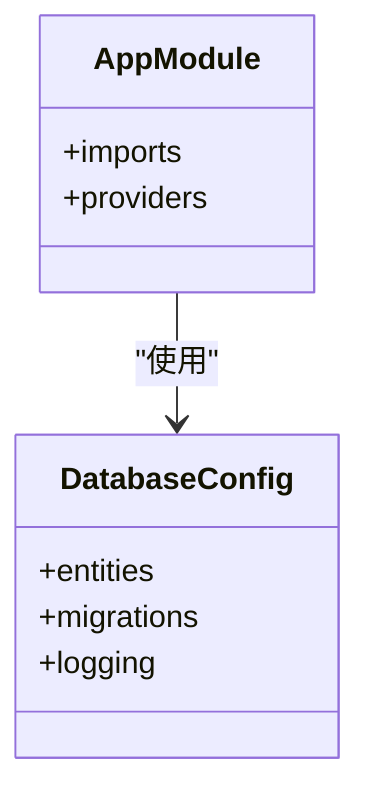
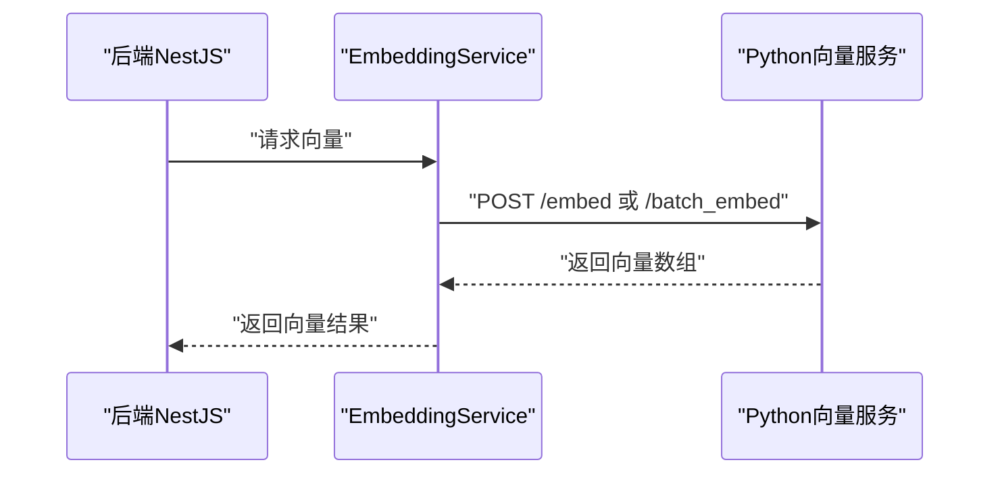
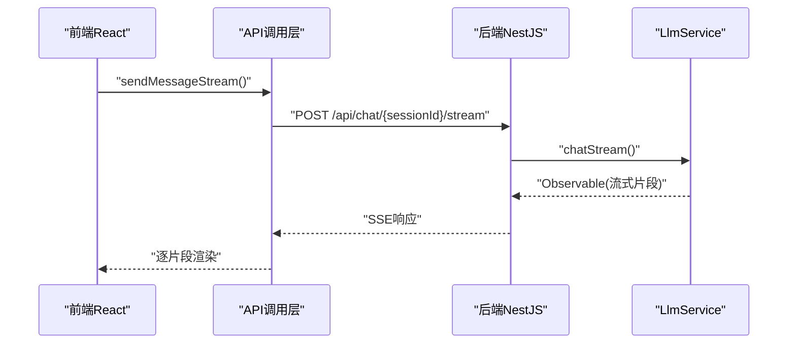
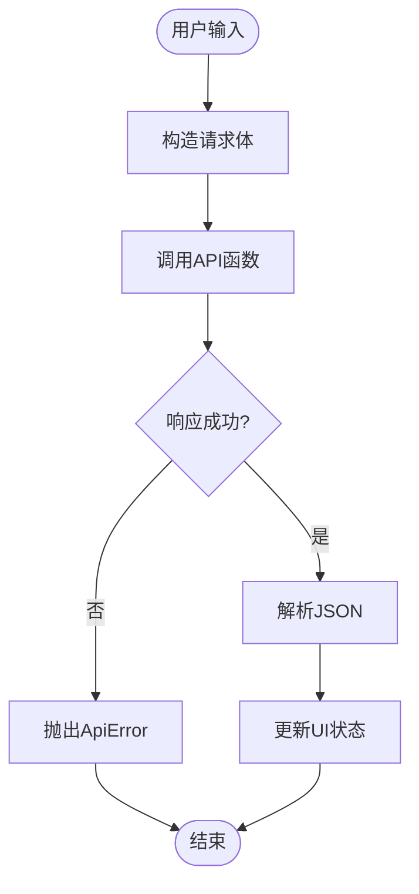
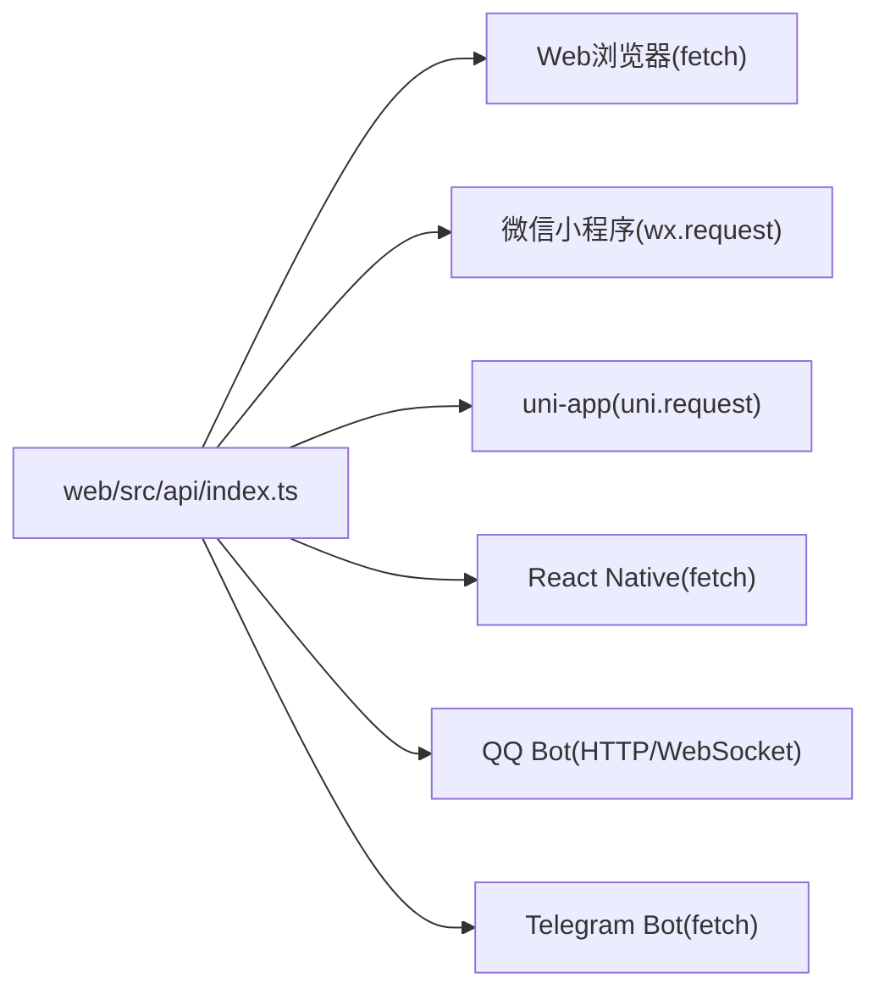
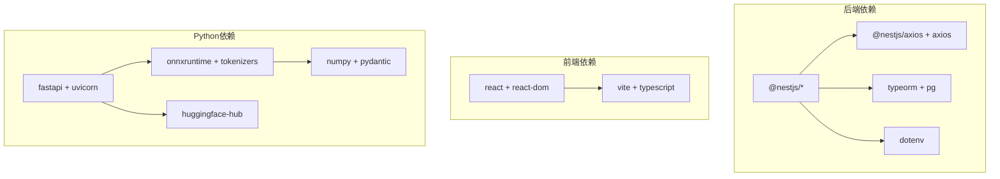

# 技术栈概览

<cite>
**本文档引用的文件**
- [README.md](file://README.md)
- [package.json](file://package.json)
- [web/package.json](file://web/package.json)
- [python/pyproject.toml](file://python/pyproject.toml)
- [src/app.module.ts](file://src/app.module.ts)
- [src/config/database.config.ts](file://src/config/database.config.ts)
- [src/main.ts](file://src/main.ts)
- [src/embedding/embedding.service.ts](file://src/embedding/embedding.service.ts)
- [src/llm/llm.service.ts](file://src/llm/llm.service.ts)
- [web/src/api/index.ts](file://web/src/api/index.ts)
- [web/src/App.tsx](file://web/src/App.tsx)
- [shared/types.ts](file://shared/types.ts)
- [python/embedder.py](file://python/embedder.py)
- [python/main.py](file://python/main.py)
- [adapters/README.md](file://adapters/README.md)
</cite>

## 目录
1. [引言](#引言)
2. [项目结构](#项目结构)
3. [核心组件](#核心组件)
4. [架构总览](#架构总览)
5. [详细组件分析](#详细组件分析)
6. [依赖关系分析](#依赖关系分析)
7. [性能考虑](#性能考虑)
8. [故障排除指南](#故障排除指南)
9. [结论](#结论)

## 引言
本项目采用“后端NestJS + 前端React + Python向量嵌入服务 + 数据库PostgreSQL+pgvector + 多平台适配器”的技术栈组合，目标是构建一个可扩展、可移植且具备跨平台能力的AI角色陪伴系统。该技术栈在以下方面形成协同：
- 后端NestJS提供稳定的服务编排与REST接口，统一管理角色、会话、消息、记忆与导入等业务域；
- 前端React提供现代化交互体验，并通过共享类型与适配器机制支持多端复用；
- Python向量嵌入服务负责文本向量化，为后续相似度检索与记忆提取奠定基础；
- 数据库采用PostgreSQL并启用pgvector扩展，支撑向量检索与结构化数据存储；
- 多平台适配器确保Web、小程序、跨端应用、机器人等不同运行环境的一致API体验。

## 项目结构
项目采用分层清晰的组织方式：
- 后端（NestJS）：位于根目录下的src，包含模块化业务域（角色、会话、聊天、记忆、嵌入、LLM等），以及数据库配置与迁移；
- 前端（React）：位于web目录，包含Vite构建、TypeScript与React组件；
- Python向量嵌入服务：位于python目录，提供FastAPI接口与ONNX推理封装；
- 共享类型：位于shared目录，供前后端与适配器共享；
- 适配器：位于adapters目录，针对不同平台提供HTTP客户端适配层；
- 文档与工具：docs与tools目录分别存放方案文档、学习笔记与聊天记录转换工具。

图表来源
- [src/app.module.ts:18-63](file://src/app.module.ts#L18-L63)
- [src/config/database.config.ts:8-20](file://src/config/database.config.ts#L8-L20)
- [src/embedding/embedding.service.ts:13-83](file://src/embedding/embedding.service.ts#L13-L83)
- [src/llm/llm.service.ts:26-146](file://src/llm/llm.service.ts#L26-L146)
- [web/src/App.tsx:1-29](file://web/src/App.tsx#L1-L29)
- [web/src/api/index.ts:1-212](file://web/src/api/index.ts#L1-L212)
- [shared/types.ts:1-166](file://shared/types.ts#L1-L166)
- [python/main.py:26-122](file://python/main.py#L26-L122)
- [python/embedder.py:31-115](file://python/embedder.py#L31-L115)
- [adapters/README.md:1-62](file://adapters/README.md#L1-L62)

章节来源
- [README.md:24-99](file://README.md#L24-L99)
- [package.json:1-90](file://package.json#L1-L90)
- [web/package.json:1-22](file://web/package.json#L1-L22)
- [python/pyproject.toml:1-22](file://python/pyproject.toml#L1-L22)

## 核心组件
- 后端NestJS
  - 作为统一服务入口，集成静态资源托管、配置加载、数据库连接与业务模块；
  - 通过TypeORM连接PostgreSQL并启用pgvector扩展，迁移脚本确保向量列存在；
  - 提供角色、会话、消息、聊天、记忆与记录导入等模块化功能。
- 前端React
  - 采用Vite构建，提供聊天界面与侧边栏管理；
  - 通过共享类型与API调用层实现跨平台一致的UI交互；
  - 开发阶段由Vite代理转发API至后端，生产阶段由后端统一提供静态资源。
- Python向量嵌入服务
  - 基于FastAPI提供/embed与/batch_embed两个接口；
  - 使用ONNX Runtime加载Jina v2中文模型进行推理，输出768维向量；
  - 支持“假向量”模式便于流程验证与开发调试。
- 数据库PostgreSQL+pgvector
  - 使用TypeORM管理实体与迁移，禁止自动同步以保护向量列；
  - 通过pgvector扩展实现高效的向量相似度检索与语义搜索。
- 多平台适配器
  - 通过统一API函数签名与共享类型，适配Web、小程序、uni-app、React Native、QQ Bot与Telegram Bot；
  - 适配器仅替换网络请求方式，保持业务逻辑一致。

章节来源
- [src/app.module.ts:18-63](file://src/app.module.ts#L18-L63)
- [src/config/database.config.ts:8-20](file://src/config/database.config.ts#L8-L20)
- [web/src/App.tsx:1-29](file://web/src/App.tsx#L1-L29)
- [web/src/api/index.ts:1-212](file://web/src/api/index.ts#L1-L212)
- [shared/types.ts:1-166](file://shared/types.ts#L1-L166)
- [python/main.py:26-122](file://python/main.py#L26-L122)
- [python/embedder.py:31-115](file://python/embedder.py#L31-L115)
- [adapters/README.md:1-62](file://adapters/README.md#L1-L62)

## 架构总览
整体架构围绕“后端统一服务 + 前端交互 + Python推理 + 数据库存储 + 多端适配”的模式展开。后端负责业务编排与数据持久化，前端负责用户交互与状态管理，Python服务负责向量化推理，数据库负责结构化与向量数据存储，适配器确保多端一致性。

图表来源
- [web/src/api/index.ts:1-212](file://web/src/api/index.ts#L1-L212)
- [src/app.module.ts:18-63](file://src/app.module.ts#L18-L63)
- [src/embedding/embedding.service.ts:13-83](file://src/embedding/embedding.service.ts#L13-L83)
- [src/llm/llm.service.ts:26-146](file://src/llm/llm.service.ts#L26-L146)
- [python/main.py:26-122](file://python/main.py#L26-L122)

## 详细组件分析

### 后端NestJS模块与数据库配置
- 主模块AppModule
  - 集成静态资源服务（ServeStaticModule），开发阶段由Vite代理API，生产阶段由后端提供web/dist；
  - 加载全局配置(ConfigModule)，支持.env文件；
  - TypeORM连接PostgreSQL，启用pgvector迁移，禁止自动同步以保护向量列。
- 数据库配置DatabaseConfig
  - 通过DataSource定义实体与迁移路径，启动时自动执行迁移；
  - 支持开启SQL日志以便开发调试。

图表来源
- [src/app.module.ts:18-63](file://src/app.module.ts#L18-L63)
- [src/config/database.config.ts:8-20](file://src/config/database.config.ts#L8-L20)

章节来源
- [src/app.module.ts:18-63](file://src/app.module.ts#L18-L63)
- [src/config/database.config.ts:8-20](file://src/config/database.config.ts#L8-L20)

### 嵌入服务与Python向量服务
- 嵌入服务EmbeddingService
  - 通过HTTP调用Python FastAPI服务，提供单条与批量向量化；
  - 支持健康检查，便于监控Python服务可用性；
  - 默认Python服务地址可通过环境变量配置。
- Python向量服务main.py
  - 提供/embed与/batch_embed两个端点，返回768维向量；
  - 支持“假向量”模式，便于开发与测试；
  - 健康检查端点返回状态与维度信息。

图表来源
- [src/embedding/embedding.service.ts:13-83](file://src/embedding/embedding.service.ts#L13-L83)
- [python/main.py:91-122](file://python/main.py#L91-L122)

章节来源
- [src/embedding/embedding.service.ts:13-83](file://src/embedding/embedding.service.ts#L13-L83)
- [python/main.py:26-122](file://python/main.py#L26-L122)
- [python/embedder.py:31-115](file://python/embedder.py#L31-L115)

### LLM服务与流式响应
- LLM服务LlmService
  - 封装DeepSeek API，支持同步与流式两种模式；
  - 流式模式通过Observable与SSE格式解析，逐片段推送回复；
  - 支持自定义模型、温度与最大token数等参数。

图表来源
- [web/src/api/index.ts:129-201](file://web/src/api/index.ts#L129-L201)
- [src/llm/llm.service.ts:69-145](file://src/llm/llm.service.ts#L69-L145)

章节来源
- [src/llm/llm.service.ts:26-146](file://src/llm/llm.service.ts#L26-L146)
- [web/src/api/index.ts:129-201](file://web/src/api/index.ts#L129-L201)

### 前端React与API调用层
- 应用入口App.tsx
  - 初始化上下文并加载角色与会话列表；
  - 采用Sidebar与ChatArea组件组织界面布局。
- API调用层index.ts
  - 提供角色、会话、消息、聊天与记录导入等API；
  - 支持SSE流式接收，前端逐片段渲染；
  - 通过共享类型保证跨端一致性。

图表来源
- [web/src/api/index.ts:37-52](file://web/src/api/index.ts#L37-L52)
- [shared/types.ts:114-121](file://shared/types.ts#L114-L121)

章节来源
- [web/src/App.tsx:1-29](file://web/src/App.tsx#L1-L29)
- [web/src/api/index.ts:1-212](file://web/src/api/index.ts#L1-L212)
- [shared/types.ts:1-166](file://shared/types.ts#L1-L166)

### 多平台适配器机制
- 适配器设计原则
  - 保持API函数签名一致，仅替换网络请求方式；
  - 类型定义来自shared/types.ts，确保跨端类型安全；
  - 适配器示例覆盖Web、微信小程序、uni-app、React Native、QQ Bot与Telegram Bot。
- 适配器开发指引
  - 基于web/src/api/index.ts复制到对应适配器目录；
  - 将fetch替换为平台专用HTTP客户端；
  - 保持所有函数签名不变。

图表来源
- [adapters/README.md:1-62](file://adapters/README.md#L1-L62)
- [web/src/api/index.ts:1-212](file://web/src/api/index.ts#L1-L212)
- [shared/types.ts:1-166](file://shared/types.ts#L1-L166)

章节来源
- [adapters/README.md:1-62](file://adapters/README.md#L1-L62)
- [web/src/api/index.ts:1-212](file://web/src/api/index.ts#L1-L212)
- [shared/types.ts:1-166](file://shared/types.ts#L1-L166)

## 依赖关系分析
- 后端依赖
  - @nestjs/*系列包提供框架能力；
  - @nestjs/axios与axios用于HTTP通信；
  - @nestjs/typeorm与typeorm、pg驱动连接PostgreSQL；
  - ws用于WebSocket支持；
  - dotenv加载环境变量。
- 前端依赖
  - React与React DOM；
  - Vite与TypeScript；
  - @types/react与@types/react-dom。
- Python向量服务依赖
  - FastAPI与Uvicorn提供服务；
  - ONNX Runtime与tokenizers进行推理；
  - NumPy与Pydantic进行数据处理与校验；
  - huggingface-hub下载模型。

图表来源
- [package.json:29-46](file://package.json#L29-L46)
- [web/package.json:10-20](file://web/package.json#L10-L20)
- [python/pyproject.toml:6-16](file://python/pyproject.toml#L6-L16)

章节来源
- [package.json:1-90](file://package.json#L1-L90)
- [web/package.json:1-22](file://web/package.json#L1-L22)
- [python/pyproject.toml:1-22](file://python/pyproject.toml#L1-L22)

## 性能考虑
- 向量化性能
  - 批量推理优于逐条推理，Python服务提供/batch_embed接口以提升吞吐；
  - ONNX Runtime在CPU上进行推理，适合中小规模向量计算。
- 数据库性能
  - pgvector扩展支持高效向量索引与相似度检索；
  - 迁移脚本确保向量列结构稳定，避免自动同步导致的列丢失。
- 前后端通信
  - 嵌入服务与LLM服务均设置合理超时时间，防止阻塞；
  - 前端SSE流式渲染减少等待时间，提升用户体验。

## 故障排除指南
- Python向量服务未启动或不可达
  - 检查PYTHON_EMBED_URL环境变量是否正确；
  - 使用health检查端点确认服务状态；
  - 开发阶段可启用MOCK_EMBEDDING环境变量使用假向量模式。
- 数据库迁移失败
  - 确认PostgreSQL服务已启动且凭据正确；
  - 检查pgvector扩展是否安装；
  - 启动时自动执行迁移，若失败需手动排查迁移脚本。
- 前端无法访问后端API
  - 开发阶段由Vite代理转发，确认代理配置；
  - 生产阶段后端提供静态资源，确认构建命令与路径。

章节来源
- [src/embedding/embedding.service.ts:70-82](file://src/embedding/embedding.service.ts#L70-L82)
- [python/main.py:115-122](file://python/main.py#L115-L122)
- [src/config/database.config.ts:16-19](file://src/config/database.config.ts#L16-L19)

## 结论
本项目通过NestJS、React、Python向量服务、PostgreSQL+pgvector与多平台适配器的组合，实现了高内聚、低耦合且可扩展的技术架构。后端统一编排业务与数据，前端专注交互体验，Python服务承担推理任务，数据库提供结构化与向量检索能力，适配器确保多端一致体验。该架构既满足当前需求，也为未来扩展提供了清晰路径。