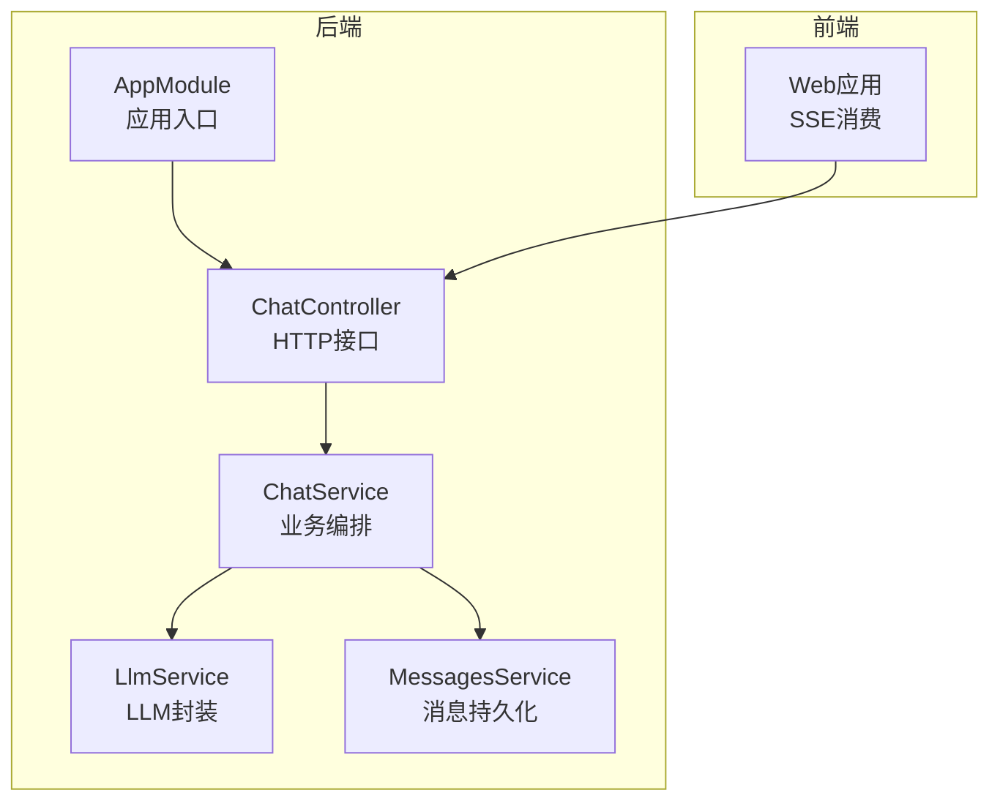
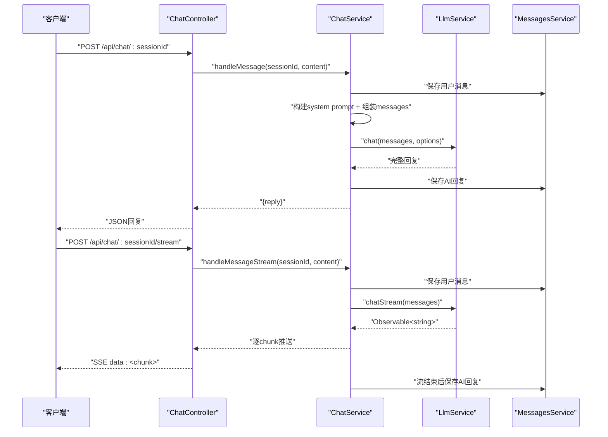
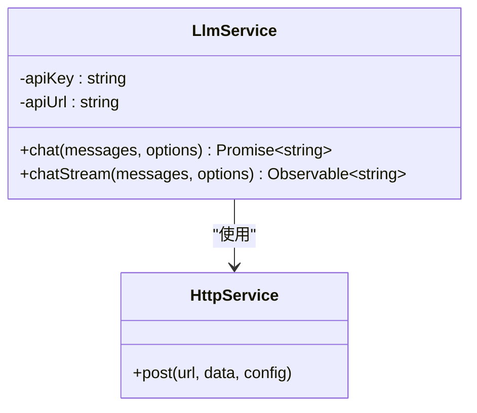
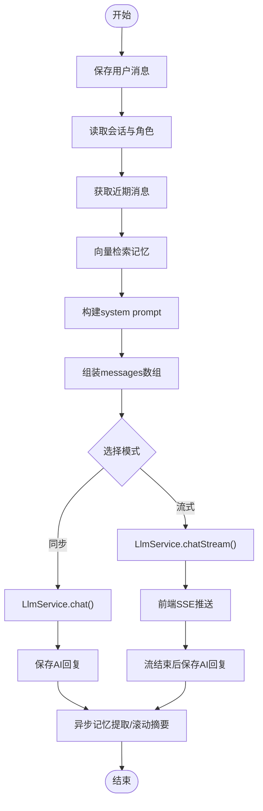
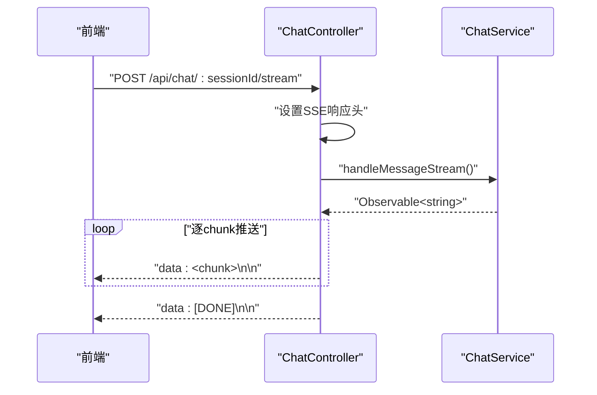
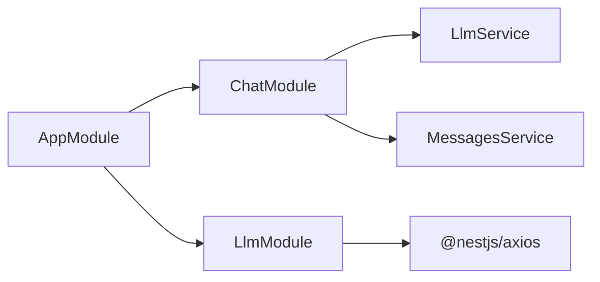

# LLM推理服务

<cite>
**本文档引用的文件**
- [llm.service.ts](file://src/llm/llm.service.ts)
- [llm.module.ts](file://src/llm/llm.module.ts)
- [types.ts](file://shared/types.ts)
- [chat.service.ts](file://src/chat/chat.service.ts)
- [chat.controller.ts](file://src/chat/chat.controller.ts)
- [messages.service.ts](file://src/messages/messages.service.ts)
- [AppModule.ts](file://src/app.module.ts)
- [AppContext.tsx](file://web/src/context/AppContext.tsx)
</cite>

## 目录
1. [简介](#简介)
2. [项目结构](#项目结构)
3. [核心组件](#核心组件)
4. [架构总览](#架构总览)
5. [详细组件分析](#详细组件分析)
6. [依赖分析](#依赖分析)
7. [性能考虑](#性能考虑)
8. [故障排查指南](#故障排查指南)
9. [结论](#结论)
10. [附录](#附录)

## 简介
本文件面向“LLM推理服务”的技术文档，系统性阐述大语言模型服务在本项目中的完整实现与关键设计。重点覆盖：
- LlmService核心能力：同步聊天、流式聊天、参数配置
- DeepSeek API集成：密钥管理、请求格式、响应处理
- 流式响应机制：SSE协议、文本块推送、错误处理
- 推理参数优化：temperature、maxTokens、topP（概念性说明）
- 聊天消息格式与系统提示词构建：ChatMessage接口、buildSystemPrompt多层提示、cleanupReply回复清理
- 在聊天系统中的核心地位与关键决策

## 项目结构
本项目采用NestJS分层架构，LLM服务位于独立模块中，通过依赖注入为聊天模块提供推理能力。前端通过SSE与后端交互，实现流式对话。

图表来源
- [AppModule.ts:18-62](file://src/app.module.ts#L18-L62)
- [chat.controller.ts:16-76](file://src/chat/chat.controller.ts#L16-L76)
- [chat.service.ts:29-40](file://src/chat/chat.service.ts#L29-L40)
- [llm.service.ts:26-33](file://src/llm/llm.service.ts#L26-L33)
- [messages.service.ts:67-74](file://src/messages/messages.service.ts#L67-L74)

章节来源
- [AppModule.ts:18-62](file://src/app.module.ts#L18-L62)
- [chat.controller.ts:16-76](file://src/chat/chat.controller.ts#L16-L76)
- [chat.service.ts:29-40](file://src/chat/chat.service.ts#L29-L40)
- [llm.service.ts:26-33](file://src/llm/llm.service.ts#L26-L33)
- [messages.service.ts:67-74](file://src/messages/messages.service.ts#L67-L74)

## 核心组件
- LlmService：封装DeepSeek API，提供同步chat与流式chatStream两类能力，负责参数配置、请求构建、响应解析与SSE解析。
- ChatService：业务编排层，负责消息保存、上下文读取、向量检索记忆、系统提示词组装、调用LLM、回复清理、异步记忆提取与滚动摘要。
- ChatController：HTTP接口层，提供同步与流式两条路由，负责SSE响应头设置与数据推送。
- Shared Types：定义ChatMessage、LlmOptions、SSE回调等跨层共享类型。

章节来源
- [llm.service.ts:8-17](file://src/llm/llm.service.ts#L8-L17)
- [chat.service.ts:13-28](file://src/chat/chat.service.ts#L13-L28)
- [chat.controller.ts:9-15](file://src/chat/chat.controller.ts#L9-L15)
- [types.ts:19-28](file://shared/types.ts#L19-L28)

## 架构总览
下图展示了从HTTP请求到LLM推理再到SSE推送的完整链路，以及与消息存储的协作关系。

图表来源
- [chat.controller.ts:21-75](file://src/chat/chat.controller.ts#L21-L75)
- [chat.service.ts:42-113](file://src/chat/chat.service.ts#L42-L113)
- [chat.service.ts:130-231](file://src/chat/chat.service.ts#L130-L231)
- [llm.service.ts:36-57](file://src/llm/llm.service.ts#L36-L57)
- [llm.service.ts:70-145](file://src/llm/llm.service.ts#L70-L145)
- [messages.service.ts:51-92](file://src/messages/messages.service.ts#L51-L92)

## 详细组件分析

### LlmService：DeepSeek API封装
- 职责
  - 同步聊天：构造请求体，发送HTTP POST，等待完整响应，返回choices[0].message.content。
  - 流式聊天：使用原生https.request建立SSE通道，解析"data: ..."行，逐块推送Observable。
  - 参数配置：model、temperature、maxTokens默认值；通过LlmOptions传入。
  - API密钥管理：从环境变量读取DEEPSEEK_API_KEY，置于Authorization头。
- 关键实现要点
  - 同步模式：使用@nestjs/axios的post方法，配合firstValueFrom转Promise。
  - 流式模式：设置Accept: text/event-stream，按行缓冲解析，遇到"[DONE]"完成流。
  - 错误处理：请求级error事件直接传递给Observable的error回调。
- 适用场景
  - 需要完整回复后再继续后续处理时使用chat。
  - 需要实时显示回复时使用chatStream，结合前端SSE消费。

图表来源
- [llm.service.ts:26-33](file://src/llm/llm.service.ts#L26-L33)
- [llm.service.ts:36-57](file://src/llm/llm.service.ts#L36-L57)
- [llm.service.ts:70-145](file://src/llm/llm.service.ts#L70-L145)

章节来源
- [llm.service.ts:26-33](file://src/llm/llm.service.ts#L26-L33)
- [llm.service.ts:36-57](file://src/llm/llm.service.ts#L36-L57)
- [llm.service.ts:70-145](file://src/llm/llm.service.ts#L70-L145)

### ChatService：业务编排与系统提示词
- 职责
  - 同步对话：保存用户消息 → 读取上下文 → 向量检索记忆 → 组装system prompt → 调LLM → 保存AI回复 → 异步记忆提取与滚动摘要。
  - 流式对话：与同步类似，但将LLM调用改为chatStream，逐chunk推送到前端，流结束后再保存AI回复并触发异步任务。
  - 系统提示词构建：buildSystemPrompt按层次组装（固定人格、说话风格、滚动摘要、导入画像、动态记忆、用户/AI情绪、核心规则）。
  - 回复清理：cleanupReply将括号动作描述替换为emoji/颜文字，优化自然语言表达。
- 关键流程
  - 组装messages：system层prompt + 近期消息 + 当前用户消息。
  - 调用LLM：同步或流式两种模式。
  - 异步任务：记忆提取、滚动摘要，使用setImmediate确保不阻塞主线程。

图表来源
- [chat.service.ts:42-113](file://src/chat/chat.service.ts#L42-L113)
- [chat.service.ts:130-231](file://src/chat/chat.service.ts#L130-L231)
- [chat.service.ts:424-497](file://src/chat/chat.service.ts#L424-L497)
- [chat.service.ts:507-544](file://src/chat/chat.service.ts#L507-L544)

章节来源
- [chat.service.ts:42-113](file://src/chat/chat.service.ts#L42-L113)
- [chat.service.ts:130-231](file://src/chat/chat.service.ts#L130-L231)
- [chat.service.ts:424-497](file://src/chat/chat.service.ts#L424-L497)
- [chat.service.ts:507-544](file://src/chat/chat.service.ts#L507-L544)

### ChatController：SSE接口与响应头
- 职责
  - 提供两条路由：同步POST /api/chat/:sessionId与流式POST /api/chat/:sessionId/stream。
  - 流式模式设置SSE响应头（Content-Type: text/event-stream; charset=utf-8、Cache-Control、Connection等），逐chunk写入data: JSON字符串，结束时写入data: [DONE]。
- 前端对接
  - 使用fetch + ReadableStream Reader逐块读取，解码后追加到UI。

图表来源
- [chat.controller.ts:46-75](file://src/chat/chat.controller.ts#L46-L75)
- [chat.service.ts:130-231](file://src/chat/chat.service.ts#L130-L231)

章节来源
- [chat.controller.ts:46-75](file://src/chat/chat.controller.ts#L46-L75)

### 类型系统：ChatMessage与LlmOptions
- ChatMessage：role限定为'system' | 'user' | 'assistant'，content为字符串。
- LlmOptions：可选model、temperature、maxTokens。
- 共享类型：前端也使用MessageRole、ChatMessage、SSECallbacks等类型，保证前后端一致。

章节来源
- [llm.service.ts:8-17](file://src/llm/llm.service.ts#L8-L17)
- [types.ts:15-28](file://shared/types.ts#L15-L28)
- [types.ts:104-108](file://shared/types.ts#L104-L108)

### 消息上下文与最近消息
- MessagesService.findRecent按时间倒序查询最近N条消息，并反转为正序，满足LLM API要求的消息顺序。
- 该方法在ChatService中用于组装messages数组的user/assistant交替部分。

章节来源
- [messages.service.ts:67-74](file://src/messages/messages.service.ts#L67-L74)
- [chat.service.ts:86-93](file://src/chat/chat.service.ts#L86-L93)

### 前端SSE消费与状态更新
- 前端通过SSE接收data: JSON字符串，逐块拼接到最后一条assistant消息。
- 完成后标记isStreaming为false，恢复在线状态；发生错误时显示错误状态。

章节来源
- [chat.controller.ts:61-74](file://src/chat/chat.controller.ts#L61-L74)
- [AppContext.tsx:99-143](file://web/src/context/AppContext.tsx#L99-L143)

## 依赖分析
- 模块依赖
  - AppModule导入ChatModule、LlmModule、MemoriesModule等，统一管理数据库、静态资源与业务模块。
  - LlmModule注册HttpModule并导出LlmService，供ChatModule注入使用。
- 外部依赖
  - @nestjs/axios：HTTP客户端，用于调用DeepSeek API。
  - 环境变量：DEEPSEEK_API_KEY用于鉴权。
  - 前端：使用SSE消费后端流式数据。

图表来源
- [AppModule.ts:52-58](file://src/app.module.ts#L52-L58)
- [llm.module.ts:5-14](file://src/llm/llm.module.ts#L5-L14)

章节来源
- [AppModule.ts:52-58](file://src/app.module.ts#L52-L58)
- [llm.module.ts:5-14](file://src/llm/llm.module.ts#L5-L14)

## 性能考虑
- 超时与重定向
  - LlmModule.HttpModule.timeout=60000ms，maxRedirects=5，平衡稳定性与性能。
  - ChatController设置SSE响应头，避免代理缓存导致延迟。
- 流式传输
  - chatStream采用SSE，前端可逐字显示，降低感知延迟。
- 异步任务
  - 记忆提取与滚动摘要使用setImmediate，避免阻塞主对话流程。
- 上下文长度控制
  - 通过findRecent限制最近消息数量，控制请求体积与成本。

章节来源
- [llm.module.ts:7-10](file://src/llm/llm.module.ts#L7-L10)
- [chat.controller.ts:52-57](file://src/chat/chat.controller.ts#L52-L57)
- [messages.service.ts:67-74](file://src/messages/messages.service.ts#L67-L74)

## 故障排查指南
- API密钥问题
  - 确认DEEPSEEK_API_KEY环境变量已正确设置。
- SSE连接异常
  - 检查代理/网关是否禁用了SSE缓冲（X-Accel-Buffering: no）。
  - 前端需正确解析data: JSON字符串，注意换行符。
- 流式解析错误
  - LlmService在解析SSE行时若JSON解析失败会忽略该行，确保网络稳定与编码正确。
- 后端超时
  - LlmModule.timeout=60000ms，若仍超时，检查上游API限流与网络状况。
- 异步任务失败
  - 记忆提取与滚动摘要为异步任务，失败仅记录日志，不影响主流程。

章节来源
- [llm.service.ts:31-33](file://src/llm/llm.service.ts#L31-L33)
- [chat.controller.ts:52-57](file://src/chat/chat.controller.ts#L52-L57)
- [llm.service.ts:115-123](file://src/llm/llm.service.ts#L115-L123)
- [llm.module.ts:7-10](file://src/llm/llm.module.ts#L7-L10)
- [chat.service.ts:311-314](file://src/chat/chat.service.ts#L311-L314)

## 结论
本LLM推理服务以LlmService为核心，向上提供同步与流式两种调用方式，向下封装DeepSeek API细节。ChatService在其中承担编排职责，将角色设定、滚动摘要、导入画像、动态记忆与情绪状态等多层信息整合为system prompt，并通过cleanupReply提升回复的自然度与表现力。整体架构清晰、模块职责明确，既满足实时交互体验，又兼顾异步扩展与可维护性。

## 附录

### 调用示例与最佳实践
- 同步调用
  - 使用ChatService.handleMessage，适合需要完整回复后再继续处理的场景。
  - 参考路径：[chat.service.ts:42-113](file://src/chat/chat.service.ts#L42-L113)
- 流式调用
  - 使用ChatService.handleMessageStream，结合ChatController的SSE路由，实现逐字推送。
  - 参考路径：[chat.service.ts:130-231](file://src/chat/chat.service.ts#L130-L231)，[chat.controller.ts:46-75](file://src/chat/chat.controller.ts#L46-L75)
- 推理参数配置
  - model：指定模型名称，默认'deepseek-chat'。
  - temperature：控制创造性，默认0.8；越低越保守，越高越随机。
  - maxTokens：控制最大生成长度，默认2000。
  - 参考路径：[llm.service.ts:36-57](file://src/llm/llm.service.ts#L36-L57)，[llm.service.ts:70-78](file://src/llm/llm.service.ts#L70-L78)
- 系统提示词构建
  - 分层组装：固定人格、说话风格、滚动摘要、导入画像、动态记忆、情绪状态、核心规则。
  - 参考路径：[chat.service.ts:424-497](file://src/chat/chat.service.ts#L424-L497)
- 回复清理
  - 将括号动作描述替换为emoji/颜文字，优化自然语言表达。
  - 参考路径：[chat.service.ts:507-544](file://src/chat/chat.service.ts#L507-L544)