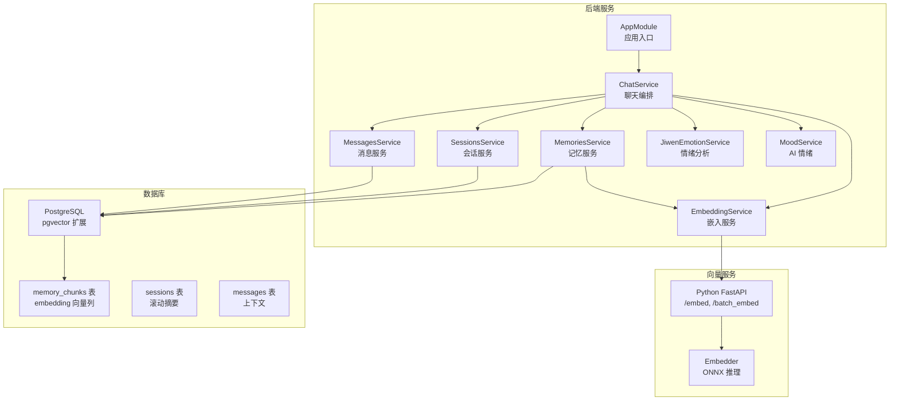
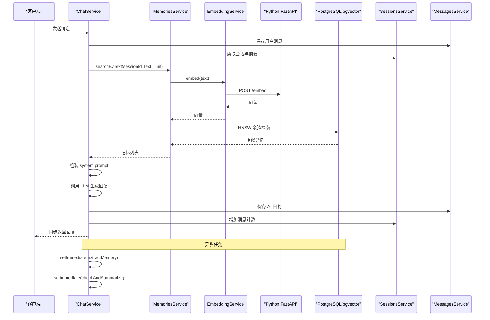
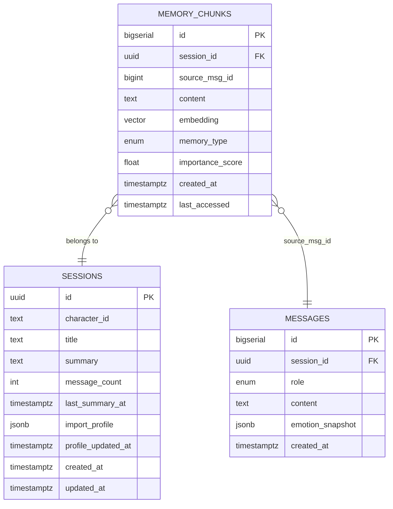
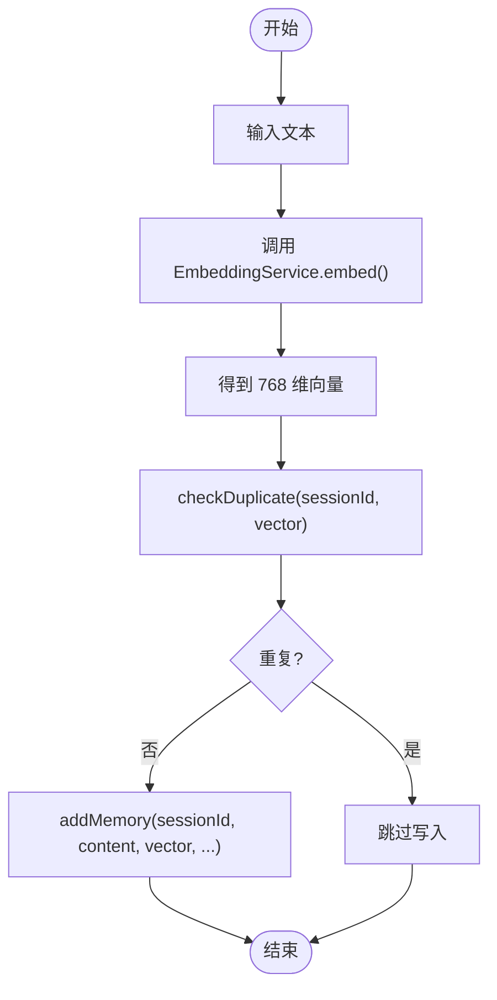
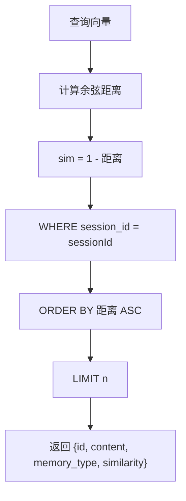
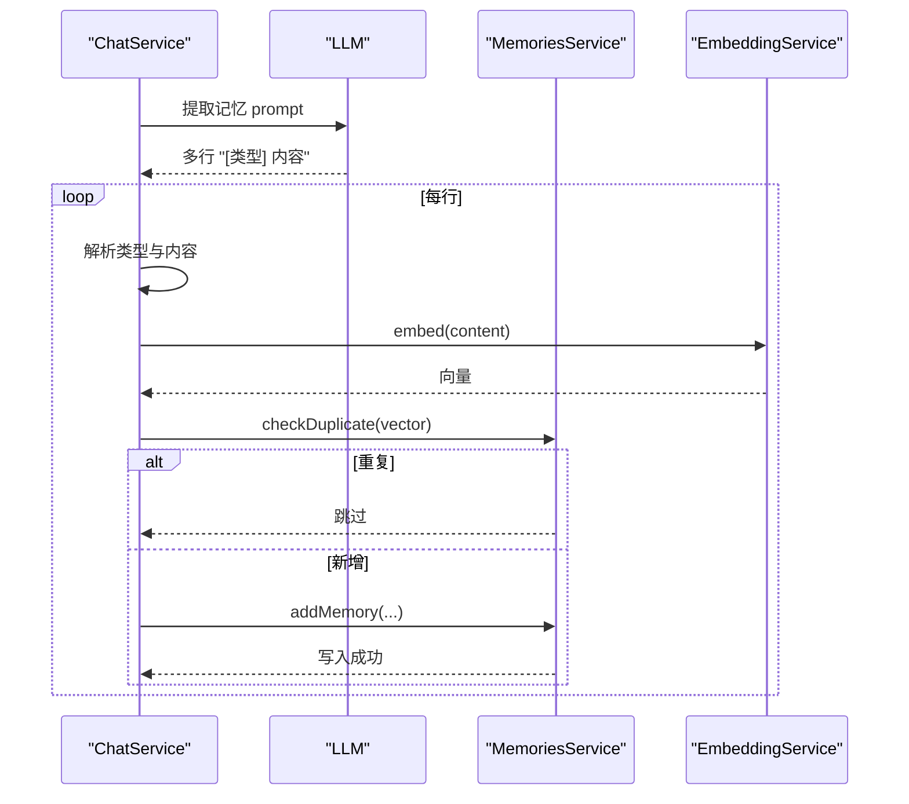
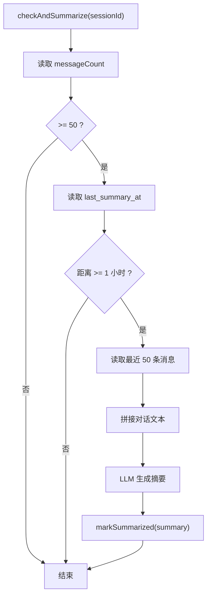
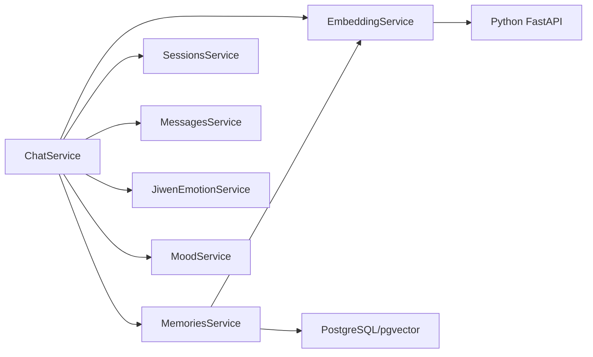

# 上下文记忆持久化

<cite>
**本文档引用的文件**
- [src/memories/entities/memory.entity.ts](file://src/memories/entities/memory.entity.ts)
- [src/memories/memories.service.ts](file://src/memories/memories.service.ts)
- [src/memories/memories.module.ts](file://src/memories/memories.module.ts)
- [src/embedding/embedding.service.ts](file://src/embedding/embedding.service.ts)
- [src/sessions/entities/session.entity.ts](file://src/sessions/entities/session.entity.ts)
- [src/sessions/sessions.service.ts](file://src/sessions/sessions.service.ts)
- [src/chat/chat.service.ts](file://src/chat/chat.service.ts)
- [src/messages/messages.service.ts](file://src/messages/messages.service.ts)
- [src/emotion/jiwen-emotion.service.ts](file://src/emotion/jiwen-emotion.service.ts)
- [src/emotion/mood.service.ts](file://src/emotion/mood.service.ts)
- [src/migrations/1710000000000-init-pgvector-schema.ts](file://src/migrations/1710000000000-init-pgvector-schema.ts)
- [python/embedder.py](file://python/embedder.py)
- [python/main.py](file://python/main.py)
- [src/app.module.ts](file://src/app.module.ts)
</cite>

## 目录
1. [简介](#简介)
2. [项目结构](#项目结构)
3. [核心组件](#核心组件)
4. [架构概览](#架构概览)
5. [详细组件分析](#详细组件分析)
6. [依赖关系分析](#依赖关系分析)
7. [性能考量](#性能考量)
8. [故障排查指南](#故障排查指南)
9. [结论](#结论)
10. [附录](#附录)

## 简介
本技术文档围绕“上下文记忆持久化”功能，系统性阐述记忆系统的完整架构与实现细节，包括：
- Memory 实体设计（content 内容字段、type 类型字段、sessionId 会话关联、embedding 向量嵌入等）
- 记忆存储机制（addMemoryByText 添加记忆、向量嵌入生成、相似度检索）
- 记忆检索算法（向量相似度计算、HNSW 索引优化、语义搜索）
- 异步记忆提取流程（extractMemory 记忆提取、事实/偏好/情绪分类、去重机制）
- pgvector 向量数据库集成方式、批量向量处理优化策略、记忆生命周期管理
- 滚动摘要机制（checkAndSummarize 定期摘要、消息计数触发条件、摘要生成流程）

文档旨在帮助开发者快速理解并扩展该记忆系统，同时为非技术读者提供清晰的概念说明与使用场景。

## 项目结构
该项目采用 NestJS 微服务架构，围绕“会话-消息-记忆-嵌入”四大核心域组织代码。记忆子系统独立于 TypeORM 实体映射，直接通过 DataSource 使用原生 SQL 操作 pgvector 表，确保向量列的稳定性与检索性能。

图表来源
- [src/app.module.ts:18-63](file://src/app.module.ts#L18-L63)
- [src/chat/chat.service.ts:29-40](file://src/chat/chat.service.ts#L29-L40)
- [src/memories/memories.service.ts:30-34](file://src/memories/memories.service.ts#L30-L34)
- [src/embedding/embedding.service.ts:13-21](file://src/embedding/embedding.service.ts#L13-L21)
- [src/migrations/1710000000000-init-pgvector-schema.ts:6-92](file://src/migrations/1710000000000-init-pgvector-schema.ts#L6-L92)
- [python/main.py:26-70](file://python/main.py#L26-L70)

章节来源
- [src/app.module.ts:18-63](file://src/app.module.ts#L18-L63)
- [src/migrations/1710000000000-init-pgvector-schema.ts:6-92](file://src/migrations/1710000000000-init-pgvector-schema.ts#L6-L92)

## 核心组件
- Memory 实体与表结构：定义记忆碎片的字段与约束，其中 embedding 为 pgvector 的 VECTOR(768)，不通过 TypeORM 映射，改由原生 SQL 管理。
- MemoriesService：提供检索、写入、查重、便捷接口（文本→向量→检索/写入），并直接使用 DataSource 执行 SQL。
- EmbeddingService：封装对 Python FastAPI 的 HTTP 调用，负责单条与批量向量生成。
- ChatService：核心业务编排，同步完成消息保存、上下文组装、LLM 调用；异步触发记忆提取与滚动摘要。
- SessionsService/MessagesService：维护会话摘要与消息计数，支撑滚动摘要触发条件。
- 情绪系统：JiwenEmotionService 分析用户情绪，MoodService 维护 AI 情绪状态，二者共同影响系统提示词。
- Python 向量服务：FastAPI 提供 /embed 与 /batch_embed 接口，ONNX 推理生成 768 维向量。

章节来源
- [src/memories/entities/memory.entity.ts:16-43](file://src/memories/entities/memory.entity.ts#L16-L43)
- [src/memories/memories.service.ts:30-137](file://src/memories/memories.service.ts#L30-L137)
- [src/embedding/embedding.service.ts:13-83](file://src/embedding/embedding.service.ts#L13-L83)
- [src/chat/chat.service.ts:29-374](file://src/chat/chat.service.ts#L29-L374)
- [src/sessions/sessions.service.ts:7-61](file://src/sessions/sessions.service.ts#L7-L61)
- [src/messages/messages.service.ts:23-92](file://src/messages/messages.service.ts#L23-L92)
- [src/emotion/jiwen-emotion.service.ts:31-133](file://src/emotion/jiwen-emotion.service.ts#L31-L133)
- [src/emotion/mood.service.ts:18-110](file://src/emotion/mood.service.ts#L18-L110)
- [python/main.py:26-122](file://python/main.py#L26-L122)
- [python/embedder.py:31-115](file://python/embedder.py#L31-L115)

## 架构概览
记忆系统采用“前端请求 → 后端编排 → 向量检索 → LLM 对话 → 异步记忆提取/摘要”的闭环流程。检索与写入通过 pgvector 的 HNSW 索引与余弦距离实现高效语义匹配；嵌入服务通过 Python FastAPI 提供稳定的 768 维向量；异步任务不阻塞主线程，保证用户体验。

图表来源
- [src/chat/chat.service.ts:42-113](file://src/chat/chat.service.ts#L42-L113)
- [src/memories/memories.service.ts:115-118](file://src/memories/memories.service.ts#L115-L118)
- [src/embedding/embedding.service.ts:33-42](file://src/embedding/embedding.service.ts#L33-L42)
- [python/main.py:91-112](file://python/main.py#L91-L112)
- [src/memories/memories.service.ts:42-59](file://src/memories/memories.service.ts#L42-L59)

## 详细组件分析

### Memory 实体与表结构
- 字段设计
  - id：自增主键
  - session_id：UUID，关联 sessions 表
  - source_msg_id：bigint，记录来源消息 ID（可为空）
  - content：text，记忆内容
  - memory_type：枚举 fact/preference/emotion
  - importance_score：float，默认 0.5
  - created_at/last_accessed：时间戳字段
- 特殊约定
  - embedding 为 VECTOR(768)，TypeORM 不支持，因此不映射到实体，所有涉及 embedding 的操作均通过原生 SQL 执行。

图表来源
- [src/memories/entities/memory.entity.ts:16-43](file://src/memories/entities/memory.entity.ts#L16-L43)
- [src/migrations/1710000000000-init-pgvector-schema.ts:71-82](file://src/migrations/1710000000000-init-pgvector-schema.ts#L71-L82)
- [src/sessions/entities/session.entity.ts:32-63](file://src/sessions/entities/session.entity.ts#L32-L63)
- [src/messages/messages.service.ts:23-92](file://src/messages/messages.service.ts#L23-L92)

章节来源
- [src/memories/entities/memory.entity.ts:16-43](file://src/memories/entities/memory.entity.ts#L16-L43)
- [src/migrations/1710000000000-init-pgvector-schema.ts:71-82](file://src/migrations/1710000000000-init-pgvector-schema.ts#L71-L82)

### 记忆存储机制
- addMemoryByText：文本 → 向量化 → 查重 → 写入
- addMemory：原生 SQL 插入，包含 embedding 列
- checkDuplicate：基于余弦距离阈值（默认 0.95）判断重复
- searchByText/search：检索相似记忆，返回 content、memory_type 与 similarity

图表来源
- [src/memories/memories.service.ts:124-136](file://src/memories/memories.service.ts#L124-L136)
- [src/embedding/embedding.service.ts:33-42](file://src/embedding/embedding.service.ts#L33-L42)
- [src/memories/memories.service.ts:93-110](file://src/memories/memories.service.ts#L93-L110)
- [src/memories/memories.service.ts:64-88](file://src/memories/memories.service.ts#L64-L88)

章节来源
- [src/memories/memories.service.ts:64-136](file://src/memories/memories.service.ts#L64-L136)
- [src/embedding/embedding.service.ts:33-65](file://src/embedding/embedding.service.ts#L33-L65)

### 记忆检索算法
- 余弦距离：pgvector 的 “<=>” 运算符计算 embedding 与查询向量的余弦距离
- 相似度换算：similarity = 1 - (embedding <=> query)
- HNSW 索引：使用向量余弦运算符创建 HNSW 索引，提升大规模检索性能
- 限制返回数量：默认 limit=5，可根据需要调整

图表来源
- [src/memories/memories.service.ts:42-59](file://src/memories/memories.service.ts#L42-L59)
- [src/migrations/1710000000000-init-pgvector-schema.ts:90-92](file://src/migrations/1710000000000-init-pgvector-schema.ts#L90-L92)

章节来源
- [src/memories/memories.service.ts:42-59](file://src/memories/memories.service.ts#L42-L59)
- [src/migrations/1710000000000-init-pgvector-schema.ts:90-92](file://src/migrations/1710000000000-init-pgvector-schema.ts#L90-L92)

### 异步记忆提取流程
- 触发时机：setImmediate 在主线程完成后立即执行
- 提取步骤：
  1) LLM 提取：调用 LLM 生成“[类型] 内容”格式的多行结果
  2) 解析：按行解析，映射到 fact/preference/emotion
  3) 向量化：逐条调用 EmbeddingService.embed
  4) 查重：checkDuplicate(cosine > 0.95 跳过）
  5) 写入：addMemory 写入 memory_chunks
- 失败处理：异步任务捕获错误并记录日志，不影响主流程

图表来源
- [src/chat/chat.service.ts:249-315](file://src/chat/chat.service.ts#L249-L315)
- [src/memories/memories.service.ts:93-110](file://src/memories/memories.service.ts#L93-L110)
- [src/embedding/embedding.service.ts:33-42](file://src/embedding/embedding.service.ts#L33-L42)

章节来源
- [src/chat/chat.service.ts:249-315](file://src/chat/chat.service.ts#L249-L315)

### 滚动摘要机制
- 触发条件：
  - 消息数 ≥ 50 条
  - 距离上次摘要 ≥ 1 小时（last_summary_at）
- 流程：
  1) 读取最近 50 条消息，拼接为对话文本
  2) LLM 生成摘要
  3) 更新 session.summary，重置 message_count 与 last_summary_at

图表来源
- [src/chat/chat.service.ts:334-374](file://src/chat/chat.service.ts#L334-L374)
- [src/sessions/sessions.service.ts:30-42](file://src/sessions/sessions.service.ts#L30-L42)

章节来源
- [src/chat/chat.service.ts:334-374](file://src/chat/chat.service.ts#L334-L374)
- [src/sessions/sessions.service.ts:30-42](file://src/sessions/sessions.service.ts#L30-L42)

### pgvector 集成与索引优化
- 扩展启用：CREATE EXTENSION IF NOT EXISTS vector
- 表结构：memory_chunks 包含 embedding vector(768) 列
- 索引：
  - idx_memory_embedding：HNSW，向量余弦运算符
  - idx_memory_session：(session_id, created_at)
  - idx_messages_session_created_at：消息表索引
- 设计原则：TypeORM 不同步 vector 列，通过迁移脚本创建与维护

章节来源
- [src/migrations/1710000000000-init-pgvector-schema.ts:6-92](file://src/migrations/1710000000000-init-pgvector-schema.ts#L6-L92)
- [src/memories/memories.module.ts:8-11](file://src/memories/memories.module.ts#L8-L11)

### 批量向量处理优化策略
- EmbeddingService.batchEmbed：批量接口，适合一次性处理多条记忆
- Python FastAPI：/batch_embed 支持批量推理，提升吞吐
- 优化建议：
  - 将多条记忆合并为批次，减少网络往返
  - 控制批次大小，平衡延迟与内存占用
  - 在异步提取中优先使用批量接口

章节来源
- [src/embedding/embedding.service.ts:56-65](file://src/embedding/embedding.service.ts#L56-L65)
- [python/main.py:103-112](file://python/main.py#L103-L112)

### 记忆生命周期管理
- 创建：addMemoryByText → 自动生成 embedding → 写入 memory_chunks
- 访问：last_accessed 字段记录访问时间，便于后续统计与清理
- 清理：可结合会话过期策略或定期任务进行归档/删除（当前实现未包含清理逻辑）
- 重要性：importance_score 默认 0.5，可用于后续排序或过滤

章节来源
- [src/memories/entities/memory.entity.ts:35-42](file://src/memories/entities/memory.entity.ts#L35-L42)
- [src/memories/memories.service.ts:64-88](file://src/memories/memories.service.ts#L64-L88)

### 通过记忆增强对话的连贯性与个性化
- 连贯性：滚动摘要提供上下文压缩，减少上下文长度
- 个性化：import_profile 与情绪状态注入 system prompt，使回复更贴合用户画像
- 记忆增强：检索到的记忆片段作为“关于用户的记忆”，直接参与 prompt 组装

章节来源
- [src/chat/chat.service.ts:424-497](file://src/chat/chat.service.ts#L424-L497)
- [src/sessions/entities/session.entity.ts:9-30](file://src/sessions/entities/session.entity.ts#L9-L30)
- [src/emotion/jiwen-emotion.service.ts:78-97](file://src/emotion/jiwen-emotion.service.ts#L78-L97)
- [src/emotion/mood.service.ts:59-91](file://src/emotion/mood.service.ts#L59-L91)

## 依赖关系分析
- 模块耦合
  - ChatService 依赖 MemoriesService、EmbeddingService、SessionsService、MessagesService、情绪服务
  - MemoriesService 仅依赖 DataSource 与 EmbeddingService，避免与 TypeORM 实体耦合
  - EmbeddingService 仅依赖 HttpService 与环境变量，职责单一
- 外部依赖
  - PostgreSQL + pgvector：向量检索与索引
  - Python FastAPI：ONNX 推理引擎
- 循环依赖
  - 未发现循环依赖，模块间关系清晰

图表来源
- [src/chat/chat.service.ts:29-40](file://src/chat/chat.service.ts#L29-L40)
- [src/memories/memories.service.ts:30-34](file://src/memories/memories.service.ts#L30-L34)
- [src/embedding/embedding.service.ts:13-21](file://src/embedding/embedding.service.ts#L13-L21)
- [python/main.py:26-70](file://python/main.py#L26-L70)

章节来源
- [src/chat/chat.service.ts:29-40](file://src/chat/chat.service.ts#L29-L40)
- [src/memories/memories.service.ts:30-34](file://src/memories/memories.service.ts#L30-L34)
- [src/embedding/embedding.service.ts:13-21](file://src/embedding/embedding.service.ts#L13-L21)

## 性能考量
- 向量检索性能
  - HNSW 索引显著降低检索复杂度，适合大规模向量数据
  - 余弦距离计算在数据库侧完成，减少网络传输
- 批量处理
  - 批量嵌入接口减少 HTTP 调用次数，提高吞吐
  - 建议在异步提取中优先使用批量接口
- 资源控制
  - Python 服务超时配置：单条 10 秒，批量 30 秒
  - 检索 limit 控制返回数量，避免上下文过长
- 存储与索引
  - 确保 vector 扩展与索引存在，迁移脚本已包含创建逻辑

[本节为通用性能建议，无需特定文件引用]

## 故障排查指南
- Python 向量服务不可用
  - 现象：EmbeddingService.healthCheck 返回 false
  - 处理：确认 Python 服务已启动，端口与环境变量正确
- 模型文件缺失
  - 现象：ONNX 推理报错或提示模型不存在
  - 处理：运行下载脚本或设置环境变量指向模型路径
- pgvector 索引缺失
  - 现象：检索性能差或报错
  - 处理：运行迁移脚本确保扩展与索引创建
- 记忆重复写入
  - 现象：相似记忆被重复插入
  - 处理：调整查重阈值或优化嵌入质量
- 异步任务失败
  - 现象：日志出现 Memory Extract/Summarize 错误
  - 处理：检查 LLM 可用性与网络连接，异步任务不影响主线程

章节来源
- [src/embedding/embedding.service.ts:70-82](file://src/embedding/embedding.service.ts#L70-L82)
- [python/main.py:64-70](file://python/main.py#L64-L70)
- [src/migrations/1710000000000-init-pgvector-schema.ts:6-92](file://src/migrations/1710000000000-init-pgvector-schema.ts#L6-L92)
- [src/chat/chat.service.ts:311-314](file://src/chat/chat.service.ts#L311-L314)

## 结论
该记忆系统通过 pgvector 与 HNSW 索引实现了高效的语义检索，结合异步记忆提取与滚动摘要机制，在保证用户体验的同时提升了对话的连贯性与个性化程度。通过将 embedding 字段与 TypeORM 解耦，系统在可维护性与性能之间取得良好平衡。建议在生产环境中持续监控向量服务健康状况与检索性能，并根据业务增长调整索引与批处理策略。

[本节为总结性内容，无需特定文件引用]

## 附录

### 常见操作示例（代码路径）
- 添加记忆（文本→向量→查重→写入）
  - [src/memories/memories.service.ts:124-136](file://src/memories/memories.service.ts#L124-L136)
- 检索记忆（文本→向量→检索）
  - [src/memories/memories.service.ts:115-118](file://src/memories/memories.service.ts#L115-L118)
  - [src/memories/memories.service.ts:42-59](file://src/memories/memories.service.ts#L42-L59)
- 异步记忆提取
  - [src/chat/chat.service.ts:249-315](file://src/chat/chat.service.ts#L249-L315)
- 滚动摘要
  - [src/chat/chat.service.ts:334-374](file://src/chat/chat.service.ts#L334-L374)
  - [src/sessions/sessions.service.ts:30-42](file://src/sessions/sessions.service.ts#L30-L42)

### 配置与环境
- 数据库连接与迁移
  - [src/app.module.ts:37-50](file://src/app.module.ts#L37-L50)
  - [src/migrations/1710000000000-init-pgvector-schema.ts:6-92](file://src/migrations/1710000000000-init-pgvector-schema.ts#L6-L92)
- Python 向量服务
  - [python/main.py:26-70](file://python/main.py#L26-L70)
  - [python/embedder.py:31-115](file://python/embedder.py#L31-L115)