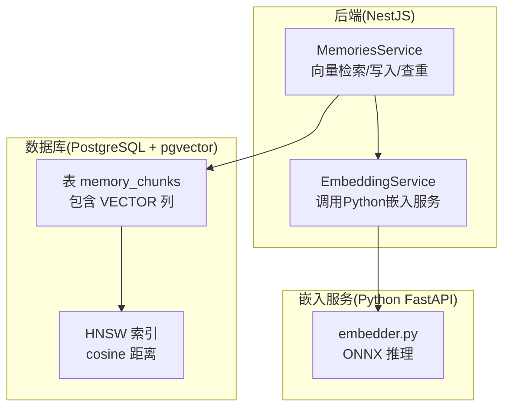
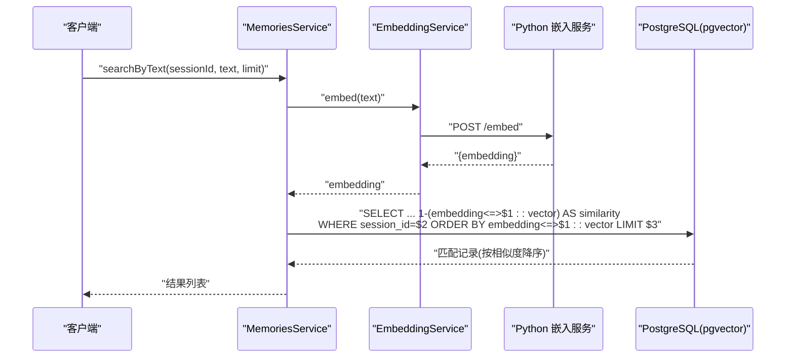
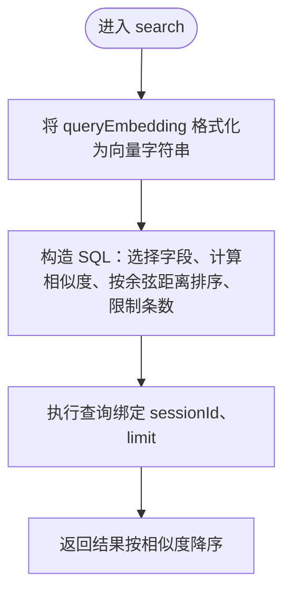
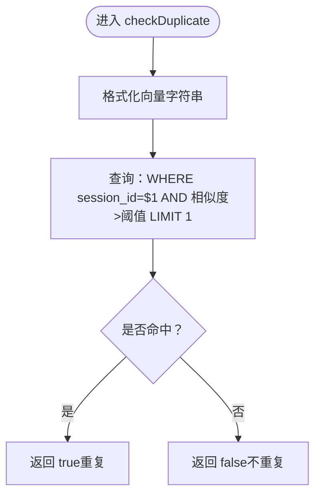
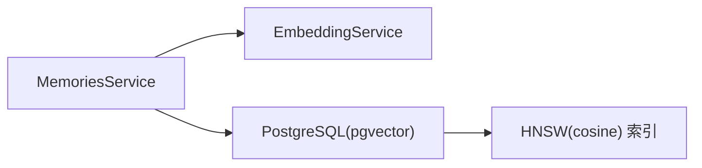

# 向量相似度检索

<cite>
**本文引用的文件**
- [memories.service.ts](file://src/memories/memories.service.ts)
- [Learning_Notes.md](file://docs/Learning_Notes.md)
- [AI_Companion_最终方案.md](file://docs/AI_Companion_最终方案.md)
- [1710000000000-init-pgvector-schema.ts](file://src/migrations/1710000000000-init-pgvector-schema.ts)
- [embedder.py](file://python/embedder.py)
</cite>

## 目录
1. [简介](#简介)
2. [项目结构](#项目结构)
3. [核心组件](#核心组件)
4. [架构总览](#架构总览)
5. [详细组件分析](#详细组件分析)
6. [依赖关系分析](#依赖关系分析)
7. [性能考量](#性能考量)
8. [故障排查指南](#故障排查指南)
9. [结论](#结论)
10. [附录](#附录)

## 简介
本技术文档围绕向量相似度检索功能展开，系统阐述了基于 pgvector 的向量数据库集成方案，重点包括：
- pgvector 余弦距离运算符“<=>”的使用原理与余弦相似度计算公式 1-(embedding<=>$1::vector) 的数学含义与取值范围
- HNSW 索引在向量检索中的性能优势与参数调优
- search 方法的实现细节：参数处理（会话过滤、查询向量、返回条数限制）、SQL 查询优化策略、向量字符串格式化
- 相似度阈值的应用场景（如查重机制中 0.95 阈值的选择依据）与语义相关性排序
- 实际代码示例路径与性能优化技巧

## 项目结构
本项目采用 NestJS 后端与 PostgreSQL + pgvector 的混合架构。向量相关逻辑集中在内存模块（memories），通过原生 SQL 执行向量检索与写入；非向量字段仍由 TypeORM 管理；嵌入模型服务由独立的 Python FastAPI 提供。

图表来源
- [memories.service.ts:36-137](file://src/memories/memories.service.ts#L36-L137)
- [embedder.py](file://python/embedder.py)

章节来源
- [memories.service.ts:36-137](file://src/memories/memories.service.ts#L36-L137)
- [AI_Companion_最终方案.md:252-313](file://docs/AI_Companion_最终方案.md#L252-L313)

## 核心组件
- 向量检索与写入：MemoriesService 提供 search、addMemory、checkDuplicate、searchByText、addMemoryByText 等方法，其中 search 使用 pgvector 的余弦距离运算符“<=>”，并通过 ORDER BY 和 LIMIT 控制返回数量。
- 嵌入服务：EmbeddingService 通过 HTTP 调用 Python FastAPI 的 /embed 或 /batch_embed 接口获取向量。
- 数据库迁移：初始化 memory_chunks 表与 HNSW 索引，确保 cosine 距离检索性能。
- 文档规范：Learning_Notes 与 AI_Companion_最终方案 明确了 TypeORM 与 pgvector 的协作边界与实现原则。

章节来源
- [memories.service.ts:36-137](file://src/memories/memories.service.ts#L36-L137)
- [AI_Companion_最终方案.md:252-313](file://docs/AI_Companion_最终方案.md#L252-L313)
- [Learning_Notes.md:1085-1129](file://docs/Learning_Notes.md#L1085-L1129)

## 架构总览
下图展示了从文本到向量、再到向量检索与查重的整体流程。

图表来源
- [memories.service.ts:115-118](file://src/memories/memories.service.ts#L115-L118)
- [embedder.py](file://python/embedder.py)
- [AI_Companion_最终方案.md:284-313](file://docs/AI_Companion_最终方案.md#L284-L313)

## 详细组件分析

### 余弦距离与相似度计算
- 运算符“<=>”：pgvector 的余弦距离运算符，返回两个向量之间的余弦距离（0~2，越小越相似）。
- 相似度公式：1 - (embedding <=> query) 得到余弦相似度（0~1，越大越相似）。
- 取值范围：当两向量完全一致时相似度为 1；方向相反时距离为 2，相似度为 -1；正交时距离为 1，相似度为 0。

章节来源
- [memories.service.ts:36-60](file://src/memories/memories.service.ts#L36-L60)
- [Learning_Notes.md:1085-1129](file://docs/Learning_Notes.md#L1085-L1129)

### HNSW 索引与性能优势
- HNSW（Hierarchical Navigable Small World）是 pgvector 的高性能近似最近邻搜索索引，适合大规模向量检索。
- 常用参数：
  - m：每个节点的最大连接数，调大可提升精度但占用更多空间
  - ef_construction：构建时搜索深度，调大可提升精度但构建更慢
- 在 memory_chunks 上建立 HNSW(cosine) 索引，可显著降低 ORDER BY embedding<=>$1::vector 的查询成本。

章节来源
- [Learning_Notes.md:1116-1129](file://docs/Learning_Notes.md#L1116-L1129)
- [1710000000000-init-pgvector-schema.ts](file://src/migrations/1710000000000-init-pgvector-schema.ts)

### search 方法实现细节
- 参数处理
  - sessionId：用于会话过滤，确保检索仅在当前会话内进行
  - queryEmbedding：查询向量数组，需格式化为向量字符串
  - limit：返回数量限制
- SQL 查询优化策略
  - 使用余弦距离作为排序键，配合 HNSW 索引实现高效近似最近邻
  - 通过 WHERE 子句限定 session_id，减少扫描范围
  - 使用 LIMIT 控制结果集大小
- 向量字符串格式化
  - 将数字数组拼接为形如 “[x,y,z,...]” 的字符串，传入 SQL 作为 ::vector 类型
  - 该格式由服务内部统一生成，避免在调用方处理格式问题

图表来源
- [memories.service.ts:42-59](file://src/memories/memories.service.ts#L42-L59)

章节来源
- [memories.service.ts:42-59](file://src/memories/memories.service.ts#L42-L59)

### 相似度阈值与查重机制
- 应用场景：在新增记忆前，先检查是否存在高相似度的历史记录，若存在则判定为重复并跳过写入
- 阈值选择：0.95 作为“高度相似”的阈值，兼顾召回与防误报
- 实现要点：使用 1 - (embedding<=>$2::vector) > $3 的条件快速过滤低相似度项，LIMIT 1 提升效率

图表来源
- [memories.service.ts:93-110](file://src/memories/memories.service.ts#L93-L110)

章节来源
- [memories.service.ts:93-110](file://src/memories/memories.service.ts#L93-L110)

### 便捷方法：文本→向量化→检索/查重/写入
- searchByText：对输入文本进行嵌入，再调用 search 完成检索
- addMemoryByText：先查重，若未重复则写入新记忆
- 依赖 EmbeddingService 通过 Python FastAPI 获取向量

章节来源
- [memories.service.ts:115-137](file://src/memories/memories.service.ts#L115-L137)
- [AI_Companion_最终方案.md:284-313](file://docs/AI_Companion_最终方案.md#L284-L313)

## 依赖关系分析
- MemoriesService 依赖 EmbeddingService 获取向量
- 数据访问通过 DataSource.query 执行原生 SQL，避免 TypeORM 对 VECTOR 类型的支持限制
- 数据库层面依赖 HNSW(cosine) 索引提供高效检索

图表来源
- [memories.service.ts:36-137](file://src/memories/memories.service.ts#L36-L137)
- [AI_Companion_最终方案.md:252-313](file://docs/AI_Companion_最终方案.md#L252-L313)

章节来源
- [memories.service.ts:36-137](file://src/memories/memories.service.ts#L36-L137)
- [AI_Companion_最终方案.md:252-313](file://docs/AI_Companion_最终方案.md#L252-L313)

## 性能考量
- 索引策略
  - 为 embedding 列建立 HNSW(cosine) 索引，确保 ORDER BY 与 WHERE 条件下的高效扫描
  - 合理设置 m 与 ef_construction，在精度与资源之间取得平衡
- 查询优化
  - 使用 LIMIT 控制返回数量，避免全表扫描
  - WHERE 限定 session_id，缩小检索范围
  - 优先使用余弦距离作为排序键，充分利用索引
- 向量格式化
  - 统一在服务层进行向量字符串格式化，减少调用方负担
- 嵌入服务
  - 使用 Python FastAPI + ONNX 推理，保证低延迟与高吞吐

章节来源
- [Learning_Notes.md:1116-1129](file://docs/Learning_Notes.md#L1116-L1129)
- [AI_Companion_最终方案.md:284-313](file://docs/AI_Companion_最终方案.md#L284-L313)

## 故障排查指南
- 现象：检索结果为空或性能异常
  - 检查是否已创建 HNSW(cosine) 索引
  - 确认 sessionId 是否正确传入且与数据一致
  - 验证向量字符串格式是否符合“[x,y,z,...]”
- 现象：相似度异常（远小于预期）
  - 确认嵌入模型与训练/推理一致性
  - 检查是否对向量进行了归一化等预处理
- 现象：查重频繁误判
  - 调整相似度阈值（如从 0.95 下调至 0.92~0.94）
  - 结合业务语境评估阈值，必要时引入多阈值策略

章节来源
- [memories.service.ts:93-110](file://src/memories/memories.service.ts#L93-L110)
- [Learning_Notes.md:1085-1129](file://docs/Learning_Notes.md#L1085-L1129)

## 结论
本方案以 pgvector 为核心，结合 HNSW(cosine) 索引与原生 SQL，实现了高效的向量相似度检索与查重能力。通过明确 TypeORM 与 pgvector 的协作边界、统一向量格式化与阈值策略，既保证了性能，也提升了可维护性。建议在生产环境中持续监控索引参数与阈值表现，并根据业务反馈动态调整。

## 附录
- 相关实现路径参考
  - 向量检索与写入：[memories.service.ts:36-137](file://src/memories/memories.service.ts#L36-L137)
  - HNSW 索引定义与迁移：[1710000000000-init-pgvector-schema.ts](file://src/migrations/1710000000000-init-pgvector-schema.ts)
  - 嵌入服务接口与实现：[embedder.py](file://python/embedder.py)
  - 设计文档与协作边界：[AI_Companion_最终方案.md:252-313](file://docs/AI_Companion_最终方案.md#L252-L313)
  - 余弦距离与 HNSW 参数说明：[Learning_Notes.md:1085-1129](file://docs/Learning_Notes.md#L1085-L1129)