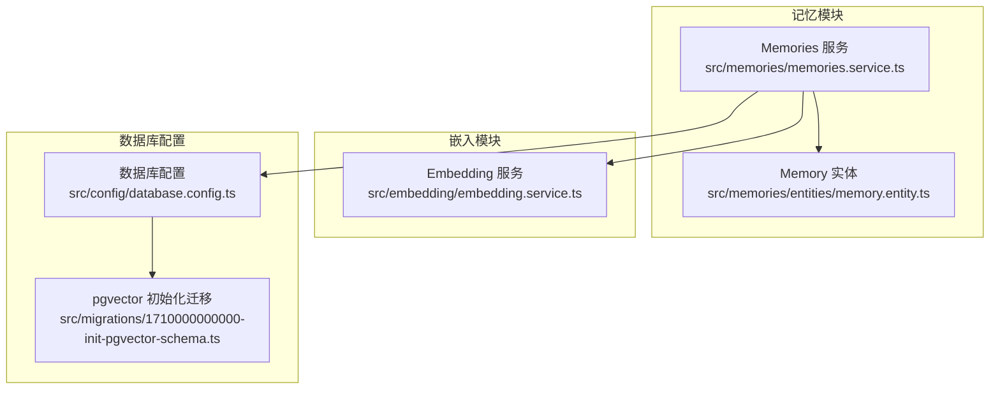
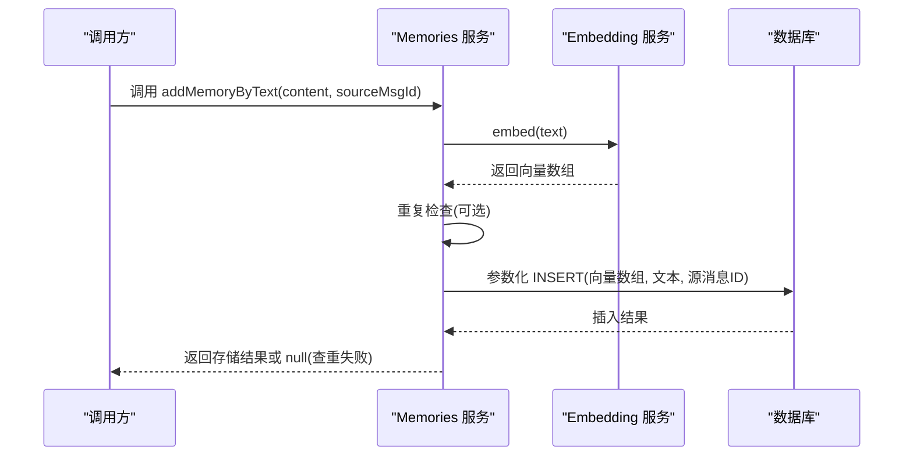
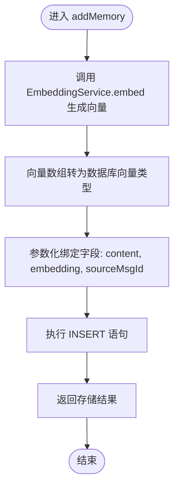
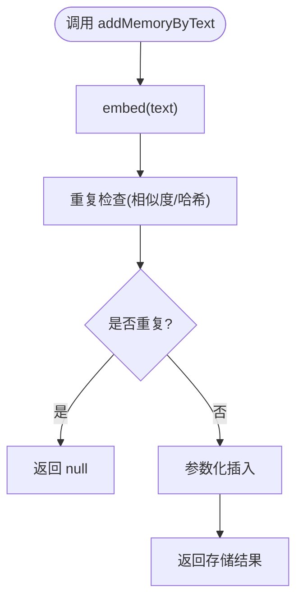
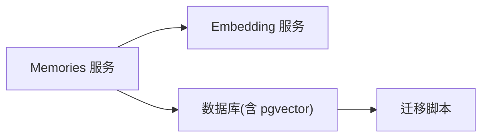

# 记忆存储机制

<cite>
**本文引用的文件**
- [memory.entity.ts](file://src/memories/entities/memory.entity.ts)
- [memories.service.ts](file://src/memories/memories.service.ts)
- [embedding.service.ts](file://src/embedding/embedding.service.ts)
- [database.config.ts](file://src/config/database.config.ts)
- [1710000000000-init-pgvector-schema.ts](file://src/migrations/1710000000000-init-pgvector-schema.ts)
</cite>

## 目录
1. [引言](#引言)
2. [项目结构](#项目结构)
3. [核心组件](#核心组件)
4. [架构总览](#架构总览)
5. [详细组件分析](#详细组件分析)
6. [依赖关系分析](#依赖关系分析)
7. [性能考量](#性能考量)
8. [故障排查指南](#故障排查指南)
9. [结论](#结论)

## 引言
本技术文档围绕“记忆存储机制”展开，重点阐述以下内容：
- addMemory 方法的完整存储流程：从文本向量化到 SQL 插入、向量数据类型转换与参数绑定、返回值处理。
- addMemoryByText 便捷方法：自动向量化、重复检查与查重失败时的 null 返回策略。
- sourceMsgId 源消息 ID 字段：用于建立记忆与原始消息之间的关联。
- 性能优化：批量插入、事务策略、大文本存储最佳实践。
- 安全性：向量数据的安全处理、SQL 注入防护与错误处理机制。

## 项目结构
记忆相关模块位于 src/memories，包含实体定义、服务层与数据库配置；向量化由 embedding 服务提供；迁移脚本初始化 pgvector 扩展与向量索引表结构。

**图表来源**
- [memory.entity.ts](file://src/memories/entities/memory.entity.ts)
- [memories.service.ts](file://src/memories/memories.service.ts)
- [embedding.service.ts](file://src/embedding/embedding.service.ts)
- [database.config.ts](file://src/config/database.config.ts)
- [1710000000000-init-pgvector-schema.ts](file://src/migrations/1710000000000-init-pgvector-schema.ts)

**章节来源**
- [memory.entity.ts](file://src/memories/entities/memory.entity.ts)
- [memories.service.ts](file://src/memories/memories.service.ts)
- [embedding.service.ts](file://src/embedding/embedding.service.ts)
- [database.config.ts](file://src/config/database.config.ts)
- [1710000000000-init-pgvector-schema.ts](file://src/migrations/1710000000000-init-pgvector-schema.ts)

## 核心组件
- Memory 实体：定义记忆字段（如 content、embedding、sourceMsgId 等），并映射到数据库表。
- Memories 服务：对外暴露 addMemory、addMemoryByText 等方法，负责调用 EmbeddingService 获取向量、执行 SQL 插入、参数绑定与返回值处理。
- Embedding 服务：封装向量嵌入生成逻辑，输出固定维度的向量数组。
- 数据库配置：连接 PostgreSQL 并启用 pgvector 扩展，确保向量列类型可用。
- 迁移脚本：初始化向量表结构与索引，保证后续插入与检索性能。

**章节来源**
- [memory.entity.ts](file://src/memories/entities/memory.entity.ts)
- [memories.service.ts](file://src/memories/memories.service.ts)
- [embedding.service.ts](file://src/embedding/embedding.service.ts)
- [database.config.ts](file://src/config/database.config.ts)
- [1710000000000-init-pgvector-schema.ts](file://src/migrations/1710000000000-init-pgvector-schema.ts)

## 架构总览
下图展示了 addMemory 及 addMemoryByText 的端到端流程：文本经 EmbeddingService 向量化，随后由 Memories 服务以参数化方式写入数据库，同时保留 sourceMsgId 建立与原始消息的关联。

**图表来源**
- [memories.service.ts](file://src/memories/memories.service.ts)
- [embedding.service.ts](file://src/embedding/embedding.service.ts)

## 详细组件分析

### Memory 实体与表结构
- 字段设计要点：
  - content：存储记忆文本（建议分段或截断以控制单条记录大小）。
  - embedding：向量列，pgvector 类型，维度与嵌入模型一致。
  - sourceMsgId：源消息 ID，用于回溯记忆来源，便于上下文关联与去重。
- 索引与约束：迁移脚本中应包含向量距离索引与必要约束，以提升相似度检索性能与数据完整性。

**章节来源**
- [memory.entity.ts](file://src/memories/entities/memory.entity.ts)
- [1710000000000-init-pgvector-schema.ts](file://src/migrations/1710000000000-init-pgvector-schema.ts)

### EmbeddingService 向量化流程
- 输入：原始文本字符串。
- 输出：固定维度的浮点数组（例如 768 维）。
- 处理：内部封装模型推理与后处理，确保输出格式稳定，供数据库向量列直接使用。

**章节来源**
- [embedding.service.ts](file://src/embedding/embedding.service.ts)

### addMemory 存储流程详解
- 步骤一：调用 EmbeddingService.embed 获取向量数组。
- 步骤二：将向量数组转换为数据库可接受的向量类型（例如 [embedding.join(',')] 形式）。
- 步骤三：构造参数化 SQL 插入语句，绑定 content、embedding、sourceMsgId 等字段。
- 步骤四：执行插入并返回存储结果（成功/失败状态）。

**图表来源**
- [memories.service.ts](file://src/memories/memories.service.ts)
- [embedding.service.ts](file://src/embedding/embedding.service.ts)

**章节来源**
- [memories.service.ts](file://src/memories/memories.service.ts)

### addMemoryByText 便捷方法工作原理
- 自动向量化：内部调用 EmbeddingService.embed 对输入文本进行向量化。
- 重复检查：在插入前对 content 或 embedding 进行相似度/哈希检查，避免重复记忆。
- 查重失败策略：若重复检查未通过，返回 null，避免污染数据库与检索结果。

**图表来源**
- [memories.service.ts](file://src/memories/memories.service.ts)
- [embedding.service.ts](file://src/embedding/embedding.service.ts)

**章节来源**
- [memories.service.ts](file://src/memories/memories.service.ts)

### sourceMsgId 源消息 ID 字段
- 作用：建立记忆与原始消息的可追溯关联，支持：
  - 上下文回溯：根据 sourceMsgId 还原原始对话片段。
  - 去重与更新：同一消息触发的记忆可被识别并合并。
  - 审计与调试：便于定位问题与验证数据来源。

**章节来源**
- [memory.entity.ts](file://src/memories/entities/memory.entity.ts)
- [memories.service.ts](file://src/memories/memories.service.ts)

### 数据类型转换与参数绑定
- 向量数据类型转换：将浮点数组转换为数据库向量类型（如 [embedding.join(',')]），确保与 pgvector 列匹配。
- 参数绑定：使用参数化查询绑定字段，避免 SQL 注入风险。
- 返回值处理：根据插入结果返回布尔状态或对象，供上层业务判断。

**章节来源**
- [memories.service.ts](file://src/memories/memories.service.ts)
- [database.config.ts](file://src/config/database.config.ts)

## 依赖关系分析
- Memories 服务依赖 EmbeddingService 生成向量，依赖数据库配置连接与迁移脚本提供的表结构。
- 数据库层依赖 pgvector 扩展，迁移脚本负责初始化向量列与索引。
- 低耦合高内聚：向量化与存储分离，便于替换模型与优化存储策略。

**图表来源**
- [memories.service.ts](file://src/memories/memories.service.ts)
- [embedding.service.ts](file://src/embedding/embedding.service.ts)
- [database.config.ts](file://src/config/database.config.ts)
- [1710000000000-init-pgvector-schema.ts](file://src/migrations/1710000000000-init-pgvector-schema.ts)

**章节来源**
- [memories.service.ts](file://src/memories/memories.service.ts)
- [embedding.service.ts](file://src/embedding/embedding.service.ts)
- [database.config.ts](file://src/config/database.config.ts)
- [1710000000000-init-pgvector-schema.ts](file://src/migrations/1710000000000-init-pgvector-schema.ts)

## 性能考量
- 批量插入优化：
  - 使用批量参数化 INSERT 提升吞吐，减少网络往返。
  - 控制每批大小，避免单次事务过大导致锁竞争。
- 事务策略：
  - 将重复检查与插入置于同一事务中，保证一致性。
  - 对于高频写入场景，可采用只读副本或异步写入队列。
- 大文本存储最佳实践：
  - 预切分长文本，降低单条记录体积，提升查询与索引效率。
  - 对重复率高的内容进行预去重与哈希缓存。
- 向量索引：
  - 在迁移脚本中创建合适的向量距离索引，加速相似度检索。
  - 定期维护索引，监控查询延迟与存储开销。

[本节为通用性能指导，不直接分析具体文件]

## 故障排查指南
- 向量维度不匹配：
  - 确认 EmbeddingService 输出维度与数据库向量列一致。
- SQL 注入防护：
  - 严格使用参数化查询，禁止拼接用户输入到 SQL 字符串。
- 查重失败返回 null：
  - 若 addMemoryByText 返回 null，检查重复阈值与相似度算法设置。
- pgvector 扩展问题：
  - 确认数据库已启用 pgvector 扩展，迁移脚本执行成功。
- 大文本导致的超时：
  - 分段存储与限流策略，避免单次请求过大。

**章节来源**
- [memories.service.ts](file://src/memories/memories.service.ts)
- [embedding.service.ts](file://src/embedding/embedding.service.ts)
- [database.config.ts](file://src/config/database.config.ts)
- [1710000000000-init-pgvector-schema.ts](file://src/migrations/1710000000000-init-pgvector-schema.ts)

## 结论
记忆存储机制通过“文本 → 向量 → 参数化插入”的闭环流程，实现了高效、可追溯且可扩展的记忆持久化能力。借助 sourceMsgId 建立与原始消息的关联，配合重复检查与事务策略，既保障了数据质量，也提升了检索性能。通过批量插入、索引优化与大文本分段等手段，可在高并发场景下保持系统稳定性与响应速度。