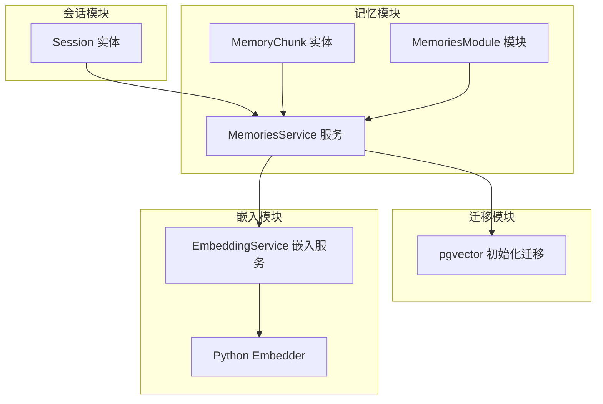
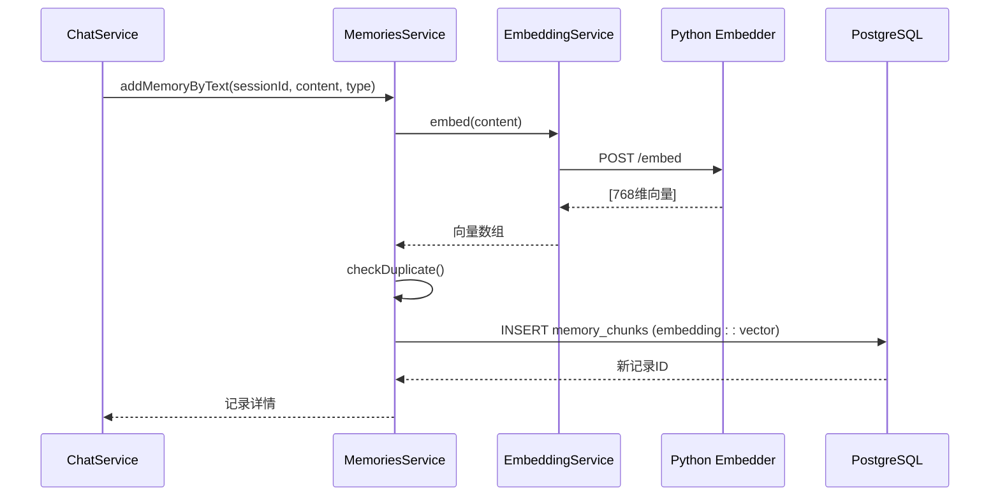
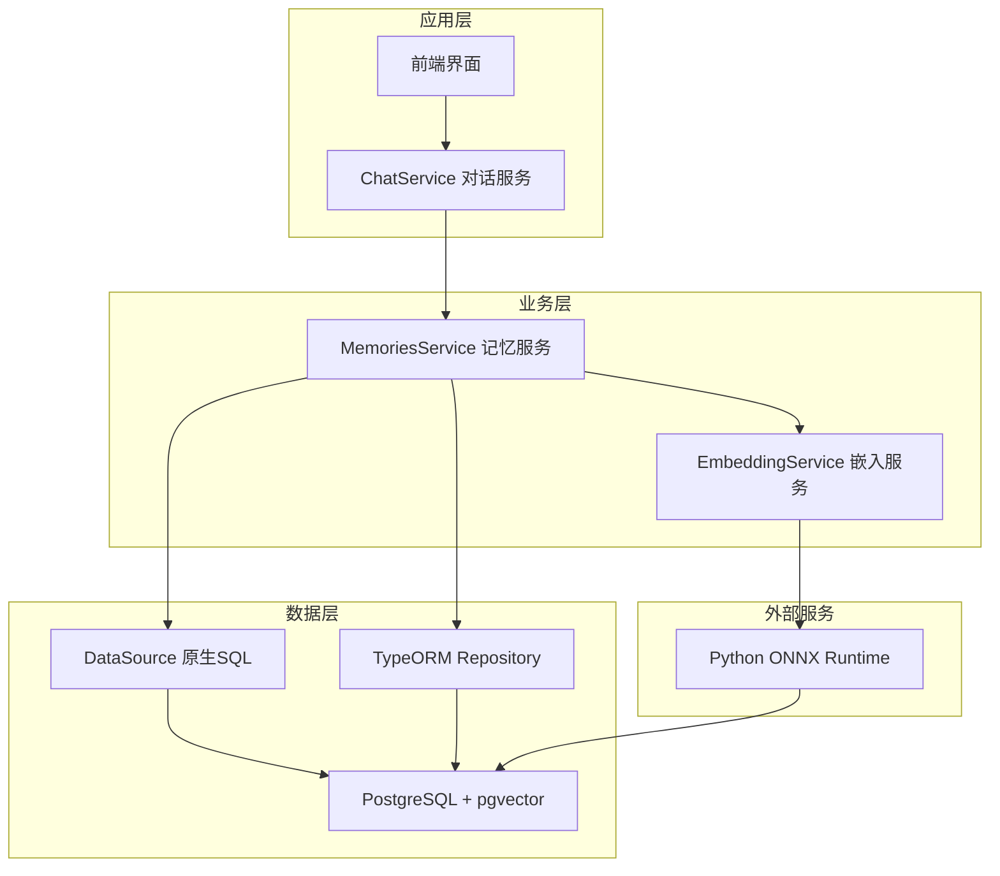
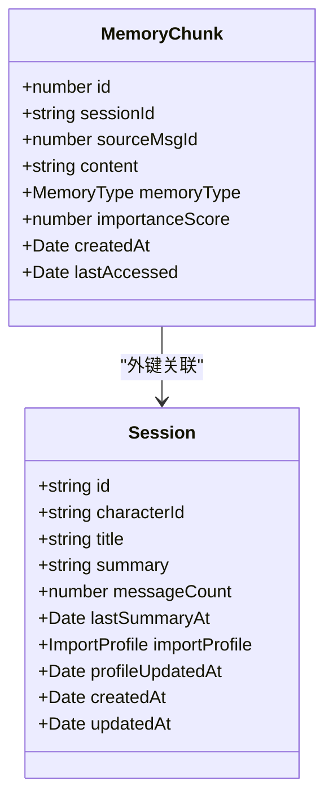
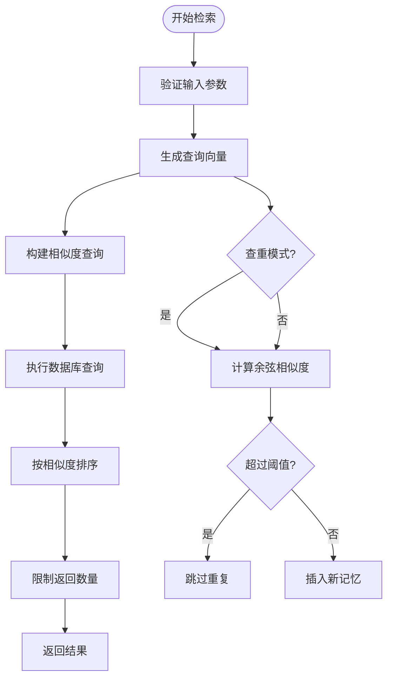
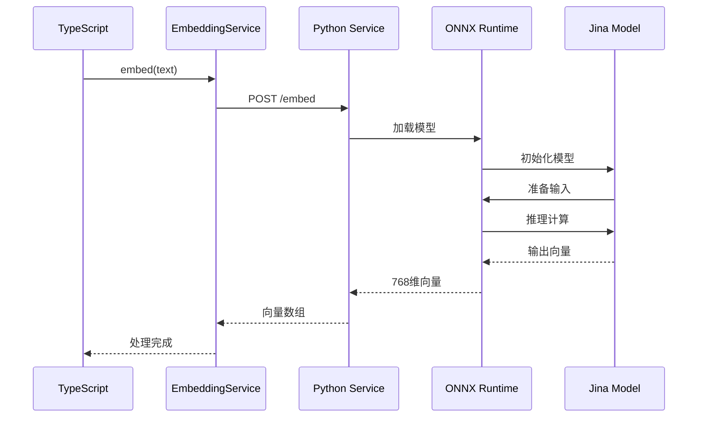
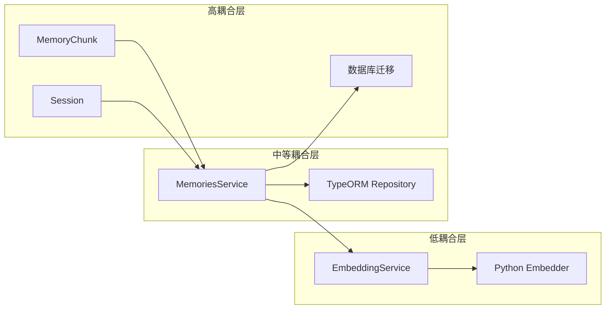

# 记忆实体设计

<cite>
**本文档引用的文件**
- [memory.entity.ts](file://src/memories/entities/memory.entity.ts)
- [memories.service.ts](file://src/memories/memories.service.ts)
- [memories.module.ts](file://src/memories/memories.module.ts)
- [1710000000000-init-pgvector-schema.ts](file://src/migrations/1710000000000-init-pgvector-schema.ts)
- [session.entity.ts](file://src/sessions/entities/session.entity.ts)
- [embedding.service.ts](file://src/embedding/embedding.service.ts)
- [embedder.py](file://python/embedder.py)
- [chat.service.ts](file://src/chat/chat.service.ts)
</cite>

## 目录
1. [简介](#简介)
2. [项目结构](#项目结构)
3. [核心组件](#核心组件)
4. [架构概览](#架构概览)
5. [详细组件分析](#详细组件分析)
6. [依赖关系分析](#依赖关系分析)
7. [性能考虑](#性能考虑)
8. [故障排除指南](#故障排除指南)
9. [结论](#结论)

## 简介

本文件详细阐述了AI Companion项目中记忆实体的设计与实现。记忆实体是系统长期记忆能力的核心，负责存储用户对话中的事实、偏好和情绪信息。该设计采用TypeORM与PostgreSQL pgvector扩展相结合的方式，实现了高效的向量相似度检索和智能的记忆管理。

## 项目结构

记忆相关功能分布在以下关键文件中：



**图表来源**
- [memory.entity.ts:16-43](file://src/memories/entities/memory.entity.ts#L16-L43)
- [memories.service.ts:29-34](file://src/memories/memories.service.ts#L29-L34)
- [memories.module.ts:12-17](file://src/memories/memories.module.ts#L12-L17)

**章节来源**
- [memory.entity.ts:1-44](file://src/memories/entities/memory.entity.ts#L1-L44)
- [memories.service.ts:1-138](file://src/memories/memories.service.ts#L1-L138)
- [memories.module.ts:1-18](file://src/memories/memories.module.ts#L1-L18)

## 核心组件

### MemoryChunk 实体设计

MemoryChunk是记忆实体的核心，采用TypeORM进行映射，但专门处理非向量字段：

| 字段名称 | 类型 | 约束 | 描述 |
|---------|------|------|------|
| id | bigint | PRIMARY KEY, AUTO_INCREMENT | 记忆碎片主键 |
| sessionId | uuid | NOT NULL | 会话关联外键 |
| sourceMsgId | bigint | NULLABLE | 来源消息ID |
| content | text | NOT NULL | 记忆内容文本 |
| memoryType | enum | NOT NULL, CHECK | 记忆类型（fact/preference/emotion） |
| importanceScore | float | DEFAULT 0.5 | 重要性评分 |
| createdAt | timestamptz | DEFAULT NOW() | 创建时间戳 |
| lastAccessed | timestamptz | DEFAULT NOW() | 最后访问时间戳 |

### 向量嵌入系统

由于TypeORM不支持pgvector的VECTOR(768)类型，向量字段通过原生SQL处理：



**图表来源**
- [chat.service.ts:298-303](file://src/chat/chat.service.ts#L298-L303)
- [memories.service.ts:124-136](file://src/memories/memories.service.ts#L124-L136)
- [embedding.service.ts:33-42](file://src/embedding/embedding.service.ts#L33-L42)

**章节来源**
- [memory.entity.ts:17-43](file://src/memories/entities/memory.entity.ts#L17-L43)
- [memories.service.ts:30-137](file://src/memories/memories.service.ts#L30-L137)

## 架构概览

记忆系统的整体架构采用分层设计，确保向量处理与传统数据操作的分离：



**图表来源**
- [memories.module.ts:8-11](file://src/memories/memories.module.ts#L8-L11)
- [memories.service.ts:31-34](file://src/memories/memories.service.ts#L31-L34)

## 详细组件分析

### MemoryChunk 实体类结构

MemoryChunk类采用TypeORM装饰器定义数据库映射关系：



**图表来源**
- [memory.entity.ts:17-43](file://src/memories/entities/memory.entity.ts#L17-L43)
- [session.entity.ts:32-63](file://src/sessions/entities/session.entity.ts#L32-L63)

#### 字段详细说明

**content 字段**
- 数据类型：text
- 存储策略：直接存储原始文本内容
- 验证规则：NOT NULL，长度限制由数据库决定
- 使用场景：存储具体的记忆内容，如"用户住在北京"

**memoryType 字段**
- 数据类型：enum
- 取值范围：'fact' | 'preference' | 'emotion'
- 用途机制：
  - fact：客观事实信息（居住地、职业、年龄等）
  - preference：个人偏好和习惯（喜好、厌恶、习惯等）
  - emotion：情绪状态和情感倾向（开心、焦虑、疲惫等）

**sessionId 字段**
- 数据类型：uuid
- 外键约束：REFERENCES sessions(id)
- 关联策略：通过TypeORM实体关系管理
- 时间戳管理：配合created_at字段进行排序

**embedding 字段（特殊处理）**
- 数据类型：VECTOR(768) - pgvector扩展
- 存储策略：不通过TypeORM映射，使用原生SQL
- 性能优化：支持HNSW索引和余弦相似度计算
- 集成方式：通过EmbeddingService生成768维向量

**importanceScore 字段**
- 数据类型：float
- 默认值：0.5
- 作用机制：影响记忆检索的权重分配
- 更新策略：定期更新以反映记忆的新鲜度

**时间戳字段**
- created_at：自动创建时间，默认NOW()
- last_accessed：最后访问时间，默认NOW()，每次访问更新

**章节来源**
- [memory.entity.ts:27-42](file://src/memories/entities/memory.entity.ts#L27-L42)

### MemoriesService 核心功能

MemoriesService提供完整的记忆管理能力：

#### 向量相似度检索



**图表来源**
- [memories.service.ts:42-59](file://src/memories/memories.service.ts#L42-L59)
- [memories.service.ts:93-110](file://src/memories/memories.service.ts#L93-L110)

#### 记忆写入流程

服务支持多种写入方式：
1. 直接向量写入：addMemory()
2. 文本自动向量化：addMemoryByText()
3. 批量处理：支持异步记忆提取

**章节来源**
- [memories.service.ts:36-137](file://src/memories/memories.service.ts#L36-L137)

### 嵌入向量系统

#### Python ONNX Runtime 集成



**图表来源**
- [embedding.service.ts:33-42](file://src/embedding/embedding.service.ts#L33-L42)
- [embedder.py:31-116](file://python/embedder.py#L31-L116)

#### 向量生成算法

向量生成采用Jina v2 base zh模型：
- 模型架构：Transformer编码器
- 输入预处理：分词器 + 截断填充
- 特征提取：最后一层隐藏状态
- 向量聚合：平均池化 + L2归一化
- 输出维度：768维浮点数向量

**章节来源**
- [embedding.service.ts:14-84](file://src/embedding/embedding.service.ts#L14-L84)
- [embedder.py:31-116](file://python/embedder.py#L31-L116)

### 数据库迁移与索引策略

#### 表结构定义

memory_chunks表采用手动创建策略，确保pgvector扩展的正确配置：

```mermaid
erDiagram
MEMORY_CHUNKS {
bigserial id PK
uuid session_id FK
bigint source_msg_id
text content
vector embedding
enum memory_type
double_precision importance_score
timestamptz created_at
timestamptz last_accessed
}
SESSIONS {
uuid id PK
character_id
text title
text summary
integer message_count
timestamptz last_summary_at
jsonb import_profile
timestamptz profile_updated_at
timestamptz created_at
timestamptz updated_at
}
MEMORY_CHUNKS }o--|| SESSIONS : "belongs_to"
```

**图表来源**
- [1710000000000-init-pgvector-schema.ts:71-82](file://src/migrations/1710000000000-init-pgvector-schema.ts#L71-L82)

#### 索引策略

数据库包含以下关键索引：

1. **向量相似度索引**：HNSW算法 + 余弦距离
   - 类型：USING hnsw
   - 运算符：vector_cosine_ops
   - 性能：支持快速近似最近邻搜索

2. **会话查询索引**：复合索引优化会话过滤
   - 字段：session_id + created_at
   - 性能：加速按会话和时间的查询

3. **消息表索引**：messages表的辅助索引
   - 字段：session_id + created_at

**章节来源**
- [1710000000000-init-pgvector-schema.ts:84-92](file://src/migrations/1710000000000-init-pgvector-schema.ts#L84-L92)

## 依赖关系分析

### 组件耦合度



**图表来源**
- [memories.module.ts:12-17](file://src/memories/memories.module.ts#L12-L17)
- [memories.service.ts:31-34](file://src/memories/memories.service.ts#L31-L34)

### 外部依赖

系统依赖的关键外部组件：

1. **PostgreSQL + pgvector**：提供向量存储和相似度计算
2. **Python ONNX Runtime**：提供高性能的向量生成
3. **TypeORM**：处理非向量字段的ORM操作

**章节来源**
- [memories.module.ts:8-11](file://src/memories/memories.module.ts#L8-L11)

## 性能考虑

### 向量检索性能

1. **HNSW索引优化**：提供近似最近邻搜索，时间复杂度O(log N)
2. **批量查询**：支持多条记忆的并发检索
3. **内存缓存**：热点记忆的内存缓存策略

### 存储优化

1. **向量压缩**：768维向量的高效存储
2. **索引维护**：定期重建HNSW索引保持性能
3. **垃圾回收**：过期记忆的自动清理机制

### 系统监控

- 向量生成延迟监控
- 数据库查询性能指标
- 内存使用情况跟踪

## 故障排除指南

### 常见问题及解决方案

**问题1：TypeORM同步错误**
- 症状：VECTOR(768)字段被删除
- 解决方案：使用手动迁移而非TypeORM同步

**问题2：向量检索性能下降**
- 症状：相似度查询响应缓慢
- 解决方案：检查HNSW索引完整性，重建索引

**问题3：Python嵌入服务不可用**
- 症状：向量生成请求超时
- 解决方案：检查Python服务健康状态，重启服务

**章节来源**
- [memories.module.ts:8-11](file://src/memories/memories.module.ts#L8-L11)
- [memories.service.ts:10-12](file://src/memories/memories.service.ts#L10-L12)

## 结论

记忆实体设计通过TypeORM与pgvector的有机结合，实现了高效的记忆管理能力。该设计的关键优势包括：

1. **架构清晰**：向量处理与传统数据操作分离
2. **性能优异**：HNSW索引提供快速相似度检索
3. **扩展性强**：支持多种记忆类型和应用场景
4. **维护简便**：明确的职责分工便于系统维护

通过合理的索引策略和性能优化，系统能够处理大规模的记忆数据，为用户提供智能化的长期记忆体验。