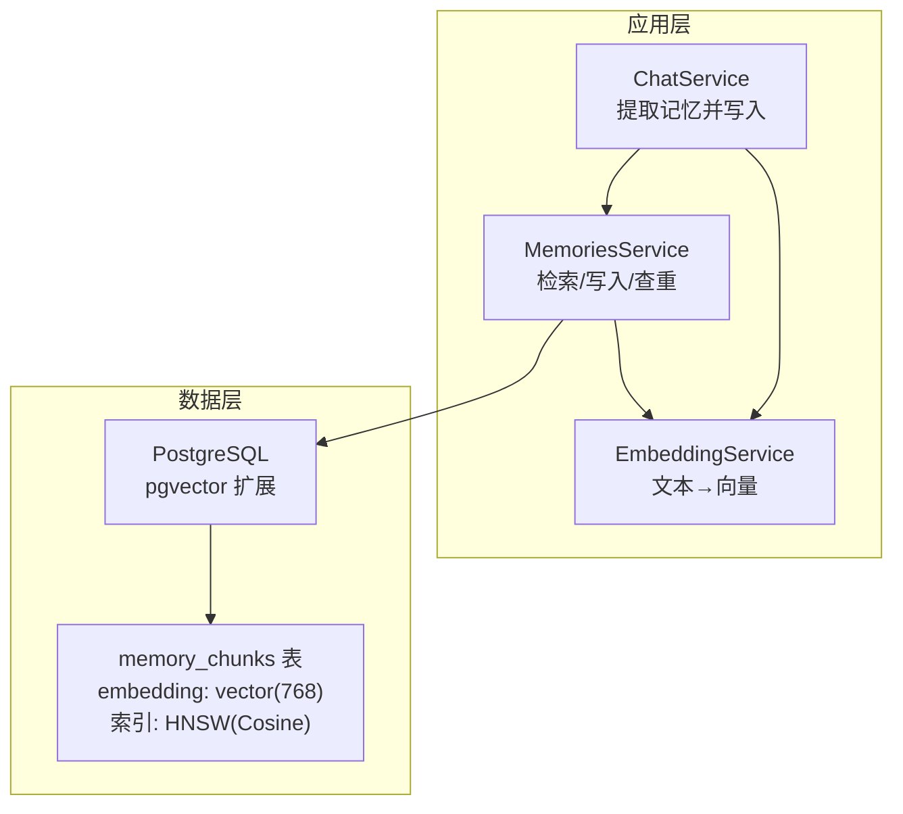
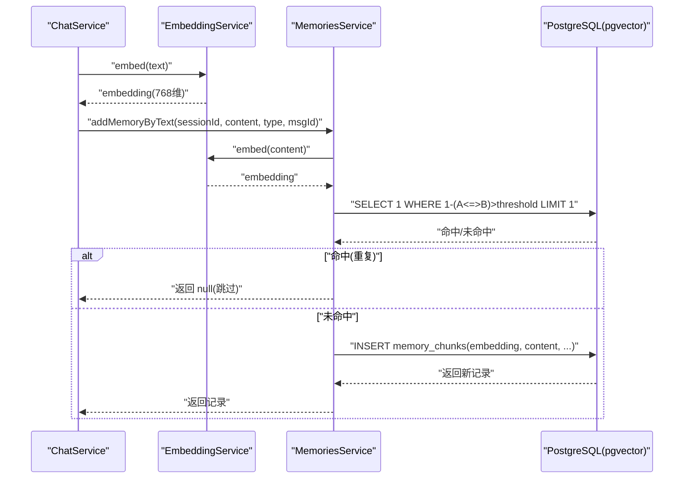
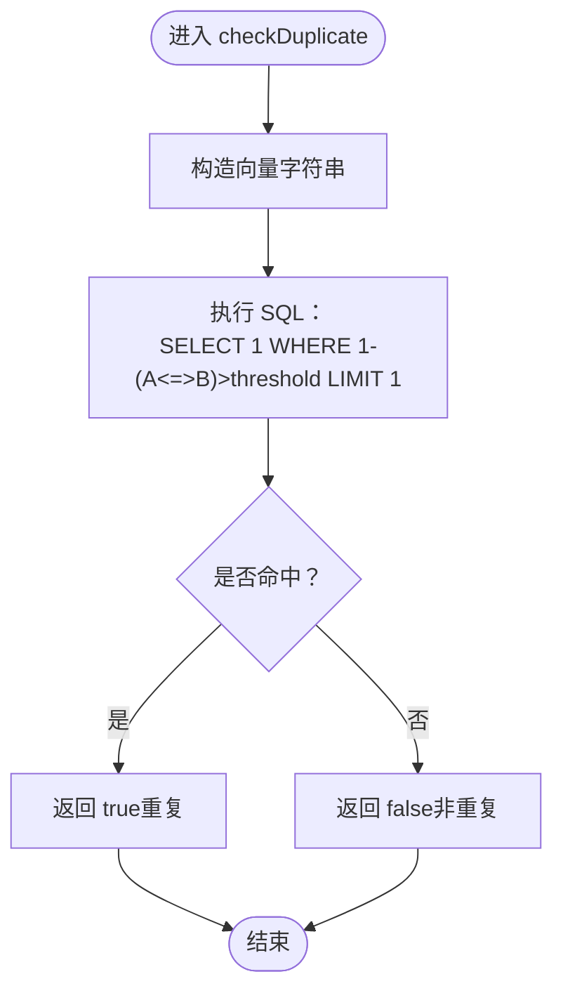
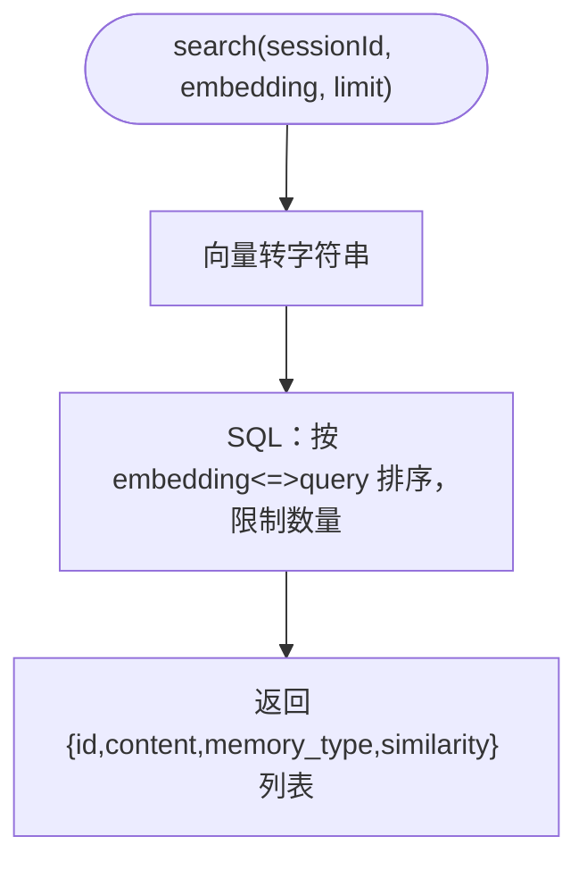
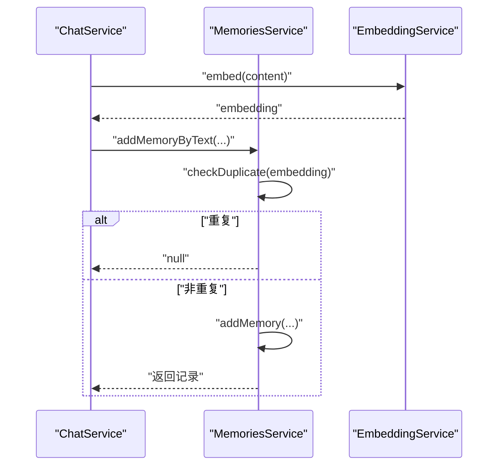
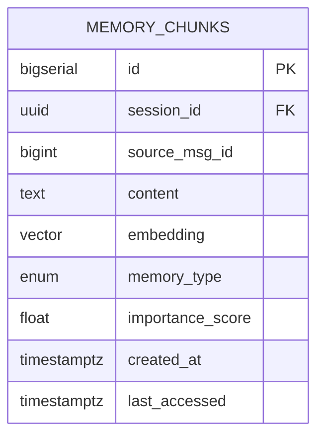
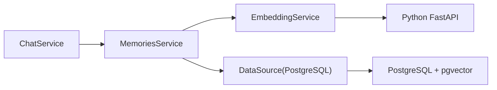

# 重复检测系统

<cite>
**本文引用的文件**
- [memories.service.ts](file://src/memories/memories.service.ts)
- [embedding.service.ts](file://src/embedding/embedding.service.ts)
- [memory.entity.ts](file://src/memories/entities/memory.entity.ts)
- [1710000000000-init-pgvector-schema.ts](file://src/migrations/1710000000000-init-pgvector-schema.ts)
- [chat.service.ts](file://src/chat/chat.service.ts)
- [database.config.ts](file://src/config/database.config.ts)
- [AI_Companion_最终方案.md](file://docs/AI_Companion_最终方案.md)
- [Learning_Notes.md](file://docs/Learning_Notes.md)
</cite>

## 目录
1. [简介](#简介)
2. [项目结构](#项目结构)
3. [核心组件](#核心组件)
4. [架构总览](#架构总览)
5. [详细组件分析](#详细组件分析)
6. [依赖关系分析](#依赖关系分析)
7. [性能考量](#性能考量)
8. [故障排查指南](#故障排查指南)
9. [结论](#结论)
10. [附录](#附录)

## 简介
本文件围绕“重复检测系统”展开，聚焦于 checkDuplicate 方法的查重算法实现，系统性阐述余弦相似度阈值 0.95 的科学依据与业务意义、向量相似度计算的数学原理、重复判断的逻辑流程；并进一步说明该系统在记忆管理中的作用：避免重复存储相似内容、提升检索效率、减少存储空间浪费；最后提供阈值参数的调优策略、批量查重处理策略、与其他记忆操作的协调机制，并分析其对用户体验的影响。

## 项目结构
重复检测系统位于后端 NestJS 应用的记忆模块中，核心由以下部分组成：
- 记忆服务：提供检索、写入、查重等能力，其中查重基于 PostgreSQL + pgvector 的余弦距离进行。
- 嵌入服务：负责将文本转换为 768 维向量，供记忆模块使用。
- 数据库迁移：初始化包含向量列与 HNSW 索引的表结构。
- 使用方：聊天服务在提取记忆片段时，先向量化、再查重、最后写入。

图表来源
- [chat.service.ts:298-303](file://src/chat/chat.service.ts#L298-L303)
- [memories.service.ts:30-34](file://src/memories/memories.service.ts#L30-L34)
- [embedding.service.ts:14-21](file://src/embedding/embedding.service.ts#L14-L21)
- [1710000000000-init-pgvector-schema.ts:71-92](file://src/migrations/1710000000000-init-pgvector-schema.ts#L71-L92)

章节来源
- [memories.service.ts:1-137](file://src/memories/memories.service.ts#L1-L137)
- [embedding.service.ts:1-84](file://src/embedding/embedding.service.ts#L1-L84)
- [1710000000000-init-pgvector-schema.ts:1-107](file://src/migrations/1710000000000-init-pgvector-schema.ts#L1-L107)
- [chat.service.ts:298-303](file://src/chat/chat.service.ts#L298-L303)

## 核心组件
- MemoriesService：提供检索、写入、查重等方法，查重基于 PostgreSQL 的余弦相似度比较。
- EmbeddingService：封装 Python FastAPI 的嵌入接口，提供单条与批量向量化能力。
- memory_chunks 表：包含向量列与 HNSW 索引，用于高效相似度检索与去重。
- ChatService：在提取记忆时调用 addMemoryByText，内部完成“向量化 → 查重 → 写入”。

章节来源
- [memories.service.ts:29-137](file://src/memories/memories.service.ts#L29-L137)
- [embedding.service.ts:14-84](file://src/embedding/embedding.service.ts#L14-L84)
- [memory.entity.ts:16-43](file://src/memories/entities/memory.entity.ts#L16-L43)
- [1710000000000-init-pgvector-schema.ts:71-92](file://src/migrations/1710000000000-init-pgvector-schema.ts#L71-L92)
- [chat.service.ts:298-303](file://src/chat/chat.service.ts#L298-L303)

## 架构总览
重复检测系统的关键路径如下：
- 文本输入 → 嵌入服务生成向量 → 记忆服务执行查重（余弦相似度 > 阈值则判定重复）→ 若非重复则写入。
- 检索路径：文本输入 → 嵌入 → 查询数据库（按余弦距离排序）→ 返回相似记忆。

图表来源
- [chat.service.ts:298-303](file://src/chat/chat.service.ts#L298-L303)
- [memories.service.ts:124-136](file://src/memories/memories.service.ts#L124-L136)
- [embedding.service.ts:33-42](file://src/embedding/embedding.service.ts#L33-L42)

## 详细组件分析

### checkDuplicate 方法与查重算法
- 数学原理
  - 余弦相似度定义：对于单位向量 u、v，cosθ = (u·v)/(|u||v|) = u·v。在 pgvector 中，余弦距离定义为 1 - cosθ，因此相似度 = 1 - (embedding <=> query)。
  - 判定规则：若 1 - (embedding <=> query) > threshold，则认为重复。
- 实现要点
  - 将查询向量拼接为字符串传入 SQL，使用 PostgreSQL 的向量类型进行比较。
  - 仅需检查是否存在匹配项，因此使用 LIMIT 1，提高查重效率。
- 阈值 0.95 的业务意义
  - 代表极高的语义等价性要求：只有当新内容与已有记忆在语义上几乎完全一致时才判定重复，从而有效避免存储冗余，同时降低误删重要细节的风险。
  - 在对话记忆提取场景下，可显著减少“同义改写”导致的重复入库，保持记忆库的简洁与高相关性。

图表来源
- [memories.service.ts:93-110](file://src/memories/memories.service.ts#L93-L110)

章节来源
- [memories.service.ts:90-110](file://src/memories/memories.service.ts#L90-L110)

### 向量相似度计算与检索
- 相似度计算
  - 余弦相似度 = 1 - cosDistance，其中 cosDistance 由 pgvector 的 “<=>” 运算符提供。
  - 检索时按 cosDistance 升序排序，相似度降序排列。
- 索引与性能
  - 使用 HNSW（分层可导航小世界图）索引，Cosine 距离作为度量，支持近似最近邻搜索，兼顾速度与精度。
  - 迁移脚本中显式创建 HNSW 索引，确保大规模数据下的高效检索与查重。

图表来源
- [memories.service.ts:42-59](file://src/memories/memories.service.ts#L42-L59)
- [1710000000000-init-pgvector-schema.ts:91-91](file://src/migrations/1710000000000-init-pgvector-schema.ts#L91-L91)

章节来源
- [memories.service.ts:36-59](file://src/memories/memories.service.ts#L36-L59)
- [1710000000000-init-pgvector-schema.ts:91-91](file://src/migrations/1710000000000-init-pgvector-schema.ts#L91-L91)

### 写入与去重协同
- addMemoryByText 的工作流
  - 先向量化，再查重，若重复则跳过，否则写入。
- 与 ChatService 的集成
  - 提取记忆后调用 addMemoryByText，自动完成“去重 + 写入”，并在控制台输出重复跳过的提示，便于可观测性。

图表来源
- [chat.service.ts:298-303](file://src/chat/chat.service.ts#L298-L303)
- [memories.service.ts:124-136](file://src/memories/memories.service.ts#L124-L136)
- [embedding.service.ts:33-42](file://src/embedding/embedding.service.ts#L33-L42)

章节来源
- [chat.service.ts:298-303](file://src/chat/chat.service.ts#L298-L303)
- [memories.service.ts:124-136](file://src/memories/memories.service.ts#L124-L136)

### 数据模型与索引
- memory_chunks 表
  - 包含 embedding vector(768)，并创建 HNSW 索引以支持高效相似度检索与查重。
- 类型与约束
  - memory_type 为枚举类型，确保一致性。
  - 其他字段如 created_at、last_accessed 等用于统计与访问追踪。

图表来源
- [1710000000000-init-pgvector-schema.ts:71-82](file://src/migrations/1710000000000-init-pgvector-schema.ts#L71-L82)
- [memory.entity.ts:16-43](file://src/memories/entities/memory.entity.ts#L16-L43)

章节来源
- [1710000000000-init-pgvector-schema.ts:71-92](file://src/migrations/1710000000000-init-pgvector-schema.ts#L71-L92)
- [memory.entity.ts:16-43](file://src/memories/entities/memory.entity.ts#L16-L43)

## 依赖关系分析
- 组件耦合
  - MemoriesService 依赖 EmbeddingService 进行向量化，依赖 DataSource 执行原生 SQL。
  - ChatService 通过 MemoriesService 的便捷方法 addMemoryByText 完成“提取 → 去重 → 写入”的闭环。
- 外部依赖
  - PostgreSQL + pgvector：提供向量存储与 HNSW 索引。
  - Python FastAPI：提供嵌入服务，MemoriesService 通过 HTTP 调用。

图表来源
- [chat.service.ts:298-303](file://src/chat/chat.service.ts#L298-L303)
- [memories.service.ts:30-34](file://src/memories/memories.service.ts#L30-L34)
- [embedding.service.ts:18-21](file://src/embedding/embedding.service.ts#L18-L21)
- [database.config.ts:8-20](file://src/config/database.config.ts#L8-L20)

章节来源
- [chat.service.ts:298-303](file://src/chat/chat.service.ts#L298-L303)
- [memories.service.ts:30-34](file://src/memories/memories.service.ts#L30-L34)
- [embedding.service.ts:18-21](file://src/embedding/embedding.service.ts#L18-L21)
- [database.config.ts:8-20](file://src/config/database.config.ts#L8-L20)

## 性能考量
- 查重路径优化
  - 使用 LIMIT 1，避免全表扫描，显著降低查重成本。
  - 依赖 HNSW 索引，使相似度比较在大数据集上仍具备亚线性复杂度。
- 批量处理策略
  - 嵌入服务提供批量接口，可在一次 HTTP 请求中并行推理多个文本，减少网络开销与推理延迟。
  - 在需要批量去重或批量写入时，优先采用批量嵌入与批量写入，以提升吞吐。
- 与检索的协同
  - 检索与查重共享同一向量表示与索引，避免重复计算，统一语义空间。
- 索引参数建议
  - HNSW 的 m 与 ef_construction 可根据数据规模与精度需求调整：增大 m 提高精度但占用更多空间；增大 ef_construction 提高构建质量但耗时更长。
- 超时与稳定性
  - 嵌入服务对单条与批量请求分别设置了合理的超时时间，避免阻塞上游调用方。

章节来源
- [memories.service.ts:93-110](file://src/memories/memories.service.ts#L93-L110)
- [embedding.service.ts:56-65](file://src/embedding/embedding.service.ts#L56-L65)
- [Learning_Notes.md:1118-1129](file://docs/Learning_Notes.md#L1118-L1129)

## 故障排查指南
- Python 嵌入服务不可达
  - 现象：嵌入调用失败或超时。
  - 排查：确认 PYTHON_EMBED_URL 环境变量正确；检查 Python FastAPI 服务健康状态；确认网络连通性。
- PostgreSQL 向量扩展缺失
  - 现象：无法创建向量列或执行向量运算。
  - 排查：确认已启用 vector 扩展；迁移脚本应自动创建；检查权限与版本兼容性。
- HNSW 索引缺失或失效
  - 现象：检索/查重性能骤降。
  - 排查：确认索引存在且未被意外删除；必要时重建索引。
- 重复误判或漏判
  - 误判（过于严格）：适当降低阈值（例如从 0.95 下调至 0.92 或 0.90）。
  - 漏判（过于宽松）：适当提高阈值（例如从 0.95 上调至 0.97）。
  - 结合业务场景与数据分布进行 A/B 测试，逐步微调。

章节来源
- [embedding.service.ts:18-21](file://src/embedding/embedding.service.ts#L18-L21)
- [1710000000000-init-pgvector-schema.ts:7-7](file://src/migrations/1710000000000-init-pgvector-schema.ts#L7-L7)
- [Learning_Notes.md:1118-1129](file://docs/Learning_Notes.md#L1118-L1129)

## 结论
重复检测系统通过“余弦相似度 + HNSW 索引”的组合，在保证检索效率的同时实现了高精度的语义去重。阈值 0.95 在大多数对话记忆提取场景下能有效避免重复存储，提升检索质量与存储利用率。配合批量嵌入与便捷的 API，系统在工程上具备良好的可维护性与扩展性。后续可根据业务反馈与数据分布持续调优阈值与索引参数，以达到最佳的准确性与完整性平衡。

## 附录

### 阈值调优策略与建议
- 场景一：强一致性要求（如法律/合规类记忆）
  - 建议：提高阈值（如 0.97），降低误判风险。
- 场景二：创意/表达多样性要求较高（如写作/创作辅助）
  - 建议：适度降低阈值（如 0.92），允许同义表达存留。
- 场景三：通用对话记忆
  - 建议：维持 0.95，兼顾准确与覆盖。
- 记忆粒度关系
  - 更细粒度（短句/关键词）：阈值可略低，避免过度去重。
  - 更粗粒度（完整句子/段落）：阈值可略高，减少冗余。
- 平衡严格性与完整性
  - 通过 A/B 实验对比不同阈值下的重复率、召回率与用户满意度，动态选择最优阈值。

章节来源
- [memories.service.ts:93-110](file://src/memories/memories.service.ts#L93-L110)

### 与其他记忆操作的协调机制
- 写入前查重：addMemoryByText 自动完成“向量化 → 查重 → 写入”，避免重复。
- 检索时相似度：search 返回相似度，便于前端展示与二次过滤。
- 类型与来源：memory_type 与 source_msg_id 支持分类与溯源，便于后续清洗与审计。

章节来源
- [memories.service.ts:115-136](file://src/memories/memories.service.ts#L115-L136)
- [memory.entity.ts:32-42](file://src/memories/entities/memory.entity.ts#L32-L42)