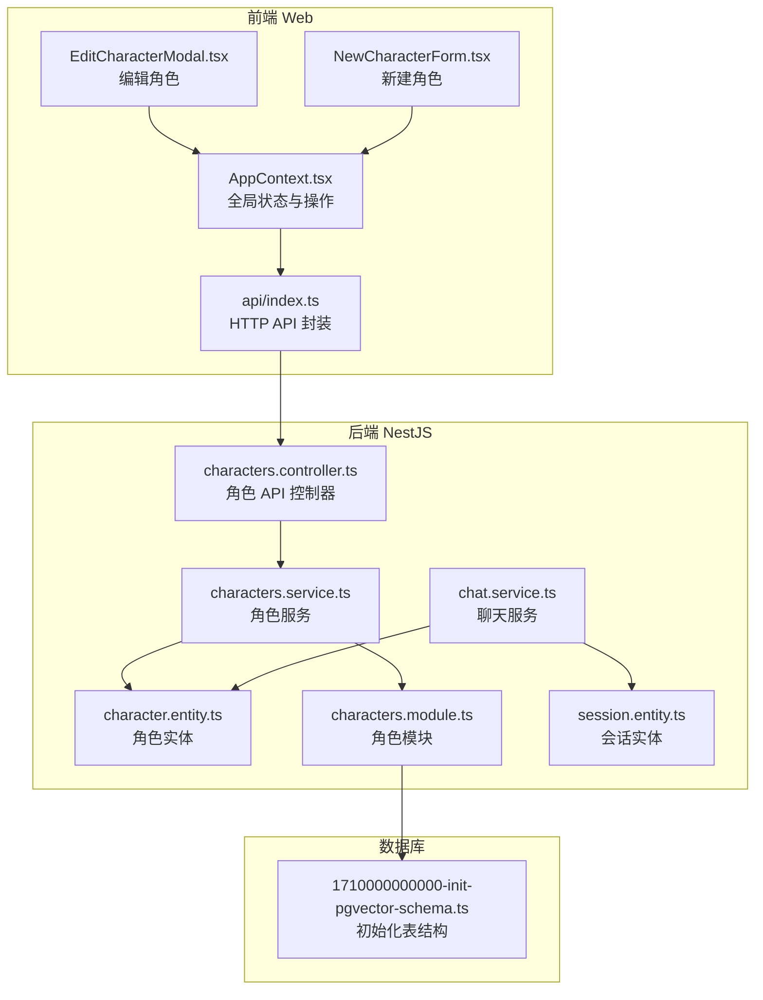
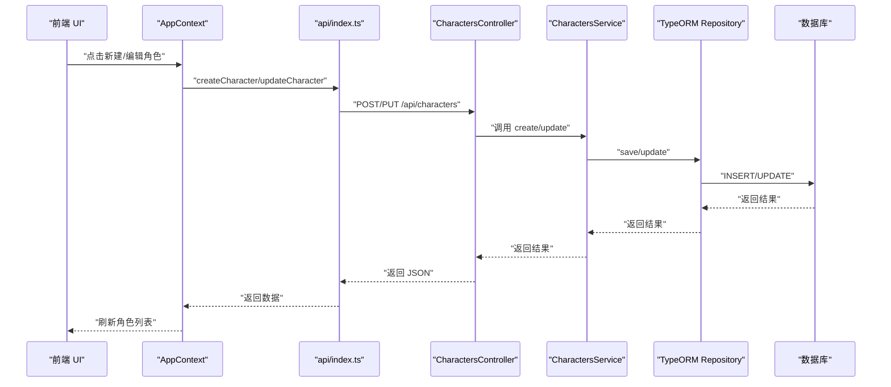
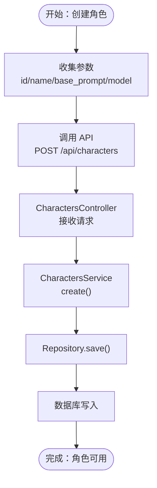
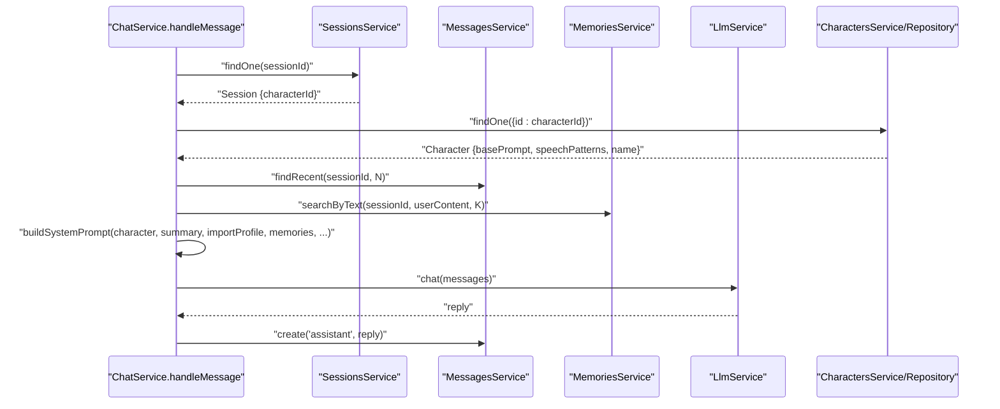
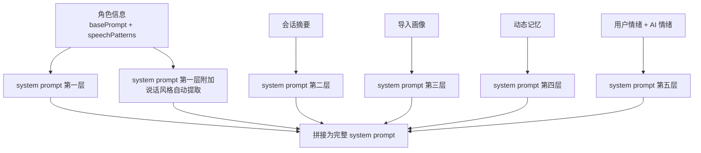
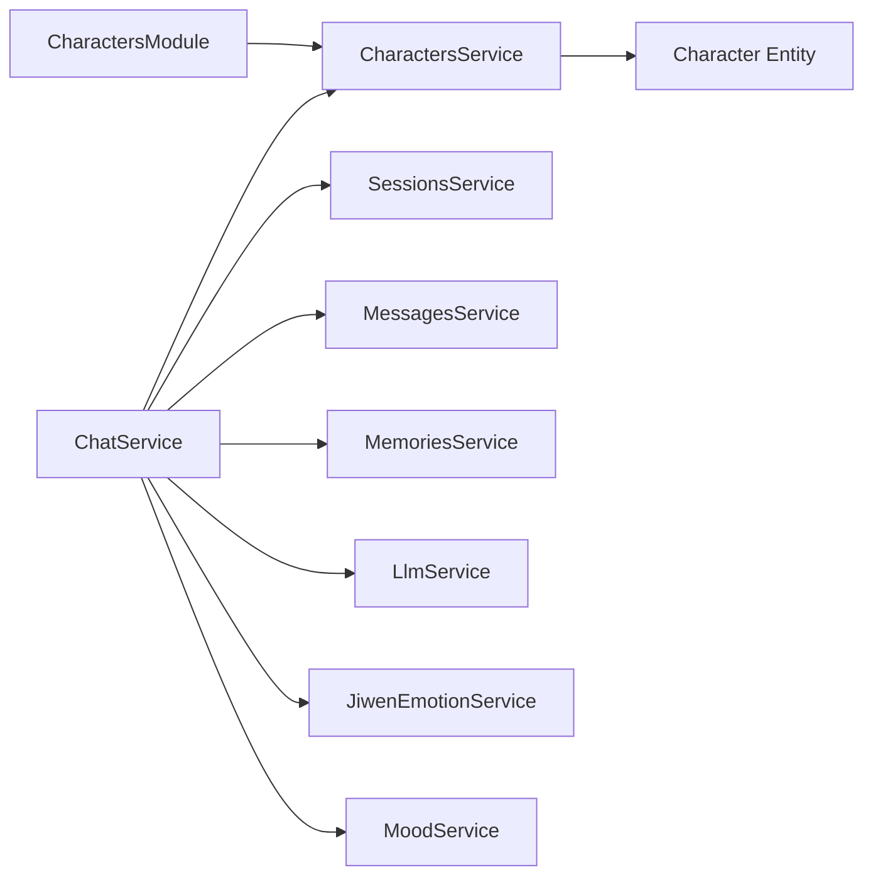

# 多角色聊天管理

<cite>
**本文档引用的文件**
- [character.entity.ts](file://src/characters/entities/character.entity.ts)
- [characters.service.ts](file://src/characters/characters.service.ts)
- [characters.controller.ts](file://src/characters/characters.controller.ts)
- [characters.module.ts](file://src/characters/characters.module.ts)
- [chat.service.ts](file://src/chat/chat.service.ts)
- [session.entity.ts](file://src/sessions/entities/session.entity.ts)
- [AppContext.tsx](file://web/src/context/AppContext.tsx)
- [EditCharacterModal.tsx](file://web/src/components/Sidebar/EditCharacterModal.tsx)
- [NewCharacterForm.tsx](file://web/src/components/Sidebar/NewCharacterForm.tsx)
- [api/index.ts](file://web/src/api/index.ts)
- [types.ts](file://shared/types.ts)
- [records-import.service.ts](file://src/records-import/records-import.service.ts)
- [1710000000000-init-pgvector-schema.ts](file://src/migrations/1710000000000-init-pgvector-schema.ts)
</cite>

## 目录
1. [简介](#简介)
2. [项目结构](#项目结构)
3. [核心组件](#核心组件)
4. [架构总览](#架构总览)
5. [详细组件分析](#详细组件分析)
6. [依赖分析](#依赖分析)
7. [性能考虑](#性能考虑)
8. [故障排查指南](#故障排查指南)
9. [结论](#结论)
10. [附录](#附录)

## 简介
本技术文档围绕“多角色聊天管理”功能，系统阐述角色系统的完整实现，包括角色实体设计、角色创建与配置流程、角色切换机制、角色与聊天服务的集成方式，以及角色配置项（如 basePrompt、speechPatterns、name 等）的作用与配置方法。文档结合具体代码路径，解释角色系统在聊天流程中的作用，包括 system prompt 组装、角色行为控制与个性化对话体验的实现原理。

## 项目结构
角色系统位于后端 NestJS 模块化架构中，前端通过 React + Context 管理全局状态与 UI 交互。核心目录与文件如下：
- 后端角色模块：characters.controller.ts、characters.service.ts、character.entity.ts、characters.module.ts
- 聊天服务：chat.service.ts（负责系统提示词组装、调用 LLM、消息持久化）
- 会话实体：session.entity.ts（包含 characterId 字段，建立会话与角色的绑定）
- 前端状态与 UI：AppContext.tsx、EditCharacterModal.tsx、NewCharacterForm.tsx、api/index.ts
- 类型定义：shared/types.ts
- 记录导入与角色增强：records-import.service.ts
- 数据库迁移：1710000000000-init-pgvector-schema.ts

图表来源
- [AppContext.tsx:196-373](file://web/src/context/AppContext.tsx#L196-L373)
- [api/index.ts:58-81](file://web/src/api/index.ts#L58-L81)
- [characters.controller.ts:17-55](file://src/characters/characters.controller.ts#L17-L55)
- [characters.service.ts:7-40](file://src/characters/characters.service.ts#L7-L40)
- [character.entity.ts:3-22](file://src/characters/entities/character.entity.ts#L3-L22)
- [characters.module.ts:7-13](file://src/characters/characters.module.ts#L7-L13)
- [chat.service.ts:31-40](file://src/chat/chat.service.ts#L31-L40)
- [session.entity.ts:32-63](file://src/sessions/entities/session.entity.ts#L32-L63)
- [1710000000000-init-pgvector-schema.ts:34-106](file://src/migrations/1710000000000-init-pgvector-schema.ts#L34-L106)

章节来源
- [characters.controller.ts:17-55](file://src/characters/characters.controller.ts#L17-L55)
- [characters.service.ts:7-40](file://src/characters/characters.service.ts#L7-L40)
- [character.entity.ts:3-22](file://src/characters/entities/character.entity.ts#L3-L22)
- [characters.module.ts:7-13](file://src/characters/characters.module.ts#L7-L13)
- [chat.service.ts:31-40](file://src/chat/chat.service.ts#L31-L40)
- [session.entity.ts:32-63](file://src/sessions/entities/session.entity.ts#L32-L63)
- [AppContext.tsx:196-373](file://web/src/context/AppContext.tsx#L196-L373)
- [api/index.ts:58-81](file://web/src/api/index.ts#L58-L81)
- [1710000000000-init-pgvector-schema.ts:34-106](file://src/migrations/1710000000000-init-pgvector-schema.ts#L34-L106)

## 核心组件
- 角色实体（Character）：定义角色的唯一标识、显示名称、基础人格提示词、默认模型、说话风格 JSON、创建时间等字段。
- 角色服务（CharactersService）：提供角色的创建、查询、更新、删除能力，封装 TypeORM Repository。
- 角色控制器（CharactersController）：暴露 REST API，接收前端请求并调用服务层。
- 聊天服务（ChatService）：在处理消息时按会话绑定的角色动态加载角色信息，组装 system prompt 并调用 LLM。
- 会话实体（Session）：包含 characterId 字段，用于将会话与角色建立绑定关系。
- 前端上下文（AppContext）：集中管理角色与会话列表、当前选中角色/会话、消息流式状态等。
- API 封装（api/index.ts）：统一的 HTTP 请求封装，提供角色、会话、消息、聊天接口。

章节来源
- [character.entity.ts:3-22](file://src/characters/entities/character.entity.ts#L3-L22)
- [characters.service.ts:7-40](file://src/characters/characters.service.ts#L7-L40)
- [characters.controller.ts:17-55](file://src/characters/characters.controller.ts#L17-L55)
- [chat.service.ts:55-85](file://src/chat/chat.service.ts#L55-L85)
- [session.entity.ts:32-63](file://src/sessions/entities/session.entity.ts#L32-L63)
- [AppContext.tsx:196-373](file://web/src/context/AppContext.tsx#L196-L373)
- [api/index.ts:58-81](file://web/src/api/index.ts#L58-L81)

## 架构总览
角色系统贯穿“前端状态管理 → 后端 API → 数据库存储 → 聊天编排”的完整链路。前端通过 AppContext 维护当前角色与会话，调用 api/index.ts 发起 HTTP 请求；后端通过 CharactersController/Service 与数据库交互；聊天时 ChatService 依据 Session 中的 characterId 动态加载角色，组装 system prompt 并调用 LLM。

图表来源
- [AppContext.tsx:258-280](file://web/src/context/AppContext.tsx#L258-L280)
- [api/index.ts:58-81](file://web/src/api/index.ts#L58-L81)
- [characters.controller.ts:21-49](file://src/characters/characters.controller.ts#L21-L49)
- [characters.service.ts:13-39](file://src/characters/characters.service.ts#L13-L39)

## 详细组件分析

### 角色实体设计（Character 实体）
- 字段说明
  - id：角色唯一标识，字符串类型，主键
  - name：角色显示名称
  - basePrompt：固定人格提示词，文本类型
  - model：默认使用的 LLM 模型，默认值为 deepseek-chat
  - speechPatterns：说话风格 JSON，存储语气、句尾、口头禅、表情风格、回复长度、反问频率、自我披露等
  - createdAt：创建时间
- 关系映射
  - 与会话（Session）通过 Session.characterId 间接关联，实现“会话绑定角色”的设计

章节来源
- [character.entity.ts:3-22](file://src/characters/entities/character.entity.ts#L3-L22)
- [session.entity.ts:37](file://src/sessions/entities/session.entity.ts#L37)

### 角色创建与配置流程
- 新建角色
  - 前端：NewCharacterForm.tsx 收集 id、name、base_prompt，调用 AppContext.createCharacter
  - API：api/index.ts 调用 POST /api/characters
  - 控制器：characters.controller.ts 接收请求并调用 characters.service.ts 的 create
  - 服务：characters.service.ts 使用 Repository.create/save 持久化
- 配置角色参数
  - 基础提示词（basePrompt）：角色的人格设定
  - 说话风格（speechPatterns）：可由人工填写或通过 records-import.service.ts 基于聊天记录自动提取并合并
  - 模型（model）：可选覆盖默认模型
- 个性化参数设置
  - 通过 speechPatterns 的多个维度（语气、句尾、口头禅、表情风格、回复长度、反问频率、自我披露）实现个性化对话风格

图表来源
- [NewCharacterForm.tsx:10-25](file://web/src/components/Sidebar/NewCharacterForm.tsx#L10-L25)
- [AppContext.tsx:258-263](file://web/src/context/AppContext.tsx#L258-L263)
- [api/index.ts:58-60](file://web/src/api/index.ts#L58-L60)
- [characters.controller.ts:21-29](file://src/characters/characters.controller.ts#L21-L29)
- [characters.service.ts:13-16](file://src/characters/characters.service.ts#L13-L16)

章节来源
- [NewCharacterForm.tsx:10-25](file://web/src/components/Sidebar/NewCharacterForm.tsx#L10-L25)
- [EditCharacterModal.tsx:19-39](file://web/src/components/Sidebar/EditCharacterModal.tsx#L19-L39)
- [AppContext.tsx:258-280](file://web/src/context/AppContext.tsx#L258-L280)
- [api/index.ts:58-81](file://web/src/api/index.ts#L58-L81)
- [characters.controller.ts:21-49](file://src/characters/characters.controller.ts#L21-L49)
- [characters.service.ts:13-39](file://src/characters/characters.service.ts#L13-L39)

### 角色切换机制（会话绑定、动态加载）
- 会话绑定
  - Session 实体包含 characterId 字段，确保每次会话仅绑定一个角色
- 动态加载
  - ChatService 在处理消息时，先根据 sessionId 获取 Session，再根据 Session.characterId 查询对应 Character
  - 若角色不存在，抛出错误，避免无效角色导致的系统异常

图表来源
- [chat.service.ts:55-95](file://src/chat/chat.service.ts#L55-L95)
- [session.entity.ts:37](file://src/sessions/entities/session.entity.ts#L37)
- [characters.service.ts:22-28](file://src/characters/characters.service.ts#L22-L28)

章节来源
- [chat.service.ts:55-95](file://src/chat/chat.service.ts#L55-L95)
- [session.entity.ts:37](file://src/sessions/entities/session.entity.ts#L37)
- [characters.service.ts:22-28](file://src/characters/characters.service.ts#L22-L28)

### 角色与聊天服务的集成方式
- system prompt 组装
  - ChatService.buildSystemPrompt 将角色的 basePrompt 与 speechPatterns 注入到系统提示词的第一层与第一层附加
  - 同时叠加会话摘要、导入画像、动态记忆、用户情绪与 AI 情绪，形成多层提示词结构
- 角色行为控制
  - speechPatterns 的各项指标（语气、句尾、口头禅、表情风格、回复长度、反问频率、自我披露）在 system prompt 中以“说话风格（自动提取）”形式注入，指导 LLM 输出符合该角色风格的回复
- 个性化对话体验
  - 通过 importProfile、memories、emotion 与 mood 的综合，使回复更贴合用户画像与当下的情绪状态

图表来源
- [chat.service.ts:424-497](file://src/chat/chat.service.ts#L424-L497)

章节来源
- [chat.service.ts:424-497](file://src/chat/chat.service.ts#L424-L497)

### 角色配置选项详解
- basePrompt（基础提示词）
  - 作用：定义角色的固定人格与行为准则，作为 system prompt 的第一层
  - 配置方法：新建角色时传入，或通过 records-import.service.ts 基于聊天记录生成/合并
- speechPatterns（说话风格）
  - 作用：以 JSON 结构描述角色的语气、句尾、口头禅、表情风格、回复长度、反问频率、自我披露等，注入到 system prompt 的“说话风格（自动提取）”
  - 配置方法：手工填写或通过 records-import.service.ts 自动提取并合并
- name（角色名称）
  - 作用：用于 system prompt 的核心规则与个性化提示中，如“你就是{name}本人”
- model（模型）
  - 作用：指定角色默认使用的 LLM 模型，可在角色层面进行覆盖
- createdAt（创建时间）
  - 作用：用于排序与审计

章节来源
- [character.entity.ts:11-18](file://src/characters/entities/character.entity.ts#L11-L18)
- [records-import.service.ts:507-598](file://src/records-import/records-import.service.ts#L507-L598)
- [chat.service.ts:480-494](file://src/chat/chat.service.ts#L480-L494)

### 前端角色管理与会话绑定
- 角色 CRUD
  - 新建：NewCharacterForm.tsx -> AppContext.createCharacter -> api/index.ts -> CharactersController/Service
  - 编辑：EditCharacterModal.tsx -> AppContext.updateCharacter -> api/index.ts -> CharactersController/Service
  - 删除：EditCharacterModal.tsx -> AppContext.deleteCharacter -> api/index.ts -> CharactersController/Service
- 会话绑定
  - AppContext.createSession 会携带当前选中的 currentCharacterId 创建会话，确保后续聊天基于该角色
- 角色切换
  - AppContext.selectCharacter 会重置当前会话为该角色的第一个会话，并清空消息列表，触发重新加载

章节来源
- [NewCharacterForm.tsx:10-25](file://web/src/components/Sidebar/NewCharacterForm.tsx#L10-L25)
- [EditCharacterModal.tsx:19-39](file://web/src/components/Sidebar/EditCharacterModal.tsx#L19-L39)
- [AppContext.tsx:258-304](file://web/src/context/AppContext.tsx#L258-L304)
- [api/index.ts:58-81](file://web/src/api/index.ts#L58-L81)

## 依赖分析
- 模块耦合
  - CharactersModule 导出 CharactersService 与 TypeOrmModule，供其他模块（如 ChatService）使用
  - ChatService 依赖 CharactersRepository、SessionsService、MessagesService、MemoriesService、LlmService、JiwenEmotionService、MoodService
- 外部依赖
  - TypeORM（Entity/Repository）
  - RxJS（流式聊天）
  - PostgreSQL（存储角色、会话、消息、记忆）

图表来源
- [characters.module.ts:7-13](file://src/characters/characters.module.ts#L7-L13)
- [chat.service.ts:31-40](file://src/chat/chat.service.ts#L31-L40)

章节来源
- [characters.module.ts:7-13](file://src/characters/characters.module.ts#L7-L13)
- [chat.service.ts:31-40](file://src/chat/chat.service.ts#L31-L40)

## 性能考虑
- 数据库索引
  - 初始化迁移中为 messages 与 memory_chunks 建立索引，提升检索效率
- 异步处理
  - 记忆提取与滚动摘要采用 setImmediate 异步执行，避免阻塞主线程
- 流式响应
  - SSE 流式聊天在前端逐 chunk 推送，降低等待时间

章节来源
- [1710000000000-init-pgvector-schema.ts:84-93](file://src/migrations/1710000000000-init-pgvector-schema.ts#L84-L93)
- [chat.service.ts:102-111](file://src/chat/chat.service.ts#L102-L111)
- [chat.service.ts:130-231](file://src/chat/chat.service.ts#L130-L231)

## 故障排查指南
- 角色不存在
  - 现象：ChatService 在加载角色时报错
  - 处理：确认 Session.characterId 是否正确，或角色是否已被删除
- 会话未绑定角色
  - 现象：无法加载角色信息
  - 处理：创建会话时必须携带 characterId
- 说话风格未生效
  - 现象：回复不符合预期风格
  - 处理：检查 speechPatterns 是否存在且非空；确认 system prompt 组装逻辑是否正确注入
- 记忆提取失败
  - 现象：异步记忆提取报错但不影响主流程
  - 处理：查看日志，确认 LLM 返回格式与解析逻辑

章节来源
- [chat.service.ts:59-61](file://src/chat/chat.service.ts#L59-L61)
- [chat.service.ts:254-315](file://src/chat/chat.service.ts#L254-L315)

## 结论
角色系统通过“实体设计 + API 层 + 聊天编排”的协同，实现了可配置、可扩展、可个性化的多角色聊天体验。角色的 basePrompt 与 speechPatterns 作为 system prompt 的关键输入，配合会话摘要、导入画像、动态记忆与情绪状态，形成多层次的提示词体系，从而精准控制角色行为与回复风格。前端通过 Context 与 API 封装，提供了直观的角色管理与会话绑定能力，整体架构清晰、职责明确、易于维护与扩展。

## 附录
- 角色配置最佳实践
  - basePrompt：建议包含角色身份、年龄、性格、价值观与沟通方式
  - speechPatterns：从聊天记录中提取高频特征，逐步完善
  - 会话绑定：确保每次会话都有明确的 characterId
- 常用代码路径参考
  - 新建角色：[NewCharacterForm.tsx:10-25](file://web/src/components/Sidebar/NewCharacterForm.tsx#L10-L25) → [AppContext.tsx:258-263](file://web/src/context/AppContext.tsx#L258-L263) → [api/index.ts:58-60](file://web/src/api/index.ts#L58-L60) → [characters.controller.ts:21-29](file://src/characters/characters.controller.ts#L21-L29) → [characters.service.ts:13-16](file://src/characters/characters.service.ts#L13-L16)
  - 编辑角色：[EditCharacterModal.tsx:19-39](file://web/src/components/Sidebar/EditCharacterModal.tsx#L19-L39) → [AppContext.tsx:266-272](file://web/src/context/AppContext.tsx#L266-L272) → [api/index.ts:70-77](file://web/src/api/index.ts#L70-L77) → [characters.controller.ts:42-49](file://src/characters/characters.controller.ts#L42-L49) → [characters.service.ts:30-34](file://src/characters/characters.service.ts#L30-L34)
  - 删除角色：[EditCharacterModal.tsx:31-39](file://web/src/components/Sidebar/EditCharacterModal.tsx#L31-L39) → [AppContext.tsx:274-280](file://web/src/context/AppContext.tsx#L274-L280) → [api/index.ts:79-81](file://web/src/api/index.ts#L79-L81) → [characters.controller.ts:51-54](file://src/characters/characters.controller.ts#L51-L54) → [characters.service.ts:36-39](file://src/characters/characters.service.ts#L36-L39)
  - 聊天流程：[chat.service.ts:42-113](file://src/chat/chat.service.ts#L42-L113) → [chat.service.ts:424-497](file://src/chat/chat.service.ts#L424-L497)