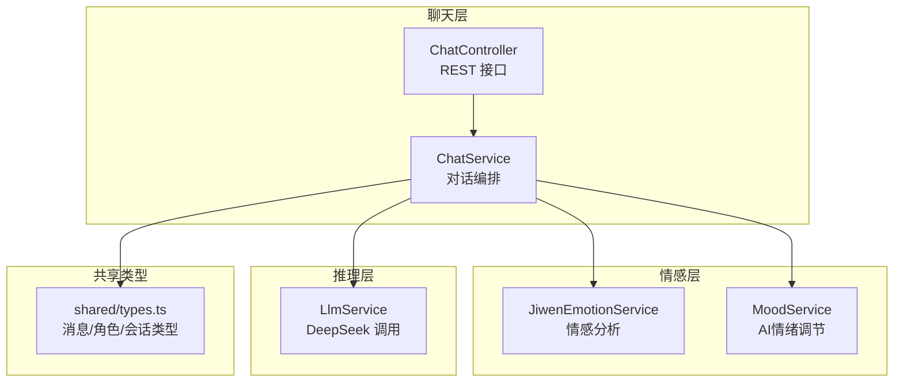
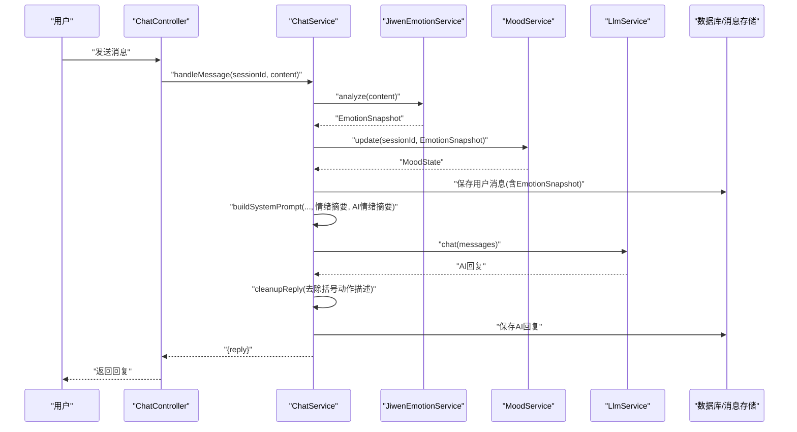
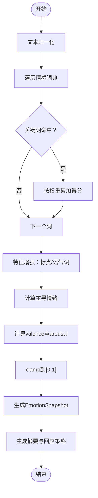
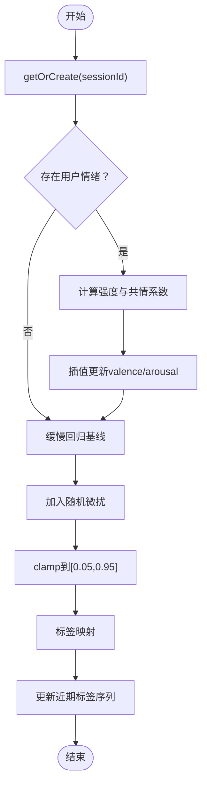
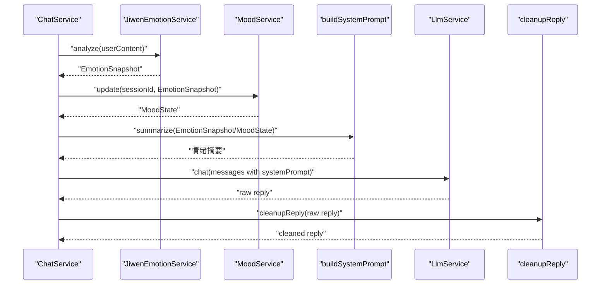
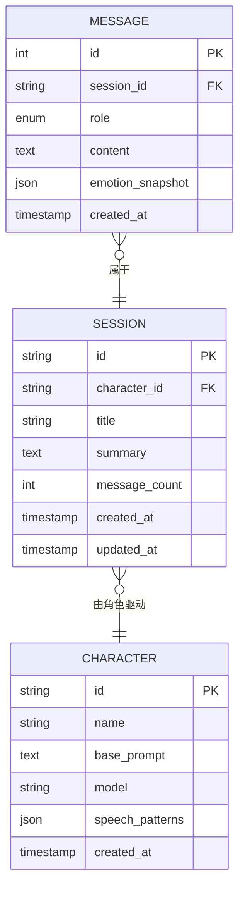
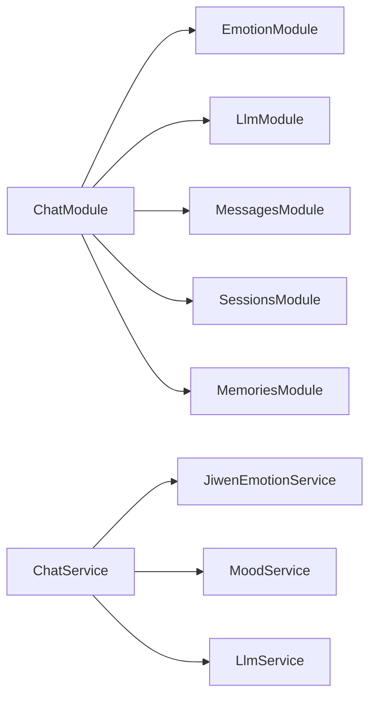

# 情感分析与情绪调节

<cite>
**本文档引用的文件**
- [jiwen-emotion.service.ts](file://src/emotion/jiwen-emotion.service.ts)
- [mood.service.ts](file://src/emotion/mood.service.ts)
- [emotion.module.ts](file://src/emotion/emotion.module.ts)
- [chat.service.ts](file://src/chat/chat.service.ts)
- [chat.controller.ts](file://src/chat/chat.controller.ts)
- [chat.module.ts](file://src/chat/chat.module.ts)
- [llm.service.ts](file://src/llm/llm.service.ts)
- [types.ts](file://shared/types.ts)
</cite>

## 目录
1. [简介](#简介)
2. [项目结构](#项目结构)
3. [核心组件](#核心组件)
4. [架构总览](#架构总览)
5. [详细组件分析](#详细组件分析)
6. [依赖关系分析](#依赖关系分析)
7. [性能考量](#性能考量)
8. [故障排查指南](#故障排查指南)
9. [结论](#结论)
10. [附录](#附录)

## 简介
本技术文档围绕情感分析与情绪调节功能展开，系统性阐述以下能力：
- 情感分析：基于情感词典的用户情绪识别，包含情绪类别、强度量化（愉悦度/唤醒度）与主导情绪判定。
- 情绪调节：AI情绪状态建模与传播，体现“共情”与“自然波动”，并在对话中影响回复风格与表情使用。
- 对话集成：在聊天流程中将情绪信号注入系统提示，驱动个性化、情感共鸣的自然对话体验。

本系统通过模块化设计将情感分析与情绪调节解耦，既可独立演进，又能在聊天服务中无缝协作，形成“用户情绪 → AI情绪 → 回复风格”的闭环。

## 项目结构
与情感分析和情绪调节直接相关的模块与文件如下：
- 情感分析模块：JiwenEmotionService（词典匹配、强度计算、摘要策略）
- 情绪调节模块：MoodService（AI情绪状态、标签映射、近期趋势）
- 聊天编排：ChatService（消息处理、系统提示组装、回复清理）
- 控制器与路由：ChatController（同步/流式接口）
- LLM封装：LlmService（同步/流式调用）
- 类型定义：shared/types.ts（消息结构、角色/会话/聊天数据）

图表来源
- [chat.controller.ts:16-77](file://src/chat/chat.controller.ts#L16-L77)
- [chat.service.ts:30-113](file://src/chat/chat.service.ts#L30-L113)
- [jiwen-emotion.service.ts:30-76](file://src/emotion/jiwen-emotion.service.ts#L30-L76)
- [mood.service.ts:17-57](file://src/emotion/mood.service.ts#L17-L57)
- [llm.service.ts:26-57](file://src/llm/llm.service.ts#L26-L57)
- [types.ts:79-86](file://shared/types.ts#L79-L86)

章节来源
- [chat.controller.ts:16-77](file://src/chat/chat.controller.ts#L16-L77)
- [chat.service.ts:30-113](file://src/chat/chat.service.ts#L30-L113)
- [emotion.module.ts:1-10](file://src/emotion/emotion.module.ts#L1-L10)
- [chat.module.ts:12-35](file://src/chat/chat.module.ts#L12-L35)

## 核心组件
- 情感分析（JiwenEmotionService）
  - 输入：用户文本
  - 输出：EmotionSnapshot（各类别得分、主导情绪、愉悦度valence、唤醒度arousal）
  - 关键能力：词典匹配、标点/语气词增强、强度归一化、摘要与回应策略
- AI情绪调节（MoodService）
  - 输入：会话ID、用户情绪快照
  - 输出：MoodState（valence/arousal/标签/近期标签序列）
  - 关键能力：共情权重、衰减回归、随机微扰、标签映射
- 聊天编排（ChatService）
  - 输入：sessionId、用户消息
  - 输出：AI回复
  - 关键能力：情绪分析与AI情绪更新、系统提示组装、回复清理、异步记忆与摘要

章节来源
- [jiwen-emotion.service.ts:30-134](file://src/emotion/jiwen-emotion.service.ts#L30-L134)
- [mood.service.ts:17-111](file://src/emotion/mood.service.ts#L17-L111)
- [chat.service.ts:30-113](file://src/chat/chat.service.ts#L30-L113)

## 架构总览
下图展示了从用户输入到AI回复的完整流程，重点标注了情绪分析与情绪调节的介入点。

图表来源
- [chat.controller.ts:20-27](file://src/chat/chat.controller.ts#L20-L27)
- [chat.service.ts:42-113](file://src/chat/chat.service.ts#L42-L113)
- [jiwen-emotion.service.ts:32-76](file://src/emotion/jiwen-emotion.service.ts#L32-L76)
- [mood.service.ts:33-57](file://src/emotion/mood.service.ts#L33-L57)
- [llm.service.ts:35-57](file://src/llm/llm.service.ts#L35-L57)

## 详细组件分析

### 情感分析：JiwenEmotionService
- 数据结构
  - EmotionSnapshot：包含各类别得分、主导情绪、valence、arousal
  - WeightedLexicon：情感类别、权重、关键词集合
- 算法流程
  - 文本归一化后遍历词典，命中关键词按权重累加
  - 特征增强：连续感叹号、问号、笑声、叹息等正则增强
  - 主导情绪：按最高分阈值判定
  - 强度量化：基于正负向分量线性组合得到valence与arousal，并clamp至[0,1]
  - 摘要策略：根据主导情绪与强度生成个性化回应建议
- 复杂度
  - 时间复杂度：O(N词典 + M文本)，N为词典条目数，M为文本长度
  - 空间复杂度：O(K类别)用于计分

图表来源
- [jiwen-emotion.service.ts:32-76](file://src/emotion/jiwen-emotion.service.ts#L32-L76)
- [jiwen-emotion.service.ts:78-97](file://src/emotion/jiwen-emotion.service.ts#L78-L97)

章节来源
- [jiwen-emotion.service.ts:3-8](file://src/emotion/jiwen-emotion.service.ts#L3-L8)
- [jiwen-emotion.service.ts:10-24](file://src/emotion/jiwen-emotion.service.ts#L10-L24)
- [jiwen-emotion.service.ts:32-76](file://src/emotion/jiwen-emotion.service.ts#L32-L76)
- [jiwen-emotion.service.ts:78-97](file://src/emotion/jiwen-emotion.service.ts#L78-L97)

### AI情绪调节：MoodService
- 数据结构
  - MoodState：valence、arousal、标签、近期标签序列
- 算法流程
  - 初始化：随机轻微扰动，确保初始状态自然
  - 更新：若存在用户情绪，则按“强度×共情系数”进行插值，使AI情绪向用户靠近
  - 回归：缓慢回归基线（valence→0.5，arousal→0.5）
  - 微扰：加入随机噪声，模拟自然波动
  - 标签映射：根据valence与arousal区间映射到具体情绪标签
  - 近期趋势：维护最近5个标签，便于观察情绪变化轨迹
- 复杂度
  - 时间复杂度：O(1)
  - 空间复杂度：O(R)（R为近期标签长度，固定为5）

图表来源
- [mood.service.ts:21-57](file://src/emotion/mood.service.ts#L21-L57)
- [mood.service.ts:101-109](file://src/emotion/mood.service.ts#L101-L109)

章节来源
- [mood.service.ts:4-9](file://src/emotion/mood.service.ts#L4-L9)
- [mood.service.ts:17-57](file://src/emotion/mood.service.ts#L17-L57)
- [mood.service.ts:59-91](file://src/emotion/mood.service.ts#L59-L91)

### 聊天流程中的情绪应用
- 系统提示组装（buildSystemPrompt）
  - 将用户情绪摘要与AI情绪摘要作为第四层提示注入，指导LLM以符合当前情绪状态的方式回复
  - 第五层为严格规则约束，强调表情与语气的自然使用
- 回复清理（cleanupReply）
  - 将LLM输出中的括号动作描述替换为emoji/颜文字，提升真实感与情感表达力
- 情绪状态摘要
  - 用户侧：基于EmotionSnapshot生成“当前情绪信号 + 回应策略”
  - AI侧：基于MoodState生成“当前情绪状态 + 语气/表情建议”

图表来源
- [chat.service.ts:424-497](file://src/chat/chat.service.ts#L424-L497)
- [chat.service.ts:507-544](file://src/chat/chat.service.ts#L507-L544)
- [jiwen-emotion.service.ts:78-97](file://src/emotion/jiwen-emotion.service.ts#L78-L97)
- [mood.service.ts:59-91](file://src/emotion/mood.service.ts#L59-L91)

章节来源
- [chat.service.ts:424-497](file://src/chat/chat.service.ts#L424-L497)
- [chat.service.ts:507-544](file://src/chat/chat.service.ts#L507-L544)

### 类型与数据模型
- 消息数据结构（MessageData）
  - 包含sessionId、role、content、emotionSnapshot（含各类别得分、valence、arousal）
- 角色与会话
  - CharacterData：基础prompt、模型、说话风格、创建时间
  - SessionData：会话ID、角色ID、标题、摘要、消息计数、时间戳
- LLM消息与选项
  - ChatMessage：role/content
  - LlmOptions：model/temperature/maxTokens

图表来源
- [types.ts:79-86](file://shared/types.ts#L79-L86)
- [types.ts:34-41](file://shared/types.ts#L34-L41)
- [types.ts:60-68](file://shared/types.ts#L60-L68)

章节来源
- [types.ts:79-86](file://shared/types.ts#L79-L86)
- [types.ts:34-41](file://shared/types.ts#L34-L41)
- [types.ts:60-68](file://shared/types.ts#L60-L68)

## 依赖关系分析
- 模块依赖
  - ChatModule 导入 EmotionModule，确保 ChatService 能注入 JiwenEmotionService 与 MoodService
  - ChatService 依赖 LlmService、MessagesService、SessionsService、MemoriesService
- 组件耦合
  - ChatService 与情绪模块松耦合：通过接口传入/传出EmotionSnapshot/MoodState
  - 情绪模块内部无外部依赖，职责清晰
- 外部依赖
  - LlmService 依赖 DeepSeek API，提供同步与流式两种调用方式

图表来源
- [chat.module.ts:22-30](file://src/chat/chat.module.ts#L22-L30)
- [emotion.module.ts:5-8](file://src/emotion/emotion.module.ts#L5-L8)

章节来源
- [chat.module.ts:22-30](file://src/chat/chat.module.ts#L22-L30)
- [emotion.module.ts:5-8](file://src/emotion/emotion.module.ts#L5-L8)

## 性能考量
- 情感分析
  - 词典匹配为线性扫描，词典规模可控（约7类×若干关键词），整体开销极低
  - 正则增强仅在特定场景触发，额外成本有限
- AI情绪调节
  - 插值与clamp均为O(1)，内存占用恒定
- 对话编排
  - 情绪摘要与系统提示拼接为字符串拼接，成本与消息长度线性相关
  - 流式模式下，清理步骤在流结束后一次性执行，避免阻塞
- 建议
  - 若词典规模扩大，可考虑前缀树或Trie优化匹配
  - 情绪摘要与系统提示拼接可缓存热点会话的摘要，减少重复计算

## 故障排查指南
- 情绪分析结果异常
  - 检查输入文本是否包含特殊字符或编码问题
  - 确认词典权重与阈值设置是否合理
- AI情绪波动过大或过小
  - 调整共情系数与衰减参数，平衡“共情”与“稳定性”
- 回复中出现括号动作描述
  - 确认cleanupReply是否正确执行
  - 检查LLM输出是否包含非预期格式
- 流式接口无响应
  - 检查SSE响应头设置与订阅处理
  - 确认网络代理与防火墙未拦截SSE流

章节来源
- [chat.controller.ts:52-75](file://src/chat/chat.controller.ts#L52-L75)
- [chat.service.ts:507-544](file://src/chat/chat.service.ts#L507-L544)

## 结论
本系统通过“情感词典 + 强度量化 + 共情调节”的双通道机制，实现了自然、细腻且可解释的情绪感知与反馈。情感分析提供用户情绪的客观刻画，AI情绪调节赋予AI“情绪波动”的生命力，二者共同驱动系统提示与回复风格，从而在对话中营造情感共鸣与个性化体验。模块化设计保证了扩展性与可维护性，适合在多角色、多会话场景中持续演进。

## 附录
- API端点
  - 同步：POST /api/chat/:sessionId
  - 流式：POST /api/chat/:sessionId/stream
- 关键流程参考
  - 消息处理与系统提示组装：[chat.service.ts:42-113](file://src/chat/chat.service.ts#L42-L113)
  - 情绪分析与摘要：[jiwen-emotion.service.ts:32-97](file://src/emotion/jiwen-emotion.service.ts#L32-L97)
  - AI情绪更新与摘要：[mood.service.ts:33-91](file://src/emotion/mood.service.ts#L33-L91)
  - LLM调用与清理：[llm.service.ts:35-57](file://src/llm/llm.service.ts#L35-L57)、[chat.service.ts:507-544](file://src/chat/chat.service.ts#L507-L544)