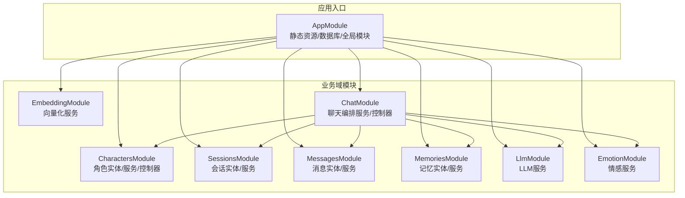
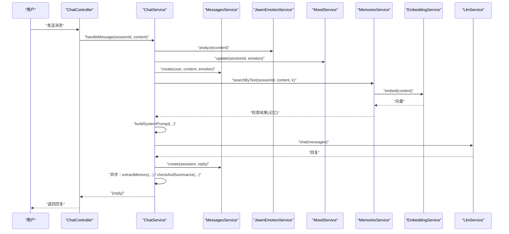
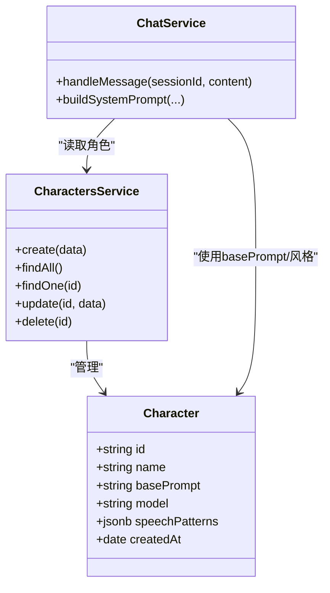
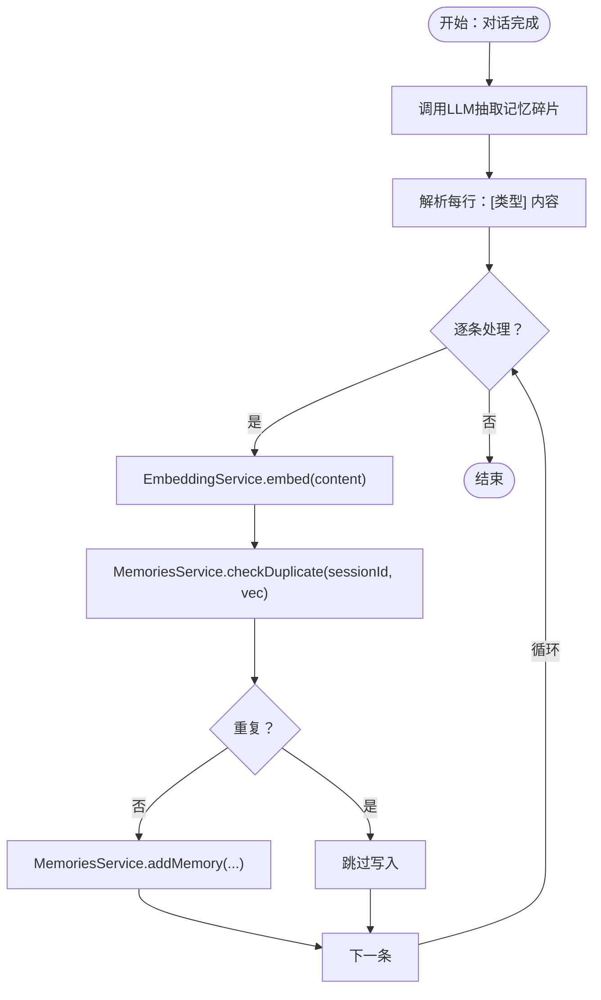
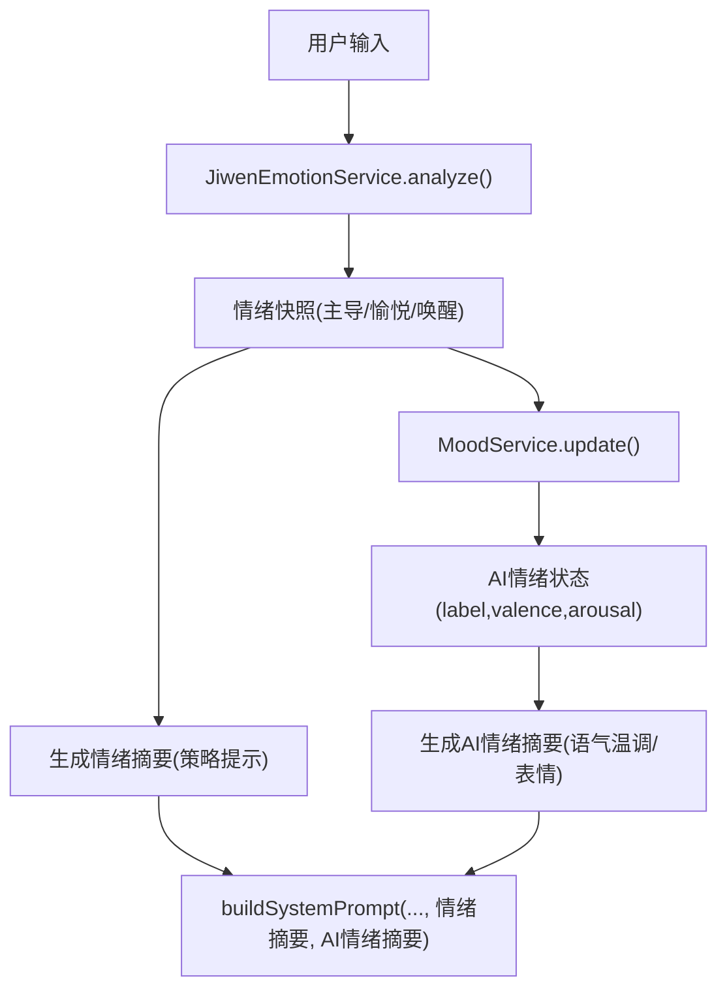
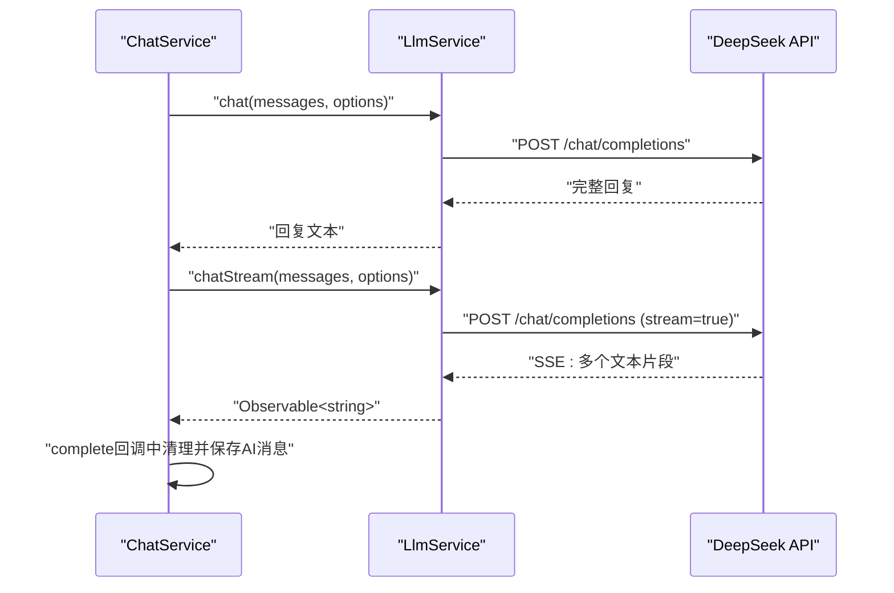
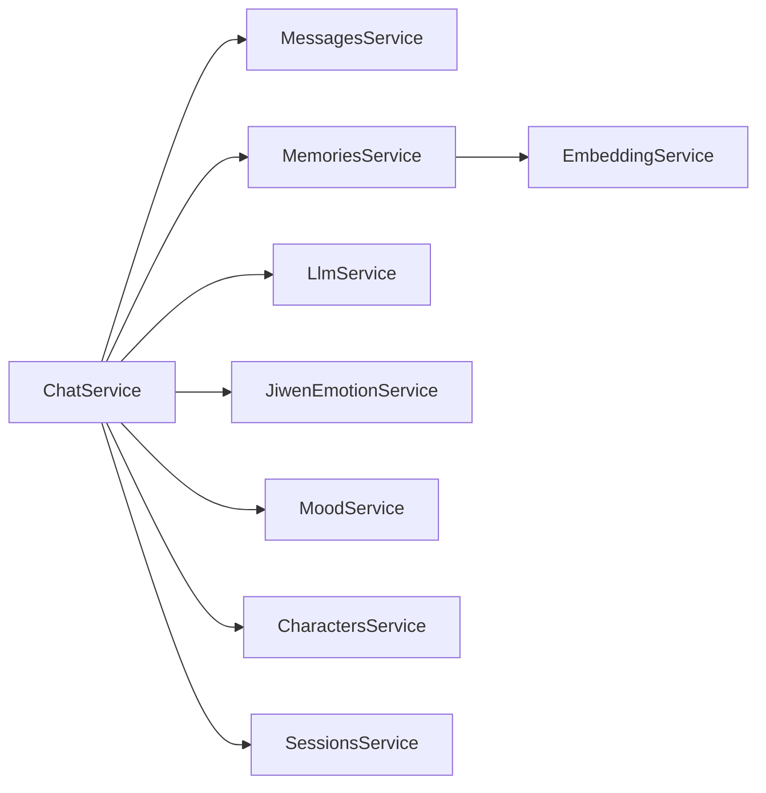
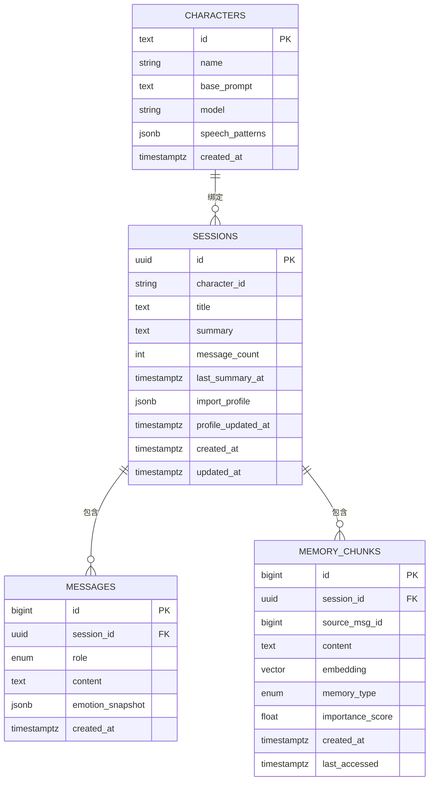

# 核心功能特性

<cite>
**本文引用的文件**
- [src/app.module.ts](file://src/app.module.ts)
- [src/characters/characters.module.ts](file://src/characters/characters.module.ts)
- [src/characters/characters.service.ts](file://src/characters/characters.service.ts)
- [src/characters/entities/character.entity.ts](file://src/characters/entities/character.entity.ts)
- [src/chat/chat.module.ts](file://src/chat/chat.module.ts)
- [src/chat/chat.service.ts](file://src/chat/chat.service.ts)
- [src/embedding/embedding.module.ts](file://src/embedding/embedding.module.ts)
- [src/embedding/embedding.service.ts](file://src/embedding/embedding.service.ts)
- [src/emotion/emotion.module.ts](file://src/emotion/emotion.module.ts)
- [src/emotion/jiwen-emotion.service.ts](file://src/emotion/jiwen-emotion.service.ts)
- [src/emotion/mood.service.ts](file://src/emotion/mood.service.ts)
- [src/llm/llm.module.ts](file://src/llm/llm.module.ts)
- [src/llm/llm.service.ts](file://src/llm/llm.service.ts)
- [src/memories/memories.module.ts](file://src/memories/memories.module.ts)
- [src/memories/memories.service.ts](file://src/memories/memories.service.ts)
- [src/memories/entities/memory.entity.ts](file://src/memories/entities/memory.entity.ts)
- [src/messages/messages.service.ts](file://src/messages/messages.service.ts)
- [src/messages/entities/message.entity.ts](file://src/messages/entities/message.entity.ts)
- [src/sessions/sessions.module.ts](file://src/sessions/sessions.module.ts)
- [src/sessions/entities/session.entity.ts](file://src/sessions/entities/session.entity.ts)
</cite>

## 目录
1. [简介](#简介)
2. [项目结构](#项目结构)
3. [核心组件](#核心组件)
4. [架构总览](#架构总览)
5. [详细组件分析](#详细组件分析)
6. [依赖分析](#依赖分析)
7. [性能考虑](#性能考虑)
8. [故障排查指南](#故障排查指南)
9. [结论](#结论)
10. [附录](#附录)

## 简介
本文件面向AI Companion项目的开发者与产品人员，系统性阐述核心功能特性与实现原理，包括：
- 多角色聊天管理：角色创建、Prompt配置、个性化对话
- 上下文记忆持久化：向量嵌入、语义检索、记忆存储
- 情感分析与情绪调节：情绪识别、情绪状态调节、回应策略
- AI推理服务：LLM调用、流式响应、参数配置

文档以“功能目标—实现原理—技术优势—实际效果—集成方式”为主线，配合图示与来源标注，帮助读者快速理解并高效集成。

## 项目结构
后端采用NestJS模块化架构，围绕“会话—消息—角色—记忆—推理—情感”六大领域建模，模块间职责清晰、耦合可控。应用入口集中配置静态资源、数据库连接与全局模块装配。

图表来源
- [src/app.module.ts:18-62](file://src/app.module.ts#L18-L62)
- [src/chat/chat.module.ts:12-33](file://src/chat/chat.module.ts#L12-L33)

章节来源
- [src/app.module.ts:18-62](file://src/app.module.ts#L18-L62)
- [src/chat/chat.module.ts:12-33](file://src/chat/chat.module.ts#L12-L33)

## 核心组件
- 多角色聊天管理：通过角色实体与服务实现角色的创建、查询、更新与删除；聊天服务基于角色的basePrompt与个性化说话风格进行prompt组装。
- 上下文记忆持久化：消息服务维护对话上下文；记忆服务通过pgvector进行向量检索与去重，结合嵌入服务完成文本向量化。
- 情感分析与情绪调节：用户输入经情绪服务分析得到情绪快照，AI情绪状态由情绪调节服务根据用户情绪进行共鸣式调节，并生成回应策略提示。
- AI推理服务：封装DeepSeek API，支持同步回复与SSE流式响应，便于前端实时展示。

章节来源
- [src/characters/characters.service.ts:13-39](file://src/characters/characters.service.ts#L13-L39)
- [src/chat/chat.service.ts:42-113](file://src/chat/chat.service.ts#L42-L113)
- [src/memories/memories.service.ts:36-136](file://src/memories/memories.service.ts#L36-L136)
- [src/emotion/jiwen-emotion.service.ts:32-76](file://src/emotion/jiwen-emotion.service.ts#L32-L76)
- [src/emotion/mood.service.ts:33-57](file://src/emotion/mood.service.ts#L33-L57)
- [src/llm/llm.service.ts:36-57](file://src/llm/llm.service.ts#L36-L57)

## 架构总览
整体流程围绕一次完整对话展开：用户消息进入后，系统同步保存消息、读取上下文、检索相关记忆、组装system prompt、调用LLM生成回复；随后异步提取记忆碎片与滚动摘要，持续优化个性化体验。

图表来源
- [src/chat/chat.service.ts:42-113](file://src/chat/chat.service.ts#L42-L113)
- [src/chat/chat.service.ts:249-315](file://src/chat/chat.service.ts#L249-L315)
- [src/chat/chat.service.ts:334-374](file://src/chat/chat.service.ts#L334-L374)
- [src/messages/messages.service.ts:36-49](file://src/messages/messages.service.ts#L36-L49)
- [src/memories/memories.service.ts:115-118](file://src/memories/memories.service.ts#L115-L118)
- [src/embedding/embedding.service.ts:33-42](file://src/embedding/embedding.service.ts#L33-L42)
- [src/llm/llm.service.ts:36-57](file://src/llm/llm.service.ts#L36-L57)

## 详细组件分析

### 多角色聊天管理
- 角色实体与服务
  - 角色实体包含唯一标识、显示名、基础Prompt、默认模型、说话风格JSON等字段，支撑个性化对话。
  - 角色服务提供创建、查询、更新、删除能力，确保角色生命周期管理。
- 聊天服务的角色集成
  - 聊天服务在每次对话开始前读取当前会话绑定的角色，将其basePrompt与个性化说话风格注入system prompt，形成稳定的个性基线。
  - 通过会话摘要、导入画像与动态记忆进一步丰富上下文，使回复更贴合角色设定与用户画像。

图表来源
- [src/characters/entities/character.entity.ts:3-22](file://src/characters/entities/character.entity.ts#L3-L22)
- [src/characters/characters.service.ts:13-39](file://src/characters/characters.service.ts#L13-L39)
- [src/chat/chat.service.ts:424-497](file://src/chat/chat.service.ts#L424-L497)

章节来源
- [src/characters/entities/character.entity.ts:3-22](file://src/characters/entities/character.entity.ts#L3-L22)
- [src/characters/characters.service.ts:13-39](file://src/characters/characters.service.ts#L13-L39)
- [src/chat/chat.service.ts:424-497](file://src/chat/chat.service.ts#L424-L497)

### 上下文记忆持久化
- 记忆实体与检索
  - 记忆实体记录会话ID、来源消息ID、内容、类型（事实/偏好/情绪）、重要度评分与访问时间等；向量列通过原生SQL管理，避免TypeORM对pgvector类型的支持限制。
  - 记忆服务提供向量检索、写入与去重能力，检索基于余弦距离排序，支持按会话维度限定。
- 向量化与批量处理
  - 嵌入服务通过HTTP调用Python FastAPI服务，提供单条与批量向量化接口，支持健康检查与超时控制。
- 对话记忆提取
  - 聊天服务在对话完成后异步触发记忆提取：调用LLM抽取事实/偏好/情绪，逐条向量化、去重后写入memory_chunks，持续增强个性化。

图表来源
- [src/chat/chat.service.ts:249-315](file://src/chat/chat.service.ts#L249-L315)
- [src/memories/memories.service.ts:124-136](file://src/memories/memories.service.ts#L124-L136)
- [src/embedding/embedding.service.ts:33-65](file://src/embedding/embedding.service.ts#L33-L65)

章节来源
- [src/memories/entities/memory.entity.ts:16-43](file://src/memories/entities/memory.entity.ts#L16-L43)
- [src/memories/memories.service.ts:36-136](file://src/memories/memories.service.ts#L36-L136)
- [src/embedding/embedding.service.ts:33-82](file://src/embedding/embedding.service.ts#L33-L82)
- [src/chat/chat.service.ts:249-315](file://src/chat/chat.service.ts#L249-L315)

### 情感分析与情绪调节
- 用户情绪识别
  - 基于中文情感词典加权计算，综合语气、重复标点与高频词，输出主导情绪、愉悦度与唤醒度等指标，并生成回应策略提示。
- AI情绪状态调节
  - 根据用户情绪进行共鸣式调节，同时缓慢回归基线，维持自然的人类情绪波动；输出当前情绪标签、语气温调、表情与颜文字建议。
- prompt注入
  - 将用户情绪摘要与AI情绪摘要注入system prompt第四层，指导AI在回复中自然地使用表情与语气，避免括号动作描述。

图表来源
- [src/emotion/jiwen-emotion.service.ts:32-97](file://src/emotion/jiwen-emotion.service.ts#L32-L97)
- [src/emotion/mood.service.ts:33-91](file://src/emotion/mood.service.ts#L33-L91)
- [src/chat/chat.service.ts:424-497](file://src/chat/chat.service.ts#L424-L497)

章节来源
- [src/emotion/jiwen-emotion.service.ts:32-134](file://src/emotion/jiwen-emotion.service.ts#L32-L134)
- [src/emotion/mood.service.ts:18-111](file://src/emotion/mood.service.ts#L18-L111)
- [src/chat/chat.service.ts:424-497](file://src/chat/chat.service.ts#L424-L497)

### AI推理服务
- 同步与流式两种模式
  - 同步模式：等待完整回复，适用于非实时场景或测试。
  - 流式模式：基于SSE返回Observable，前端可逐字/逐句渲染，显著提升交互体验。
- 参数配置
  - 支持模型选择、温度、最大token等参数，满足不同任务的稳定性与创造性平衡。
- 与聊天编排的集成
  - 聊天服务在组装完system prompt与上下文后，统一调用LLM服务生成回复；流式版本在complete回调中清理回复并保存AI消息。

图表来源
- [src/llm/llm.service.ts:36-57](file://src/llm/llm.service.ts#L36-L57)
- [src/llm/llm.service.ts:70-145](file://src/llm/llm.service.ts#L70-L145)
- [src/chat/chat.service.ts:95-113](file://src/chat/chat.service.ts#L95-L113)
- [src/chat/chat.service.ts:190-231](file://src/chat/chat.service.ts#L190-L231)

章节来源
- [src/llm/llm.service.ts:27-147](file://src/llm/llm.service.ts#L27-L147)
- [src/chat/chat.service.ts:95-113](file://src/chat/chat.service.ts#L95-L113)
- [src/chat/chat.service.ts:190-231](file://src/chat/chat.service.ts#L190-L231)

## 依赖分析
- 模块内聚与解耦
  - ChatModule聚合Characters/Sessions/Messages/Llm/Memories/Emotion模块，作为核心编排者；各子模块职责单一，降低耦合。
- 数据一致性与扩展性
  - 会话、消息、角色、记忆均通过TypeORM实体管理；pgvector相关操作通过原生SQL实现，避免ORM限制。
- 外部依赖
  - LLM服务依赖DeepSeek API；嵌入服务依赖独立的Python FastAPI服务；数据库为PostgreSQL并启用pgvector扩展。

图表来源
- [src/chat/chat.module.ts:22-30](file://src/chat/chat.module.ts#L22-L30)
- [src/chat/chat.service.ts:31-40](file://src/chat/chat.service.ts#L31-L40)
- [src/memories/memories.service.ts:31-34](file://src/memories/memories.service.ts#L31-L34)

章节来源
- [src/chat/chat.module.ts:22-30](file://src/chat/chat.module.ts#L22-L30)
- [src/chat/chat.service.ts:31-40](file://src/chat/chat.service.ts#L31-L40)

## 性能考虑
- 流式响应
  - 使用SSE流式输出，前端可边接收边渲染，显著降低首字延迟，改善用户体验。
- 批量向量化
  - 嵌入服务提供批量接口，减少网络往返与模型推理开销，适合批量记忆写入场景。
- 检索与去重
  - pgvector索引与余弦距离计算在数据库侧完成，避免将大量向量传输至应用层；去重阈值可调，兼顾召回与质量。
- 异步处理
  - 记忆提取与滚动摘要在setImmediate中异步执行，不阻塞主流程，保证响应速度。

## 故障排查指南
- LLM调用失败
  - 检查DEEPSEEK_API_KEY配置与网络连通性；确认请求参数（模型、温度、最大token）合理。
- 嵌入服务不可用
  - 确认PYTHON_EMBED_URL可达，查看健康检查接口返回；关注超时与错误日志。
- 记忆检索为空
  - 确认会话存在且已写入记忆；检查pgvector索引是否存在；验证阈值与k值设置。
- 情绪摘要异常
  - 检查用户输入是否为空或极短；确认情绪服务词典覆盖范围与权重设置。
- 会话摘要未生成
  - 检查消息计数阈值与上次摘要时间；确认摘要生成逻辑触发条件。

章节来源
- [src/llm/llm.service.ts:36-57](file://src/llm/llm.service.ts#L36-L57)
- [src/embedding/embedding.service.ts:70-82](file://src/embedding/embedding.service.ts#L70-L82)
- [src/memories/memories.service.ts:42-59](file://src/memories/memories.service.ts#L42-L59)
- [src/emotion/jiwen-emotion.service.ts:32-76](file://src/emotion/jiwen-emotion.service.ts#L32-L76)
- [src/chat/chat.service.ts:334-374](file://src/chat/chat.service.ts#L334-L374)

## 结论
本项目通过“角色—记忆—情感—推理”的闭环设计，实现了高个性化、强上下文感知与自然情绪表达的聊天体验。模块化架构与异步处理保障了系统的可扩展性与稳定性；pgvector与SSE等关键技术选型有效提升了检索效率与交互体验。建议在生产环境中完善监控与告警、优化阈值与参数，并持续迭代情绪词典与记忆抽取策略。

## 附录
- 数据模型概览

图表来源
- [src/sessions/entities/session.entity.ts:32-63](file://src/sessions/entities/session.entity.ts#L32-L63)
- [src/messages/entities/message.entity.ts:5-24](file://src/messages/entities/message.entity.ts#L5-L24)
- [src/characters/entities/character.entity.ts:3-22](file://src/characters/entities/character.entity.ts#L3-L22)
- [src/memories/entities/memory.entity.ts:16-43](file://src/memories/entities/memory.entity.ts#L16-L43)