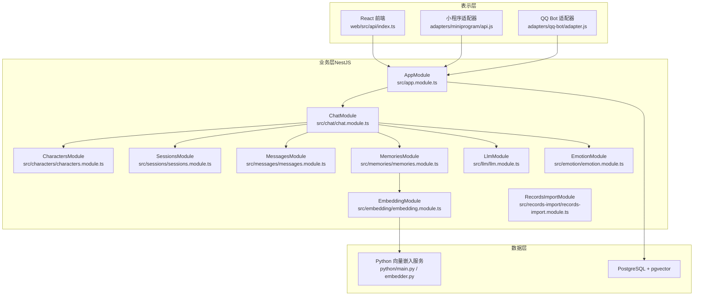
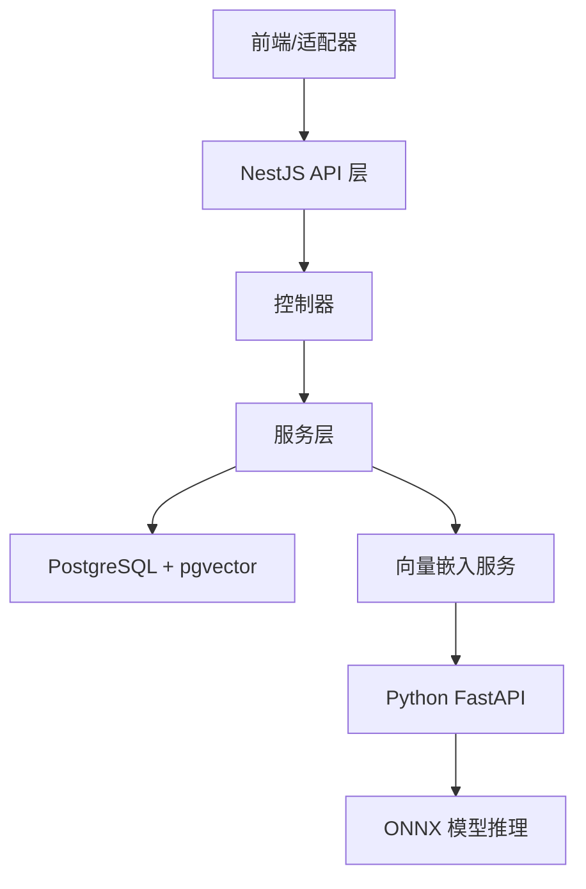
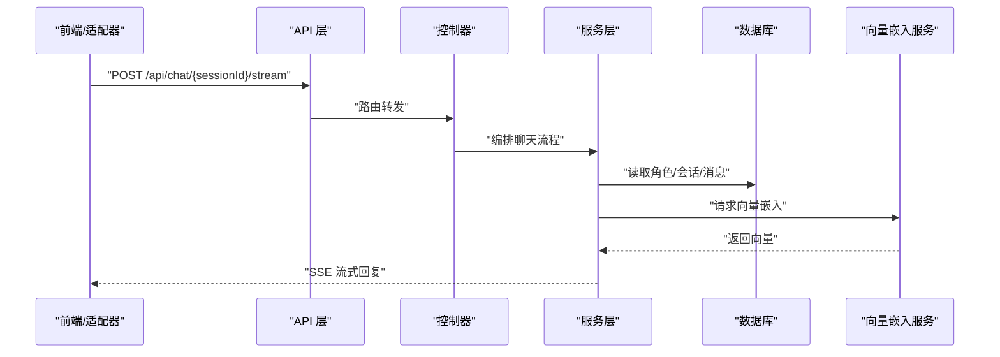
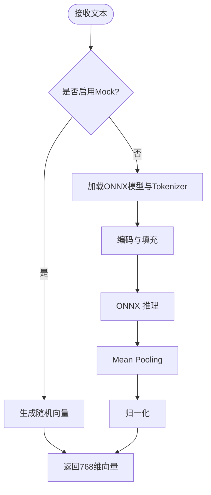
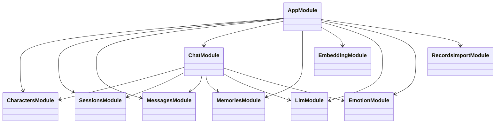
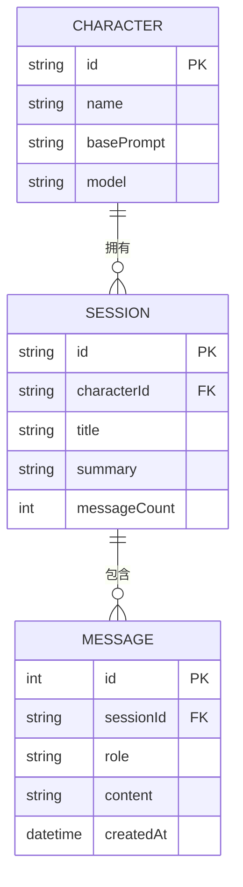
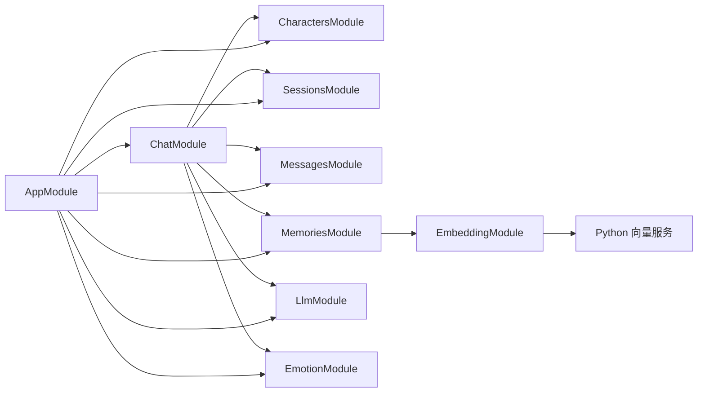

# 系统架构概览

<cite>
**本文档引用的文件**
- [src/main.ts](file://src/main.ts)
- [src/app.module.ts](file://src/app.module.ts)
- [src/characters/characters.module.ts](file://src/characters/characters.module.ts)
- [src/sessions/sessions.module.ts](file://src/sessions/sessions.module.ts)
- [src/messages/messages.module.ts](file://src/messages/messages.module.ts)
- [src/chat/chat.module.ts](file://src/chat/chat.module.ts)
- [src/embedding/embedding.module.ts](file://src/embedding/embedding.module.ts)
- [src/memories/memories.module.ts](file://src/memories/memories.module.ts)
- [src/llm/llm.module.ts](file://src/llm/llm.module.ts)
- [src/emotion/emotion.module.ts](file://src/emotion/emotion.module.ts)
- [src/records-import/records-import.module.ts](file://src/records-import/records-import.module.ts)
- [shared/types.ts](file://shared/types.ts)
- [web/src/api/index.ts](file://web/src/api/index.ts)
- [adapters/miniprogram/api.js](file://adapters/miniprogram/api.js)
- [adapters/qq-bot/adapter.js](file://adapters/qq-bot/adapter.js)
- [python/main.py](file://python/main.py)
- [python/embedder.py](file://python/embedder.py)
</cite>

## 目录
1. [引言](#引言)
2. [项目结构](#项目结构)
3. [核心组件](#核心组件)
4. [架构总览](#架构总览)
5. [详细组件分析](#详细组件分析)
6. [依赖分析](#依赖分析)
7. [性能考虑](#性能考虑)
8. [故障排查指南](#故障排查指南)
9. [结论](#结论)
10. [附录](#附录)

## 引言
本项目旨在打造一个可多平台适配的智能伙伴系统，采用前后端分离与微服务化思想，结合NestJS后端、React前端、Python向量嵌入服务以及多平台适配器，形成“三层架构 + 模块化 + 微服务”的整体设计。系统通过共享类型定义实现跨平台一致性，通过适配器抽象不同平台差异，通过独立的向量嵌入服务实现高内聚低耦合的数据处理能力。

## 项目结构
项目采用分层与模块化混合架构：
- 表示层：React前端应用与多平台适配器（小程序、QQ机器人等）
- 业务层：NestJS后端，按功能拆分为多个领域模块（角色、会话、消息、聊天、记忆、LLM、情感、导入等）
- 数据层：PostgreSQL数据库，配合pgvector扩展存储向量；独立的Python向量嵌入服务提供文本向量化能力
- 共享层：共享类型定义，确保前后端与适配器之间契约一致

**图表来源**
- [src/app.module.ts:18-62](file://src/app.module.ts#L18-L62)
- [src/chat/chat.module.ts:12-34](file://src/chat/chat.module.ts#L12-L34)
- [src/embedding/embedding.module.ts:5-14](file://src/embedding/embedding.module.ts#L5-L14)
- [src/memories/memories.module.ts:1-18](file://src/memories/memories.module.ts#L1-L18)
- [web/src/api/index.ts:30-32](file://web/src/api/index.ts#L30-L32)
- [adapters/miniprogram/api.js:12-12](file://adapters/miniprogram/api.js#L12-L12)
- [adapters/qq-bot/adapter.js:14-27](file://adapters/qq-bot/adapter.js#L14-L27)
- [python/main.py:26-29](file://python/main.py#L26-L29)

**章节来源**
- [src/app.module.ts:18-62](file://src/app.module.ts#L18-L62)
- [src/chat/chat.module.ts:12-34](file://src/chat/chat.module.ts#L12-L34)
- [web/src/api/index.ts:30-32](file://web/src/api/index.ts#L30-L32)
- [adapters/miniprogram/api.js:12-12](file://adapters/miniprogram/api.js#L12-L12)
- [adapters/qq-bot/adapter.js:14-27](file://adapters/qq-bot/adapter.js#L14-L27)
- [python/main.py:26-29](file://python/main.py#L26-L29)

## 核心组件
- 共享类型定义：统一消息、角色、会话、导入等数据契约，确保跨平台一致性
- 前端API层：封装HTTP请求与SSE流式处理，屏蔽平台差异
- 适配器层：以函数替换的方式适配小程序等平台的网络请求与流式能力
- NestJS模块：按领域拆分，明确职责边界与依赖关系
- Python向量嵌入服务：提供稳定的文本向量化能力，支持Mock模式快速验证

**章节来源**
- [shared/types.ts:11-166](file://shared/types.ts#L11-L166)
- [web/src/api/index.ts:15-28](file://web/src/api/index.ts#L15-L28)
- [adapters/miniprogram/api.js:14-33](file://adapters/miniprogram/api.js#L14-L33)
- [src/chat/chat.module.ts:12-34](file://src/chat/chat.module.ts#L12-L34)
- [python/main.py:91-112](file://python/main.py#L91-L112)

## 架构总览
系统采用“三层架构 + 微服务化”设计：
- 表示层：React前端与多平台适配器通过统一的API契约与后端交互
- 业务层：NestJS模块化组织，核心聊天流程在ChatModule中编排
- 数据层：PostgreSQL承载结构化数据，pgvector用于向量检索；Python服务独立提供向量化能力

**图表来源**
- [src/app.module.ts:18-62](file://src/app.module.ts#L18-L62)
- [src/chat/chat.module.ts:22-34](file://src/chat/chat.module.ts#L22-L34)
- [src/embedding/embedding.module.ts:7-10](file://src/embedding/embedding.module.ts#L7-L10)
- [python/main.py:26-29](file://python/main.py#L26-L29)
- [python/embedder.py:31-70](file://python/embedder.py#L31-L70)

## 详细组件分析

### 前端与适配器
- React前端通过API层发起REST与SSE请求，支持流式回复与错误处理
- 小程序适配器以函数替换的方式适配wx.request，并对SSE进行降级处理
- QQ Bot适配器提供伪代码示例，展示如何接入官方SDK并通过HTTP调用后端API

**图表来源**
- [web/src/api/index.ts:137-201](file://web/src/api/index.ts#L137-L201)
- [adapters/miniprogram/api.js:75-82](file://adapters/miniprogram/api.js#L75-L82)
- [src/chat/chat.module.ts:12-34](file://src/chat/chat.module.ts#L12-L34)

**章节来源**
- [web/src/api/index.ts:137-201](file://web/src/api/index.ts#L137-L201)
- [adapters/miniprogram/api.js:75-82](file://adapters/miniprogram/api.js#L75-L82)
- [adapters/qq-bot/adapter.js:14-27](file://adapters/qq-bot/adapter.js#L14-L27)

### 向量嵌入服务
- Python服务提供单条与批量向量化接口，支持Mock模式与真实模型
- ONNX Runtime封装Tokenizer与mean pooling，输出768维向量
- 嵌入服务通过HTTP模块被NestJS调用，避免在主业务中耦合模型细节

**图表来源**
- [python/main.py:33-70](file://python/main.py#L33-L70)
- [python/embedder.py:71-115](file://python/embedder.py#L71-L115)

**章节来源**
- [python/main.py:91-112](file://python/main.py#L91-L112)
- [python/embedder.py:31-70](file://python/embedder.py#L31-L70)

### NestJS模块化与依赖注入
- AppModule集中配置静态资源、配置加载、数据库连接与业务模块
- 各领域模块通过TypeOrmModule注册实体，提供者在模块内声明并通过exports暴露给其他模块
- ChatModule作为核心编排模块，聚合角色、会话、消息、记忆、LLM与情感模块

**图表来源**
- [src/app.module.ts:18-62](file://src/app.module.ts#L18-L62)
- [src/chat/chat.module.ts:22-34](file://src/chat/chat.module.ts#L22-L34)

**章节来源**
- [src/app.module.ts:18-62](file://src/app.module.ts#L18-L62)
- [src/chat/chat.module.ts:22-34](file://src/chat/chat.module.ts#L22-L34)

### 数据模型与边界
- 共享类型定义统一了消息、角色、会话、导入等数据结构，确保跨平台一致性
- 前端API层与适配器均基于共享类型，减少重复实现
- 模块间通过exports暴露必要依赖，避免循环依赖

**图表来源**
- [shared/types.ts:34-86](file://shared/types.ts#L34-L86)

**章节来源**
- [shared/types.ts:11-166](file://shared/types.ts#L11-L166)

## 依赖分析
- 模块耦合：ChatModule为核心，向上依赖角色、会话、消息模块，向下依赖LLM、记忆、情感模块
- 外部依赖：HttpModule用于HTTP调用；TypeOrmModule用于数据库访问；ServeStaticModule提供静态资源
- 微服务边界：向量嵌入服务独立部署，通过HTTP接口与主业务解耦

**图表来源**
- [src/chat/chat.module.ts:22-34](file://src/chat/chat.module.ts#L22-L34)
- [src/embedding/embedding.module.ts:7-10](file://src/embedding/embedding.module.ts#L7-L10)
- [src/app.module.ts:18-62](file://src/app.module.ts#L18-L62)

**章节来源**
- [src/chat/chat.module.ts:22-34](file://src/chat/chat.module.ts#L22-L34)
- [src/embedding/embedding.module.ts:7-10](file://src/embedding/embedding.module.ts#L7-L10)
- [src/app.module.ts:18-62](file://src/app.module.ts#L18-L62)

## 性能考虑
- 向量服务超时与重定向限制：HttpModule配置timeout与maxRedirects，避免阻塞影响整体响应
- 数据库迁移策略：pgvector表结构通过迁移脚本管理，禁止TypeORM自动同步，确保向量列安全
- 前端SSE流式：前端按块解析SSE，降低首屏延迟，提升交互体验
- Mock模式：向量服务支持Mock模式，便于快速验证流程与接口契约

**章节来源**
- [src/embedding/embedding.module.ts:7-10](file://src/embedding/embedding.module.ts#L7-L10)
- [src/memories/memories.module.ts:8-10](file://src/memories/memories.module.ts#L8-L10)
- [web/src/api/index.ts:162-191](file://web/src/api/index.ts#L162-L191)
- [python/main.py:33-41](file://python/main.py#L33-L41)

## 故障排查指南
- CORS与端口：后端开启CORS并监听环境端口，确认前端代理或同源策略正确
- 数据库连接：检查DB_HOST/DB_PORT/DB_USER/DB_NAME等环境变量，确保pgvector迁移已执行
- 向量服务健康检查：通过/health端点确认向量服务状态与维度信息
- 适配器问题：小程序需配置服务器域名白名单；SSE在小程序上降级为同步请求
- 错误类型：统一使用ApiError抛错，前端捕获并展示友好提示

**章节来源**
- [src/main.ts:9-13](file://src/main.ts#L9-L13)
- [src/app.module.ts:38-50](file://src/app.module.ts#L38-L50)
- [python/main.py:115-122](file://python/main.py#L115-L122)
- [adapters/miniprogram/api.js:12-12](file://adapters/miniprogram/api.js#L12-L12)
- [shared/types.ts:114-121](file://shared/types.ts#L114-L121)

## 结论
本项目通过清晰的分层与模块化设计，实现了前后端分离与多平台适配；通过独立的向量嵌入服务与严格的迁移策略，保障了系统的可维护性与扩展性。建议后续在以下方面持续优化：完善单元测试与E2E测试、引入缓存与限流策略、增强日志与监控体系、探索更多平台适配器与LLM供应商集成。

## 附录
- 系统边界：前端/适配器仅负责请求与渲染；后端负责业务编排与数据持久化；向量服务专注于模型推理
- 组件交互：通过共享类型定义契约，模块间通过依赖注入与导出机制协作
- 数据流向：用户输入经前端/SSE进入后端，后端编排角色、会话、消息、记忆与LLM，向量服务参与检索与嵌入，最终返回结果