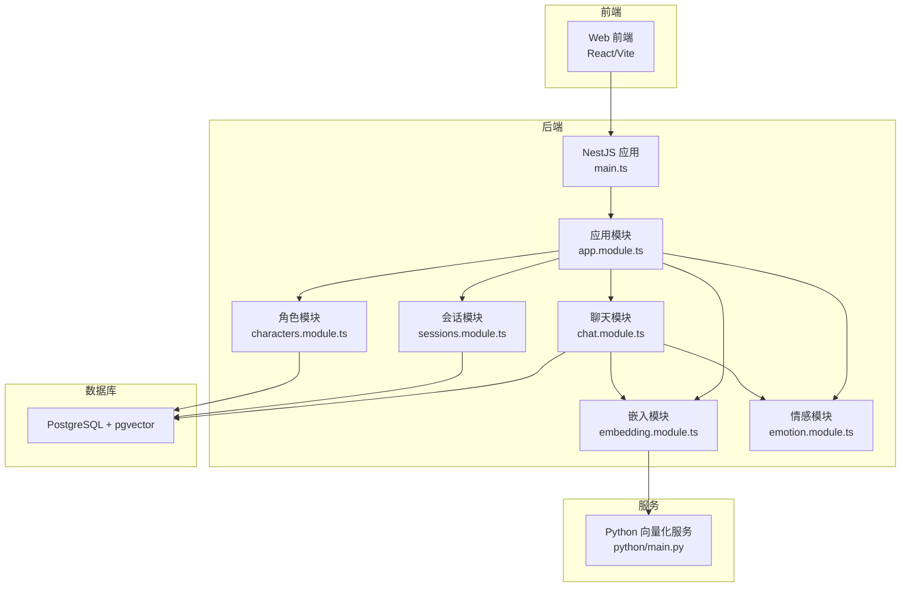
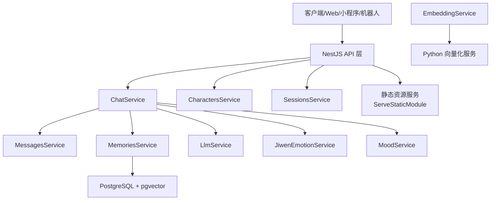
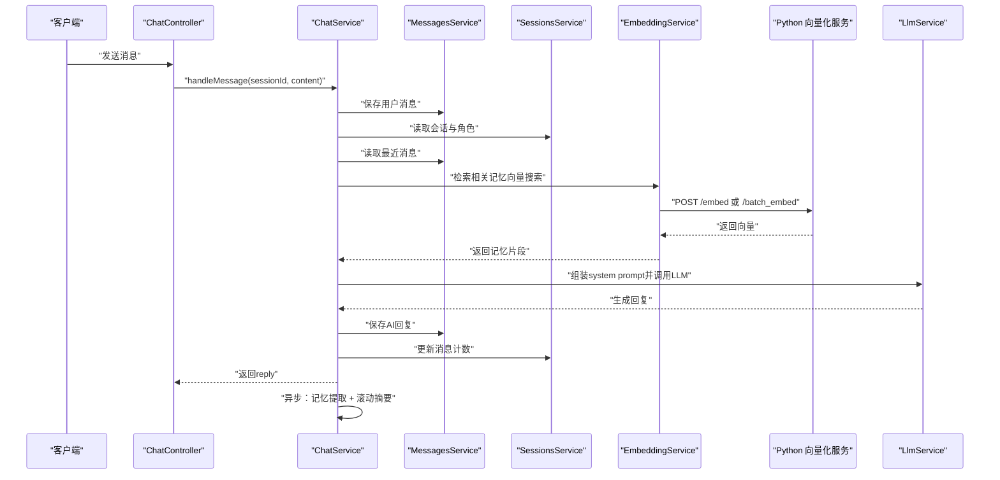
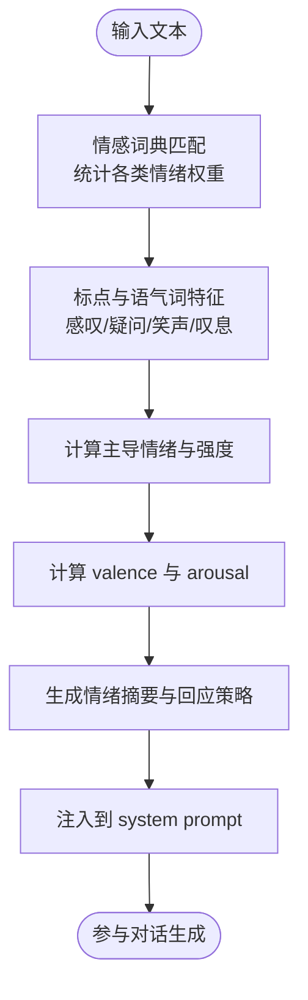
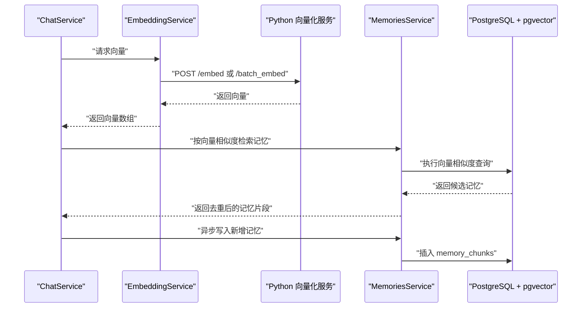
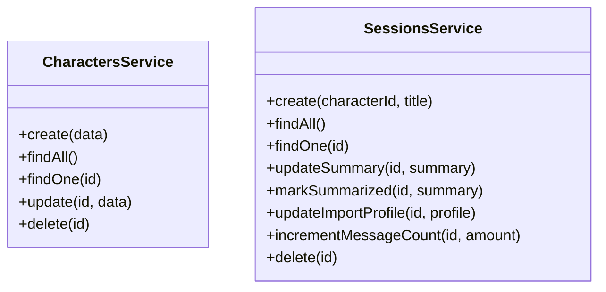
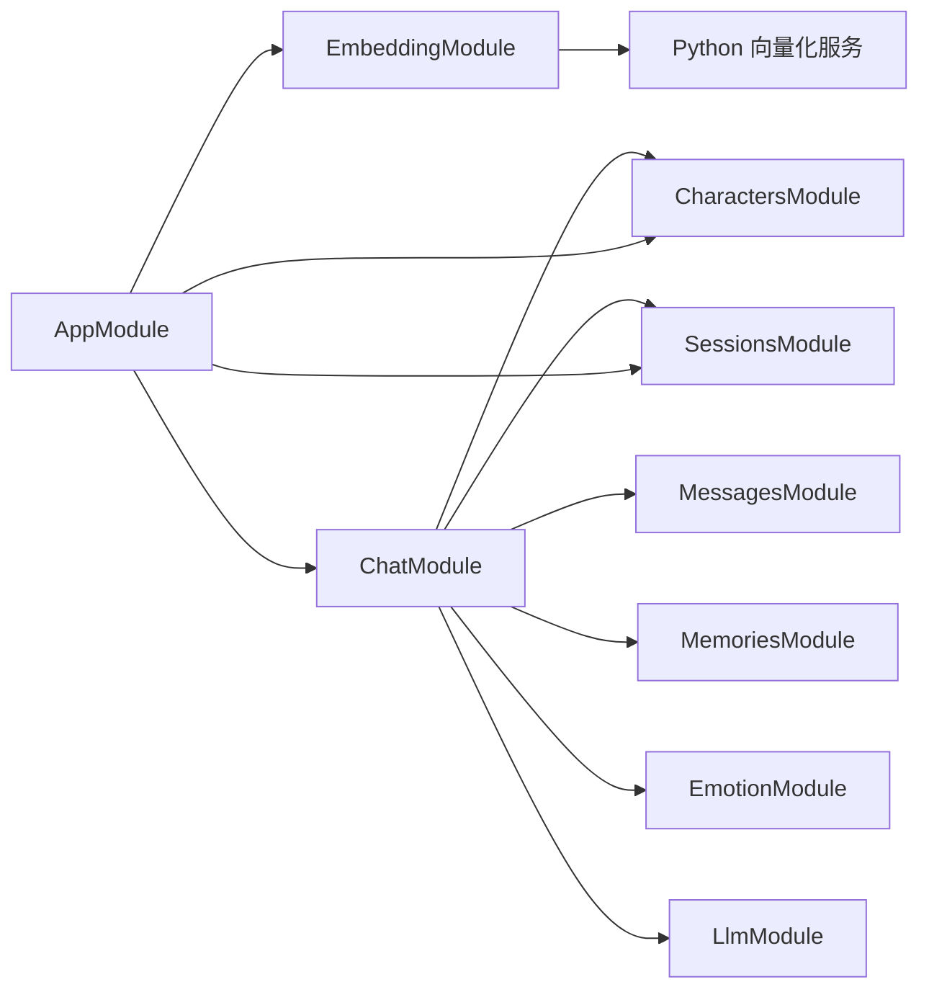

# 项目介绍

<cite>
**本文档引用的文件**
- [README.md](file://README.md)
- [main.ts](file://src/main.ts)
- [app.module.ts](file://src/app.module.ts)
- [types.ts](file://shared/types.ts)
- [chat.module.ts](file://src/chat/chat.module.ts)
- [chat.service.ts](file://src/chat/chat.service.ts)
- [characters.module.ts](file://src/characters/characters.module.ts)
- [characters.service.ts](file://src/characters/characters.service.ts)
- [sessions.module.ts](file://src/sessions/sessions.module.ts)
- [sessions.service.ts](file://src/sessions/sessions.service.ts)
- [embedding.module.ts](file://src/embedding/embedding.module.ts)
- [embedding.service.ts](file://src/embedding/embedding.service.ts)
- [emotion.module.ts](file://src/emotion/emotion.module.ts)
- [jiwen-emotion.service.ts](file://src/emotion/jiwen-emotion.service.ts)
- [main.py](file://python/main.py)
</cite>

## 目录
1. [引言](#引言)
2. [项目结构](#项目结构)
3. [核心组件](#核心组件)
4. [架构总览](#架构总览)
5. [详细组件分析](#详细组件分析)
6. [依赖分析](#依赖分析)
7. [性能考虑](#性能考虑)
8. [故障排查指南](#故障排查指南)
9. [结论](#结论)
10. [附录](#附录)

## 引言
AI Companion 是一个面向“多角色个性化对话”的智能聊天助手系统，旨在为用户提供自然、连贯且富有情感温度的对话体验。项目通过模块化设计与多平台适配，覆盖从角色管理、会话与消息持久化、上下文记忆与滚动摘要、情感分析与情绪调节，到向量语义检索与LLM集成的完整闭环。

核心价值与定位
- 多角色个性化对话：每个角色拥有独立的人设基元与说话风格，系统在对话中动态注入角色特征，使回复更贴合人物设定。
- 上下文记忆持久化：结合滚动摘要与向量检索，系统在长对话中保留关键信息，减少重复输入，提升连贯性。
- 情感分析与情绪调节：基于中文情感词典与用户输入特征，实时分析情绪倾向，并在系统提示词中注入回应策略，使AI的语气与情绪与用户保持共振。
- 向量语义检索：通过独立的Python向量化服务，将文本映射为高维向量，配合PostgreSQL的pgvector扩展进行高效相似度检索，精准召回相关记忆片段。

实际问题与应用场景
- 个人AI助手：提供全天候、可记忆、有温度的聊天伙伴，适合日常倾诉、创意启发与情绪支持。
- 智能客服：以角色化的人设与稳定的回复风格，降低沟通成本，提升用户满意度。
- 教育辅导：通过情绪识别与调节策略，营造轻松、鼓励的学习氛围，辅助学习者表达与思考。

技术创新点与竞争优势
- 模块化设计：以NestJS模块化组织业务域，职责清晰、耦合可控，便于扩展与维护。
- 多平台适配：前后端分离，Web前端、小程序适配器与Telegram适配器并存，满足多样化部署与接入场景。
- AI服务集成：统一的LLM调用与嵌入服务抽象，既支持流式对话，又支持批量化处理，兼顾交互体验与性能。
- 数据与算法解耦：嵌入服务独立部署，便于替换模型与优化推理性能；数据库迁移机制确保pgvector扩展与表结构的稳定性。

## 项目结构
项目采用前后端分离与模块化架构：
- 后端（NestJS）：提供REST API、WebSocket（SSE）流式输出、静态资源托管与数据库连接。
- 前端（React + Vite）：提供聊天界面与角色/会话管理。
- 嵌入服务（Python FastAPI）：提供文本向量化能力，供后端调用。
- 适配器（MiniProgram/QQ Bot/Telegram）：将后端能力适配到不同平台。

图表来源
- [main.ts:1-22](file://src/main.ts#L1-L22)
- [app.module.ts:18-62](file://src/app.module.ts#L18-L62)
- [chat.module.ts:12-34](file://src/chat/chat.module.ts#L12-L34)
- [embedding.module.ts:5-15](file://src/embedding/embedding.module.ts#L5-L15)
- [emotion.module.ts:5-9](file://src/emotion/emotion.module.ts#L5-L9)
- [characters.module.ts:7-13](file://src/characters/characters.module.ts#L7-L13)
- [sessions.module.ts:7-13](file://src/sessions/sessions.module.ts#L7-L13)
- [main.py:26-29](file://python/main.py#L26-L29)

章节来源
- [README.md:24-99](file://README.md#L24-L99)
- [main.ts:1-22](file://src/main.ts#L1-L22)
- [app.module.ts:18-62](file://src/app.module.ts#L18-L62)

## 核心组件
- 类型与契约（共享）：统一的消息、角色、会话、导入记录等数据结构，确保前后端与适配器的一致性。
- 聊天编排（ChatService）：串联消息保存、上下文组装、向量检索、LLM调用、回复清理、异步记忆提取与滚动摘要。
- 情感分析（JiwenEmotionService）：基于中文情感词典与标点、语气词等特征，计算情绪强度与倾向，并生成回应策略。
- 嵌入服务（EmbeddingService + Python服务）：提供单条与批量向量化接口，供记忆检索与去重使用。
- 角色与会话（Characters/Sessions Services）：提供角色配置与会话生命周期管理，支撑个性化与上下文延续。

章节来源
- [types.ts:19-166](file://shared/types.ts#L19-L166)
- [chat.service.ts:30-113](file://src/chat/chat.service.ts#L30-L113)
- [jiwen-emotion.service.ts:32-97](file://src/emotion/jiwen-emotion.service.ts#L32-L97)
- [embedding.service.ts:14-83](file://src/embedding/embedding.service.ts#L14-L83)
- [characters.service.ts:7-40](file://src/characters/characters.service.ts#L7-L40)
- [sessions.service.ts:7-61](file://src/sessions/sessions.service.ts#L7-L61)

## 架构总览
系统以“聊天模块”为核心，围绕角色、会话、消息、记忆、情感与嵌入服务形成闭环。后端通过CORS与静态资源服务对外提供Web与API访问；嵌入服务独立运行并通过HTTP提供向量化能力；数据库采用PostgreSQL并启用pgvector扩展用于向量检索。

图表来源
- [chat.module.ts:12-34](file://src/chat/chat.module.ts#L12-L34)
- [embedding.module.ts:5-15](file://src/embedding/embedding.module.ts#L5-L15)
- [app.module.ts:18-62](file://src/app.module.ts#L18-L62)

## 详细组件分析

### 聊天编排流程（同步+异步）
聊天服务负责一次完整对话的编排：保存用户消息、读取上下文、检索相关记忆、组装系统提示词、调用LLM生成回复、保存AI回复、更新消息计数，并在异步任务中触发记忆提取与滚动摘要检查。

图表来源
- [chat.service.ts:42-113](file://src/chat/chat.service.ts#L42-L113)
- [embedding.service.ts:33-65](file://src/embedding/embedding.service.ts#L33-L65)
- [main.py:91-112](file://python/main.py#L91-L112)

章节来源
- [chat.service.ts:13-28](file://src/chat/chat.service.ts#L13-L28)
- [chat.service.ts:42-113](file://src/chat/chat.service.ts#L42-L113)

### 情感分析与情绪调节
系统通过中文情感词典与输入特征（如感叹号、问号、笑声、叹息等）计算情绪强度与倾向，并生成回应策略，注入到系统提示词中，使AI的语气与情绪与用户保持共振。

图表来源
- [jiwen-emotion.service.ts:32-76](file://src/emotion/jiwen-emotion.service.ts#L32-L76)
- [jiwen-emotion.service.ts:78-97](file://src/emotion/jiwen-emotion.service.ts#L78-L97)

章节来源
- [jiwen-emotion.service.ts:32-134](file://src/emotion/jiwen-emotion.service.ts#L32-L134)

### 向量语义检索与记忆持久化
嵌入服务提供单条与批量向量化接口；记忆服务在检索后对候选片段进行去重与入库，形成可检索的记忆库。检索与写入均通过PostgreSQL的pgvector扩展完成。

图表来源
- [embedding.service.ts:33-65](file://src/embedding/embedding.service.ts#L33-L65)
- [main.py:91-112](file://python/main.py#L91-L112)
- [chat.service.ts:249-315](file://src/chat/chat.service.ts#L249-L315)

章节来源
- [embedding.service.ts:14-83](file://src/embedding/embedding.service.ts#L14-L83)
- [main.py:1-123](file://python/main.py#L1-L123)
- [chat.service.ts:249-315](file://src/chat/chat.service.ts#L249-L315)

### 角色与会话管理
角色模块负责角色的增删改查与基础提示词管理；会话模块负责会话的创建、摘要更新与导入画像维护，支撑个性化与上下文延续。

图表来源
- [characters.service.ts:7-40](file://src/characters/characters.service.ts#L7-L40)
- [sessions.service.ts:7-61](file://src/sessions/sessions.service.ts#L7-L61)

章节来源
- [characters.module.ts:7-13](file://src/characters/characters.module.ts#L7-L13)
- [sessions.module.ts:7-13](file://src/sessions/sessions.module.ts#L7-L13)
- [characters.service.ts:7-40](file://src/characters/characters.service.ts#L7-L40)
- [sessions.service.ts:7-61](file://src/sessions/sessions.service.ts#L7-L61)

## 依赖分析
- 模块耦合：聊天模块聚合角色、会话、消息、记忆、情感与LLM服务，形成强内聚的对话闭环；嵌入模块通过HTTP与Python服务解耦。
- 外部依赖：PostgreSQL + pgvector（向量检索）、Python FastAPI（向量化）、NestJS（后端框架）、React（前端）。
- 运行时依赖：CORS、静态资源服务、数据库迁移（pgvector初始化）。

图表来源
- [chat.module.ts:22-34](file://src/chat/chat.module.ts#L22-L34)
- [embedding.module.ts:5-15](file://src/embedding/embedding.module.ts#L5-L15)
- [app.module.ts:18-62](file://src/app.module.ts#L18-L62)

章节来源
- [chat.module.ts:12-34](file://src/chat/chat.module.ts#L12-L34)
- [embedding.module.ts:5-15](file://src/embedding/embedding.module.ts#L5-L15)
- [app.module.ts:18-62](file://src/app.module.ts#L18-L62)

## 性能考虑
- 向量化性能：批量嵌入（batch_embed）相比逐条调用具有更好的吞吐；合理设置超时与并发，避免阻塞主流程。
- 检索效率：pgvector的向量索引与相似度阈值控制可显著降低检索开销；对候选集进行去重与裁剪，减少后续处理量。
- 异步化：记忆提取与滚动摘要在setImmediate中异步执行，避免阻塞用户感知的对话时延。
- 缓存与预热：Python服务可在启动时加载模型，前端与后端可缓存常用角色与会话元数据，缩短首次响应时间。

## 故障排查指南
- CORS与端口：确认开发环境允许任意来源访问，生产环境限制为具体域名；后端默认端口可通过环境变量配置。
- 数据库连接：检查PostgreSQL连接参数与pgvector迁移是否成功；迁移脚本已在启动时自动执行。
- 嵌入服务健康检查：通过EmbeddingService.healthCheck确认Python服务可达；若不可达，检查PYTHON_EMBED_URL与服务端口。
- 日志与错误：聊天流程中的异常会记录日志；注意观察内存检索与摘要生成过程中的错误堆栈。

章节来源
- [main.ts:7-13](file://src/main.ts#L7-L13)
- [app.module.ts:38-50](file://src/app.module.ts#L38-L50)
- [embedding.service.ts:70-82](file://src/embedding/embedding.service.ts#L70-L82)
- [chat.service.ts:73-75](file://src/chat/chat.service.ts#L73-L75)

## 结论
AI Companion通过模块化设计与多平台适配，实现了“多角色个性化对话 + 上下文记忆 + 情感分析 + 向量语义检索”的一体化能力。其核心优势在于：清晰的业务边界、可插拔的AI服务集成、稳健的数据与算法解耦，以及对用户体验（流式输出、异步处理）的重视。该系统既适合个人使用，也可拓展至客服、教育等专业场景，具备良好的可扩展性与落地价值。

## 附录
- 快速开始：安装依赖后启动后端与嵌入服务，访问Web界面即可开始对话。
- 部署建议：生产环境建议将嵌入服务与后端分别部署，使用容器编排与负载均衡；数据库启用备份与监控。