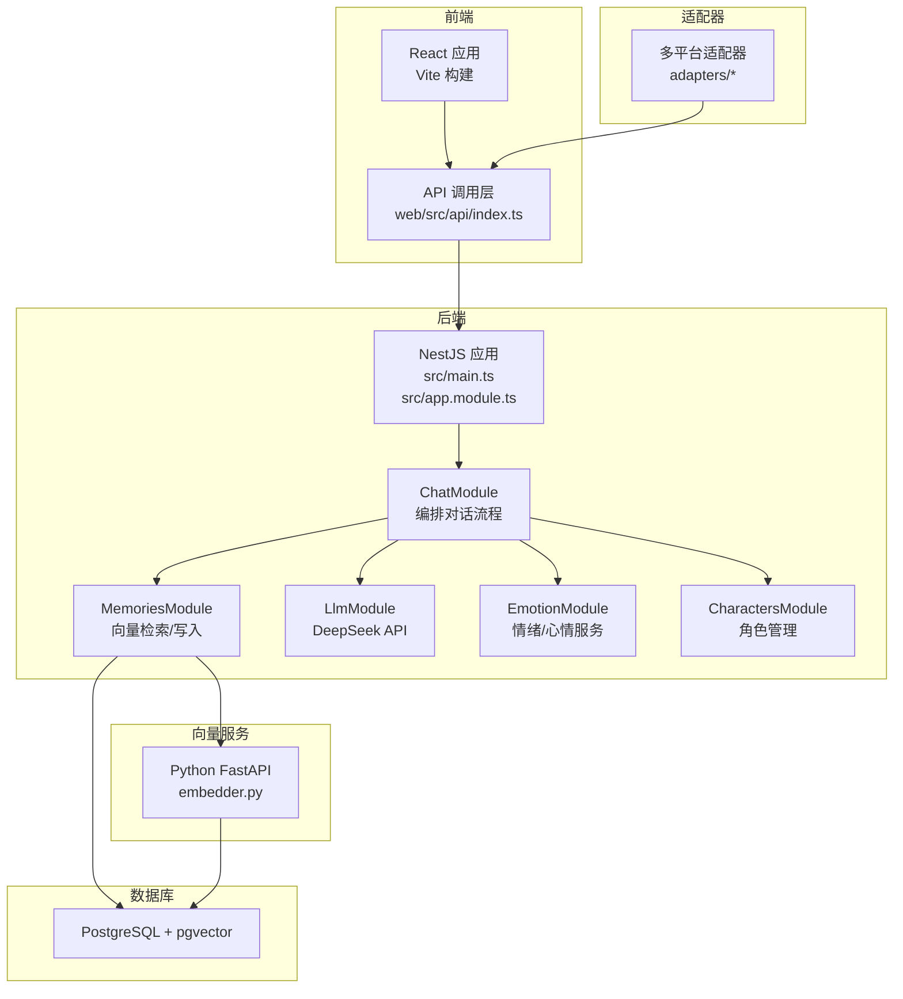
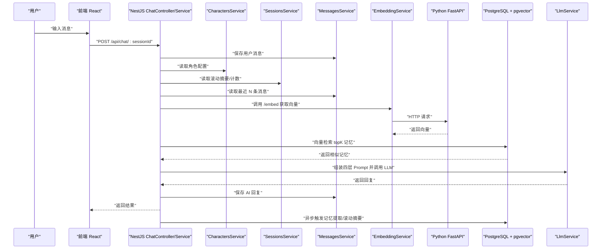
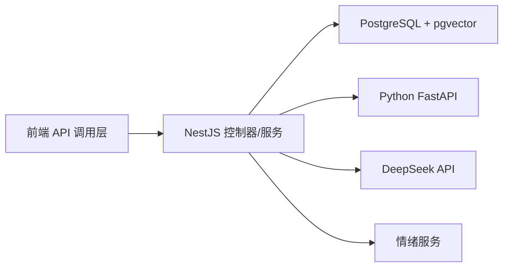

# 项目概述

<cite>
**本文引用的文件**
- [README.md](file://README.md)
- [AI_Companion_最终方案.md](file://docs/AI_Companion_最终方案.md)
- [main.ts](file://src/main.ts)
- [app.module.ts](file://src/app.module.ts)
- [chat.module.ts](file://src/chat/chat.module.ts)
- [memories.module.ts](file://src/memories/memories.module.ts)
- [llm.module.ts](file://src/llm/llm.module.ts)
- [emotion.module.ts](file://src/emotion/emotion.module.ts)
- [characters.module.ts](file://src/characters/characters.module.ts)
- [embedder.py](file://python/embedder.py)
- [pyproject.toml](file://python/pyproject.toml)
- [types.ts](file://shared/types.ts)
- [index.ts](file://web/src/api/index.ts)
- [README.md](file://adapters/README.md)
</cite>

## 目录
1. [简介](#简介)
2. [项目结构](#项目结构)
3. [核心组件](#核心组件)
4. [架构总览](#架构总览)
5. [详细组件分析](#详细组件分析)
6. [依赖分析](#依赖分析)
7. [性能考量](#性能考量)
8. [故障排查指南](#故障排查指南)
9. [结论](#结论)
10. [附录](#附录)

## 简介
AI Companion 是一个面向“长期记忆 + 人格模拟 + 情绪调节”的智能聊天助手系统。其核心目标是：
- 多角色个性化对话：每个角色拥有独立的人格设定与回复风格，支持快速切换与编辑。
- 上下文记忆持久化：将对话中的事实、偏好与情绪等记忆以向量形式存储，实现语义检索与持续学习。
- 情感分析与情绪调节：结合情绪引擎，动态调整回复的情绪色彩，提升互动的真实感与亲和力。
- 向量语义检索：通过 PostgreSQL 的 pgvector 扩展进行高效相似度检索，支撑“回忆”与“联想”。

系统采用“后端 NestJS + 前端 React + Python 向量嵌入服务 + 多平台适配器”的分层协作架构，实现高内聚、低耦合与跨平台复用。

## 项目结构
项目采用模块化分层组织：
- 后端（NestJS）：提供 REST API、业务编排、数据库访问与静态资源托管。
- 前端（React + Vite）：提供 Web 聊天界面与 API 调用层。
- Python 向量嵌入服务：提供文本向量化能力，专注推理，不参与检索。
- 多平台适配器：通过统一 API 签名适配不同运行环境（Web、小程序、QQ Bot、Telegram 等）。

图表来源
- [main.ts:1-22](file://src/main.ts#L1-L22)
- [app.module.ts:1-64](file://src/app.module.ts#L1-L64)
- [chat.module.ts:1-35](file://src/chat/chat.module.ts#L1-L35)
- [memories.module.ts:1-18](file://src/memories/memories.module.ts#L1-L18)
- [llm.module.ts:1-16](file://src/llm/llm.module.ts#L1-L16)
- [emotion.module.ts:1-10](file://src/emotion/emotion.module.ts#L1-L10)
- [embedder.py:1-116](file://python/embedder.py#L1-L116)
- [index.ts:1-212](file://web/src/api/index.ts#L1-L212)
- [README.md:1-62](file://adapters/README.md#L1-L62)

章节来源
- [README.md:24-99](file://README.md#L24-L99)
- [AI_Companion_最终方案.md:23-50](file://docs/AI_Companion_最终方案.md#L23-L50)
- [app.module.ts:15-30](file://src/app.module.ts#L15-L30)

## 核心组件
- 后端核心模块
  - ChatModule：编排一次完整对话流程，串联角色、会话、消息、记忆、LLM 与情绪模块。
  - MemoriesModule：负责向量检索与写入，使用原生 SQL 操作 pgvector。
  - LlmModule：封装 DeepSeek API 调用，提供超时与重定向控制。
  - EmotionModule：提供情绪与心情服务，辅助生成带情绪色彩的回复。
  - CharactersModule：角色的增删改查与基础提示词管理。
- 前端组件
  - API 调用层：统一的 HTTP 请求封装，支持同步与 SSE 流式响应。
  - React 组件：聊天区域、侧边栏、消息气泡、输入区等。
- Python 向量嵌入服务
  - FastAPI 提供 /embed 与 /batch_embed 接口，基于 ONNX Runtime 推理 Jina v2 中文模型。
- 多平台适配器
  - 通过替换网络请求方式（如 fetch、wx.request、uni.request、WebSocket），保持 API 签名一致。

章节来源
- [chat.module.ts:12-33](file://src/chat/chat.module.ts#L12-L33)
- [memories.module.ts:5-17](file://src/memories/memories.module.ts#L5-L17)
- [llm.module.ts:5-15](file://src/llm/llm.module.ts#L5-L15)
- [emotion.module.ts:5-9](file://src/emotion/emotion.module.ts#L5-L9)
- [characters.module.ts:7-13](file://src/characters/characters.module.ts#L7-L13)
- [index.ts:54-212](file://web/src/api/index.ts#L54-L212)
- [embedder.py:284-311](file://python/embedder.py#L284-L311)
- [README.md:1-62](file://adapters/README.md#L1-L62)

## 架构总览
系统以“对话即编排”的思想为核心，后端在每次调用 LLM 之前，先从数据库中召回与当前话题最相关的记忆，并与角色人格、滚动摘要共同组成 system prompt，从而实现“有记忆、有人格、有上下文”的高质量回复。

图表来源
- [AI_Companion_最终方案.md:117-133](file://docs/AI_Companion_最终方案.md#L117-L133)
- [AI_Companion_最终方案.md:206-217](file://docs/AI_Companion_最终方案.md#L206-L217)
- [index.ts:115-201](file://web/src/api/index.ts#L115-L201)
- [embedder.py:284-311](file://python/embedder.py#L284-L311)

## 详细组件分析

### 后端入口与静态资源
- 入口文件负责创建 Nest 应用、启用 CORS、监听端口并输出访问日志。
- 静态资源模块在生产环境托管 web/dist，开发阶段由 Vite 代理 API。

章节来源
- [main.ts:4-21](file://src/main.ts#L4-L21)
- [app.module.ts:21-30](file://src/app.module.ts#L21-L30)

### 数据库与迁移
- TypeORM 连接 PostgreSQL，启用 pgvector 扩展并通过迁移初始化表结构。
- 为避免 TypeORM 删除 VECTOR 列，向量相关操作采用原生 SQL。

章节来源
- [app.module.ts:37-50](file://src/app.module.ts#L37-L50)
- [AI_Companion_最终方案.md:252-281](file://docs/AI_Companion_最终方案.md#L252-L281)

### 聊天模块（核心编排）
- 依赖链清晰：角色 → 会话 → 消息 → 记忆 → LLM → 情绪。
- 职责：组装四层 Prompt（角色、摘要、记忆、指令），触发异步记忆提取与滚动摘要。

章节来源
- [chat.module.ts:12-33](file://src/chat/chat.module.ts#L12-L33)
- [AI_Companion_最终方案.md:206-217](file://docs/AI_Companion_最终方案.md#L206-L217)

### 记忆模块（向量检索与写入）
- 不注册 TypeORM 实体，直接使用 DataSource 执行原生 SQL。
- 检索：基于向量余弦距离排序，限定会话范围与数量。
- 写入：对新记忆进行去重（余弦阈值）后入库。

章节来源
- [memories.module.ts:5-17](file://src/memories/memories.module.ts#L5-L17)
- [AI_Companion_最终方案.md:252-281](file://docs/AI_Companion_最终方案.md#L252-L281)

### LLM 模块（DeepSeek API）
- 基于 @nestjs/axios，设置合理超时与重定向上限。
- ChatService 负责将角色、摘要、记忆与当前消息拼装为 system prompt。

章节来源
- [llm.module.ts:5-15](file://src/llm/llm.module.ts#L5-L15)
- [AI_Companion_最终方案.md:220-248](file://docs/AI_Companion_最终方案.md#L220-L248)

### 情绪模块（jiwen 情绪引擎）
- 提供情绪与心情服务，可将情绪快照写入消息，辅助生成更富情感的回复。

章节来源
- [emotion.module.ts:5-9](file://src/emotion/emotion.module.ts#L5-L9)
- [AI_Companion_最终方案.md:375-386](file://docs/AI_Companion_最终方案.md#L375-L386)

### 角色模块（Characters）
- 支持角色的增删改查与基础提示词管理，为对话提供稳定的人格基线。

章节来源
- [characters.module.ts:7-13](file://src/characters/characters.module.ts#L7-L13)

### 前端 API 调用层
- 统一的 HTTP 请求封装，支持同步与 SSE 流式响应。
- 通过 BASE_URL 在开发与生产环境间灵活切换。

章节来源
- [index.ts:37-52](file://web/src/api/index.ts#L37-L52)
- [index.ts:115-201](file://web/src/api/index.ts#L115-L201)

### Python 向量嵌入服务
- FastAPI 提供 /embed 与 /batch_embed，使用 ONNX Runtime 推理 Jina v2 中文模型。
- 专注于文本向量化，不参与检索逻辑。

章节来源
- [embedder.py:284-311](file://python/embedder.py#L284-L311)
- [pyproject.toml:6-16](file://python/pyproject.toml#L6-L16)

### 多平台适配器
- 通过替换网络请求方式（fetch、wx.request、uni.request、WebSocket）实现跨平台复用。
- 保持 API 函数签名一致，便于在不同运行环境中无缝切换。

章节来源
- [README.md:1-62](file://adapters/README.md#L1-L62)
- [types.ts:114-166](file://shared/types.ts#L114-L166)

## 依赖分析
- 组件内聚与解耦
  - ChatService 作为编排者，向上游模块解耦，降低耦合度。
  - MemoriesService 通过原生 SQL 与数据库直接交互，避免 ORM 对向量类型的限制。
- 外部依赖
  - PostgreSQL + pgvector：承载关系数据与向量数据，提供高效相似度检索。
  - DeepSeek API：提供对话生成与摘要能力。
  - Python FastAPI + ONNX Runtime：提供稳定的本地推理能力。
- 交互模式
  - 前端 → 后端 REST API → 数据库/外部服务。
  - 后端 → Python 向量服务（仅推理）。
  - 后端 → LLM API（对话生成）。

图表来源
- [index.ts:37-52](file://web/src/api/index.ts#L37-L52)
- [app.module.ts:37-50](file://src/app.module.ts#L37-L50)
- [embedder.py:284-311](file://python/embedder.py#L284-L311)
- [llm.module.ts:7-11](file://src/llm/llm.module.ts#L7-L11)

章节来源
- [app.module.ts:37-50](file://src/app.module.ts#L37-L50)
- [embedder.py:284-311](file://python/embedder.py#L284-L311)
- [llm.module.ts:7-11](file://src/llm/llm.module.ts#L7-L11)

## 性能考量
- 向量检索优化
  - 使用 HNSW 索引与余弦距离，限定检索窗口与返回数量，减少 IO。
  - 将检索下沉至数据库，避免额外网络往返。
- 推理与检索分离
  - Python 服务仅负责向量化，不参与检索，降低复杂度与延迟。
- 异步处理
  - 记忆提取与滚动摘要异步执行，避免阻塞主线对话流程。
- 前端流式响应
  - SSE 流式返回可逐步渲染，改善用户体验与感知延迟。

章节来源
- [AI_Companion_最终方案.md:106-113](file://docs/AI_Companion_最终方案.md#L106-L113)
- [AI_Companion_最终方案.md:135-151](file://docs/AI_Companion_最终方案.md#L135-L151)
- [index.ts:129-201](file://web/src/api/index.ts#L129-L201)

## 故障排查指南
- CORS 与端口
  - 开发阶段允许任意来源，生产需限制具体域名；确认端口 3000 是否被占用。
- 数据库连接
  - 检查 .env 中数据库主机、端口、账号、密码与数据库名；确认 pgvector 扩展已启用。
- Python 向量服务
  - 确认模型与分词器文件存在；检查端口 8000 是否可用；查看服务日志。
- LLM 调用
  - 检查 DEEPSEEK_API_KEY；关注超时与重定向配置；观察网络连通性。
- 前端联调
  - 开发环境通过 Vite 代理 /api；生产环境确保同源或正确反向代理。

章节来源
- [main.ts:9-13](file://src/main.ts#L9-L13)
- [app.module.ts:37-50](file://src/app.module.ts#L37-L50)
- [embedder.py:40-52](file://python/embedder.py#L40-L52)
- [AI_Companion_最终方案.md:328-346](file://docs/AI_Companion_最终方案.md#L328-L346)
- [index.ts:30-32](file://web/src/api/index.ts#L30-L32)

## 结论
AI Companion 以“对话即编排”为核心理念，通过角色、记忆、摘要与情绪的协同，实现了具备长期记忆与人格一致性的智能聊天体验。后端采用 NestJS 的模块化架构，前端以 React/Vite 构建，Python 向量服务专注推理，多平台适配器保证跨端一致性。该架构在可维护性、扩展性与性能之间取得平衡，适合进一步演进为多用户、多渠道、多模态的智能助手平台。

## 附录
- 应用场景
  - 个人情感陪伴、心理咨询辅助、知识问答助手、创意写作伙伴等。
- 优势特点
  - 单库存储（关系+向量）、模块化设计、最小可用先行、跨平台适配。
- 发展前景
  - 增加流式输出、队列化异步任务、WebSocket 实时聊天、情绪引擎融合、多用户系统、分布式向量存储等。