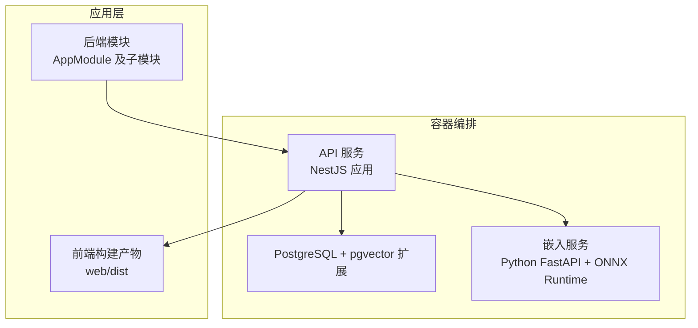
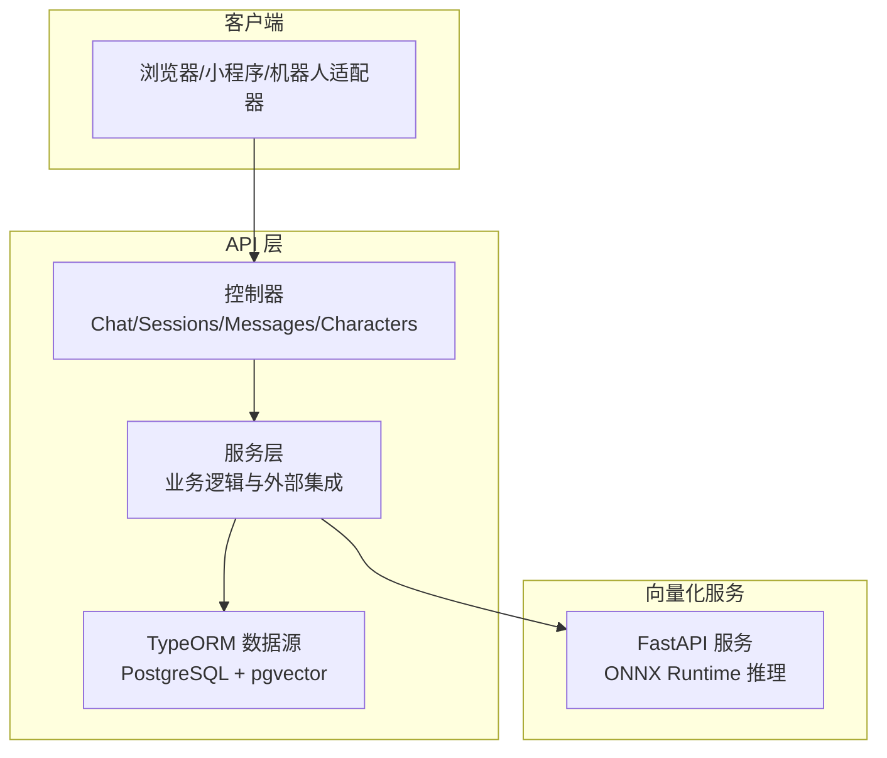
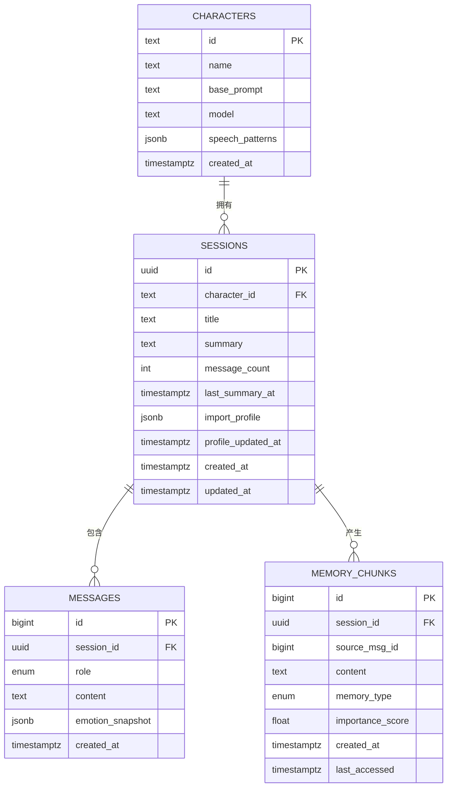
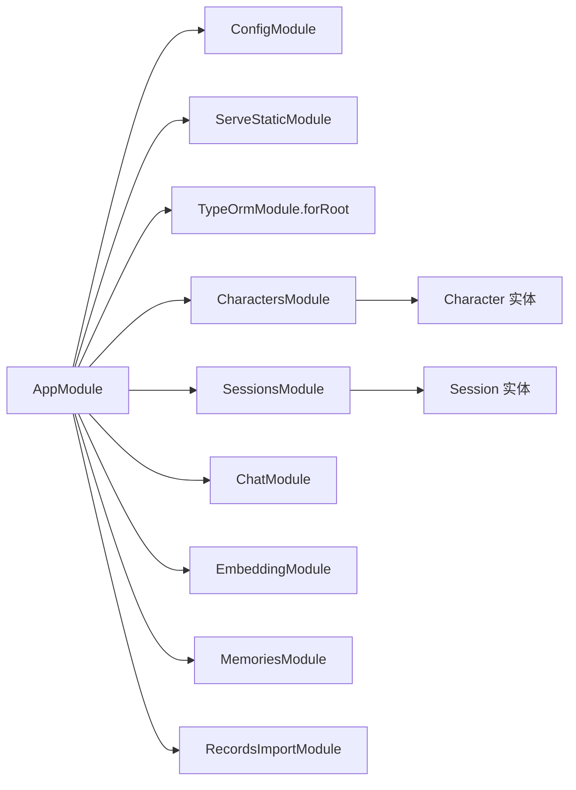
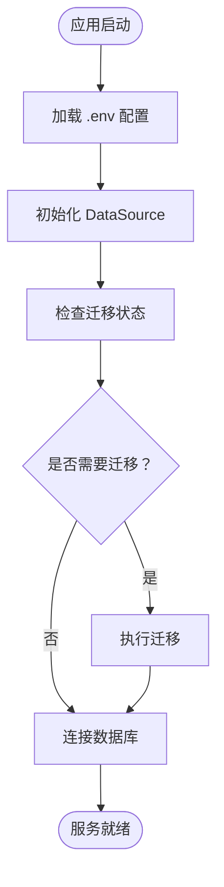
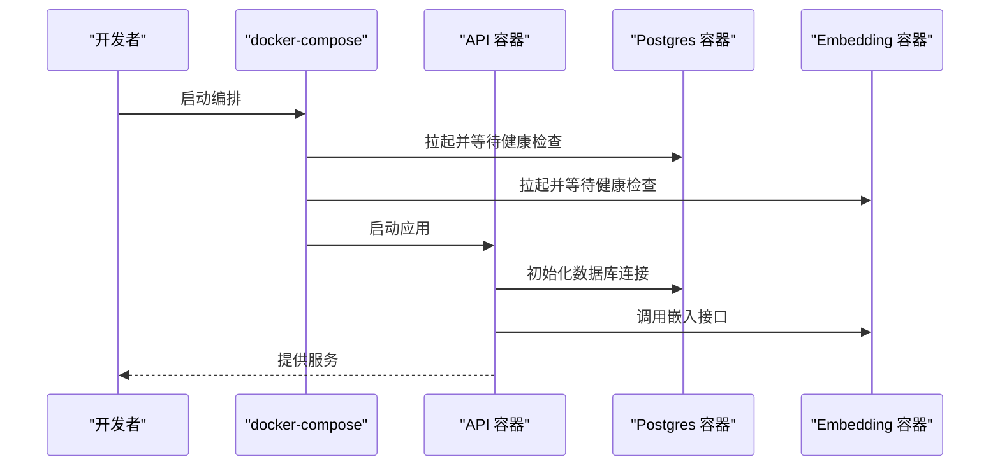
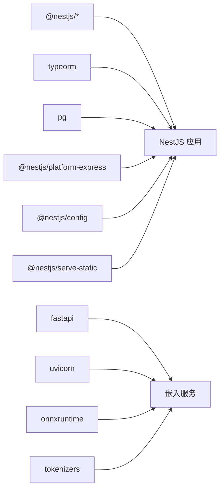

# 项目规则

<cite>
**本文档引用的文件**
- [docs/Project_Rules.md](file://docs/Project_Rules.md)
- [README.md](file://README.md)
- [package.json](file://package.json)
- [docker-compose.yml](file://docker-compose.yml)
- [Dockerfile](file://Dockerfile)
- [src/app.module.ts](file://src/app.module.ts)
- [src/config/database.config.ts](file://src/config/database.config.ts)
- [src/characters/characters.module.ts](file://src/characters/characters.module.ts)
- [src/sessions/sessions.module.ts](file://src/sessions/sessions.module.ts)
- [src/characters/entities/character.entity.ts](file://src/characters/entities/character.entity.ts)
- [src/sessions/entities/session.entity.ts](file://src/sessions/entities/session.entity.ts)
- [src/messages/entities/message.entity.ts](file://src/messages/entities/message.entity.ts)
- [src/memories/entities/memory.entity.ts](file://src/memories/entities/memory.entity.ts)
- [python/pyproject.toml](file://python/pyproject.toml)
</cite>

## 目录
1. [简介](#简介)
2. [项目结构](#项目结构)
3. [核心组件](#核心组件)
4. [架构总览](#架构总览)
5. [详细组件分析](#详细组件分析)
6. [依赖关系分析](#依赖关系分析)
7. [性能考虑](#性能考虑)
8. [故障排除指南](#故障排除指南)
9. [结论](#结论)
10. [附录](#附录)

## 简介
本文件系统性梳理 AI Companion 项目的工程规则与最佳实践，覆盖工程规范、文档维护、Docker 容器化、Windows/编码注意事项、微信数据处理边界、云资源采购策略等。同时结合项目实际代码结构，给出可落地的实施建议与风险控制点，帮助新成员快速上手并避免重复踩坑。

## 项目结构
项目采用 NestJS 后端 + 前端 Web 构建产物 + Python 向量化服务的多服务架构，通过 Docker Compose 编排数据库、嵌入服务与 API 服务，并在生产环境统一打包运行。

图示来源
- [docker-compose.yml:1-63](file://docker-compose.yml#L1-L63)
- [Dockerfile:1-30](file://Dockerfile#L1-L30)
- [src/app.module.ts:18-62](file://src/app.module.ts#L18-L62)

章节来源
- [README.md:24-99](file://README.md#L24-L99)
- [docker-compose.yml:1-63](file://docker-compose.yml#L1-L63)
- [Dockerfile:1-30](file://Dockerfile#L1-L30)
- [src/app.module.ts:18-62](file://src/app.module.ts#L18-L62)

## 核心组件
- 工程规则：强调变更前审查、最小化修改范围、测试与构建验证、清理生成物等。
- 文档规则：功能状态变更需同步更新计划与学习笔记；学习笔记应包含推理、数据流、陷阱、验证与下一步。
- Docker 规则：服务间通信使用 Compose 服务名；禁止在容器内使用 localhost 访问同级服务；ONNX 模型挂载只读；敏感信息放入 .env.docker；使用 compose config 校验配置。
- Windows/编码规则：PowerShell 中文注释可能出现乱码，不要仅因终端显示问题重写注释；避免脆弱的多行精确替换；除非测试需要，尽量使用 ASCII 测试夹具。
- 微信规则：官方备份导出不可读文本；不破解数据库；使用安全工具进行剪贴板/当前窗口导出；忽略 exports/ 目录。
- 云采购规则：按需购买；优先 CPU/内存；默认使用免费/自动化 HTTPS；在真实需求出现后再引入对象存储、CDN、CLB。

章节来源
- [docs/Project_Rules.md:5-49](file://docs/Project_Rules.md#L5-L49)

## 架构总览
整体架构由三层组成：前端 Web（SPA）、后端 API（NestJS）、向量化服务（Python FastAPI）。数据库采用 PostgreSQL 并启用 pgvector 扩展以支持向量检索。容器编排通过 docker-compose 实现，服务间通过内部网络通信，生产环境通过多阶段 Dockerfile 构建镜像并统一暴露 3000 端口。

图示来源
- [src/app.module.ts:18-62](file://src/app.module.ts#L18-L62)
- [docker-compose.yml:37-59](file://docker-compose.yml#L37-L59)
- [python/pyproject.toml:1-22](file://python/pyproject.toml#L1-L22)

## 详细组件分析

### 数据模型与实体设计
项目采用 TypeORM 管理关系型数据，核心实体包括角色（Character）、会话（Session）、消息（Message）、记忆碎片（MemoryChunk）。其中向量字段（embedding）不映射到实体，通过原生 SQL 处理，遵循“关系字段用 Repository，向量字段用原生 SQL”的设计原则。

图示来源
- [src/characters/entities/character.entity.ts:3-22](file://src/characters/entities/character.entity.ts#L3-L22)
- [src/sessions/entities/session.entity.ts:32-63](file://src/sessions/entities/session.entity.ts#L32-L63)
- [src/messages/entities/message.entity.ts:5-24](file://src/messages/entities/message.entity.ts#L5-L24)
- [src/memories/entities/memory.entity.ts:16-43](file://src/memories/entities/memory.entity.ts#L16-L43)

章节来源
- [src/characters/entities/character.entity.ts:1-23](file://src/characters/entities/character.entity.ts#L1-L23)
- [src/sessions/entities/session.entity.ts:1-64](file://src/sessions/entities/session.entity.ts#L1-L64)
- [src/messages/entities/message.entity.ts:1-25](file://src/messages/entities/message.entity.ts#L1-L25)
- [src/memories/entities/memory.entity.ts:1-44](file://src/memories/entities/memory.entity.ts#L1-L44)

### 模块与依赖注入
AppModule 统一导入静态资源服务、配置模块、数据库连接以及各业务模块（角色、会话、聊天、嵌入、记忆、记录导入）。角色与会话模块通过 TypeOrmModule.forFeature 注册实体，提供服务供其他模块使用。

图示来源
- [src/app.module.ts:18-62](file://src/app.module.ts#L18-L62)
- [src/characters/characters.module.ts:7-13](file://src/characters/characters.module.ts#L7-L13)
- [src/sessions/sessions.module.ts:7-13](file://src/sessions/sessions.module.ts#L7-L13)

章节来源
- [src/app.module.ts:1-64](file://src/app.module.ts#L1-L64)
- [src/characters/characters.module.ts:1-14](file://src/characters/characters.module.ts#L1-L14)
- [src/sessions/sessions.module.ts:1-14](file://src/sessions/sessions.module.ts#L1-L14)

### 数据库配置与迁移
数据库配置通过 TypeORM DataSource 完成，支持 .env 环境变量注入；生产环境禁用自动同步，强制通过迁移管理结构变更；迁移会在应用启动时自动运行，确保 pgvector 扩展与表结构就绪。

图示来源
- [src/config/database.config.ts:8-20](file://src/config/database.config.ts#L8-L20)
- [src/app.module.ts:38-50](file://src/app.module.ts#L38-L50)

章节来源
- [src/config/database.config.ts:1-22](file://src/config/database.config.ts#L1-L22)
- [src/app.module.ts:1-64](file://src/app.module.ts#L1-L64)

### 容器化与部署
Dockerfile 采用多阶段构建：分离 API 依赖、Web 依赖、构建阶段与运行时阶段，最终在运行时仅保留生产依赖与构建产物，减少镜像体积。docker-compose 将 API、Postgres、Embedding 服务编排在一起，服务间通过内部 DNS 名称通信，健康检查保障启动顺序与稳定性。

图示来源
- [Dockerfile:13-29](file://Dockerfile#L13-L29)
- [docker-compose.yml:37-59](file://docker-compose.yml#L37-L59)

章节来源
- [Dockerfile:1-30](file://Dockerfile#L1-L30)
- [docker-compose.yml:1-63](file://docker-compose.yml#L1-L63)

## 依赖关系分析
- 后端依赖：NestJS 核心、TypeORM、PostgreSQL 驱动、配置模块、静态资源服务等。
- 前端依赖：Vite + React/TurboRepo（通过 package.json 的 web 构建脚本间接管理）。
- 向量化服务依赖：FastAPI、Uvicorn、ONNX Runtime、Tokenizers、Pydantic 等。
- 开发工具链：Jest、ESLint、Prettier、TypeScript、TypeORM CLI 等。

图示来源
- [package.json:29-46](file://package.json#L29-L46)
- [python/pyproject.toml:6-16](file://python/pyproject.toml#L6-L16)

章节来源
- [package.json:1-90](file://package.json#L1-L90)
- [python/pyproject.toml:1-22](file://python/pyproject.toml#L1-L22)

## 性能考虑
- 数据库层：生产环境禁用自动同步，使用迁移管理结构变更，避免删除向量列；合理设置日志级别；利用索引与查询优化。
- 向量化服务：模型文件挂载只读，避免频繁 IO；在容器内通过服务名访问，减少网络延迟；根据负载调整并发与超时。
- 应用层：前后端分离构建产物统一托管；静态资源优先路由；缓存策略与请求限流结合使用。
- 容器层：多阶段构建减小镜像体积；运行时仅安装生产依赖；健康检查与重启策略保证可用性。

## 故障排除指南
- 构建与测试
  - 修改后务必执行构建与测试流程，确保变更不会破坏现有功能。
  - 单元测试与端到端测试分别用于验证模块独立行为与集成效果。
- 数据库迁移
  - 生产环境必须通过迁移管理结构变更；如需生成迁移，请使用 TypeORM CLI 并核对生成结果。
- Docker 编排
  - 使用 compose config 校验配置正确性；确认服务间网络连通与健康检查状态。
  - 若容器内无法访问同级服务，请检查是否使用了 localhost；应改用服务名。
- 编码与平台
  - Windows 下 PowerShell 显示中文注释可能乱码，属于终端显示问题，无需重写注释。
  - 避免脆弱的多行替换逻辑，优先使用更健壮的解析或测试夹具。

章节来源
- [docs/Project_Rules.md:10-11](file://docs/Project_Rules.md#L10-L11)
- [docs/Project_Rules.md:29](file://docs/Project_Rules.md#L29)
- [docs/Project_Rules.md:33-35](file://docs/Project_Rules.md#L33-L35)
- [package.json:8-27](file://package.json#L8-L27)
- [docker-compose.yml:23-35](file://docker-compose.yml#L23-L35)

## 结论
本项目在工程规范、文档维护、容器化与跨语言协作方面建立了清晰的规则与流程。通过严格的变更控制、完善的测试与迁移机制、合理的容器编排与依赖管理，能够有效降低技术债并提升交付质量。建议团队在日常工作中持续遵循上述规则，并在实践中不断沉淀经验与最佳实践。

## 附录
- 快速参考
  - 启动命令：安装依赖、构建前端、构建后端、启动服务。
  - 测试命令：单元测试、端到端测试、覆盖率统计。
  - 数据库命令：迁移生成、迁移执行、迁移回滚。
- 环境变量
  - 数据库相关：DB_HOST、DB_PORT、DB_USER、DB_PASSWORD、DB_NAME、DB_LOGGING。
  - API 相关：PORT、DEEPSEEK_API_KEY、PYTHON_EMBED_URL。
  - 嵌入服务相关：MOCK_EMBEDDING、EMBEDDING_MODEL_PATH、EMBEDDING_TOKENIZER_PATH。

章节来源
- [README.md:28-58](file://README.md#L28-L58)
- [package.json:8-27](file://package.json#L8-L27)
- [docker-compose.yml:41-51](file://docker-compose.yml#L41-L51)
- [src/app.module.ts:38-50](file://src/app.module.ts#L38-L50)